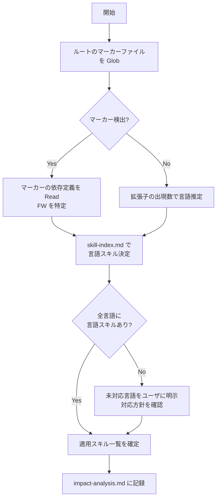

# 言語・フレームワーク検出手順

Analyze フェーズ冒頭で実施する、対象プロジェクトの言語・フレームワーク検出と委譲先言語スキルの決定手順。`orchestrator-coding` / `orchestrator-design` が共用する。
検出マーカーと言語スキルの対応は [skill-index.md](skill-index.md)（SSOT）に従う。

## 1. 検出フロー



## 2. 手順詳細

### Step 1: マーカーファイルの走査

リポジトリルート（モノレポの場合は各パッケージルートも）で以下を Glob する:

```
*.sln, *.csproj, package.json, tsconfig.json, pyproject.toml,
requirements.txt, setup.py, composer.json, prisma/schema.prisma,
docker-compose.yml, *.sql
```

変更対象ファイルが既知の場合は、その拡張子も判定材料に加える。

### Step 2: 依存定義からのフレームワーク特定

検出したマーカーファイルを Read し、依存定義からフレームワークを特定する:

| マーカー | 確認箇所 | 特定例 |
|---------|---------|-------|
| `package.json` | `dependencies` / `devDependencies` | `react` / `next` / `vue` / `nuxt` / `express` / `@nestjs/core` / `vite` / `tailwindcss` / `vitest` / `@playwright/test` / `prisma` |
| `*.csproj` | `<PackageReference>` / `<Project Sdk>` | `Microsoft.AspNetCore.*` / `Microsoft.EntityFrameworkCore.*` / `Microsoft.NET.Sdk.Web` |
| `pyproject.toml` / `requirements.txt` | 依存リスト | `flask` / `django` / `fastapi` / `sqlalchemy` |
| `composer.json` | `require` | `laravel/framework` / `symfony/*` |
| `docker-compose.yml` | サービスイメージ | `mysql` / `postgres` / `mssql` → SQL 方言判定 |

### Step 3: SQL 方言の判定

SQL を扱うタスクでは方言を特定する。判定材料（[skill-index.md](skill-index.md) 参照）:

1. ORM 設定の provider（`schema.prisma` の `provider` 等）
2. `docker-compose.yml` / 接続文字列のポート・イメージ名
3. 既存 `.sql` ファイルの方言固有構文（`AUTO_INCREMENT` / `IDENTITY` / `SERIAL` 等）

判定できない場合は `coding-sql` の共通規約（`conventions.md`）のみを適用し、方言固有構文が必要になった時点で `AskUserQuestion` によりユーザへ確認する（非対話モードでは共通範囲の構文に留めて報告）。

### Step 4: 適用スキルの確定

- 検出された **すべての言語** の言語スキルを適用対象にする（モノレポでは複数言語の併用が通常）
- 変更対象ファイルの言語を「主スキル」、その他を「副スキル」として記録する
- HTML / CSS は FW テンプレート（`.vue` / `.tsx` / `.blade.php` 等）内でも、マークアップ・スタイル部分の規約として `coding-html` / `coding-css` を併用する
- 言語横断 FW（React / Vue / Node / ORM 等）は SSOT の [frameworks/](frameworks/) 配下プロファイルを併せて適用する

### Step 5: 検出結果の記録

検出結果は `impact-analysis.md` の「言語・フレームワーク検出結果」表に記録する（形式はテンプレート [`template/impact-analysis.md`](template/impact-analysis.md) が正典）。各行に **区分（主 / 副）・言語 / FW・検出根拠・適用スキル / プロファイル** を記載し、言語横断 FW は SSOT `frameworks/` である旨を明記する。

## 3. 未対応言語の扱い

[skill-index.md](skill-index.md) に存在しない言語（例: Go / Rust / Ruby）を検出した場合:

1. 「この言語の言語スキルは未収録」であることを **ユーザに明示** する（推測した規約で黙って進めない）
2. プロジェクト独自規約（[conventions-resolution.md](conventions-resolution.md) の優先度 1〜4）が存在すれば、それのみを根拠に作業を継続してよい
3. 独自規約も存在しない場合は、進め方（既存コードの慣習に合わせる / 作業中止）を `AskUserQuestion` で確認する（非対話モードでは既存慣習準拠で進め、その旨を報告に明記）
4. 恒久対応として、[language-skill-template.md](language-skill-template.md) に従う言語スキル追加を提案する

## 4. 禁止事項

- マーカーファイルを確認せずに拡張子だけで FW を断定すること
- 検出されなかった言語の言語スキル・プロファイルを適用すること
- 未対応言語であることを伏せたまま推測規約で実装すること
