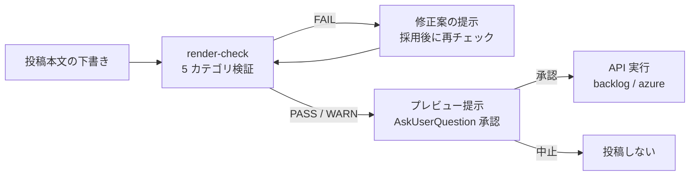

# connector

Backlog / Azure DevOps / GitHub / HUE ProjectBoard / ailead / Slack / Google Workspace の操作を、**安全ゲート（投稿前レンダリングチェック・ユーザー承認）付き** で行う外部サービス連携プラグイン。

## このドキュメントについて

このファイルは **人間向けのリファレンス** です。Claude Code がスキル動作中に参照することはありません。

## 提供スキル

| スキル | 役割 | 代表的なトリガーフレーズ |
|-------|------|-----------------------|
| `backlog` | Backlog の課題検索・取得・コメント投稿・ステータス等メタ情報更新 | 「Backlog で PROJ-123 を取得」「この課題にコメント投稿」 |
| `azure` | Azure DevOps の PR 作成・PR コメント投稿（インラインコメント対応）・スレッド一覧取得・スレッドステータス変更・PR 承認・作業項目コメント・commit 情報取得。他プラグインからの PR 操作委譲にも対応 | 「PR を作成して」「PR を承認して」「作業項目にコメント」 |
| `github` | GitHub の PR 情報取得・インラインコメント投稿（範囲指定対応）・Pending Review 一括投稿・レビュースレッド resolve/unresolve。他プラグインからの PR 操作委譲にも対応 | 「GitHub PR にコメント」「スレッドを resolve」 |
| `render-check` | 投稿本文のレンダリング検証（記法不一致・メンション暴発・機密情報の検出） | 「このコメントが Backlog で正しく表示されるかチェック」 |
| `projectboard` | HUE ProjectBoard の WBS タスク読み取り・追加・更新・スケジュールシート構造解析（クリティカルパス含む） | 「ProjectBoard のタスクを取得」「クリティカルパスを分析」「タスクを追加」 |
| `ailead` | ailead 外部共有リンクから文字起こし・AI会議要約・参加者情報を取得（読み取り専用） | 「ailead の共有リンクからデータを取得」 |
| `slack` | Slack のチャンネル検索・メッセージ読取/送信・スレッド・Canvas 操作（MCP 経由） | 「Slack で検索」「Slack にメッセージ送信」 |
| `google-workspace` | Google Drive のファイル検索・読取・作成・コピー（MCP 経由） | 「Drive でファイル検索」「ドキュメントを読んで」 |

## 提供コマンド（操作別の明示起動）

`{サービス}-{処理}` 形式のスラッシュコマンド。実作業はスキル側で制御され、コマンドは **行うべき作業をユーザーが明確に指定する入口**（操作種別を固定してスキルへ委譲）。

| コマンド | 操作 | 委譲先スキル |
|---------|------|------------|
| `/backlog-read` | 課題検索・課題取得・コメント取得（読み取り専用） | `backlog` |
| `/backlog-post` | 課題へのコメント投稿 | `backlog` |
| `/backlog-update` | 課題のステータス・担当者等メタ情報更新 | `backlog` |
| `/azure-read-pr` | PR 情報・スレッドの読み取り（読み取り専用） | `azure` |
| `/azure-create-pr` | PR 作成 | `azure` |
| `/azure-approve-pr` | PR 承認（vote 設定） | `azure` |
| `/azure-post` | PR / 作業項目へのコメント投稿 | `azure` |
| `/projectboard-read` | WBS タスクの読み取り・一覧 CSV 化（読み取り専用） | `projectboard` |
| `/projectboard-sheet` | スケジュールシート全体の構造解析・クリティカルパス（読み取り専用） | `projectboard` |
| `/projectboard-post` | WBS タスクの追加 | `projectboard` |
| `/projectboard-update` | WBS タスクの更新（ステータス・日付・担当者・先行タスク等） | `projectboard` |
| `/ailead-read` | ailead 共有リンクからデータ取得（読み取り専用） | `ailead` |
| `/slack-read` | Slack のチャンネル・メッセージ・ユーザー検索・読取 | `slack` |
| `/slack-post` | Slack にメッセージ送信・リアクション・Canvas 操作 | `slack` |
| `/google-read` | Google Drive のファイル検索・読取・メタデータ取得 | `google-workspace` |
| `/google-post` | Google Drive にファイル作成・コピー | `google-workspace` |
| `/github-read` | GitHub PR 情報取得・diff・スレッド一覧（読み取り専用） | `github` |
| `/github-post` | GitHub PR コメント投稿・Pending Review・スレッド resolve | `github` |

書き込み系コマンドも安全ゲート（Backlog / Azure は render-check + AskUserQuestion 承認、ProjectBoard は AskUserQuestion 承認 + 実行後の反映検証）を必ず経由する（コマンド指定によってゲートが省略されることはない）。

## 中核コンセプト: 投稿前レンダリングチェック

外部サービスへの **書き込み操作（コメント投稿・ステータス更新・PR 作成等）は、必ず `render-check` の検証とユーザー承認を経由** します。



検証カテゴリ: 記法整合（NOTATION）/ 自動リンク・メンション暴発（AUTOLINK）/ 構造崩れ（STRUCTURE）/ 機密情報（SECRET）/ サイズ（SIZE）。

これにより以下の事故を投稿前に防ぎます:

- Backlog 記法プロジェクトに Markdown を投稿して見出しやコードフェンスが素通し表示される
- TFS 作業項目コメント（Markdown 非解釈）に Markdown を投稿する
- `@メンション` や `#123` / 課題キーの自動リンクによる意図しない通知・リンク
- トークン・API キー等の機密情報の投稿

> HUE ProjectBoard の書き込み（タスク追加・更新）は記法レンダリングの対象外のため render-check は経由しないが、
> 変更内容（変更前 → 変更後）の提示 + AskUserQuestion 承認 + 実行後のシート再取得による反映検証を必須とする。

## 導入手順

### 前提

- Claude Code がインストール済み
- 依存プラグインなし（クロスマーケットプレイス依存なし）

### A. マーケットプレイス登録とインストール

`dmajima-claude-plugins` マーケットプレイスからインストールします。

```text
# 1. マーケットプレイスを登録（未登録の場合）
/plugin marketplace add <dmajima-claude-plugins リポジトリのローカルパス>

# 2. プラグインをインストール
/plugin install connector@dmajima-claude-plugins
```

### B. ローカル複製（リポジトリ未取得の場合）

マーケットプレイスのリポジトリをローカルに複製してから A の手順を実施します（複製済みの場合は不要）。

```text
git clone <dmajima-claude-plugins リポジトリの URL> <ローカルパス>
```

### C. 自動更新の有効化

`~/.claude/settings.json` の `extraKnownMarketplaces` で `autoUpdate: true` を設定すると、セッション起動時にマーケットプレイス + インストール済みプラグインが自動更新されます。

```json
{
  "extraKnownMarketplaces": {
    "dmajima-claude-plugins": {
      "source": { "source": "<local-path>" },
      "autoUpdate": true
    }
  }
}
```

### D. 依存関係

依存プラグインなし。

- credentials-manager プラグインは **不要（オプション）**。導入済み環境では認証情報の照合に優先利用するが、未導入でも全スキルが認証情報ストア（credentials-manager の保存先と従来パス `~/.claude/credentials.json` の両方）の直接照合 → 対話取得フォールバック（実行時に AskUserQuestion で認証情報を確認）で動作する（[`references/credentials-precheck.md`](references/credentials-precheck.md)）

**外部ツール依存**（利用者環境に導入されている前提のツール）:

- `curl` / `jq`（Backlog / TFS / ProjectBoard の REST API 呼び出しに必須。Git for Windows に同梱）
- Azure CLI `az` + `azure-devops` 拡張（**クラウド Azure DevOps を操作する場合のみ**。オンプレ TFS のみの利用なら不要）
- Python 3.9+（**HUE ProjectBoard を操作する場合のみ**。urlKey 変換・CSV 整形・クリティカルパス計算に使用。外部 PyPI 依存なし）

## 事前準備（認証情報）

以下の事前準備は **必須ではない**。credentials.json が未整備でも、各スキルは API を呼ぶ前に対話（AskUserQuestion）で認証情報を確認し、「今回のみ利用」または「credentials.json へ保存」を選択できる（[`references/credentials-precheck.md`](references/credentials-precheck.md) セクション 4）。事前に登録しておくと確認なしで動作し、サブエージェント経由の呼び出し（後述）でも往復なしで完遂できる。

| サービス | 準備 |
|---------|------|
| Backlog | `~/.claude/credentials.json` に API キーエントリを追加（下記例）。API キーは Backlog の個人設定 > API から発行 |
| クラウド Azure DevOps | `az login` を実行（または環境変数 `AZURE_DEVOPS_EXT_PAT`） |
| オンプレ TFS | `~/.claude/credentials.json` に `tfs-password` エントリを追加。**TFS 認証を利用する他プラグインと共通**のため、TFS 認証設定済み環境では追加設定不要 |
| HUE ProjectBoard | `~/.claude/credentials.json` に `hue-projectboard` エントリを追加（type=password / username=ログインメール / value=パスワード / auth_method=form:email:password / domains にテナントホスト） |

Backlog エントリ例:

```json
{
  "credentials": {
    "backlog-apikey": {
      "type": "api_key",
      "value": "<API キー>",
      "urls": ["https://<space>.backlog.jp/*"],
      "domains": ["<space>.backlog.jp"],
      "auth_method": "query:apiKey"
    }
  }
}
```

## 使い方

### スラッシュコマンド（操作を明示する場合）

```text
/backlog-read PROJ-123
/backlog-post PROJ-123 調査結果の要約をコメントして
/backlog-update PROJ-123 ステータスを処理中に
/azure-read-pr 123
/azure-create-pr feature/login develop タイトルは「ログイン改修」
/azure-approve-pr 123 承認
/azure-post 作業項目 456 に調査結果をコメント
/projectboard-read https://<tenant>.pm.apps.worksap.com/wbs/project/<urlKey>/issue/<code> を CSV に
/projectboard-sheet 外部WBS シートのクリティカルパスを分析
/projectboard-post テストフェーズ配下に「回帰テスト実施」を追加
/projectboard-update SAMPLE-67 のステータスを実行中に
```

### 自然言語

```text
Backlog の PROJ-123 を取得して           → backlog（読み取り）
Backlog で「ログイン」の課題を検索        → backlog（読み取り）
PROJ-123 に調査結果をコメント投稿して     → backlog（render-check ゲート + 承認 → 投稿）
PROJ-123 のステータスを処理中に変更       → backlog（変更前後の提示 + 承認 → 更新）
feature/x から develop への PR を作成して → azure（render-check ゲート + 承認 → 作成）
PR !123 を承認して                       → azure（vote 値の確認 + 承認 → vote）
作業項目 #456 に調査結果をコメント        → azure（TFS は HTML 変換 + 承認 → 投稿）
このコメントが Backlog でどう見えるか確認 → render-check（単体起動・投稿なし）
ProjectBoard の外部WBS を CSV にして      → projectboard（読み取り）
このシートのクリティカルパスを出して      → projectboard（構造解析・CPM）
SAMPLE-67 の進捗を 50% にして             → projectboard（変更前後の提示 + 承認 → 更新 + 反映検証）
```

## 他プラグインからの呼び出し

### write 操作: Skill() 委譲

コメント投稿・承認等の書き込み操作は `Skill()` ツール経由で呼び出す。フォーマットは [`references/delegation-interface.md`](references/delegation-interface.md) を参照。

### read 操作（後続フローあり）: Agent() + ファイル受け渡し

他プラグインが read 系操作を呼び出し、その結果を使って後続処理を行う場合は、`Skill()` ではなく `Agent()` で起動する。`Skill()` では connector の結果報告後に呼び出し元のフローが停止するため。

サブエージェントが結果をファイルに書き出し、マニフェスト（ファイルパス + 概要）を返す。呼び出し元はマニフェストを受け取り、必要なファイルを Read して後続フローを続行する。

サブエージェント内では AskUserQuestion が使えないため、認証情報が未整備の場合は `credentials_missing` エラーマニフェストが返る。呼び出し元はメインコンテキストで対話取得フォールバック（[`references/credentials-precheck.md`](references/credentials-precheck.md) セクション 4）を実施し、認証情報を保存してから再起動することで完遂できる。

詳細なプロトコル・テンプレート・復帰手順は [`references/subagent-protocol.md`](references/subagent-protocol.md) を参照。

## code-review プラグインとの関係

> code-review プラグインは本マーケットプレイス（dmajima-claude-plugins）ではなく **別マーケットプレイス（customerep-claudecode）で提供** されるプラグインです。未導入でも connector 単体の動作には影響しません（本セクションは併用時の責務分担の説明です）。

| 観点 | connector（本プラグイン） | code-review |
|-----|--------------------------|-------------|
| 責務 | PR / 課題の **操作そのもの**（作成・承認・任意コメント投稿・メタ情報更新） | PR の **観点別レビュー** と指摘コメントの組み立て・投稿 |
| TFS 認証 | `~/.claude/credentials.json` の `tfs-password` エントリを **共有** | 同左 |

「PR をレビューして」は code-review、「PR を作成 / 承認して」は connector が担当します。

## ファイル構成

```text
plugins/connector/
├── .claude-plugin/
│   └── plugin.json
├── README.md
├── LICENSE
├── commands/                            # 操作別スラッシュコマンド（18 個・スキルへの明示委譲）
│   ├── backlog-read.md / backlog-post.md / backlog-update.md
│   ├── azure-read-pr.md / azure-create-pr.md / azure-approve-pr.md / azure-post.md
│   ├── github-read.md / github-post.md
│   ├── projectboard-read.md / projectboard-sheet.md / projectboard-post.md / projectboard-update.md
│   ├── ailead-read.md
│   ├── slack-read.md / slack-post.md
│   └── google-read.md / google-post.md
├── references/                          # プラグイン共通ナレッジ
│   ├── CLAUDE.md                        # references の目的・原則・ナビゲーション（scripts/ 等の各サブフォルダにも CLAUDE.md）
│   ├── credentials-precheck.md          # 認証情報の事前確認
│   ├── delegation-interface.md          # 委譲インターフェース仕様（Skill() ベース・SSOT）
│   ├── subagent-protocol.md             # サブエージェント呼び出しプロトコル（Agent() ベース・SSOT）
│   ├── safe-api-access.md               # API アクセス安全原則（ホワイトリスト・エラー分岐・書き込みゲート）
│   ├── signatures.md                    # 投稿署名
│   ├── scripts/                         # プラグイン共通スクリプト（ADR-024/025）
│   │   ├── run_via_job.sh               # PowerShell ツール経由 Python 起動用 Start-Job ラッパー
│   │   ├── credentials/                 # 認証情報ストアの照合（cred_lookup.sh）・保存（cred_save.sh）
│   │   └── setup/                       # venv 構築・削除・依存統合（setup_venv.sh / teardown_venv.sh / requirements.txt）
│   └── rendering/                       # レンダリングルール（render-check が参照）
│       ├── backlog-notation.md          # Backlog 記法
│       ├── backlog-markdown.md          # Backlog Markdown
│       └── azure-devops-markdown.md     # Azure DevOps（PR / 作業項目）
└── skills/
    ├── backlog/                         # Backlog 操作スキル
    │   ├── SKILL.md / README.md
    │   ├── references/                  # api-read.md / api-write.md
    │   └── evals/                       # 17 ケース + demo.sh
    ├── azure/                           # Azure DevOps 操作スキル（PR・作業項目・commit・Pipelines）
    │   ├── SKILL.md / README.md
    │   ├── references/                  # host-detection.md / pr-operations.md / workitem-operations.md
    │   └── evals/                       # 14 ケース + demo.sh
    ├── github/                          # GitHub PR 操作スキル
    │   ├── SKILL.md / README.md
    │   ├── references/                  # pr-operations.md
    │   └── evals/                       # 10 ケース + demo.sh
    ├── render-check/                    # 投稿前レンダリング検証スキル
    │   ├── SKILL.md / README.md
    │   ├── references/                  # check-procedures.md
    │   └── evals/                       # 7 ケース + demo.sh
    ├── projectboard/                    # HUE ProjectBoard 操作スキル
    │   ├── SKILL.md / README.md
    │   ├── references/                  # setup.md / api-spec.md / api-write.md / pitfalls.md / procedures.md
    │   │   └── scripts/                 # cleanup / auth / resolve / fetch / write / format（ADR-025）
    │   └── evals/                       # 9 ケース + demo.sh
    ├── ailead/                          # ailead 共有リンク取得スキル（読み取り専用）
    │   ├── SKILL.md / README.md
    │   ├── references/                  # api-spec.md / procedures.md / setup.md
    │   │   └── scripts/                 # fetch/fetch_share.py（ADR-025）
    │   └── evals/                       # 11 ケース + demo.sh
    ├── slack/                           # Slack 操作スキル（MCP 経由）
    │   ├── SKILL.md / README.md
    │   ├── references/                  # mcp-tools.md / mcp-fallback.md
    │   └── evals/                       # 10 ケース + demo.sh
    └── google-workspace/               # Google Workspace 操作スキル（MCP 経由）
        ├── SKILL.md / README.md
        ├── references/                  # mcp-tools.md / mcp-fallback.md
        └── evals/                       # 8 ケース + demo.sh
```

## 依存システム（External Dependencies）

| システム | 用途 | 参照箇所 |
|---------|------|---------|
| Backlog REST API v2（`https://<space>.backlog.jp/api/v2/`） | 課題・コメント・ステータスの取得 / 更新 | `skills/backlog/references/` |
| Azure DevOps REST API（クラウド: api-version 7.1 / TFS: 6.0） | PR・作業項目の取得 / 更新 | `skills/azure/references/` |
| HUE ProjectBoard 内部 API（`https://<tenant>.pm.apps.worksap.com/wbs/`。Cookie セッション + XSRF） | WBS タスクの取得 / 追加 / 更新 | `skills/projectboard/references/` |

## 技術スタック

| ツール | 用途 | 必要条件 |
|-------|------|---------|
| `curl` | REST API 呼び出し（Backlog / TFS / ProjectBoard） | Git for Windows に同梱 |
| `jq` | JSON の構築・解析（インジェクション対策の `--arg` / `--rawfile` 利用） | Git for Windows に同梱 |
| Azure CLI `az` + `azure-devops` 拡張 | クラウド Azure DevOps の操作 | クラウド利用時のみ。オンプレ TFS のみなら不要 |
| Python 3.9+ | ProjectBoard の urlKey 変換・CSV 整形・クリティカルパス計算（標準ライブラリのみ・外部 PyPI 依存なし） | ProjectBoard 利用時のみ |

backlog / azure / github / render-check はスクリプト同梱なし（AI 実行型）。ailead / projectboard はスクリプト同梱型
（`skills/{ailead,projectboard}/references/scripts/` — データ取得・認証・書き込み・整形の再利用可能スクリプト群）。
venv 構築・削除はプラグイン共通スクリプト（`references/scripts/setup/`、ADR-024）に統合されている。

## ライセンス

[MIT License](LICENSE) の下で配布されています。
