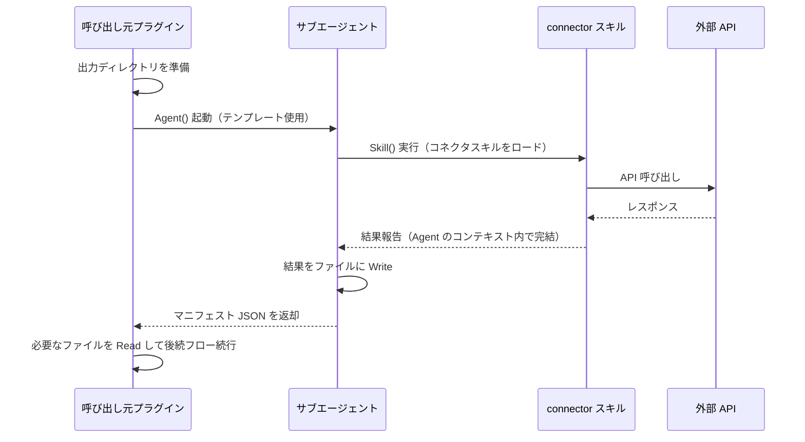

# サブエージェント呼び出しプロトコル（SSOT）

他プラグインが connector の read 系操作を **後続フローのある文脈で** 呼び出す際のプロトコル。

**本ファイルがサブエージェント呼び出しパターンの唯一の定義元（SSOT）**。
呼び出し元プラグイン（code-review / meeting-minutes / coding / investigation 等）が
Agent() テンプレートを構築する際は、本ファイルに従うこと。

## 1. 背景

`Skill()` ツールは呼び出されたスキルの指示を **現在のコンテキストに直接ロード** する。
connector スキルが結果を「報告」すると、LLM がそれをターンの完了と解釈し、
呼び出し元の後続フローが消失する（**フロー停止問題**）。

本プロトコルは `Agent()` ツールでサブエージェントを起動し、
結果をファイルで受け渡すことでこの問題を回避する。

## 2. 使い分け

| 用途 | 推奨方式 | 理由 |
|------|---------|------|
| read 操作（後続フローあり） | **本プロトコル（`Agent()` + ファイル受け渡し）** | `Skill()` ではフロー停止する |
| write 操作（コメント投稿等） | 従来の `Skill()` 委譲（`delegation-interface.md`） | ターミナル操作のため停止問題なし |
| ユーザー直接の read | 従来の `Skill()` / コマンド経由 | 直接報告で十分 |

## 3. プロトコル

### 3.1 全体フロー



### 3.2 出力ディレクトリ

呼び出し元が使用するメインセッションの作業フォルダ配下に配置する。

```
.claude/.local/work/{yyyyMMdd_nn_summary}/workspace/connector/
```

### 3.3 マニフェスト形式

Agent の返却テキストは以下の JSON 形式とする。

**成功時:**

```json
{
  "status": "success",
  "outputDir": "<output-dir の絶対パスまたは相対パス>",
  "files": {
    "<key>": "<ファイル名>"
  },
  "summary": "<1行の概要>"
}
```

**エラー時:**

```json
{
  "status": "error",
  "error": "<エラー種別>",
  "detail": "<詳細メッセージ>"
}
```

### 3.4 Agent プロンプトの必須要素

呼び出し元が `Agent()` に渡すプロンプトには、以下を **すべて** 含めること。

1. `Skill()` 呼び出し指示（スキル名 + args）
2. 出力ディレクトリの絶対パス
3. 書き出すファイルの指定（キー名 + ファイル名）
4. マニフェスト返却指示
5. **「Skill の結果報告後もターンを終了せず、ファイル書き出しとマニフェスト返却を必ず実行する」旨の明示的指示**

## 4. 共通テンプレート

以下のテンプレートの `{{変数}}` を操作別パラメータ表（セクション 5）で置き換えて使用する。

```text
Agent({
  description: "{{description}}",
  prompt: `以下の手順を順番に実行してください。

1. Skill(skill: "connector:{{skill}}", args: "{{args}}") を実行する
2. 取得結果を {{output-dir}}/{{filename}} に Write ツールで書き出す
   - API レスポンスの JSON データ（または取得テキスト）をそのまま書き出す
   - 解釈・要約・整形は行わない
3. 以下の JSON マニフェストのみをテキストとして返す（他のテキストは出力しない）:
   {"status":"success","outputDir":"{{output-dir}}","files":{"{{key}}":"{{filename}}"},"summary":"<概要1行>"}

重要: 手順1で Skill() の実行結果が出力された後、必ず手順2・3を続行すること。
Skill の結果報告でターンを終了しないこと。`
})
```

**複数ファイル出力の場合:**

```text
Agent({
  description: "{{description}}",
  prompt: `以下の手順を順番に実行してください。

1. Skill(skill: "connector:{{skill}}", args: "{{args}}") を実行する
2. 取得結果を以下のファイルに Write ツールで書き出す:
   - {{output-dir}}/{{filename1}}: {{description1}}
   - {{output-dir}}/{{filename2}}: {{description2}}
3. 以下の JSON マニフェストのみをテキストとして返す:
   {"status":"success","outputDir":"{{output-dir}}","files":{"{{key1}}":"{{filename1}}","{{key2}}":"{{filename2}}"},"summary":"<概要1行>"}

重要: 手順1で Skill() の実行結果が出力された後、必ず手順2・3を続行すること。
Skill の結果報告でターンを終了しないこと。`
})
```

## 5. 操作別パラメータ

### 5.1 connector:azure

| 操作 | description | args | 出力ファイル |
|------|-------------|------|-------------|
| PR 情報取得 | `Azure PR情報取得` | `読み取りのみ。PR URL: {{url}} の PR メタ情報を取得して` | `pr-meta.json` |
| スレッド一覧 | `Azure PRスレッド取得` | `読み取りのみ。PR URL: {{url}} のスレッド一覧を取得して` | `threads.json` |
| commit 情報 | `Azure commit情報取得` | `読み取りのみ。{{org-url}} のリポジトリ {{repo}} の commit {{commitId}} の詳細・変更ファイル一覧を取得して` | `commit.json` |
| Pipelines ビルド結果 | `Azure Pipelines結果取得` | `読み取りのみ。{{org-url}} のプロジェクト {{project}} のビルド {{buildId}} の結果・テスト結果・ログを取得して` | `build-result.json` |
| 認証ユーザー ID | `Azure認証ユーザーID取得` | `読み取りのみ。{{url}} の認証ユーザー（自分）の ID を取得して` | `auth-user.json` |

### 5.2 connector:github

| 操作 | description | args | 出力ファイル |
|------|-------------|------|-------------|
| PR 情報取得 | `GitHub PR情報取得` | `読み取りのみ。PR URL: {{url}} の PR メタ情報を取得して` | `pr-meta.json` |
| PR diff 取得 | `GitHub PR diff取得` | `読み取りのみ。PR URL: {{url}} の diff を取得して` | `diff.txt` |
| スレッド一覧 | `GitHub PRスレッド取得` | `読み取りのみ。PR URL: {{url}} のレビュースレッド一覧を取得して` | `threads.json` |

### 5.3 connector:backlog

| 操作 | description | args | 出力ファイル |
|------|-------------|------|-------------|
| 課題取得 | `Backlog課題取得` | `読み取りのみ。{{issue-key-or-url}} の件名・本文・コメントを取得して` | `issue.json` |
| 課題検索 | `Backlog課題検索` | `読み取りのみ。{{space}} で「{{keyword}}」に関する課題を検索して` | `search-results.json` |

### 5.4 connector:ailead

ailead スキルは内部でファイル出力を行うため、サブエージェントは取得後にファイルを出力ディレクトリにコピーする。

| 操作 | description | args | 出力ファイル |
|------|-------------|------|-------------|
| 会議データ取得 | `ailead会議データ取得` | `{{ailead-share-url}}` | `transcript.txt`, `summary.md`, `metadata.json`, `response.json` |

**ailead 専用テンプレート:**

```text
Agent({
  description: "ailead会議データ取得",
  prompt: `以下の手順を順番に実行してください。

1. Skill(skill: "connector:ailead", args: "{{ailead-share-url}}") を実行する
2. スキルの結果報告から保存先パス（`.claude/.local/work/{yyyyMMdd_nn_ailead_fetch}/workspace/`）を読み取り、
   そのディレクトリ内の以下のファイルを {{output-dir}} に Bash の cp コマンドでコピーする:
   - transcript.txt（文字起こし全文）
   - summary.md（AI会議要約）
   - metadata.json（会議メタデータ）
   - response.json（GraphQL レスポンス全文）
3. 以下の JSON マニフェストのみをテキストとして返す:
   {"status":"success","outputDir":"{{output-dir}}","files":{"transcript":"transcript.txt","summary":"summary.md","metadata":"metadata.json","response":"response.json"},"summary":"<会議タイトル — 日時 — 参加者数>"}

重要: 手順1で Skill() の実行結果が出力された後、必ず手順2・3を続行すること。
Skill の結果報告でターンを終了しないこと。`
})
```

### 5.5 connector:slack

| 操作 | description | args | 出力ファイル |
|------|-------------|------|-------------|
| チャンネル読取 | `Slackチャンネル読取` | `読み取りのみ。チャンネル {{channel}} の最新メッセージを取得して` | `messages.json` |
| メッセージ検索 | `Slackメッセージ検索` | `読み取りのみ。「{{keyword}}」でメッセージを検索して` | `search-results.json` |
| スレッド読取 | `Slackスレッド読取` | `読み取りのみ。チャンネル {{channel}} のメッセージ {{ts}} のスレッドを取得して` | `thread.json` |
| ユーザー情報 | `Slackユーザー情報取得` | `読み取りのみ。ユーザー {{user}} の情報を取得して` | `user-profile.json` |

### 5.6 connector:google-workspace

| 操作 | description | args | 出力ファイル |
|------|-------------|------|-------------|
| ファイル内容取得 | `Googleファイル取得` | `読み取りのみ。{{file-id-or-url}} の内容を取得して` | `file-content.json` |
| ファイル検索 | `Googleファイル検索` | `読み取りのみ。「{{keyword}}」でファイルを検索して` | `search-results.json` |

### 5.7 connector:projectboard

| 操作 | description | args | 出力ファイル |
|------|-------------|------|-------------|
| WBS 情報取得 | `ProjectBoard WBS取得` | `読み取りのみ。{{project}} の WBS 情報を取得して` | `wbs.json` |
| シート情報取得 | `ProjectBoard シート取得` | `読み取りのみ。{{project}} のシート情報を取得して` | `sheet.json` |

## 6. 呼び出し元の実装例

### 6.1 code-review（pr-review）からの Azure PR 情報取得

```javascript
// 出力ディレクトリの準備
const outputDir = `${sessionDir}/workspace/connector`;

// サブエージェントで PR 情報取得
const manifest = Agent({
  description: "Azure PR情報取得",
  prompt: `以下の手順を順番に実行してください。

1. Skill(skill: "connector:azure", args: "読み取りのみ。PR URL: https://tfs.example.com/.../pullrequest/123 の PR メタ情報を取得して") を実行する
2. 取得結果を ${outputDir}/pr-meta.json に Write ツールで書き出す
3. 以下の JSON マニフェストのみをテキストとして返す:
   {"status":"success","outputDir":"${outputDir}","files":{"pr-meta":"pr-meta.json"},"summary":"<概要>"}

重要: Skill() 実行後に結果が出力されても、手順2・3を必ず続行すること。`
});

// マニフェストを解析し、後続フローで pr-meta.json を Read
```

### 6.2 meeting-minutes からの ailead データ取得

```javascript
const outputDir = `${sessionDir}/workspace/connector`;

const manifest = Agent({
  description: "ailead会議データ取得",
  prompt: `以下の手順を順番に実行してください。

1. Skill(skill: "connector:ailead", args: "https://dashboard.ailead.app/share/xxx") を実行する
2. スキルが作成したセッションフォルダの workspace/ から transcript.txt, summary.md, metadata.json, response.json を ${outputDir} にコピーする
3. マニフェスト JSON のみを返す:
   {"status":"success","outputDir":"${outputDir}","files":{"transcript":"transcript.txt","summary":"summary.md","metadata":"metadata.json","response":"response.json"},"summary":"<概要>"}

重要: Skill() 実行後も手順2・3を必ず続行すること。`
});

// 後続: transcript.txt と metadata.json を Read して minutes-composer に渡す
```

## 7. フォーマット変更時の影響範囲

本ファイルのフォーマットを変更する場合、以下のファイルの該当セクションも同期更新が必要。

| プラグイン | ファイル | 該当セクション |
|-----------|---------|---------------|
| connector | `references/delegation-interface.md` | セクション 4 |
| connector | `skills/azure/SKILL.md` | 「サブエージェント呼び出し」セクション |
| connector | `skills/github/SKILL.md` | 同上 |
| connector | `skills/backlog/SKILL.md` | 同上 |
| connector | `skills/ailead/SKILL.md` | 同上 |
| connector | `skills/slack/SKILL.md` | 同上 |
| connector | `skills/google-workspace/SKILL.md` | 同上 |
| connector | `skills/projectboard/SKILL.md` | 同上 |
| code-review | `skills/pr-review/references/azure-devops.md` | 委譲パターンセクション |
| meeting-minutes | `skills/minutes-composer/references/steps/ailead-flow.md` | Step 1 |
| meeting-minutes | `commands/minutes-md.md` | Step 1 |

## 8. 従来の Skill() 委譲との関係

- 本プロトコルは `delegation-interface.md` の **拡張** であり、置き換えではない
- write 操作は引き続き `delegation-interface.md` の `Skill()` ベースの args フォーマットを使用する
- 同一プラグインから read と write の両方を呼ぶ場合、read は本プロトコル、write は従来方式を使い分ける
