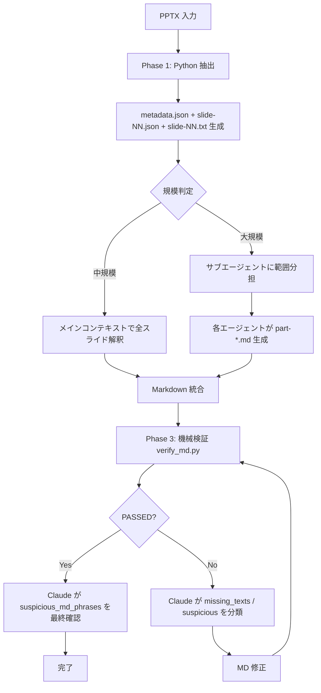

# 大規模 PPTX の作業フロー

スライド数や shape 数が多く、構造化 JSON 単体では LLM コンテキスト ウィンドウに収まらない / 1 度に処理しきれない PPTX を扱うための分割処理フロー。

## 1. サイズ別ガイドライン

| 規模 | 目安 | 推奨フロー |
|---|---|---|
| 小規模 | スライド数 30 以下 / JSON 1 MB 以下 | **単一 JSON 全読み込み**（`--structured-json` のみ） |
| 中規模 | スライド数 30〜100 / JSON 1〜5 MB | **per-slide JSON + compact view**（メインコンテキストで Read 分散） |
| 大規模 | スライド数 100 超 / JSON 5 MB 超 | **per-slide JSON + サブエージェント並列分担**（10 スライド単位等） |

判断は **shape 数の総和** が支配的（スライド数だけでなく shape 密度も考慮）。`metadata.json` の `slides_index` で各スライドの `shape_count` を確認できる。

## 2. 中規模フロー（30〜100 スライド）

### 2.1 抽出

```powershell
& "$SESSION_DIR/workspace/.venv/Scripts/python.exe" `
  "${env:CLAUDE_PLUGIN_ROOT}/references/scripts/convert-from-pptx/convert_from_pptx.py" `
  "<入力 PPTX>" `
  --per-slide-json   "<セッション>/json/" `
  --compact-view     "<セッション>/views/" `
  --json-only `
  [--include-notes] [--include-hidden]
```

出力ファイル構成:

```
<セッション>/
├── json/
│   ├── metadata.json                  # 全体メタ (slides_index 含む)
│   ├── slide-01.json
│   ├── slide-02.json
│   └── ...
├── views/
│   ├── slide-01.txt                   # 人間/LLM 可読の簡潔ビュー
│   ├── slide-02.txt
│   └── ...
└── <出力MD basename>_images/          # 抽出画像（共通）
```

### 2.2 Claude による解釈

1. `metadata.json` を Read で読み、スライド構成（layout / shape 数）を把握
2. スライドごとに `views/slide-NN.txt` または `json/slide-NN.json` を Read
   - **コンパクトビューを優先**: text/位置/フォント/色がまとまっており、軽量
   - 細部（段落構造・フォント詳細）が必要なときのみ JSON を補助参照
3. スライドごとの Markdown ブロックを順次組み立て、最終 MD ファイルに Write

### 2.3 検証

[`validation.md`](validation.md) に従って `verify_md.py` を実行し、最終 MD を元 PPTX と機械的に突き合わせる。

## 3. 大規模フロー（100 スライド超）

### 3.1 抽出（中規模と同じ）

`--per-slide-json` と `--compact-view` を使用する。

### 3.2 サブエージェント並列分担

スライドを範囲分割し、サブエージェントに担当範囲を割り当てる:

```text
Agent A: スライド 1〜25
Agent B: スライド 26〜50
Agent C: スライド 51〜75
Agent D: スライド 76〜100+
```

各サブエージェントへの指示テンプレート:

```text
{セッション}/views/slide-{N1:02d}.txt 〜 slide-{N2:02d}.txt を Read で読み、
references/json-schema.md の Phase 2 ガイドラインに従って Markdown ブロックを生成してください。
出力は {セッション}/parts/part-{担当範囲}.md に書き込みます。

ルール:
- タイトル推定はガイドライン 2.1 に従う
- 装飾除外はガイドライン 2.2 に従う
- フロー図は Mermaid 化する（コネクタ 2 件以上）
- 視覚順 (top → left) で並べる
- 画像参照は {basename}_images/slideN_imgM.png 形式
- 詳細が必要な場合は {セッション}/json/slide-NN.json も補助参照可

出力後、担当範囲の総スライド数と特記事項（フロー図化したスライド番号等）を報告。
```

### 3.3 統合

メインコンテキストが各 `parts/part-*.md` を Read し、章構成・スライド順序・統一感を確認したうえで最終 MD に統合する。具体的には:

1. すべての part を順序通り Read
2. 重複した見出し / 章扉の表記揺れを統一
3. Mermaid ノード ID の衝突を回避（範囲ごとに prefix を分けるよう事前指示するか、統合時に rename）
4. 最終 MD としてセッション フォルダ直下に Write

### 3.4 検証

**統合 MD に対して** `verify_md.py` を実行する。
**分割 MD に対する個別検証は推奨しない**（あるスライドのテキストが別エージェントの担当範囲に含まれている場合に誤判定が出るため）。

## 4. 大規模 PPTX 特有の注意

### 4.1 Mermaid ID 衝突の回避

複数サブエージェントが独立に Mermaid ノード ID を採番すると衝突する。事前指示で:

- 各エージェントは `A1`, `B1`, ... のような **range prefix** をノード ID に付与
- または、ノード ID を `slide{N}_{shape_id}` 形式で統一

を強制する。

### 4.2 章構成の整合

複数エージェントが章扉スライドを跨ぐ場合、章番号（H2 と H3 の階層）が乱れることがある。事前指示で:

- 各エージェントは **H3 以下のみ生成**（H2 章見出しは統合時に追加）
- または、章番号は出力せず統合時に付与

を選択する。

### 4.3 画像参照の統一

画像は単一の `{basename}_images/` ディレクトリに抽出されているため、すべてのエージェントが同じ相対パスで参照すること。事前指示で **画像参照のディレクトリ名を明示** する。

### 4.4 検証カバレッジの判定

機械検証の閾値は中規模と同じ（`text_coverage >= 0.85` / `table_cell_coverage >= 0.85`）。大規模 PPTX では蓄積的に微小ズレが効いてカバレッジが低下しやすいため、**`missing_texts` を必ず Claude が分類** し、真の漏れだけを修正対象にする（[validation.md](validation.md) 節 3 参照）。

## 5. 推奨ワークフロー（中規模・大規模共通）



## 6. CI / バッチ ジョブ向け

LLM 介入なしでフォールバック動作させる場合は、Python 単独で Markdown を直接生成する（[SKILL.md の「フォールバック」セクション参照](../SKILL.md)）。この場合は Phase 2/3 をスキップし、最終的に人手で目視確認する。

## 7. 関連ドキュメント

| 用途 | ファイル |
|---|---|
| JSON スキーマ・Phase 2 解釈ガイド | [json-schema.md](json-schema.md) |
| Phase 3 検証ガイド | [validation.md](validation.md) |
| 環境構築 | [setup.md](setup.md) |
| 標準実行手順 | [procedures.md](procedures.md) |
