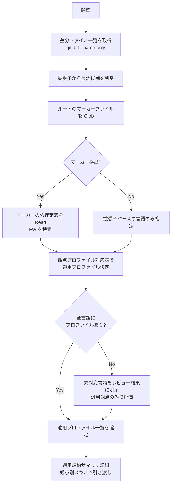

# 言語・フレームワーク検出手順（レビュー用）

レビュー対象差分から言語・フレームワークを検出し、適用する言語別レビュー観点プロファイル（`languages/`）と FW 別プロファイル（`frameworks/`）を決定する手順。
`code-review` オーケストレーターが Step 2（変更内容の把握）で実施し、検出結果を観点別スキルへの委譲引数に含める。

## 1. 検出フロー



## 2. 観点プロファイル対応表（SSOT）

### 2.1 言語プロファイル

| 言語 | 対象拡張子 | マーカーファイル | 観点プロファイル |
|------|-----------|----------------|----------------|
| C# | `.cs` `.csx` | `*.csproj` / `*.sln` / `Directory.Build.props` / `global.json` | `languages/csharp.md` |
| Python | `.py` `.pyi` | `pyproject.toml` / `requirements.txt` / `setup.py` / `Pipfile` | `languages/python.md` |
| JavaScript | `.js` `.mjs` `.cjs` `.jsx` | `package.json`（**tsconfig.json なし**） | `languages/javascript.md` |
| TypeScript | `.ts` `.tsx` `.mts` `.cts` | `tsconfig.json` | `languages/typescript.md`（javascript.md を継承） |
| HTML | `.html` `.htm` + テンプレート（`.cshtml` `.razor` `.blade.php` `.vue` `.liquid` `.twig` `.jinja` 等のマークアップ部） | — | `languages/html.md` |
| CSS | `.css` `.scss` `.sass` `.less` | `.stylelintrc*` | `languages/css.md` |
| PHP | `.php` | `composer.json` | `languages/php.md` |
| SQL | `.sql` / `migrations/` 配下 / ORM スキーマ（`schema.prisma` 等） | `docker-compose.yml`（DB イメージ） | `languages/sql.md` |

**JS/TS の分岐**: `tsconfig.json` の有無が決定的。存在すれば TypeScript プロファイル（JS 観点を継承）、なければ JavaScript プロファイル。

### 2.2 フレームワークプロファイル

| FW / 技術 | 検出条件（依存定義） | 観点プロファイル |
|----------|--------------------|----------------|
| ASP.NET Core / Blazor / WebForms / EF Core | `*.csproj` の `Microsoft.AspNetCore.*` / `Microsoft.NET.Sdk.Web` / `Microsoft.EntityFrameworkCore.*` / `.aspx` 存在 | `frameworks/dotnet.md` |
| Express 5 / NestJS | `package.json` の `express` / `@nestjs/core` | `frameworks/node.md` |
| React / Next.js | `package.json` の `react` / `next` | `frameworks/react.md` |
| Vue 3 / Nuxt | `package.json` の `vue` / `nuxt` | `frameworks/vue.md` |
| Vite / Tailwind / Vitest / Playwright / Jest / Sass / Bootstrap | `package.json` の `vite` / `tailwindcss` / `vitest` / `@playwright/test` / `jest` / `sass` / `bootstrap` | `frameworks/frontend-tooling.md` |
| Laravel / Symfony / WordPress | `composer.json` の `laravel/framework` / `symfony/*`、`wp-content/` 構造 | `frameworks/php-web.md` |
| Flask / Django / FastAPI | `pyproject.toml` / `requirements.txt` の `flask` / `django` / `fastapi` | `frameworks/python-web.md` |
| Prisma / EF Core / SQLAlchemy / Eloquent | `schema.prisma` / `Microsoft.EntityFrameworkCore.*` / `sqlalchemy` / Laravel 検出 | `frameworks/orm.md` |

> EF Core は `frameworks/dotnet.md`（.NET 統合観点）と `frameworks/orm.md`（ORM 横断観点）の両方に登場する（意図的な二重配置）。.NET プロジェクトでは dotnet.md を優先し、orm.md は横断比較が必要な場合に併読する。Eloquent も同様に `frameworks/php-web.md`（Laravel 統合観点）と `frameworks/orm.md` に登場する。

### 2.3 SQL 方言の判定

1. ORM 設定の provider（`schema.prisma` の `provider`、接続文字列等）
2. `docker-compose.yml` のサービスイメージ（`mysql` / `postgres` / `mssql`）・ポート（3306 / 5432 / 1433）
3. 既存 `.sql` ファイルの方言固有構文（`AUTO_INCREMENT` = MySQL / `IDENTITY` = SQL Server / `SERIAL` = PostgreSQL）

判定できない場合は `languages/sql.md` の共通観点のみで評価し、方言固有の指摘には「方言確認待ち」と付記する。

## 3. 手順詳細

### Step 1: 差分ファイルの言語分類

レビュー対象の差分ファイル一覧（`git diff --name-only <base>...<head>` 等で取得済み）を拡張子で分類する。
テンプレートファイル（`.vue` / `.cshtml` / `.blade.php` 等）はマークアップ・スタイル・スクリプトの複合であるため、該当するすべての言語プロファイルを併用する。

### Step 2: マーカーファイルの走査

リポジトリルート（モノレポの場合は差分ファイルが属する各パッケージルートも）で以下を Glob する:

```
*.sln, *.csproj, package.json, tsconfig.json, pyproject.toml,
requirements.txt, setup.py, composer.json, prisma/schema.prisma,
docker-compose.yml
```

### Step 3: 依存定義からのフレームワーク特定

検出したマーカーファイルを Read し、セクション 2.2 の検出条件で FW を特定する。
**マーカーファイルを確認せずに拡張子だけで FW を断定しない**。

### Step 4: 適用プロファイルの確定

- 差分に含まれる **すべての言語** のプロファイルを適用対象にする（モノレポ・複数言語の併用が通常）
- 差分ファイル数が最多の言語を「主」、その他を「副」として記録する
- HTML / CSS は FW テンプレート内の変更でも、マークアップ・スタイル部分の観点として併用する
- **埋め込み SQL の横断適用**: ホスト言語（C# / Python / PHP / JS/TS 等）のコード内に **生 SQL 文字列** が検出された場合（`SqlCommand.CommandText` / `ExecuteReader` / `cursor.execute(...)` / f-string・文字列連結による SQL / `$queryRawUnsafe` / `DB::raw` 等）、その SQL 断片に対して **`languages/sql.md` の観点（SQL インジェクション・`SELECT *`・`NOLOCK`・NULL 三値論理・方言固有等）を併用適用** する。`.sql` ファイルが差分に無くても、埋め込み SQL があれば sql.md を適用プロファイルに追加する（SQL 方言はホスト側の接続文字列・ORM プロバイダ・既存 `.sql` から判定。不明なら共通観点のみ）

### Step 5: 検出結果の記録

オーケストレーターの「適用規約サマリ」（Step 2 出力）に以下の形式で記録し、観点別スキルへの委譲引数に含める:

```markdown
## 言語・フレームワーク検出結果

| 区分 | 言語 / FW | 検出根拠 | 適用プロファイル |
|------|----------|---------|----------------|
| 主 | TypeScript | tsconfig.json + 差分 12 ファイル | languages/typescript.md |
| 主 | React 19 | package.json dependencies.react | frameworks/react.md |
| 副 | CSS (Tailwind) | devDependencies.tailwindcss + 差分 3 ファイル | languages/css.md + frameworks/frontend-tooling.md |
| 副 | SQL (PostgreSQL) | migrations/ 配下 + docker-compose.yml postgres | languages/sql.md |
```

## 4. 未対応言語の扱い

観点プロファイルが存在しない言語（例: Go / Rust / Ruby / Java / Kotlin）が差分に含まれる場合:

1. 「この言語の観点プロファイルは未収録」であることを **統合サマリの「未確認事項・制約」に明示** する（推測した規約で黙って評価しない）
2. プロジェクト独自規約（`conventions-resolution.md` の優先度 1〜4）が存在すれば、それを根拠にレビューを継続してよい
3. 独自規約も存在しない場合は、言語非依存の汎用観点（ロジック正確性・エラー処理・セキュリティ一般原則）のみで評価し、その旨を指摘の根拠に明記する
4. 深い言語固有レビューが必要な場合は、対象言語の観点プロファイル追加を提案する

## 5. 禁止事項

- マーカーファイルを確認せずに拡張子だけで FW を断定すること
- 検出されなかった言語・FW のプロファイルを適用すること
- 未対応言語であることを伏せたまま推測規約で指摘を出すこと
- 観点プロファイルの内容を、プロジェクト独自規約より優先すること（優先順位は `conventions-resolution.md` に従う）
