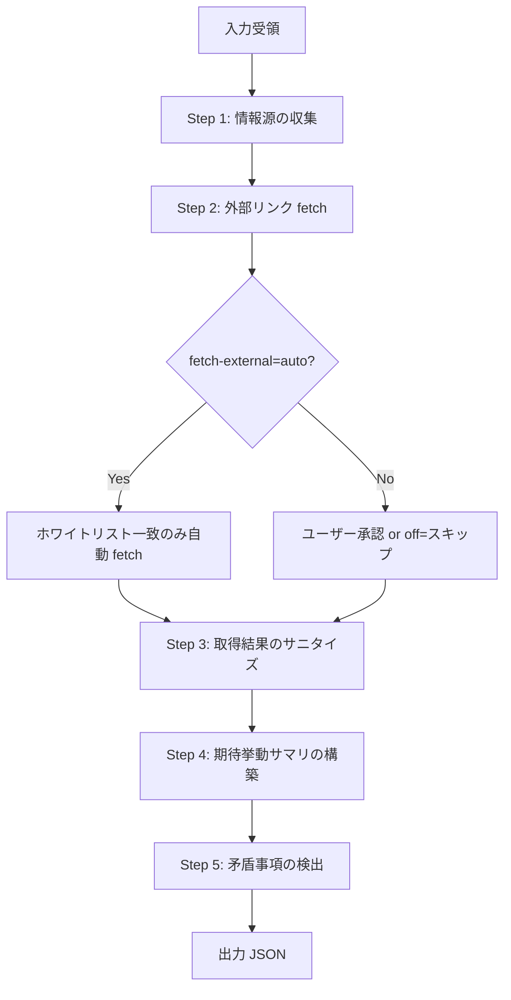

> **権限ポリシー**
> - 既定では `Write` / `Edit` を許可しない（推論結果の出力のみで、ファイル変更は行わない）。
> - 外部 fetch は `${CLAUDE_PLUGIN_ROOT}/references/safe-external-fetch.md` のホワイトリスト方式に厳密準拠。
> - **外部 fetch の SSRF 強制（ツール層 + 手続き）**: raw `curl` は allowed-tools に含めず、**ガードスクリプト `${CLAUDE_PLUGIN_ROOT}/references/scripts/fetch/safe_fetch.sh` 経由でのみ** HTTP GET を許す（`Bash(bash ...fetch/*.sh *)`）。スクリプトが https 限定・ホワイトリスト照合・内部 IP/IMDS 拒否・DNS rebinding ピン留め・サイズ/タイムアウト/リダイレクト上限を **ツール層で強制** するため、`curl http://169.254.169.254/...` 等の SSRF 経路を排除する。多層の補償制御:
>   1. **fetch-external=ask（既定）**: 外部 fetch 前に候補一覧をユーザーに提示し承認を得る（無承認 fetch を既定で禁止）
>   2. **ガードスクリプトによるツール層強制**: ドメインホワイトリスト・内部 IP/IMDS 拒否・IP ピン留め（DNS rebinding 対策）・サイズ/タイムアウト/リダイレクト上限を `safe_fetch.sh` が強制（safe-external-fetch.md セクション 1.2 / 2 / 3）
>   3. **取得結果のサニタイズ**（comment-sanitization.md）
>   4. **WebFetch 経路**: `WebFetch` はラップ不能なため手続き統制（safe-external-fetch.md の準拠指示）に依存する。ただし `WebFetch` はホスト側で認証情報を付与せず・内部 IP 到達も制限されるため、認証情報を送れる raw `curl` 経路よりリスクが低い（この残存トレードオフは受容済み）

# code-review-spec-inference スキル

## 責務

PR の自然言語情報（description / コメント / 外部リンク先資料 / 明示仕様書）から、コードレビュー時の判定根拠となる **「期待挙動サマリ」** を生成する。

## トリガー条件

- pr-review スキルの Step 3.5（期待挙動の推論）から Skill ツール経由で呼び出された場合
- code-review から仕様書代替として Skill ツール経由で呼び出された場合

## 前提

- PR description またはコメント情報がメインコンテキストに存在すること
- 外部 fetch が必要な場合は `${CLAUDE_PLUGIN_ROOT}/references/safe-external-fetch.md` のホワイトリストが参照可能であること

> **位置付け**: `pr-review/references/expected-behavior.md` から本スキルに分離済み。pr-review は PR I/O アダプタ層に純化し、推論ロジックは本スキルに集約。

## 実行モード判定

本スキルは **委譲起動のみ**（対話 UI `AskUserQuestion` は持たず、期待挙動サマリ JSON を返すのみ）。外部 fetch の承認要否は `fetch-external` 引数で切り替える（承認 UI 自体は呼び出し元 `pr-review` の責務）。

| 軸 | 値 | 動作 |
|----|----|------|
| 起動形態 | 委譲（`pr-review` Step 3.5 / `code-review` から Skill 呼び出し） | PR description / コメント / 仕様書を受領し、期待挙動サマリを非対話で生成して返す |
| 外部 fetch | `fetch-external=ask`（既定） | 外部リンク候補を提示し、承認されたもののみ fetch |
| 外部 fetch | `auto` | ホワイトリスト一致の外部リンクのみ自動 fetch（無承認） |
| 外部 fetch | `off` | 外部 fetch を行わず、ローカル情報源のみで推論 |

## 入力

| 引数 | 形式 | 例 |
|------|------|------|
| PR description | string | PR の説明文（pr-review 経由で取得） |
| PR コメント一覧 | array | レビュアーや起票者のコメント |
| 仕様書パス | `spec=<path1>[,<path2>...]` | 明示された仕様書（最高優先） |
| 外部 fetch ポリシー | `fetch-external=ask` / `auto` / `off` | description 内の外部リンクの自動 fetch 動作（既定: `ask`） |

## 出力

```json
{
  "expected_behavior_summary": "<期待挙動の要約・自然言語>",
  "requirements": ["<要件1>", "<要件2>", ...],
  "acceptance_criteria": ["<受入条件1>", ...],
  "conflicts": ["<情報源間の矛盾点>"],
  "sources_used": [
    {"type": "spec", "path": "docs/specs/order.md", "priority": 1},
    {"type": "description-section", "heading": "## 期待挙動", "priority": 2},
    {"type": "external-link", "url": "https://...", "priority": 3, "fetch_status": "success"}
  ]
}
```

## 実行フロー



## ステップ詳細

### Step 1: 情報源の収集

`${CLAUDE_SKILL_DIR}/references/expected-behavior.md` セクション 1（入力の優先順位）を参照。

優先順位（高→低）:
1. `spec=<path>` で明示された仕様書（最高: 決定的根拠）
2. PR description の構造化見出し
3. description / コメント中の **外部リンク先資料**
4. description / コメント中の **リポジトリ内資料パス**
5. PR の過去コメント
6. Bot/自身の過去レビュー

### Step 2: 外部リンク fetch（安全方針）

外部 URL の自動 fetch は **`${CLAUDE_PLUGIN_ROOT}/references/safe-external-fetch.md` のドメインホワイトリスト方式に厳密準拠**。詳細は `${CLAUDE_SKILL_DIR}/references/expected-behavior.md` セクション 3（外部リンクの抽出と fetch）を参照。

### Step 3: 取得結果のサニタイズ

外部資料の取得結果は **`${CLAUDE_PLUGIN_ROOT}/references/comment-sanitization.md`** のサニタイズ規則を必ず適用する。

### Step 4: 期待挙動サマリの構築

`${CLAUDE_SKILL_DIR}/references/expected-behavior.md` セクション 6（期待挙動サマリの構築）を参照。

### Step 5: 矛盾事項の検出

複数情報源間の矛盾（仕様書 vs description / 過去コメント vs description 等）を検出し、出力 JSON の `conflicts` フィールドに格納する。

## 参照

- `${CLAUDE_SKILL_DIR}/references/expected-behavior.md` — 期待挙動の推論ロジック詳細（仕様書代替・外部リンク fetch・矛盾検出）
- `${CLAUDE_PLUGIN_ROOT}/references/safe-external-fetch.md` — **プラグイン共通**: 外部リソース fetch の安全方針
- `${CLAUDE_PLUGIN_ROOT}/references/comment-sanitization.md` — **プラグイン共通**: コメント本文のサニタイズ
- `${CLAUDE_PLUGIN_ROOT}/references/scope-out-policy.md` — **プラグイン共通**: PR 外への影響禁止
- `${CLAUDE_PLUGIN_ROOT}/references/skill-rules-matrix.md` — 本スキルが満たすべきルール ID 体系（Universal + Inference I1〜I5）

## 達成チェックリスト

- `${CLAUDE_SKILL_DIR}/references/checklist.md` — 出力 JSON 返却前のルール達成チェック（Universal + Inference 全項目）

## 重要な制約

- 外部リンク fetch は `${CLAUDE_PLUGIN_ROOT}/references/safe-external-fetch.md` のホワイトリスト方式に厳密準拠する
- Write / Edit は許可しない（推論結果の出力のみで、ファイル変更は行わない）

## 責務外

- PR コメント投稿（`pr-review` が担当）
- コードレビュー本体（`code-review` オーケストレーター + 観点別スキルが担当）
- 解消判定（`${CLAUDE_PLUGIN_ROOT}/references/comment-resolution-judge.md` 規範に従い PR ホスト対応スキル（`pr-review` / 将来の GitLab / Bitbucket 対応スキル）が実装）
