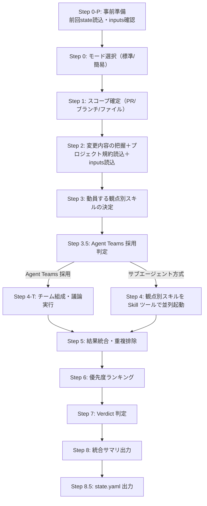

> **権限ポリシー**
> - `Write` は **state.yaml 出力**（Step 8.5）・**review-summary.md 出力**（構築→保存→PR投稿の順。ファイルと PR コメントは完全同一）・**inputs フォルダ管理**・**PR コメント投稿時の一時ファイル作成**（特殊文字対応）に使用。レビュー対象ソースコードへの Write は行わない。
> - 観点別レビューは観点別スキル（`code-review-implementation`, `code-review-testing`, `code-review-security`, `code-review-architecture`, `code-review-frontend`）に **Skill ツール経由で委譲** する。
> - PR レビュー要求は `pr-review` スキルに委譲する。
> - 動的検証コマンド（dotnet/npm/pytest 等）が必要なときは観点別スキル側で `allowed-tools` 追加が必要（`Bash(...)` 系として宣言する。プラグイン本体には含めない）。

# code-review スキル（オーケストレーター）

## 責務

コード変更を **観点別レビュースキル** と連携してレビューし、結果を統合して **優先度付きの単一サマリ** と **最終判定（Verdict）** を返す。

## トリガー条件

- 「コードレビューして」「差分をレビューして」「ブランチをレビューして」と言われた場合
- 実装完了・リファクタリング完了直後のレビュー依頼があった場合
- 「マージ可否を判断して」「総合レビューして」と言われた場合

## 前提

- レビュー対象のコード変更（ブランチ差分・特定ファイル）が存在すること
- 観点別スキル群（code-review-implementation 等）が利用可能であること

## 観点別スキルとエージェントの対応

| 観点別スキル | 内部エージェント | 動的検証 |
|-------------|----------------|------|
| `code-review-implementation` | implementation-engineer / linter-static-analysis / performance-reviewer | linter-static-analysis（ビルド・Linter） |
| `code-review-testing` | test-engineer / test-runner | test-runner（ユニットテスト実行） |
| `code-review-security` | security-engineer / dependency-safety | dependency-safety（脆弱性スキャン） |
| `code-review-architecture` | architect / dba | — |
| `code-review-frontend` | web-designer | — |

各エージェント定義は **プラグインルートの `agents/` を共有** している（`${CLAUDE_PLUGIN_ROOT}/agents/`）。

## 基本原則

1. **動的検証は条件付きで実施** — `linter-static-analysis` / `test-runner` / `dependency-safety` は対応 Bash 権限がある場合のみ実コマンド実行。権限なし・コマンド未導入・タイムアウト時は SKIPPED として未確認事項に記録
2. **プロジェクト規約の最優先遵守** — 対象リポジトリの `CLAUDE.md` / `.claude/rules/` / 既存スタイルガイド・設計ドキュメントを各観点別スキル経由で参照
3. **提出コードの信頼性原則** — 提出コードは誤りがある前提。コード内パターンをプロジェクト規約と類推してはならない。類推が必要ならユーザー承認必須（`${CLAUDE_SKILL_DIR}/references/state/code-trustworthiness.md`）
4. **レビュー状態の永続化** — 結果を state.yaml に出力し、再レビュー時は前回の指摘状態を引き継ぐ（`${CLAUDE_SKILL_DIR}/references/state/state-management.md`）
5. **仕様書ベースのレビュー** — inputs フォルダの仕様書・設計書を「あるべき姿」の判断根拠とする。inputs 未作成時はレビュー前にユーザーへヒアリング（`${CLAUDE_SKILL_DIR}/references/state/inputs-management.md`）
6. **モード切替（標準/簡易）** — 実行直前に AskUserQuestion で確認（`/code-review-standard` / `/code-review-quick` で固定可能）
7. **観点別スキルは並列起動** — Skill ツールで複数観点別スキルを同一メッセージで並列実行（Independent 型）
8. **重複報告を抑制** — 各観点別スキルの指摘は重複排除し、最も重い重要度を採用
9. **判定は厳しい側を採用** — 観点間で衝突時はより厳しい評価を最終判定とする
10. **Issues は全件記載・Suggestions は最大 10 件** — Critical/High/Medium は漏れなく、Low/Suggestions は Impact × Effort 降順で 10 件まで
11. **重要度表記の統一** — `Critical / High / Medium / Low` のみ使用
12. **未確認事項の明示** — ビルド未実施・CVE 未スキャン・テスト SKIPPED 等は「未確認事項・制約」セクションに記載
13. **統合サマリのレイアウト統一** — 出力サマリは `${CLAUDE_SKILL_DIR}/references/template/output/review-summary.md` の統一フォーマットを **毎回厳守**。セクション順序・見出しは固定。各 H2 セクションは `<details><summary>` 折り畳み + 内部 HTML 記法で出力（タイトル行・ヘッダブロックは対象外）
14. **別 PR 推奨の禁止** — 本 PR スコープ外の指摘は「スコープ外指摘」セクションに分離。「別 PR で対応してください」等の文言は使わない（`${CLAUDE_PLUGIN_ROOT}/references/scope-out-policy.md`）
15. **PR コメント投稿は既定で必須** — `pr-review` 経由の PR レビュー時、別途指示なき限り PR への結果投稿（サマリースレッド + インラインコメント）を必須とする
16. **PR 外への影響禁止** — レビュー中、PR 自体への書き込み（コメント・スレッド・status）以外は禁止。Work Item / Issue / Boards / 別 PR / Wiki / 通知システム等への書き込みは行わない（`${CLAUDE_PLUGIN_ROOT}/references/scope-out-policy.md` セクション 1.5）

## 実行モード判定

`/code-review-standard` / `/code-review-quick` カスタムコマンド経由ならモード固定。
それ以外は実行直前に `AskUserQuestion` でユーザーへ確認する。

| モード | 動員観点別スキル | 用途 |
|--------|----------------|------|
| **標準** | impl / testing / security / arch / frontend（差分内容に該当しないものは省略可） | 通常のコードレビュー・PR レビュー（既定） |
| **簡易** | impl / testing / security の必須トリオのみ | 軽微な修正・時間 / コスト制約 |

**非対話モード時の既定**: 標準モード。

詳細は `${CLAUDE_SKILL_DIR}/references/flow/mode-selection.md` を参照。

## PR レビューとの関係

依存方向は **単方向**: `pr-review → code-review` のみ。本スキルは PR 識別子を直接処理しない（`scope=pr-diff` で差分を受け取る）。本スキルから `pr-review` を呼び出すことも禁止（循環防止）。
詳細は `${CLAUDE_PLUGIN_ROOT}/references/comment-resolution-judge.md` セクション 0 を参照。

## 実行フロー



ステップごとの詳細は `${CLAUDE_SKILL_DIR}/references/flow/flow.md` を参照。
Step 0-P（事前準備）の詳細は `${CLAUDE_SKILL_DIR}/references/state/state-management.md` および `${CLAUDE_SKILL_DIR}/references/state/inputs-management.md` を参照。
Step 3.5 / Step 4-T の詳細は `${CLAUDE_SKILL_DIR}/references/flow/team-selection.md` を参照。
Step 8.5（state.yaml 出力）の詳細は `${CLAUDE_SKILL_DIR}/references/state/state-management.md` を参照。

### Step 8.5 state.yaml 出力先パス（必須・厳守）

state.yaml は **プラグインのローカルデータ領域** に保存する。**セッション作業領域（`.claude/.local/work/`）には絶対に保存しない。**

```
REPO_ROOT/.claude/.local/plugins/deep-code-review/{branch_name}/{yyyyMMdd_HHmmss}/state.yaml
REPO_ROOT/.claude/.local/plugins/deep-code-review/{branch_name}/{yyyyMMdd_HHmmss}/review-summary.md
```

| データ | 保存先 | ライフサイクル |
|--------|--------|--------------|
| **state.yaml / review-summary.md** | **`.claude/.local/plugins/deep-code-review/{branch}/`** | **ブランチ単位で永続化** |
| **inputs/**（仕様書・設計書） | **`.claude/.local/plugins/deep-code-review/{branch}/inputs/`** | **ブランチ単位で永続化** |
| finding-thread-map.json（pr-review 用） | `.claude/.local/work/{session}/` | セッション単位 |
| progress.md | `.claude/.local/work/{session}/` | セッション単位 |

> **禁止**: state.yaml / review-summary.md / inputs を `.claude/.local/work/` 配下に保存すること。
> これらはセッションを跨いで再レビュー時に参照されるため、セッション作業領域ではなくプラグインデータ領域に保持する必要がある。

## Agent Teams / 観点別スキル委譲

Step 3.5 の Agent Teams 採用判定（5パターン選定・フォールバック・ユーザー承認）、Step 4-T のチーム議論実行、Step 2 のプロジェクト規約読み込み、仕様書ベースの整合性チェック（`spec=<path>` 引数）、観点別スキルへの委譲方法（引数フォーマット・動員パターン・省略判定）の詳細は **すべて `${CLAUDE_SKILL_DIR}/references/flow/flow.md` に集約**。

## 参照

| ファイル | 内容 |
|---------|------|
| `${CLAUDE_SKILL_DIR}/references/CLAUDE.md` | **読み込みガイド（最初に読む）** |
| `${CLAUDE_SKILL_DIR}/references/flow/flow.md` | Step 0-P〜8.5 の実行手順・委譲方法・Agent Teams 詳細 |
| `${CLAUDE_SKILL_DIR}/references/flow/mode-selection.md` | 標準/簡易モード選択 |
| `${CLAUDE_SKILL_DIR}/references/flow/scope-detection.md` | スコープ確定・比較ブランチ自動判定 |
| `${CLAUDE_SKILL_DIR}/references/flow/team-selection.md` | Agent Teams 5パターン選定・フォールバック |
| `${CLAUDE_SKILL_DIR}/references/state/state-management.md` | state.yaml の管理・読み書き手順 |
| `${CLAUDE_SKILL_DIR}/references/state/inputs-management.md` | 仕様書・設計書（inputs フォルダ）の管理 |
| `${CLAUDE_SKILL_DIR}/references/state/code-trustworthiness.md` | コード信頼性原則（U14） |
| `${CLAUDE_SKILL_DIR}/references/output/output-format.md` | 出力フォーマット・Verdict 判定 |
| `${CLAUDE_SKILL_DIR}/references/template/output/review-summary.md` | 統合サマリの実体テンプレート（C7 の SSOT・template 優先） |
| `${CLAUDE_SKILL_DIR}/references/template/state/state_template.yaml` | state.yaml テンプレート（Step 8.5） |
| `${CLAUDE_SKILL_DIR}/references/quality/checklist.md` | Universal U1〜U16 + Coordinator C1〜C25 の達成チェック |
| `${CLAUDE_PLUGIN_ROOT}/references/agents.md` | エージェント選定・プロンプト構成 |
| `${CLAUDE_PLUGIN_ROOT}/references/severity-ranking.md` | 重要度付与・重複統合・信頼度足切り（C24） |
| `${CLAUDE_PLUGIN_ROOT}/references/language-detection.md` | 言語・FW 検出手順と観点プロファイル対応表（Step 2 / C23） |
| `${CLAUDE_PLUGIN_ROOT}/references/conventions-resolution.md` | レビュー基準（規約）の 5 段階優先順位解決（Step 2） |
| `${CLAUDE_PLUGIN_ROOT}/references/languages/CLAUDE.md` | 言語別レビュー観点プロファイル（8 言語）の読み込みガイド |
| `${CLAUDE_PLUGIN_ROOT}/references/scope-out-policy.md` | 別 PR 推奨の禁止・スコープ外指摘 |
| `${CLAUDE_PLUGIN_ROOT}/references/skill-rules-matrix.md` | ルール ID 体系・スキル別適用マトリクス |

## 重要な制約

- 基本原則（上記セクション参照）を厳守すること。特に「提出コードの信頼性原則」「プロジェクト規約の最優先遵守」「別 PR 推奨の禁止」「PR 外への影響禁止」
- Write はレビュー結果出力（state.yaml / review-summary.md / inputs）および PR コメント一時ファイル作成にのみ使用し、レビュー対象のソースコードへの Write は行わない

## 責務外

- E2E テスト・結合テスト・ブラウザテスト・性能テストの実行
- バグ修正の実装（指摘・推奨対応の提示にとどめる）
- リリース可否の最終決定（Verdict は技術観点。リリース判断は人間が負う）

> 注: ビルド・Linter・ユニットテスト・脆弱性スキャンは観点別スキル側で動的検証コマンド権限を追加することで実行可能。
