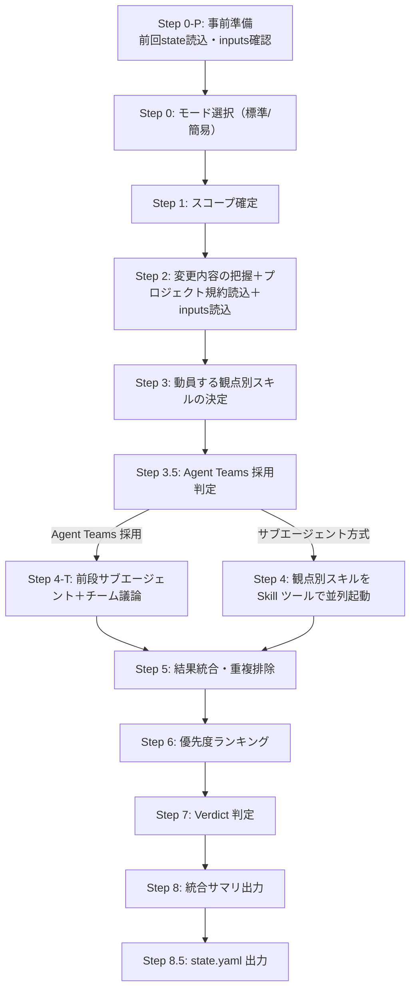

# レビュー実行フロー

`code-review` オーケストレータースキルの実行手順を Step 0-P〜8.5 で定義する。
**観点別スキル（5種）と Agent Teams（5パターン）の2経路** に対応。

> **本ファイルは索引（薄い親）**。各 Step の詳細は同ディレクトリの詳細サブファイルに分割して保持する。
> 外部からの参照（`flow.md Step 5` 等）は本ファイルのセクションマップで解決する（Step 番号は本ファイルにすべて残存）。

---

## 全体図

> **重要**: Step 4 と Step 4-T は **排他**（同時実行しない）。詳細は `team-selection.md` セクション 0 を参照。

---

## 用語の定義

| 用語 | 意味 |
|------|------|
| 観点別スキル | プラグイン内のスキル（5種）。`Skill` ツールで起動。例: `code-review-implementation` |
| エージェント | プラグイン共有エージェント定義（計 13 種 = 観点別スキル動員 10 種 + Agent Teams 専用 3 種（legal-advisor / infrastructure-engineer / project-leader））。`Agent` ツールで起動。例: `implementation-engineer` |
| 観点別スキルの内部構造 | 1スキルが内部で 1〜3 のエージェントを並列起動する |
| Agent Teams | 4〜5名の独立 Claude Code インスタンスが議論する協調作業（`TeamCreate`） |

| 観点別スキル（Skill ツール） | 内部で起動するエージェント（Agent ツール） |
|---|---|
| `code-review-implementation` | implementation-engineer / linter-static-analysis / performance-reviewer |
| `code-review-testing` | test-engineer / test-runner |
| `code-review-security` | security-engineer / dependency-safety |
| `code-review-architecture` | architect / dba |
| `code-review-frontend` | web-designer |

---

## セクションマップ（Step 索引）

各 Step の詳細は以下の詳細サブファイルに移設済み。外部参照が使う **Step 識別子（0-P〜8.5）はすべて本表に保持** する。各 Step 内のサブ識別子（例: 0-P-1〜0-P-4 / 6.1〜6.2 / 4-T-1〜4-T-4 / 8.5-1〜8.5-7）は各サブファイル内に見出しのまま保持している。

| Step | 概要 | 詳細ファイル |
|------|------|-------------|
| Step 0-P | 事前準備。前回 state.yaml 読込・inputs 確認・コード信頼性原則の適用準備（0-P-1 ブランチ名確定 / 0-P-2 前回 state 読込 / 0-P-3 inputs 確認 / 0-P-4 コード信頼性原則準備） | [flow-steps-early.md](flow-steps-early.md) |
| Step 0 | モード選択。`AskUserQuestion` で **標準 / 簡易** の2段階から選択（非対話・失敗時は標準既定） | [flow-steps-early.md](flow-steps-early.md) |
| Step 1 | スコープ確定。レビュー対象範囲を特定し、比較ブランチを `origin/develop → main → master` の順で自動判定 | [flow-steps-early.md](flow-steps-early.md) |
| Step 2 | 変更内容の把握＋プロジェクト規約読込。差分分類・ベンダー除外・言語/FW 検出・規約/仕様/inputs 読込・コード信頼性原則の適用 | [flow-steps-early.md](flow-steps-early.md) |
| Step 3 | 動員する観点別スキルの決定。Step 0 のモードと Step 2 の分類から起動する観点別スキルを確定（簡易＝トリオ / 標準＝最大5種＋動的省略） | [flow-steps-early.md](flow-steps-early.md) |
| Step 3.5 | Agent Teams 採用判定。`team-selection.md` の 5パターンから選定。採用条件・フォールバック条件・ユーザー承認 | [flow-steps-early.md](flow-steps-early.md) |
| Step 4 | 観点別スキル並列起動（サブエージェント方式）。Skill ツールで Independent 型並列起動。**Step 4-T と排他**。U14 伝達必須 | [flow-steps-review.md](flow-steps-review.md) |
| Step 4-T | Agent Teams 議論（チーム方式）。前段サブエージェント並列（4-T-1）＋チーム作成・議論（4-T-2）＋議論ラウンド（4-T-3）＋クリーンアップ（4-T-4）。**Step 4 と排他** | [flow-steps-review.md](flow-steps-review.md) |
| Step 5 | 結果統合・重複排除・前回指摘の解消確認。指摘プール統合・Issues/Suggestions/Scope-out の三分・プロファイルアンカー照合（C25） | [flow-steps-review.md](flow-steps-review.md) |
| Step 6 | 優先度ランキング + Finding ID 採番。並び順の確定（6.1）・Finding ID の一括採番（6.2・`CR-001`〜） | [flow-steps-review.md](flow-steps-review.md) |
| Step 7 | レビュー結果の判定。Verdict（Needs Work / Needs Attention / Ready to Merge）を条件表で判定 | [flow-steps-review.md](flow-steps-review.md) |
| Step 8 | 統合サマリ出力。`template/review-summary.md` の統一フォーマット（必須10セクション）で最終サマリ生成 | [flow-steps-output.md](flow-steps-output.md) |
| Step 8.5 | state.yaml 出力（必須）。永続化パス厳守（8.5-1 / 8.5-1.1）・state 生成（8.5-2）・detail_summary（8.5-3）・Thread ID（8.5-4）・status 更新（8.5-5）・サマリー作成→出力→投稿（8.5-6）・検証（8.5-7） | [flow-steps-output.md](flow-steps-output.md) |

---

## 詳細サブファイル

| サブファイル | 収録 Step | 内容 |
|-------------|-----------|------|
| [flow-steps-early.md](flow-steps-early.md) | Step 0-P 〜 Step 3.5 | 準備〜動員決定フェーズ（事前準備・モード選択・スコープ確定・変更把握・観点別スキル決定・Agent Teams 採用判定） |
| [flow-steps-review.md](flow-steps-review.md) | Step 4 〜 Step 7 | レビュー実行フェーズ（サブエージェント方式並列起動・Agent Teams 議論・結果統合・優先度ランキング・Verdict 判定） |
| [flow-steps-output.md](flow-steps-output.md) | Step 8 〜 Step 8.5 | 出力・状態フェーズ（統合サマリ出力・state.yaml 永続化・PR 投稿手順） |
