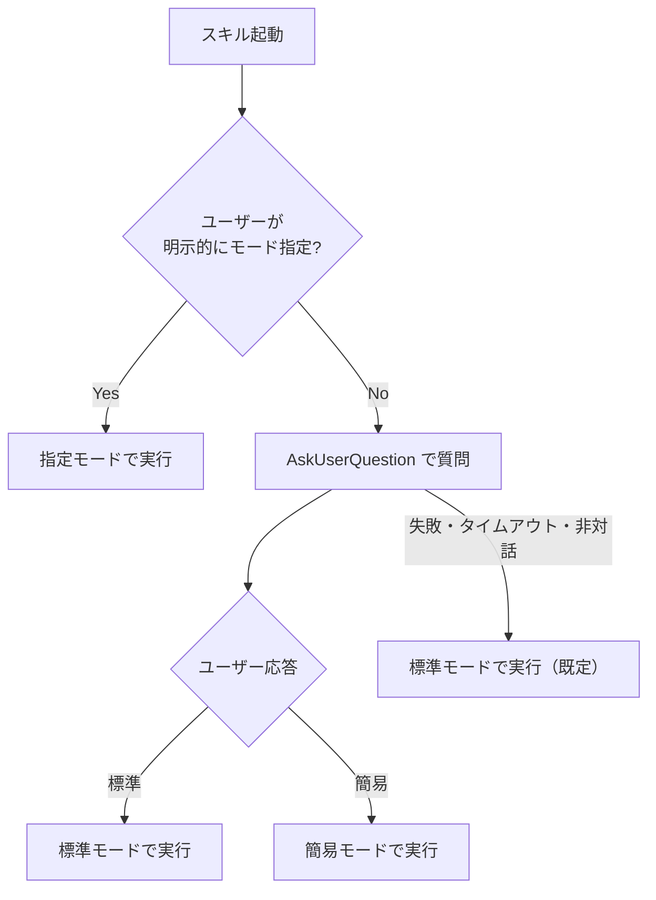

# レビューモード選択（標準 / 簡易）

`code-review` スキル開始直後の **Step 0** で実行するモード選択手順を定義する。

---

## 1. モード仕様

> **粒度**: モード判断は **観点別スキル単位**（5種）。エージェント単位（10種）ではない。各観点別スキルは内部で 1〜3 のエージェントを起動する。

| モード | 動員観点別スキル | 内訳エージェント（参考） | 用途 |
|--------|-----------------|------------------------|------|
| **標準** | 5種：impl / testing / security / architecture / frontend（差分内容に応じて architecture / frontend は省略可） | 最大10種（impl + linter + perf + test + runner + sec + dep + arch + dba + web） | 通常のコードレビュー（既定） |
| **簡易** | 3種：impl / testing / security（必須トリオ） | 最大7種（impl + linter + perf + test + runner + sec + dep） | 軽微な修正・時間 / コスト制約がある場合 |

### 簡易モードでも観点別スキル内のエージェントは全動員

簡易モード = 「観点別スキルを 3 個に絞る」という設計。各観点別スキル内部のエージェント（linter / runner / perf / dep 等）はスキル内で必要に応じ起動される（動的検証は権限がなければ SKIPPED）。

「簡易モード = 3 エージェントだけ動かす」という旧解釈は誤り。観点別スキルの責務（実装品質・テスト品質・セキュリティ品質を**多面的に評価**する）を保つため。

---

## 2. 選択フロー



### 2.1 ユーザー指示の優先

レビュー依頼時にユーザーが以下の表現をした場合は **そのモードで即実行** し、AskUserQuestion はスキップする。

| ユーザー表現 | 採用モード |
|------------|----------|
| 「簡易レビュー」「軽くレビュー」「クイックレビュー」「impl/test/sec だけで」「必須トリオで」 | 簡易 |
| 「標準レビュー」「フルレビュー」「全観点で」「全エージェントで」 | 標準 |

### 2.2 AskUserQuestion の呼び出し

ユーザー指示でモードが特定できなければ、以下の構造で `AskUserQuestion` を呼び出す。

```text
AskUserQuestion({
  questions: [{
    question: "どのレビューモードで実行しますか？（標準 = 全 5 観点 / 簡易 = 主要 3 観点のみ）",
    header: "レビューモード",
    options: [
      {
        label: "標準",
        description: "5 観点全動員（impl/test/sec/arch/frontend）。網羅性優先"
      },
      {
        label: "簡易",
        description: "必須 3 観点（impl/test/sec）。短時間・低コスト"
      }
    ],
    multiSelect: false
  }]
})
```

選択結果はメインコンテキストで保持し、Step 3 のエージェント選定に渡す。

### 2.3 非対話モード時の判定

以下のいずれかに該当すれば **AskUserQuestion を呼び出さず、標準モードで実行** する。

| 判定条件 | 内容 |
|---------|------|
| AskUserQuestion ツールが利用不可 | スキルの `allowed-tools` に AskUserQuestion が含まれていない / プラットフォームが非対応 |
| 呼び出しに対する応答がエラーで返る | ユーザーセッションが非対話モード（CI/CD・バッチ実行・コード実行 SDK 経由等） |
| 環境変数や呼び出しコンテキストから非対話と判別される | ターミナル TTY が割り当てられていない場合等 |
| ユーザーが Auto モードで明示的にモードを指定していない | Auto モード下でもユーザー応答が得られないケース。標準で実行する |

> **既定値ポリシー**: 非対話・失敗時は **常に標準モード**。簡易モードはユーザーが明示的に選択した場合のみ採用する（網羅性を優先する設計）。

> **フォールバック時の実行前通知（必須）**: AskUserQuestion を経ずに標準モードへフォールバックした場合は、レビュー実行前に 1 行で通知する（例: 「モード選択の確認ができなかったため標準モードで実行します」）。ユーザーが意図しない高コスト経路（標準モード → Agent Teams 提案）に気づかず進むのを防ぐため。集計セクションの「レビューモード」にも「標準（フォールバック）」と記録する。

---

## 3. モード採用後の処理

### 3.1 標準モード

`references/agents.md` の「標準モード動員エージェント一覧」に従い、10 種すべてを並列起動する。
ただし以下の **動的な絞り込み** は標準モードでも適用してよい:

- `dba` は SQL / DB スキーマ / マイグレーション変更が一切ない場合は省略可
- `architect` はアーキテクチャに影響しない単純な実装変更（コメント追記等）の場合は省略可
- `web-designer` は HTML / テンプレート / CSS / 静的アセット変更が一切ない場合は省略可
- `test-runner` は対応するユニットテスト基盤が存在しない場合・実行環境がない場合は実行不能として SKIPPED 扱い

### 3.2 簡易モード

必須トリオ（impl / test / sec）のみ並列起動する。
動的絞り込みは行わない（必須トリオは常に動員）。

---

## 4. モード情報のサマリ反映

最終サマリ（`output-format.md`）の「集計」セクションに採用したモードを必ず明記する。

```markdown
### 集計
- レビューモード: 標準 / 簡易
- 参加エージェント: <X> 名（<エージェント一覧>）
- ...
```

---

## 5. 実装メモ（Claude が Step 0 で行うこと）

1. ユーザー指示文を解析し、明示的なモード指示があるか判定
2. 明示があれば即採用、なければ `AskUserQuestion` を呼び出し
3. `AskUserQuestion` が成功し選択肢が返ったらそれを採用
4. 失敗・タイムアウト・例外は標準モードを採用（フォールバック）
5. 採用モードをメインコンテキストの状態として保持し、以降の Step に渡す
