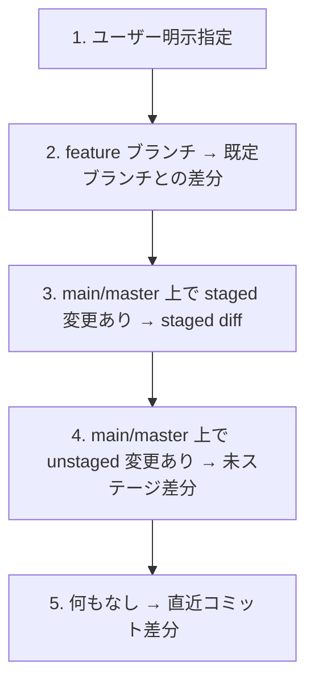

# レビュースコープ検出方法

ユーザー指示からレビュー対象（PR / ブランチ / ファイル / 差分）を確定する手順を定義。

---

## 1. レビュー対象の自動判定優先順位



### 1.1 優先度 1: ユーザー明示指定（PR / ブランチ / コミット / ファイル）

| ユーザー入力 | レビュー対象 | 取得方法 |
|------------|-------------|---------|
| 「PR #123 をレビュー」「<PR URL> をレビュー」 | PR の差分 | **セクション 2 の「PR レビュー手順」** に従う |
| 「ブランチ feature/X をレビュー」 | 指定ブランチ vs 既定ブランチ | `git diff <既定>...feature/X` |
| 「コミット abc123 をレビュー」 | 指定コミット | `git show abc123` |
| 「OrderProcessor.cs をレビュー」 | 指定ファイル全文 | `Read` |

### 1.2 優先度 2: カレントブランチが既定ブランチ以外の場合

既定ブランチとの差分を優先する。

#### 比較ブランチ自動判定の手順（必須）

リモート参照（`origin/`）を使い、未 fetch なローカルブランチとの差分による誤判定を防ぐ。

```bash
# 1. リモート最新を取得（必須）
git fetch origin --prune

# 2. 比較ブランチ候補を順に存在確認
#    優先度: develop → main → master → リモート HEAD
for branch in develop main master; do
  if git show-ref --quiet --verify "refs/remotes/origin/${branch}"; then
    DIFF_BASE="origin/${branch}"
    break
  fi
done

# 3. 上記すべてなければリモート HEAD（リポジトリのデフォルトブランチ）にフォールバック
if [ -z "$DIFF_BASE" ]; then
  DIFF_BASE=$(git symbolic-ref --short refs/remotes/origin/HEAD 2>/dev/null)  # 例: origin/trunk
fi

# 4. 差分取得
git diff "${DIFF_BASE}...HEAD"
```

#### ユーザー通知（必須）

採用した比較ブランチを **必ずユーザーに通知** する。例:

```
比較ブランチを自動判定しました: origin/develop
（origin/develop が存在したため採用。優先順位は develop → main → master → リモートHEAD）
```

#### プロジェクト固有の上書き

レビュー対象リポジトリの `CLAUDE.md` / `.claude/rules/` 等に「比較ブランチは XXX を使う」と明記されていれば、その指定を **最優先**。自動判定をスキップして指定値を使い、その旨をユーザーに通知する。

```
比較ブランチは CLAUDE.md の指定により origin/release/2026.04 を使用します。
```

#### 既定ブランチ判定

ユーザー指示・プロジェクト規約・自動判定（develop > main > master）すべてで決まらない場合のみ、リポジトリの公式デフォルトブランチを使う:

```bash
git symbolic-ref refs/remotes/origin/HEAD            # リモートの既定ブランチ
```

### 1.3 優先度 3: 既定ブランチで staged 変更がある場合

```bash
git diff --staged
```

### 1.4 優先度 4: 既定ブランチで未ステージ変更がある場合

ユーザーが明示していない限り、対象として確認する。
非対話モードでは `git diff` をレビュー対象とする。

```bash
git diff
```

### 1.5 優先度 5: 既定ブランチで未コミット変更が一切ない場合

直近コミットをレビュー対象とする。

```bash
git show HEAD                # 推奨
git diff HEAD~1 HEAD         # 互換
```

---

## 2. PR レビューへの委譲

「PR #N をレビュー」「PR URL をレビュー」「Azure DevOps の PR をレビュー」と依頼されたら、**`pr-review` スキルへ委譲する**（オーケストレーター内では PR 操作を直接行わない）。

```
Skill(skill: "pr-review", args: "<PR識別子> mode=<standard|quick>")
```

`pr-review` は GitHub と Azure DevOps Git の両方に対応し、以下を行う:
- PR 識別子からホスト判定
- 必要外部ツールの存在確認・不足時 `env-setup` への依頼
- PR メタ情報・差分・スレッド取得
- 未解決コメントの解消判定＋ネイティブステータス更新
- `code-review`（本オーケストレーター）への差分・規約サマリ付きレビュー委譲
- レビュー結果を行範囲指定で PR にコメント追記

詳細手順は以下を参照:
- `${CLAUDE_PLUGIN_ROOT}/skills/pr-review/SKILL.md` — PR レビュー全体フロー
- `${CLAUDE_PLUGIN_ROOT}/skills/pr-review/references/github.md` — GitHub PR 操作詳細
- `${CLAUDE_PLUGIN_ROOT}/skills/pr-review/references/azure-devops.md` — Azure DevOps PR 操作詳細
- `${CLAUDE_PLUGIN_ROOT}/skills/pr-review/references/comment-status.md` — コメントステータス管理

---

## 3. 差分の分類

差分から以下を分類し、エージェント選定（`agents.md`）に渡す。

| 軸 | 観点 |
|----|------|
| 規模 | 数行 / 関数〜ファイル単位 / 複数ファイル / 設計レベル |
| 種別 | 機能追加 / バグ修正 / リファクタリング / 設定変更 / マイグレーション / UI 変更 |
| 含まれるアセット | プログラムコード / テストコード / 設定 / SQL / マイグレーション / HTML / CSS / 画像 / ドキュメント |
| 危険度 | 認証・決済・個人情報・外部公開・データ破壊リスクを含むか |

> プロジェクト固有のディレクトリ構成・モジュール分類はスキル内に保持しない。レビュー対象リポジトリの `CLAUDE.md` / `.claude/rules/` / `README.md` 等から各エージェントが必要に応じ読み取る。

---

## 4. 大規模差分時の取り扱い

差分が大きすぎる場合（目安: 50 ファイル超 / 5,000 行超）はユーザーに以下を確認する。

- どのモジュール・領域を優先したいか
- 軽量レビュー（重要箇所のみ）と詳細レビュー（全件）どちらを希望するか

非対話モードでは標準モードで全件レビューに進むが、所要時間とコストが大きい旨をサマリの「未確認事項・制約」セクションに記録する。
