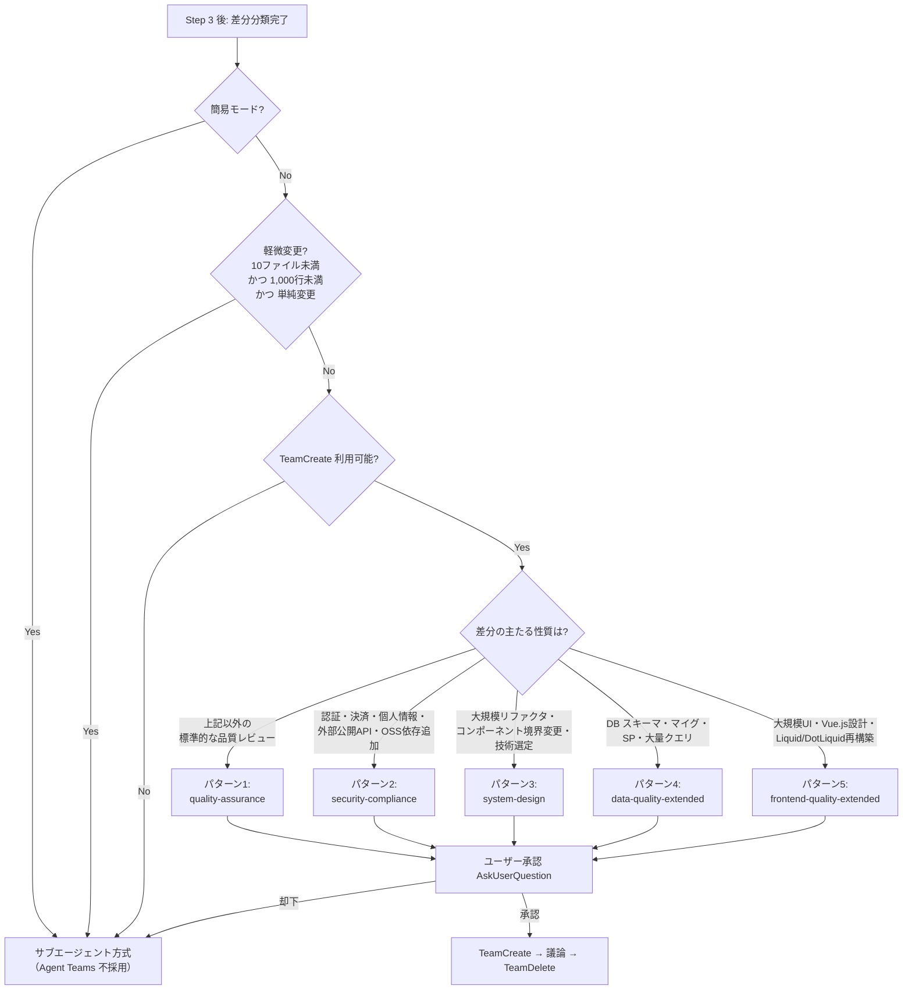

# Agent Teams 選定パターン

`code-review` オーケストレーターが Agent Teams（`TeamCreate`）を採用する際の **チーム選定パターン** を事前定義する。
レビュー対象の差分・性質を確認してからこの中から最適なパターンを選び、`TeamCreate` で組織する。

> **上位ルール**: 本ファイルは `~/.claude/rules/claude/agent-teams.md` の規約に従う。
> 既存定義済みチーム（`quality-assurance` / `security-compliance` / `system-design`）を最大限活用し、
> code-review 固有の補助観点は **Agent Teams 起動の前段サブエージェント** として並列実行する2段階構成を採る。

> **本ファイルは索引です**。詳細は同ディレクトリの詳細サブファイルに分割済み。
> 外部から `team-selection.md セクション 2` のように参照される識別子（セクション 0〜6・パターン1〜5）は、
> 下記「セクションマップ」「パターンマップ」に保持しており、参照は本索引で解決できる。

## 詳細サブファイル

| サブファイル | 収録セクション |
|---|---|
| [team-selection-patterns.md](team-selection-patterns.md) | セクション 2（パターン定義・パターン1〜5） / セクション 5（パターン早見表） |
| [team-selection-flow.md](team-selection-flow.md) | セクション 0（排他・コスト・前提） / セクション 3（共通運用ルール） / セクション 4（フォールバック条件） / セクション 6（将来の拡張） |

---

## 1. 選定フロー

---

## セクションマップ

| セクション | 内容（要約） | 場所 |
|---|---|---|
| 0. 排他関係・コスト・運用前提 | Step 4 / Step 4-T 排他・コスト倍率・前段/メンバーの違い・実行手順・環境前提（0.1〜0.5） | [team-selection-flow.md](team-selection-flow.md) |
| 1. 選定フロー | パターン選定の判断フロー図 | 本ファイル（上記フロー図） |
| 2. パターン定義 | パターン1〜5 の定義・スポーンプロンプト骨子 | [team-selection-patterns.md](team-selection-patterns.md) |
| 3. パターン共通の運用ルール | ユーザー承認（3.1）・起動/進行/終了（3.2）・進捗管理（3.3）・ファイル競合防止（3.4） | [team-selection-flow.md](team-selection-flow.md) |
| 4. フォールバック条件 | サブエージェント方式へ切替える条件一覧 | [team-selection-flow.md](team-selection-flow.md) |
| 5. パターン早見表 | 適用シーン別のパターン・リード・メンバー・前段サブエージェント一覧 | [team-selection-patterns.md](team-selection-patterns.md) |
| 6. 将来の拡張 | 新パターン追加時の手順 | [team-selection-flow.md](team-selection-flow.md) |

## パターンマップ

| パターン | チーム | リード | メンバー | 主な適用シーン | 定義 |
|---|---|---|---|---|---|
| パターン1 | quality-assurance | arch | impl / test / sec | 標準的な大規模品質レビュー | [team-selection-patterns.md](team-selection-patterns.md) |
| パターン2 | security-compliance | sec | impl / legal / infra | 認証・決済・PII・外部公開API・OSS追加 | [team-selection-patterns.md](team-selection-patterns.md) |
| パターン3 | system-design | arch | impl / sec / pl | 大規模設計変更・技術選定 | [team-selection-patterns.md](team-selection-patterns.md) |
| パターン4 | data-quality-extended | arch | impl / test / sec | DB変更主体（dba 重点） | [team-selection-patterns.md](team-selection-patterns.md) |
| パターン5 | frontend-quality-extended | arch | impl / test / sec | フロントエンド主体（web-designer 重点） | [team-selection-patterns.md](team-selection-patterns.md) |
