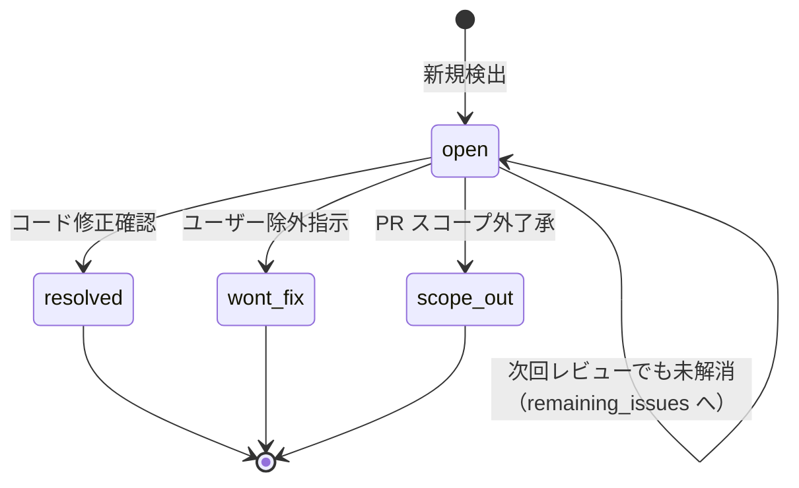

# State Management（レビュー状態管理）

レビュー結果を `state.yaml` に永続化し、再レビュー時に前回指摘状態を引き継ぐ仕組みを定義する。

---

## 1. 目的

- レビュー結果を構造化データで保持し、再レビュー精度を向上
- 解消済み・未解消の指摘を正確に追跡
- PR コメント（Azure DevOps / GitHub）との紐づけ（Thread ID）を維持
- 複数回レビューを跨いだ指摘の追跡可能性を確保

---

## 2. ディレクトリ構造

```
.claude/.local/plugins/deep-code-review/
└── {branch_name}/                    # ブランチ名（"/" はそのままディレクトリ階層化）
    ├── inputs/                       # 仕様書・設計書（inputs-management.md 参照）
    │   └── ...
    ├── {yyyyMMdd_HHmmss}/            # レビュー実施フォルダ（実施日時）
    │   ├── state.yaml                # レビュー状態スナップショット
    │   └── review-summary.md         # PR サマリースレッドと完全同一の内容
    ├── {yyyyMMdd_HHmmss}/            # 2回目のレビュー
    │   ├── state.yaml
    │   └── review-summary.md
    └── ...
```

### ブランチ名のディレクトリ化

`/` を含むブランチ名（例: `feature/order-improvements`）は **そのままディレクトリ構造化** する。

```
# ブランチ名: feature/order-improvements
.claude/.local/plugins/deep-code-review/feature/order-improvements/
├── inputs/
├── 20260604_143000/
│   └── state.yaml
└── 20260605_100000/
    └── state.yaml
```

---

### 2.1 ブランチ名のサニタイズルール

ブランチ名をディレクトリ名に使う際、以下のサニタイズを適用する。

| ルール | 対象 | 処理 |
|--------|------|------|
| `/` はそのまま階層化 | `feature/order` → `feature/order/` | 変換なし |
| Windows 禁止文字 | `\` `:` `*` `?` `"` `<` `>` `\|` | `_` に置換 |
| 先頭/末尾のドット・スペース | `.branch` `branch ` | 先頭/末尾を `_` に置換 |
| MAX_PATH 対策 | パス全長が 200 文字を超える場合 | ブランチ名を SHA-256 先頭 12 文字に短縮し、元のブランチ名を `_branch_name.txt` に記録 |

短縮例:
```
# 元のブランチ名が非常に長い場合
.claude/.local/plugins/deep-code-review/a1b2c3d4e5f6/inputs/
.claude/.local/plugins/deep-code-review/a1b2c3d4e5f6/_branch_name.txt  # 元のフルブランチ名を保持
```

---

## 3. state.yaml の生成タイミング

### 3.1 Step 8.5（オーケストレーターフロー内）

Step 8（統合サマリ出力）の直後に state.yaml を生成・保存する。

### 3.2 生成手順

1. **タイムスタンプフォルダ作成**: `.claude/.local/plugins/deep-code-review/{branch_name}/{yyyyMMdd_HHmmss}/` を作成
2. **テンプレート読み込み**: `${CLAUDE_SKILL_DIR}/references/template/state/state_template.yaml` を読む
3. **プレースホルダ埋め込み**: Step 0-P で読み込んだ前回 state + Step 5-8 の結果から値を埋める
4. **ファイル書き出し**: `Write` ツールで state.yaml を保存

### 3.3 review_round の決定

- **初回レビュー**: `review_round: 1`
- **再レビュー**: 前回 state.yaml の `review_round` + 1

---

## 4. 前回 state.yaml の読み込み（Step 0-P）

### 4.1 最新フォルダの検索

```
.claude/.local/plugins/deep-code-review/{branch_name}/
```

配下のタイムスタンプフォルダを **日時降順** でソートし、最新の `state.yaml` を検索する。

### 4.2 読み込み内容

前回 state.yaml から以下を抽出する:

| 項目 | 用途 |
|------|------|
| `findings` | 前回の全指摘。解消確認の対象 |
| `remaining_issues` | 前々回以前から継続する未解消指摘 |
| `review_round` | 今回の回数を算出（+1） |
| `git_head` | 前回時点の HEAD SHA。差分比較の起点 |
| `pr_thread_id` / `pr_thread_url` | PR コメントとの紐づけ |
| `ignored_by_user` | ユーザーが除外した指摘（再指摘しない） |
| `code_as_reference_decisions` | コード類推のユーザー承認の累積履歴（トップレベル。`last_review` の外に配置）。前回の承認を引き継ぎ、今回の新規承認をマージして保存 |

### 4.3 前回 state が存在しない場合

初回レビューとして扱う。`review_round: 1`、`remaining_issues: []`、`resolved_since_last: []` で開始。

---

## 5. 指摘の引き継ぎロジック

### 5.1 解消判定

前回 `findings` + `remaining_issues` の各項目について:

1. **ファイル・行番号の一致確認**: 前回の `file` + `line_start`-`line_end` が現在のコードで変更されているか
2. **detail_summary との照合**: 前回の `detail_summary` を読み、指摘内容が修正されているか判定
3. **PR スレッド状態の確認**: `pr_thread_id` がある場合、PR 上のスレッド状態（`fixed` / `active` 等）も参照

### 5.2 finding.status の状態遷移



| status 値 | 意味 | 格納先 |
|-----------|------|--------|
| `open` | 未解消。次回レビューで再評価 | `remaining_issues` に引き継ぎ |
| `resolved` | コード修正で解消確認済み | `resolved_since_last` に記録 |
| `wont_fix` | ユーザーが明示的に除外指示 | `ignored_by_user` に記録 |
| `scope_out` | PR スコープ外として了承 | `resolved_since_last` に `resolution=scope_out_ack` で記録 |

`resolved` / `wont_fix` / `scope_out` は最終状態。`open` のみが `remaining_issues` に移行する。

### 5.3 detail_summary の重要性

`detail_summary` は **再レビュー時に前回指摘を正確に理解する鍵**。以下を含めること:

- 問題が発生するファイルパスと行範囲
- 具体的な問題内容（何が・なぜ問題か）
- 期待される修正方針
- 関連する規約・仕様への参照

**悪い例**: `「SQL インジェクション」` — 情報が不足しており、再レビュー時に何を確認すべきかわからない

**良い例**: `「OrderSearch.cs:140-148 で SqlCommand に文字列連結で WHERE 句を構築しており、ユーザー入力がエスケープされずに SQL 文に挿入される。パラメータ化クエリ（SqlParameter）への変更が必要。OWASP A03 該当。」`

---

## 6. PR Thread ID の管理

### 6.1 Azure DevOps

Azure DevOps の PR コメントスレッドは `threadId`（数値）で識別される。state.yaml の `pr_thread_id` に保持する。

```yaml
findings:
  - id: CR-001
    pr_thread_id: 193
    pr_thread_url: "https://tfs.example.com/.../pullrequest/52?_a=files&path=/src/Order.cs&discussionId=193"
    pr_thread_status: active
```

### 6.2 GitHub

GitHub の PR コメントは `comment_id`（数値）で識別される。

```yaml
findings:
  - id: CR-001
    pr_thread_id: 1234567890
    pr_thread_url: "https://github.com/owner/repo/pull/123#discussion_r1234567890"
    pr_thread_status: active
```

### 6.3 再レビュー時の Thread ID 活用

再レビュー時は state.yaml の Thread ID を使って:

1. PR 上の既存スレッドの状態を確認できる
2. 同一指摘に対する reply / status 更新を正しいスレッドに投稿できる
3. `finding-thread-map.json`（pr-review の Step 7.4）と整合性を保てる

---

## 7. Finding ID の連続性

### 7.1 再レビュー時の採番

再レビュー時の **新規指摘** は、前回 state.yaml の最大 Finding ID 番号 + 1 から採番する。`output-format.md` セクション 1.5 の規則と整合する。

### 7.2 前回指摘の参照

統合サマリのセクション 6（既存指摘の解消判定）で前回 Finding ID を参照する際は、state.yaml の `findings[].id` / `remaining_issues[].id` を使用する。

---

## 8. state.yaml と既存セッション作業領域の関係（厳守）

state.yaml は **プラグインのローカルデータ** として `.claude/.local/plugins/deep-code-review/` 配下に保持する。セッション作業領域（`.claude/.local/work/{yyyyMMdd_nn_summary}/`）とは **別の管理体系**。

> **禁止**: state.yaml / review-summary.md / inputs を `.claude/.local/work/` 配下に保存すること。
> セッション作業領域はセッション終了後に参照されなくなるため、再レビュー時の前回 state 読み込み（Step 0-P-2）が失敗する。

| データ | 保存先 | ライフサイクル | 配置の理由 |
|--------|--------|--------------|-----------|
| **state.yaml** | **`.claude/.local/plugins/deep-code-review/{branch}/`** | **ブランチ単位で永続化** | 再レビュー時に前回の指摘状態を引き継ぐため |
| **review-summary.md** | **`.claude/.local/plugins/deep-code-review/{branch}/`** | **ブランチ単位で永続化** | state.yaml と同一フォルダで管理するため |
| **inputs/**（仕様書・設計書） | **`.claude/.local/plugins/deep-code-review/{branch}/inputs/`** | **ブランチ単位で永続化** | 再レビュー時に仕様情報を引き継ぐため |
| finding-thread-map.json（pr-review 用） | `.claude/.local/work/{session}/` | セッション単位 | PR コメント投稿直後の一時参照のみ |
| progress.md | `.claude/.local/work/{session}/` | セッション単位 | セッション内の進捗管理のみ |

---

## 9. クリーンアップ

state.yaml は **手動削除** を原則とする（誤削除防止のため自動化しない）。ブランチのマージ後、不要になったフォルダはユーザーが判断して削除する。

---

## 10. 禁止事項

- state.yaml を生成せずにレビューを完了すること（Step 8.5 は必須）
- 前回 state.yaml が存在するのに読み込まずにレビューを開始すること
- `detail_summary` を空にすること（再レビュー精度が低下する）
- `pr_thread_id` が取得可能な場合に記録しないこと
- state.yaml のスキーマバージョンを変更せずに構造を変えること

---

## 11. 関連ファイル

| ファイル | 内容 |
|---------|------|
| `${CLAUDE_SKILL_DIR}/references/template/state/state_template.yaml` | state.yaml テンプレート |
| `${CLAUDE_SKILL_DIR}/references/state/inputs-management.md` | inputs フォルダの管理 |
| `${CLAUDE_SKILL_DIR}/references/state/code-trustworthiness.md` | コード信頼性原則 |
| `${CLAUDE_SKILL_DIR}/references/flow/flow.md` | 実行フロー（Step 0-P / Step 8.5 追加） |
| `${CLAUDE_SKILL_DIR}/references/output/output-format.md` | Finding ID 採番規則 |
