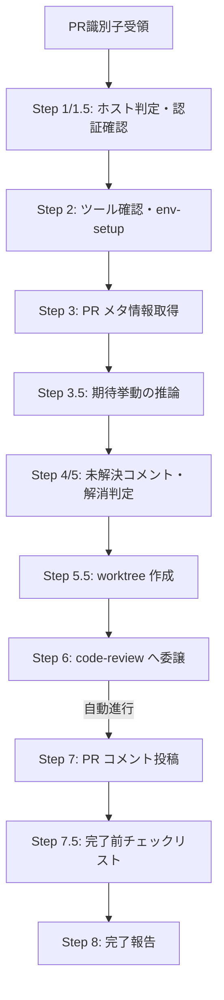

> **権限ポリシー（最小権限）**: `Write` / `Edit` は既定で不許可。GitHub / Azure DevOps の PR 操作は `connector` に委譲（pr-review は投稿内容の組み立て・バリデーションを担当し API 操作は connector 経由）。レビューロジックは `code-review` に委譲。PR API 一時ファイルの生成・削除は connector 側の責務のため pr-review は `Bash(rm *)` を持たず、worktree 操作は `references/scripts/worktree/*` スクリプト経由に限定する（任意パス削除の攻撃面を排除）。
>
> **PR コメント投稿は必須（既定動作）**: 別途指示されない限り PR への結果投稿（サマリースレッド + インラインコメント）は必須。投稿前に `${CLAUDE_SKILL_DIR}/references/pre-post-validation.md` のチェックリストを全項目通過させること。
>
> **PR 外への影響禁止**: PR 以外のリソースへの書き込み操作は禁止。詳細は `${CLAUDE_PLUGIN_ROOT}/references/scope-out-policy.md` セクション 1.5 を参照。
>
> **🔴 連続実行制約（MANDATORY / 最重要 / コンテキスト圧縮後も遵守）**: このスキルの Step 1〜Step 8 は **単一の連続フローとして中断なしで実行** する。connector からデータ取得後にユーザーへの提示や「次は〜します」宣言で停止することは **禁止** されている。connector の返却データは中間処理データであり、表形式での提示は不要。コンテキスト圧縮（recap）でフローが途切れた場合は、最後に完了したステップの次から **即座に再開** すること（ユーザーへの確認不要）。

# pr-review スキル

## 責務

GitHub と Azure DevOps Git 両方の PR を統一インターフェースでレビューし、**該当範囲を選択した状態でコメント追記**、未解決コメントの**解消確認＋ステータス変更**を行う。

## トリガー条件

- 「PR #123 をレビューして」「この PR の URL をレビューして」「PR の未解決コメントを確認して」と言われた場合
- GitHub / Azure DevOps の PR URL を渡された場合

## 前提

- PR 識別子（URL または ID）が提供されていること
- 対応するホスト（GitHub / Azure DevOps）の認証情報が設定済みであること

## 実行モード判定

起動文脈で **対話 / 非対話** が決まる。認証未設定の問い合わせ・`AskUserQuestion` 明示判断・HTTP 401/403 以外は非対話で連続実行し、CI/CD 等の非対話起動の既定は標準モード（`/code-review-standard` 等で固定可）。挙動を制御する引数軸: `mode=standard`（既定）/ `quick`（`code-review` へ委譲するレビューモード）、`auto-resolve=true`（既定・解消確認時に status まで更新）/ `false`（reply のみの dry-run）、`fetch-external=ask`（既定）/ `auto` / `off`（外部リンクの自動 fetch）。

## 入力

| 引数 | 形式 | 説明 |
|------|------|------|
| PR 識別子 | URL または ID | GitHub / Azure DevOps の PR URL、または `#123` / `azure:45` |
| ホスト指定 | `host=github` / `host=azure` | URL で判定不可な ID 形式の場合に明示（任意） |
| 再レビュー | `re-review=true` | 既存自著スレッドへの reply / status 更新を主軸にする |
| スコープ外了承 | `ack-scope-out=CR-NNN[,...]` | 通常レビューフローをスキップし了承処理のみ実行 |
| 修正完了確認 | `ack-fixed=CR-NNN[,...] commit=<sha>` | 通常レビューフローをスキップし修正完了処理のみ実行 |
| 仕様書パス | `spec=<path1>[,<path2>...]` | 期待挙動の根拠（未指定時は自動推論） |

## 対応ホスト

| ホスト | 利用ツール | 認証 | 操作経路 |
|--------|----------|------|---------|
| GitHub | `connector:github*` 系スキル群 | OAuth / PAT | connector に委譲 |
| クラウド Azure DevOps | `connector:azure*` 系スキル群 | MS アカウント / PAT | connector に委譲 |
| オンプレ TFS Server | `connector:azure*` 系スキル群 | NTLM | connector に委譲 |

> **表記について**: 本スキル内の「`connector:github`」「`connector:azure`」は connector プラグインのホスト別スキル群（`connector:github-read` / `connector:github-post` / `connector:azure-read-pr` / `connector:azure-post` / `connector:azure-approve-pr` 等）の **総称**。実際の Skill ツール呼び出しでは操作内容に応じた個別スキル名を指定する（読み取り = `*-read` 系、コメント投稿 = `*-post` 系）。

## 実行フロー

各ステップの詳細実装は下記 references を参照。

## フロー制御原則（MANDATORY）

規範本文は **`${CLAUDE_SKILL_DIR}/references/flow-control.md`** を参照（SSOT）。要点:

1. **連続実行（中断禁止）**: Step 1〜8 は単一の連続フロー。許可される中断は「認証未設定の問い合わせ」「AskUserQuestion による明示判断」「HTTP 401/403 等での続行不能」のみ。データ取得後の宣言停止（「次は〜します」で停止）は禁止
2. **connector 返却データは中間処理データ**: ユーザーへの表形式提示・列挙は禁止。受領後は即座に次ステップへ。途中経過の通知は最大 1 行
3. **code-review 結果返却後の自動進行**: 結果はフロー内部のデータ受け渡しであり、ユーザー確認なしで Step 7（PR コメント投稿）へ自動進行する
4. **サマリースレッド投稿の Verdict 非依存必須化**: OK（Ready to Merge）でもサマリースレッド投稿は必須（レビュー実施の証跡）。インラインコメントは指摘がある場合に必須
5. **コンテキスト圧縮後の再開**: recap でフローが途切れた場合は、最後に完了したステップの次から即座に再開する（ユーザーへの確認不要）

## ステップ要点

### Step 1/1.5: ホスト判定・認証確認

- GitHub: `connector:github` に読み取り操作を委譲（認証確認は connector 側）
- Azure DevOps（クラウド / TFS）: `connector:azure` に読み取り操作を委譲（認証確認は connector 側）
- 認証未確認なら connector が API を呼ばずユーザーに問い合わせる。詳細: `${CLAUDE_SKILL_DIR}/references/credentials-precheck.md`

### Step 3.5: 期待挙動の推論

`code-review-spec-inference` スキルに委譲。詳細: `${CLAUDE_PLUGIN_ROOT}/skills/code-review-spec-inference/SKILL.md`

### Step 4/5: 未解決コメント・解消判定

スレッド空配列時は Step 5 をスキップして Step 6 へ。自動判定は 2 パターン分岐（A: 解消 / C: 未解消）。ユーザー指示時の Pattern D / E を含む全 4 パターンの詳細: `${CLAUDE_SKILL_DIR}/references/re-review-flow.md`

### Step 5.5: worktree 作成

`git worktree` で PR ブランチを分離ディレクトリにチェックアウト。メインリポジトリの作業状態は変更しない。詳細: `${CLAUDE_SKILL_DIR}/references/local-checkout-review.md`

### Step 7: PR コメント投稿（最重要）

- **投稿順序（必須）**: インラインコメント → 旧サマリー closed → 新サマリースレッド
- **投稿前バリデーション（必須）**: `${CLAUDE_SKILL_DIR}/references/pre-post-validation.md` の 4 項目（PATH / ESCAPE / SANITIZE / TEMPLATE）を各コメントに適用。未通過なら投稿しない。署名は connector が自動付加するため pr-review 側では付加・検証しない
- **テンプレート駆動（必須）**: `${CLAUDE_SKILL_DIR}/references/template/comment-templates.md` から組み立てる（署名セクションを除く）
- **ホスト別投稿経路**: GitHub = `connector:github` へ委譲（args に「承認済み。」明示）/ Azure DevOps（クラウド / TFS）= `connector:azure` へ委譲（render-check を pr-review 側で事前実施し args に「render-check 通過済み。承認済み。」明示）。投稿本文の組み立ては pr-review、API 操作は connector
- 詳細実装: `${CLAUDE_SKILL_DIR}/references/comment-posting.md`

### Step 7.4: Finding ID → Thread ID マッピング

`.claude/.local/work/{session}/finding-thread-map.json` に保存。詳細: `${CLAUDE_SKILL_DIR}/references/scope-out-acknowledgment.md` セクション 7

### Step 7.5: 完了前チェックリスト

`${CLAUDE_SKILL_DIR}/references/completion-checklist.md` の全項目を通過後、レビュー判定に応じて worktree を処理（OK: 削除、NG: 維持）。

### Step 8: 完了報告

レビューモード / 指摘件数 / 投稿件数 / 失敗件数 / 解消確認件数 / worktree 状態 / PR 外書き込み有無 / マッピング保存先を報告。

### Step 9: スコープ外了承（ack-scope-out）

`ack-scope-out=CR-NNN` 指定時のみ実行。Step 1〜8 をスキップ。詳細: `${CLAUDE_SKILL_DIR}/references/scope-out-acknowledgment.md`

### Step 10: 修正完了確認（ack-fixed）

`ack-fixed=CR-NNN commit=<sha>` 指定時、または修正コミット作成後に自律発火。詳細: `${CLAUDE_SKILL_DIR}/references/scope-out-acknowledgment.md` セクション 8

## 参照

### プラグイン共通

| ファイル | 内容 |
|---------|------|
| `${CLAUDE_PLUGIN_ROOT}/references/comment-sanitization.md` | サニタイズ・予約文字エスケープ・投稿前チェックリスト |
| `${CLAUDE_PLUGIN_ROOT}/references/http-error-handling.md` | HTTP エラー分岐（429 リトライ / 401-403 即停止） |
| `${CLAUDE_PLUGIN_ROOT}/references/safe-external-fetch.md` | 外部 fetch の SSRF 対策 |
| `${CLAUDE_PLUGIN_ROOT}/references/comment-resolution-judge.md` | 解消判定アルゴリズム |
| `${CLAUDE_PLUGIN_ROOT}/references/scope-out-policy.md` | スコープ外指摘の取り扱い |

### pr-review 内部

| ファイル | 内容 |
|---------|------|
| `${CLAUDE_SKILL_DIR}/references/flow-control.md` | フロー制御原則（連続実行 / connector データ扱い / 自動進行 / Verdict 非依存投稿） |
| `${CLAUDE_SKILL_DIR}/references/pre-post-validation.md` | 投稿前バリデーション 4 項目チェックリスト（PATH / ESCAPE / SANITIZE / TEMPLATE。署名は connector 委譲） |
| `${CLAUDE_SKILL_DIR}/references/template/comment-templates.md` | コメントテンプレート（署名・インライン冒頭） |
| `${CLAUDE_SKILL_DIR}/references/comment-posting.md` | Step 7 詳細実装（インラインコメント / サマリースレッド） |
| `${CLAUDE_SKILL_DIR}/references/credentials-precheck.md` | Step 1.5 認証確認 |
| `${CLAUDE_SKILL_DIR}/references/pr-identifier-validation.md` | PR 識別子バリデーション |
| `${CLAUDE_SKILL_DIR}/references/local-checkout-review.md` | Step 5.5 worktree 利用手順 |
| `${CLAUDE_SKILL_DIR}/references/completion-checklist.md` | Step 7.5 完了前チェックリスト |
| `${CLAUDE_SKILL_DIR}/references/scope-out-acknowledgment.md` | Step 9/10 詳細（Pattern D/E） |
| `${CLAUDE_SKILL_DIR}/references/re-review-flow.md` | 再レビュー（4 パターン分岐 + reply テンプレート。スレッド status 運用は `comment-status.md`（インデックス）/ `comment-status-policy.md` を参照） |
| `${CLAUDE_SKILL_DIR}/references/azure-devops.md` | Azure DevOps PR 操作インデックス（共通仕様は `azure-devops-common.md`、TFS NTLM / クラウド ADO / GitHub のデバッグ用詳細は `azure-devops-tfs-ntlm.md` / `azure-devops-cloud.md` / `github.md`） |
| `${CLAUDE_SKILL_DIR}/references/author-identity.md` | 自著判定 |
| `${CLAUDE_SKILL_DIR}/references/checklist.md` | ルール ID 単位達成チェック |

## 重要な制約

- PR 外リソースへの書き込み禁止（`scope-out-policy.md` セクション 1.5.3 で例外条件を規定）
- Write / Edit は既定で不許可。GitHub PR コメント追記は `connector:github` 経由、Azure DevOps は `connector:azure` 経由
- 認証情報の値をユーザーに表示しない（マスクする / 存在のみ確認）
- Step 10 を省略して reply のみ投稿し status=active のまま放置することは禁止
- Verdict = OK 時にサマリースレッド投稿を省略することは禁止（レビュー実施の証跡として必須）

## 責務外

- PR のマージ・クローズ・承認操作（人間が実施）
- バグ修正の実装（指摘・推奨対応の提示にとどめる）
- 認証情報の取得・保存（ユーザーが事前準備）
- ホスティングサービスのセットアップ
- メッセージ本文での解消管理（ネイティブステータスを使う）
- PR 外のリソース操作（Work Item / Issue / Boards / 通知 / Wiki 等）
