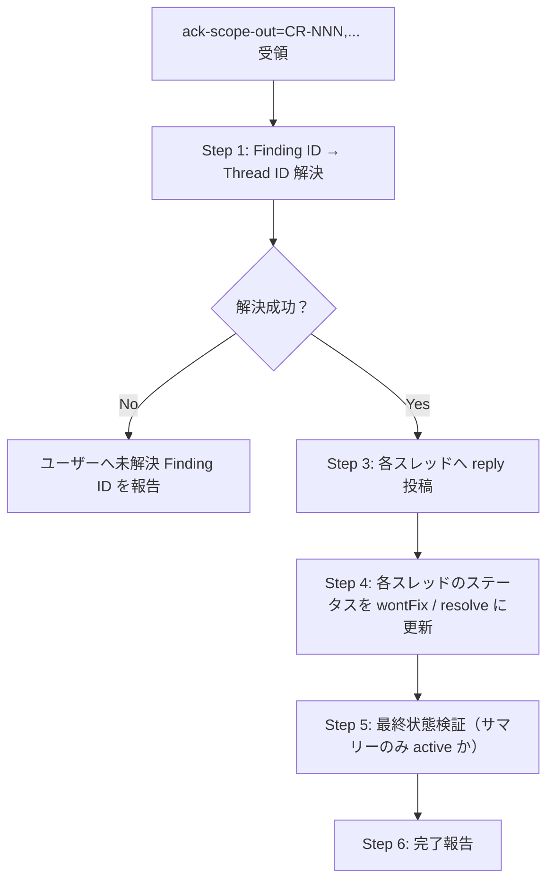

# ユーザー指示によるスレッド解消（Pattern D: スコープ外了承 / Pattern E: 修正完了確認）

ユーザーが Finding ID を指定して「スコープ外として対応」と指示した場合、対応スレッドに **了承コメントを投稿したうえでステータスを解消（wontFix / resolve）に更新** する手順（Pattern D）。ユーザー指示による修正完了確認（Pattern E）はセクション 8 を参照。

> **位置付け**: `pr-review` スキルのユーザー指示操作モード。`re-review-flow.md` の自動判定 2 パターン（A/C）に加わる **Pattern D / Pattern E**（計 4 パターン分岐）。
> **目的**: 対応すべき指摘がすべて対応された時点で、PR 上で **アクティブなコメントがレビューサマリのみ** になる状態を達成する。

---

## 本ファイルの構成（薄い索引）

本ファイルは **索引（概要 + セクションマップ）** です。詳細は同ディレクトリの 2 つの詳細ファイルに分割配置しています。外部参照用のセクション番号は下記「セクションマップ」で保持しており、`scope-out-acknowledgment.md セクション N` 形式の参照はこの索引で解決します。

| 詳細ファイル | 収録セクション | 内容 |
|---|---|---|
| [`scope-out-pattern-d.md`](scope-out-pattern-d.md) | 1〜5 | Pattern D（スコープ外了承）の想定シナリオ・起動方法・安全方針・実行フロー・ステップ詳細 |
| [`scope-out-pattern-e.md`](scope-out-pattern-e.md) | 6・6.5・7・8・9・10 | 観点別連携・prev マッピング退避・マッピング永続化・Pattern E（修正完了確認）・共通禁止事項・関連リファレンス |

---

## 全体フロー（Pattern D / セクション 4 の再掲）

> Step 2 は廃止・欠番（キーワード除外撤廃に伴う。Step 番号は参照互換のため維持）。Pattern E の全体像はセクション 8 を参照。

---

## セクションマップ（外部参照用・元の全識別子を保持）

| 識別子 | 概要 | 詳細 |
|---|---|---|
| 1. 想定シナリオ | 指摘投稿 → ユーザー指示 → スコープ外了承 → 解消（サマリーのみ active）までの流れ | [pattern-d](scope-out-pattern-d.md) |
| 2. 起動方法 | `ack-scope-out=CR-NNN[,...]` 引数仕様。受領時は通常レビュー（Step 1〜8）をスキップ | [pattern-d](scope-out-pattern-d.md) |
| 3. 安全方針 | 自動判定禁止・自著限定は `comment-status-policy.md` 0.5 に集約。ロールバック不可 | [pattern-d](scope-out-pattern-d.md) |
| 4. 実行フロー | Pattern D の mermaid フロー（上記「全体フロー」に再掲） | [pattern-d](scope-out-pattern-d.md) |
| 5. ステップ詳細 | Step 1 / 1.4 / 1.5 / 1.6 / 2 / 3 / 4 / 5 / 6 の詳細 | [pattern-d](scope-out-pattern-d.md) |
| └ Step 1 | Finding ID → Thread ID の解決（`finding-thread-map.json` 参照） | [pattern-d](scope-out-pattern-d.md) |
| └ Step 1.4 | head_sha 整合性チェック（force-push 検知） | [pattern-d](scope-out-pattern-d.md) |
| └ Step 1.5 | マッピング不在時のフォールバック（スレッド本文から特定） | [pattern-d](scope-out-pattern-d.md) |
| └ Step 1.6 | 既解消スレッドのスキップ判定（重複 reply 防止） | [pattern-d](scope-out-pattern-d.md) |
| └ Step 2 | 廃止・欠番（キーワード除外撤廃） | [pattern-d](scope-out-pattern-d.md) |
| └ Step 3 | 各スレッドへ了承 reply 投稿 | [pattern-d](scope-out-pattern-d.md) |
| └ Step 4 | ステータス更新（Azure `wontFix` / GitHub `resolve`） | [pattern-d](scope-out-pattern-d.md) |
| └ Step 5 | 最終状態検証（サマリーのみ active か） | [pattern-d](scope-out-pattern-d.md) |
| └ Step 6 | 完了報告 | [pattern-d](scope-out-pattern-d.md) |
| 6. 観点別スキル・オーケストレーター連携 | pr-review 単独完結。マッピングは Step 7 で永続化 | [pattern-e](scope-out-pattern-e.md) |
| 6.5 再レビュー時の prev マッピング退避（必須） | `finding-thread-map.prev.json` への退避手順・利用箇所・制約 | [pattern-e](scope-out-pattern-e.md) |
| 7. Finding ID → Thread ID マッピングの永続化（Step 7 拡張） | 保存先・フィールド定義（pr_id / head_sha / review_run / mappings[]） | [pattern-e](scope-out-pattern-e.md) |
| 8. Pattern E: ユーザー指示による修正完了確認（必須運用） | 8.1〜8.6。`ack-fixed` 引数・発火条件・安全方針・reply+status・完了報告・禁止事項 | [pattern-e](scope-out-pattern-e.md) |
| └ 8.1〜8.6 | 引数仕様 / 発火条件 / 安全方針 / reply テンプレ+status 更新 / 完了報告 / 禁止事項 | [pattern-e](scope-out-pattern-e.md) |
| 9. 禁止事項（Pattern D / Pattern E 共通） | 自動判定禁止・自著限定・黙ロールバック禁止・類推処理禁止・実証なき status 変更禁止 | [pattern-e](scope-out-pattern-e.md) |
| 10. 関連リファレンス | `comment-status-policy` / `re-review-flow` / `comment-posting` / `completion-checklist` 等 | [pattern-e](scope-out-pattern-e.md) |
