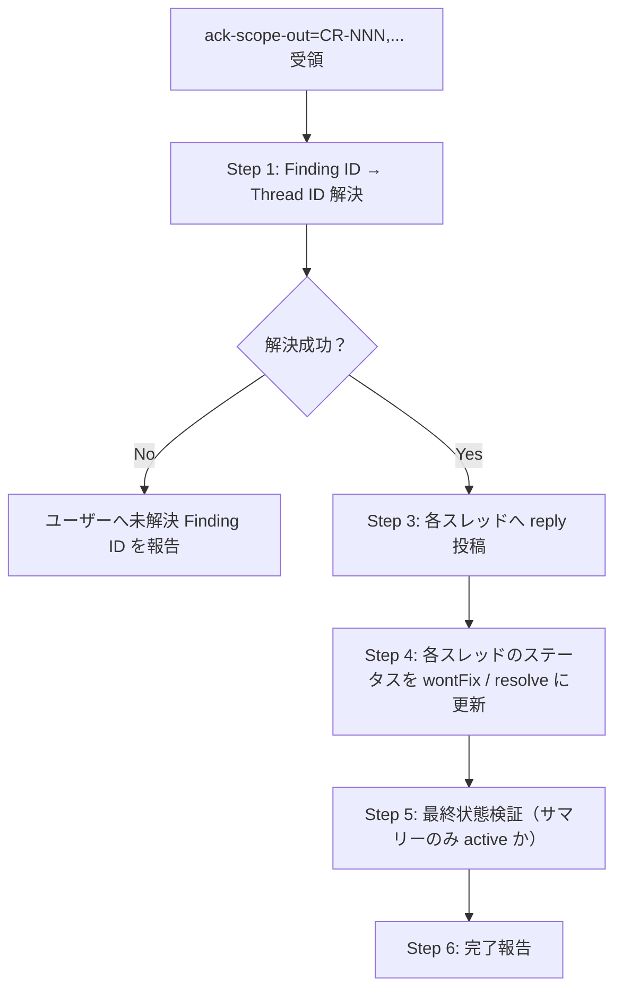

# Pattern D: スコープ外了承（scope-out-acknowledgment 詳細）

> **親索引**: [`scope-out-acknowledgment.md`](scope-out-acknowledgment.md) ｜ **対の詳細**（Pattern E・マッピング永続化・共通事項）: [`scope-out-pattern-e.md`](scope-out-pattern-e.md)
> 本ファイルは `scope-out-acknowledgment.md`（薄い索引）から分割した **Pattern D（スコープ外了承）** の詳細（セクション 1〜5）です。セクション番号は元ファイル準拠。

---

## 1. 想定シナリオ

```
1. pr-review がレビュー実施 → 指摘 CR-001〜CR-006 を投稿（各スレッド active）
2. PR 作成者・PdM がレビューを確認
3. ユーザー: 「CR-005 はスコープ外として OK。スレッド閉じて」
   または: 「CR-002, CR-005 はスコープ外、了承しました」
4. pr-review が Pattern D 動作:
   - 各スレッドに「ユーザー判断によりスコープ外として了承されました」reply
   - ステータスを wontFix（Azure DevOps）/ resolve（GitHub）に更新
5. すべての指摘が解消（fixed or wontFix）すれば、active な未解決スレッドはサマリースレッド 1 件のみ
```

---

## 2. 起動方法

`pr-review` スキルへの引数で起動する。専用の引数 `ack-scope-out=CR-NNN[,CR-NNN...]` を受け取る。

```
Skill(skill: "pr-review",
      args: "<PR識別子> ack-scope-out=CR-002,CR-005")
```

または明示的に Skill 経由ではなく、ユーザーが対話で「CR-005 はスコープ外」と言った際に、Claude が `pr-review` を本モードで呼び出す。

| 引数 | 形式 | 例 |
|------|------|------|
| PR 識別子 | URL / ID（既存と同じ） | `#46` / `https://.../pullrequest/46` |
| `ack-scope-out` | カンマ区切りの Finding ID | `ack-scope-out=CR-002,CR-005` |

引数に `ack-scope-out=` が含まれる場合、pr-review は **通常のレビューフロー（Step 1〜8）をスキップ** して **本ファイルのフローのみ** を実行する（既存スレッドへの追記操作のみ）。

---

## 3. 安全方針

Pattern D の安全方針 3 項目（自動判定禁止 / `auto-resolve=false` 指定の影響なし / 自著限定）は **`${CLAUDE_SKILL_DIR}/references/comment-status-policy.md` セクション0.5** に SSOT として集約。本ファイルでは重複定義しない（キーワード除外と警告再確認は撤廃済み）。

加えて Pattern D 固有のロールバック方針:

| 項目 | 方針 |
|------|------|
| ロールバック | 不可（`pr-review` 側ではロールバックしない。誤指定時はユーザーが手動で再オープン） |

---

## 4. 実行フロー



> Step 2（Critical/High/security 系の警告表示）は廃止済み（キーワード除外撤廃に伴う。Step 番号は参照互換のため欠番として維持）。

---

## 5. ステップ詳細

### Step 1: Finding ID → Thread ID の解決

`pr-review` は初回レビュー時にコメント投稿後、**Finding ID と PR Thread ID の対応マッピング** をセッション作業領域に保存しておく:

```
.claude/.local/work/{yyyyMMdd_nn_summary}/finding-thread-map.json
```

```json
{
  "pr_id": "46",
  "head_sha": "a3c4d5e",
  "review_run": 1,
  "mappings": [
    {
      "finding_id": "CR-001",
      "thread_id": "1234",
      "comment_id": "5678",
      "file_path": "src/web/admin/OrderSearch.cs",
      "line_range": "140-148",
      "severity": "Critical",
      "category": "セキュリティ",
      "title": "SQL インジェクション可能性"
    },
    {
      "finding_id": "CR-002",
      "thread_id": "1235",
      ...
    }
  ]
}
```

`ack-scope-out=CR-002,CR-005` を受領したら、このマッピングから対応する `thread_id` を解決する。

### Step 1.4: head_sha 整合性チェック（必須）

`finding-thread-map.json` の `head_sha` と PR の現在の head SHA を比較する。

```bash
SAVED_SHA=$(jq -r '.head_sha' "$SESSION_DIR/finding-thread-map.json")
CURRENT_SHA=$(gh pr view <PR-N> --json headRefOid -q '.headRefOid' 2>/dev/null \
              || curl -sS --ntlm --netrc-file "$NETRC" \
                   "${API_BASE}/pullrequests/<N>?api-version=6.0" \
                 | jq -r '.lastMergeSourceCommit.commitId')

if [ "$SAVED_SHA" != "$CURRENT_SHA" ]; then
  cat <<MSG
⚠️ head_sha 不一致警告:
  マッピング保存時: $SAVED_SHA
  現在の PR head:   $CURRENT_SHA
  PR ブランチが force-push 等で書き換わった可能性があります。
  thread_id 自体は不変ですが、ファイル名・行範囲が旧 SHA 基準のため
  指摘箇所と PR の現状が乖離している可能性があります。
MSG
  # ユーザーに「続行」or「中止」を確認
  AskUserQuestion: "Pattern D を続行しますか？（マッピング側の file:line は旧 SHA 基準）"
fi
```

| 判定 | 対応 |
|------|------|
| `SAVED_SHA == CURRENT_SHA` | 通常通り Step 2 へ |
| `SAVED_SHA != CURRENT_SHA` | **警告 + ユーザー確認**。続行指示があれば file:line に依存しない処理（thread_id ベースの reply / status 更新）に限定実行。マッピング再取得を推奨 |
| 比較不能（取得失敗） | 警告のみ表示し続行（thread_id は不変のため致命的ではない） |

### Step 1.5: マッピングが存在しない場合のフォールバック

セッション作業領域にマッピングがない場合（前回セッション終了済み・別セッションでの操作等）:

1. PR の現在のスレッド一覧を取得（`gh api graphql` / Azure DevOps REST）
2. 各スレッドの **本文冒頭** を確認（`## [CR-NNN] [<致命度>] <タイトル>` の **H2 見出し形式** で投稿されているはず・詳細: `comment-posting.md` セクション7.0.1）
3. Finding ID で該当スレッドを特定
4. 特定できないスレッドは「不明」として完了報告に含める（処理せずユーザー報告）

### Step 1.6: 既解消スレッドのスキップ判定（必須）

対象スレッドの **現在の status** を API で取得し、既に解消されているスレッドへの重複 reply 投稿を防止する。

```bash
# Azure DevOps / TFS
THREAD_STATUS=$(curl -sS --ntlm --netrc-file "$NETRC" \
  "${API_BASE}/threads/${threadId}?api-version=6.0" \
  | jq -r '.status')

# GitHub
THREAD_RESOLVED=$(gh api graphql -f query='
  query($id: ID!) { node(id: $id) { ... on PullRequestReviewThread { isResolved } } }
' -f id="$thread_node_id" | jq -r '.data.node.isResolved')
```

| ステータス | 対応 |
|-----------|------|
| Azure: `active` / `pending` / GitHub: `isResolved=false` | Pattern D を続行（Step 3〜4 へ） |
| Azure: `fixed` / `wontFix` / `closed` / `byDesign` / GitHub: `isResolved=true` | **処理スキップ**。完了報告に「CR-NNN: 既に解消済み（status=<...>）のためスキップ」と記載 |

**目的**:
- 同一スレッドへの重複 reply 投稿（スレッドノイズ）防止
- 既に Pattern A（自動解消）/ Pattern D（過去のユーザー指示）で対応済みのスレッドへの誤再処理防止

### Step 2: 廃止・欠番（キーワード除外撤廃）

> 旧「警告表示（Critical/High/security 系の確認）」は廃止済み。Pattern D はユーザー明示指示経路のため警告なしで Step 3 へ進む。

### Step 3: 各スレッドへ reply 投稿

スレッド ID ごとに **了承コメント** を投稿。本文テンプレート:

```
✋ [deep-code-review-plugin / pr-review] スコープ外として了承（ユーザー指示）

- 指示日時: <YYYY-MM-DD HH:MM>（<タイムゾーン>）
- Finding ID: <CR-NNN>
- 判定: ユーザーから「本 PR のスコープ外」として了承指示を受領しました
- 本 PR では対応しません。必要に応じて PR 作成者・PdM の判断で別取り組みとして検討されます
```

connector 呼び出し時: `marker: [deep-code-review-plugin] user-acknowledged scope-out`

サニタイズ・予約文字エスケープ・コマンドインジェクション対策は `comment-posting.md` セクション7.1〜7.3 と同じ。

### Step 4: ステータス更新

#### Azure DevOps / TFS

```bash
# wontFix に更新（「対応しない」が意味的に最適）
jq -n '{status: "wontFix"}' > "$BODY"

HTTP_CODE=$(curl -sS --max-time 30 -X PATCH --ntlm --netrc-file "$NETRC" \
  -H "Content-Type: application/json" --data-binary "@$BODY" \
  -o "$RESP" -w '%{http_code}' \
  "${API_BASE}/threads/${threadId}?api-version=6.0")
[[ "$HTTP_CODE" =~ ^2 ]] || { echo "HTTP $HTTP_CODE"; head -c 300 "$RESP"; exit 1; }
```

#### GitHub

```bash
# resolveReviewThread mutation
gh api graphql -f query='
  mutation($threadId: ID!) {
    resolveReviewThread(input: { threadId: $threadId }) { thread { isResolved } }
  }
' -f threadId="$thread_node_id"
```

### Step 5: 最終状態検証（必須）

スコープ外指示処理が完了した時点で、PR の **未解決スレッド一覧** を取得し、以下を確認する:

| 状態 | 期待値 |
|------|--------|
| 残っている active スレッド | サマリースレッドのみ（`threadContext.filePath == null`） |
| その他のスレッド | すべて fixed / wontFix / closed / byDesign / resolved（GitHub）|

#### Azure DevOps / TFS

```bash
# active スレッドのうち、サマリースレッド（threadContext == null）以外を抽出
HTTP_CODE=$(curl -sS --max-time 30 --ntlm --netrc-file "$NETRC" \
  -H "Accept: application/json" \
  -o "$RESP" -w '%{http_code}' \
  "${API_BASE}/threads?api-version=6.0")
[[ "$HTTP_CODE" =~ ^2 ]] || { echo "HTTP $HTTP_CODE"; exit 1; }

REMAINING=$(jq '[.value[]
  | select(.status == "active")
  | select(.threadContext.filePath != null)] | length' "$RESP")

if [ "$REMAINING" -gt 0 ]; then
  echo "WARN: 未対応の active なインラインスレッドが $REMAINING 件残っています"
  jq -r '.value[]
    | select(.status == "active")
    | select(.threadContext.filePath != null)
    | "- thread_id=\(.id) file=\(.threadContext.filePath):\(.threadContext.rightFileStart.line)"' "$RESP"
fi
```

#### GitHub

```bash
gh api graphql -f query='
  query($owner: String!, $repo: String!, $number: Int!) {
    repository(owner: $owner, name: $repo) {
      pullRequest(number: $number) {
        reviewThreads(first: 100) {
          nodes { id isResolved comments(first: 1) { nodes { path } } }
        }
      }
    }
  }
' -F owner=<owner> -F repo=<repo> -F number=<N> \
  | jq -r '.data.repository.pullRequest.reviewThreads.nodes[]
      | select(.isResolved == false)
      | select(.comments.nodes[0].path != null)
      | "- thread=\(.id) path=\(.comments.nodes[0].path)"'
```

未解決の `active` インラインスレッドが残っている場合、**その一覧を完了報告に明記**してユーザーに次のアクションを提示する（「CR-XXX も対応しますか？」「コードを修正してから再レビューしますか？」等）。

### Step 6: 完了報告

```markdown
## スコープ外了承処理 結果

### 処理した Finding ID（{N}件）
- CR-002: 「Null ハンドリング不足」 → wontFix（thread_id=1235）
- CR-005: 「早期 return リファクタ」 → wontFix（thread_id=1238）

### スキップした Finding ID（{M}件）
- CR-007: 該当スレッドが見つからず未処理（マッピング不明）

### PR の最終状態
- active なインラインスレッド: 0 件
- active なサマリースレッド: 1 件（PR 全体宛サマリー）
- ✅ 対応すべき指摘がすべて対応され、サマリーのみ active な状態を達成

または:
- active なインラインスレッド: 2 件（CR-001 / CR-003 が未対応）
- ⚠️ 未対応の指摘が残っています。コードを修正するか、追加で `ack-scope-out=...` を指示してください
```
