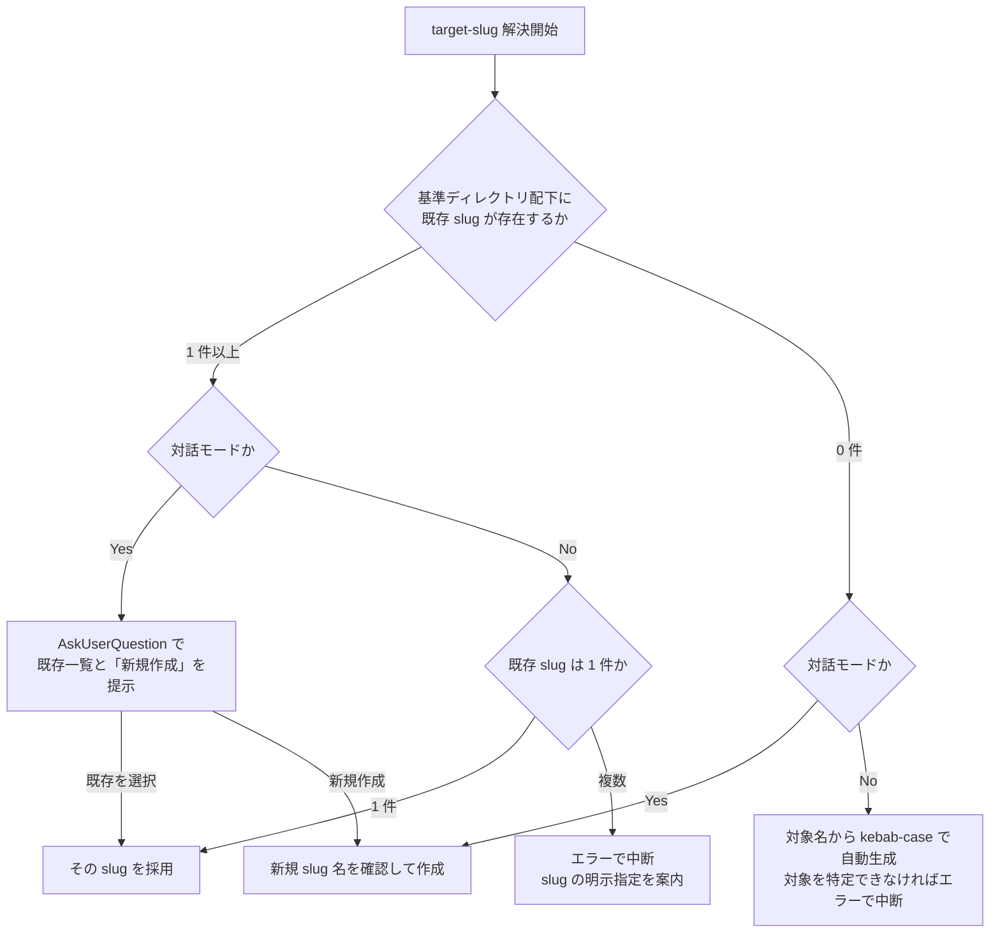

# データ配置規約

deep-test プラグインが扱うデータ（テスト計画・ケース定義・実行実績・エビデンス・報告書）の配置パス・target-slug 解決・エビデンス移送・保持方針を定義する唯一の SSOT である。
すべてのスキルはデータの読み書き先を本ファイルの規約で解決する。

---

## 1. 基準ディレクトリ

| 優先順位 | 条件 | 基準ディレクトリ |
|---------|------|----------------|
| 1（優先） | 作業ディレクトリがリポジトリ（`.git` を含む）配下 | `<repo_root>/.claude/.local/plugins/deep-test/` |
| 2（フォールバック） | リポジトリ外での作業 | `~/.claude/.local/plugins/deep-test/` |

- 判定は現在のディレクトリから `.git` を探索し、見つかればそのリポジトリルートを基準とする
- 同一セッション中は基準ディレクトリを切り替えない
- `.claude/.local/` はバージョン管理対象外の領域である。リポジトリ配下で使用する場合は `.gitignore` に `.claude/.local/` が登録されていることを確認する

---

## 2. 配置ツリー

```
.claude/.local/plugins/deep-test/
├── playwright/                        # Playwright MCP の raw 出力先（一時置き場・フラット構造。5 章）
└── {target-slug}/                     # テスト対象ごとのデータ一式
    ├── analysis.yaml                  # 解析材料・機械可読（test-analyze 生成・Phase 1.5・スキーマは yaml-schema-analysis.md）
    ├── target-analysis.md             # 解析材料・人間可読（test-analyze 生成・Phase 1.5）
    ├── fixtures.yaml                  # フィクスチャ基盤マニフェスト（test-fixture 生成・Phase 1.6・スキーマは playwright-test.md）
    ├── environment.yaml               # テスト用派生環境マニフェスト（test-environment 生成・Phase 1.7・スキーマは yaml-schema-environment.md）
    ├── environment/                   # 派生環境の成果物一式（test-environment 生成・Phase 1.7）
    │   ├── compose.test.yml           # 派生 compose（ports !override・127.0.0.1 バインド等）
    │   ├── .env.test                  # テスト用 env（ダミー値 / credentials-manager 参照形のみ）
    │   └── logs/                      # run 外の単独 down 時のコンテナログ保存先（run 中は evidence/{run_id}/environment/）
    ├── test-plan.md                   # テスト計画（test-design 生成）
    ├── test-cases.yaml                # テストケース定義（スキーマは yaml-schema-cases.md）
    ├── test-results.yaml              # 実行実績（スキーマは yaml-schema-results.md）
    ├── manual/                        # 手動実施の手順書・チャーターシート（generate_manual_sheet.py 生成。3 章）
    │   └── manual-sheet_{yyyyMMdd-HHmmss}.md
    ├── evidence/
    │   └── {run_id}/
    │       ├── environment/           # run 中のサービス別コンテナログ（test-environment の down 時保存先。{service}.log）
    │       └── {case_id}/             # ケース単位のエビデンス（移送後の正位置）
    │           ├── step-04-dashboard.png
    │           └── console-log.txt
    └── archive/                       # 手動クリーンアップ時のアーカイブ置き場（7 章）
```

> 注記: test-fixture が生成する **SUT のテストコード**（`playwright.config.ts` / `{tests}/fixtures/*.ts` / `auth.setup.ts` / seed 等）は SUT 側のテストディレクトリ（`project=` 配下）に配置され、**deep-test の管理データ領域（本ツリー）とは別**である。deep-test が本ツリーに置くのはフィクスチャの機械可読マニフェスト `fixtures.yaml` のみで、SUT テストコードそのものは deep-test の管理対象外である（SUT テストコードの書き込み境界は `playwright-test.md`）。

> 注記: **SUT の docker 資産**（compose・Dockerfile・`.env` 等）は **read-only** である。test-environment は派生ファイル（`environment/compose.test.yml` / `environment/.env.test`）を本ツリー（deep-test の管理データ領域）に生成し、SUT 側（`project=` 配下）へは一切書き込まない（派生スキーマ・書き込み境界は `yaml-schema-environment.md`）。

---

## 3. 各データの役割と生成・更新主体

| データ | 生成・更新主体 | 内容 | 詳細規約 |
|-------|--------------|------|---------|
| `analysis.yaml` | test-analyze | 解析材料（機械可読・Phase 1.5・read-only 解析の成果） | `yaml-schema-analysis.md` |
| `target-analysis.md` | test-analyze | 解析材料（人間可読・Phase 1.5・read-only 解析の成果） | — |
| `fixtures.yaml` | test-fixture | フィクスチャ基盤マニフェスト（機械可読・Phase 1.6。test-design が消費。SUT テストコード本体は管理対象外） | `playwright-test.md` |
| `environment.yaml` | test-environment | テスト用派生環境マニフェスト（機械可読・Phase 1.7。派生成果物 `environment/` 配下と併せて生成し、endpoints / exec_forms / lifecycle / status を下流へ提供） | `yaml-schema-environment.md` |
| `test-plan.md` | test-design | テスト計画（対象分析・レベル選定・方針） | — |
| `test-cases.yaml` | test-design | ケース定義・revision 管理 | `yaml-schema-cases.md` |
| `test-results.yaml` | オーケストレータ `test`（results_manager.py 経由のみ。LLM 直接編集禁止） | run 履歴 + ケース別結果 + latest 集計 | `yaml-schema-results.md` |
| `manual/` | オーケストレータ `test`（`generate_manual_sheet.py` 経由） | 手動実施ケース（manual-assist / exploratory）の実施指示書・チャーターシート（test-cases.yaml から再生成可能な派生物。タイムスタンプ命名で上書きしない） | `manual-execution.md` 8 章 |
| `evidence/{run_id}/{case_id}/` | 実行スキル（test-run-* の移送後処理） | スクリーンショット・ログ・トレース | `evidence-policy.md`（内容要件）・本ファイル 5 章（移送） |
| `playwright/` | Playwright MCP | raw 出力（移送前の一時置き場） | `playwright-mcp.md`（登録・起動オプション） |
| 報告書（Excel / Markdown） | test-report | 実績 YAML から生成する最終成果物 | `report-format.md`・本ファイル 6 章（出力先） |

---

## 4. target-slug 解決フロー

### 4.1 命名規約

- 対象アプリケーション名またはリポジトリ名の **kebab-case**（小文字英数字とハイフン。例: `order-management-web`）
- 1 対象 1 slug。同一対象の再テスト・追加テストでは既存 slug を再利用する（実績の継続性を保つため）

### 4.2 解決フロー



- 対話時は既存 `{target-slug}/` の一覧を提示（AskUserQuestion）し、選択 or 新規作成とする
- **非対話時は唯一の既存 slug を採用**する。複数存在する場合はエラーで中断する（誤った対象への実績追記を防ぐため。非対話既定値表は `execution-policy.md`）
- 非対話かつ既存 0 件の場合は、リポジトリ名等の対象名から kebab-case で自動生成する。対象名を特定できない場合はエラーで中断する

---

## 5. Playwright raw 出力とエビデンス移送

### 5.1 raw 出力先

- Playwright MCP の出力先は基準ディレクトリ配下の `playwright/`（フラット構造）に固定する
- MCP サーバーの出力先はセッション起動時に固定され、run や case ごとに切り替えられない。そのため全ケースの出力がこの一時置き場に混在する前提で扱う
- MCP の登録・起動オプション（出力先指定を含む）は `playwright-mcp.md` 参照

### 5.2 移送規約（実行スキルの必須後処理）

1. ケースのステップを実行すると、スクリーンショット等が `playwright/` に出力される
2. **ステップ実行直後**（次のステップ・次のケースに進む前）に、出力ファイルを `{target-slug}/evidence/{run_id}/{case_id}/` へ **move** する
3. move はコピーではなく移動とし、`playwright/` に残骸を残さない

- ステップ直後の移送を必須とする理由: 移送を後回しにすると他ステップ・他ケースの出力と混在し、ファイルの帰属（どのケースのどのステップの証跡か）が判別不能になるため
- エビデンスのファイル内容・取得タイミング・命名の要件は `evidence-policy.md` 参照
- run 終了時に `playwright/` に残留ファイルがある場合は帰属不明ファイルとして警告し、内容を確認のうえ手動で整理する
- 実績 YAML に記録するエビデンスパスは、移送後の `{target-slug}/` 直下基準の相対パスとする（`yaml-schema.md` 2.1）

---

## 6. 報告書の出力先

- 報告書（Excel / Markdown）は**セッション作業領域** `.claude/.local/work/{session}/` 直下に最終成果物として出力する
- `{target-slug}/` 配下には置かない。実績 YAML（test-results.yaml）が状態の SSOT であり、報告書はそこから**何度でも再生成できる派生物**のため
- フォーマット・章立て・注記は `report-format.md` 参照

---

## 7. 保持・クリーンアップ方針

### 7.1 基本方針（自動削除しない）

- `evidence/` と test-results.yaml の runs・results 履歴は**自動削除しない**（監査証跡。いつ・何を・どの結果で実行したかの追跡可能性を保証する）
- クリーンアップはユーザー判断による手動操作のみとする

### 7.2 evidence の手動クリーンアップ手順例

容量が肥大した場合、以下の目安で古い run のエビデンスをアーカイブしてから削除する。

対象選定の目安: 報告書提出済みで、かつ `latest` が参照していない古い run の evidence。

```bash
base=".claude/.local/plugins/deep-test/{target-slug}"
old_run="R20260601-090000"

# 1) 対象 run の evidence をアーカイブする（共通スクリプト経由。内容確認まで実施）
bash "${CLAUDE_PLUGIN_ROOT}/references/scripts/run/archive_evidence.sh" \
  --run "$old_run" "$base" "$base/archive/evidence-${old_run}.tar.gz"

# 2) アーカイブ作成後に元ファイルを削除する
rm -rf "$base/evidence/$old_run"
```

注意事項:

- アーカイブ作成・内容確認は `archive_evidence.sh`（`references/scripts/run/`）に集約する。引数・形式（tar.gz / zip）・`--run` 等の仕様は同スクリプト冒頭コメント参照
- **外部共有**: 報告書を外部ステークホルダーへ共有する際は、報告書実体（セクション 6・セッション作業領域）とエビデンス実体（本節の `evidence/`）が別ツリーにあるため、`archive_evidence.sh` に対象ディレクトリと報告書ファイルを渡して evidence 一式を 1 アーカイブにまとめる（`--run` 省略で全 run 対象）
- test-results.yaml の `results[].evidence` / `defect.evidence` にはパスが記録されたまま残る。削除後はパス解決できなくなる（実体はアーカイブ内）ため、アーカイブファイル名に run_id を含めて対応関係を保持する
- YAML 内の runs / results エントリは**削除しない**（推移集計・監査のため）
- 各ケースの最新結果（`latest` が参照する run）の evidence は削除対象にしない

### 7.3 test-results.yaml の肥大対処

- 現行スキーマ（schema_version: 1）は単一ファイル運用とする。操作はすべて results_manager.py 経由のため、run 数が増えても LLM コンテキストへの全量読み込みは発生しない（`yaml-schema.md` 3 章）
- ファイルの取り回しに支障が出る規模になった場合の対処は**将来検討**とする: run 単位のファイル分割（例: `results/{run_id}.yaml` への分割 + インデックス保持）。schema_version の改訂を伴うため、実施時は `yaml-schema.md` の改訂とマイグレーション手順の整備をセットで行う

---

## 8. 禁止事項

- 本規約の配置ツリー以外の場所に実績・エビデンスを出力すること
- `evidence/` や runs・results 履歴を自動削除する仕組みを追加すること（7.1 違反）
- エビデンス移送を後回しにして、複数ケースの raw 出力を `playwright/` に滞留させること
- 報告書を `{target-slug}/` 配下に保存すること（セッション作業領域直下が正位置）
- 同一セッション中に基準ディレクトリ（リポジトリ / ホーム）を切り替えること
- 非対話時に複数の既存 target-slug がある状態で処理を継続すること（エラー中断が正）

---

## 9. 関連 references

| 参照先 | 内容 |
|-------|------|
| `yaml-schema.md` | 実績 YAML の共通規約（相対パス基準）・操作規約（スキーマ本体は `yaml-schema-cases.md` / `yaml-schema-results.md`） |
| `evidence-policy.md` | エビデンスの内容要件・必須提出物・機微情報マスキング |
| `playwright-mcp.md` | Playwright MCP の登録・起動オプション・出力先指定 |
| `retest-policy.md` | 実績マージ（append-only）と履歴保持の関係 |
| `report-format.md` | 報告書のフォーマット |
| `execution-policy.md` | 非対話既定値表（target-slug 複数時のエラー中断を含む） |
