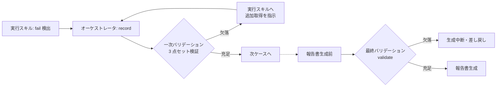

# エビデンス・NG 時提出物規約（evidence-policy）

テスト結果の証跡（エビデンス）と NG（fail）時の提出物に関する規約 SSOT。
「NG 時は再現手順・検証データ・エビデンスを必須とする」要件を、記録時と報告時の二段バリデーションで保証する。

---

## 1. NG（fail）時の必須 3 点セット

status = fail のケースは、`defect` に以下 3 点を**すべて**含めなければならない。1 点でも欠けた fail は記録として確定されない（セクション 2）。

| # | 項目 | 内容 |
|---|------|------|
| 1 | `reproduction_steps` | **環境情報を含む完全な再現手順**。前提条件（ログイン状態・初期データ）・操作ステップ（番号付き）・使用データ・発生条件（毎回再現 / 特定条件下のみ・再現率）を含む。第三者がこの記述だけで再現できる粒度で書く |
| 2 | `test_data` | 検証データ。**入力値・期待値・実際値**の 3 つを明記する |
| 3 | `evidence` | スクリーンショット・ログ・トレース等の**ファイルパス 1 件以上**（evidence/ 配下の相対パス。実在するファイルであること） |

- 上記 3 点は `defect` 配下のエビデンスだが、**結果本体の `results[].evidence` も fail 時は 1 件以上必須**（`defect.evidence` とは別の結果レベルのエビデンス。一次バリデーションは両方を検証する）。フィールド定義は yaml-schema-results.md 3 章参照
- `defect.severity` の付与も fail 時必須。判定基準は severity-policy.md 参照（本書では複製しない）
- `defect` のフィールド構造・スキーマは yaml-schema-results.md 4 章参照

## 2. 二段バリデーション

3 点セットの充足は、**一次（記録直後）と最終（報告書生成前）の二段**で検証する。

| 段階 | タイミング | 検証内容 | 欠落時の動作 |
|------|-----------|---------|-------------|
| 一次 | fail 記録直後（オーケストレータの record 時） | 当該 fail の 3 点セット | **その場で実行スキルに追加取得を指示**する（スクリーンショット再取得・ログ収集・再現手順の補完）。充足するまで record を確定しない |
| 最終 | 報告書生成前（validate） | 全 fail の 3 点セット再検証 + **run の scope vs results 突合**（欠落ケース検出） | **報告書生成を中断し差し戻す**（欠落エビデンスの補完、または該当 run の状態確認へ） |

- record / validate は `results_manager.py` のサブコマンドであり、実行主体はオーケストレータ（execution-policy.md 責務境界）
- 最終バリデーションを通過していない実績からの報告書生成は禁止（report-format.md）

## 3. blocked / skipped / na の reason 必須

fail 以外でも、未実施・対象外となったケースには**監査証跡として reason を必ず記録**する。「なぜ実施しなかったか・なぜ対象外か」を後から追跡できない実績を残さない。

| status | reason に書くこと |
|--------|-----------------|
| blocked | 何にブロックされたか（依存ケース ID とその fail・前提不成立の内容・タイムアウト発生の旨と経過時間 等） |
| skipped | どの実行手段が利用不可だったか（MCP 未ロード・テストランナー未検出・対象 URL 到達不可・負荷ツール未検出 等） |
| na | なぜ対象外と判定したか（対象機能の非搭載・環境非該当 等） |

- reason を欠く blocked / skipped / na は record で受理しない（必須制約の定義は yaml-schema-results.md 3 章）
- skipped は報告書の「未確認事項」として一覧化され（report-format.md）、環境整備後の再テスト対象となる（retest-policy.md）

## 4. エビデンスファイルの命名・配置

| 項目 | 規約 |
|------|------|
| 配置 | `evidence/{run_id}/{case_id}/` 配下（target-slug 配下。完全なパス規約・基準ディレクトリ解決・raw 出力からの移送手順は data-locations.md 参照） |
| 命名 | **ステップ番号 2 桁プレフィクスを推奨**（例: `01_login-page.png`, `02_submit.png`, `90_console-log.txt`, `91_snapshot.txt`）。時系列が名前順で追えるようにする |
| 集約 | 1 ケースのエビデンスは当該ケースのディレクトリに集約し、他ケースのファイルと混在させない |
| 参照記法 | YAML・報告書からの参照は evidence/ 起点の**相対パス文字列**で記録する（絶対パス・環境依存パスを書かない） |

## 5. 機微情報マスキング

### 5.1 マスク形式

| 対象文字列長 | マスク形式 | 例 |
|-------------|-----------|-----|
| 9 文字以上 | 先頭 4 文字 + アスタリスク（固定 4 個）+ 末尾 4 文字 | `sk-p****f456` |
| 8 文字以下 | 全文字マスク（固定 8 個のアスタリスク） | `********` |

- アスタリスク個数は元の長さに関わらず固定とする（元の文字列長を推測させないため）

### 5.2 マスク対象

| 分類 | 例 |
|------|-----|
| 認証情報 | パスワード・API キー・アクセストークン（Bearer / JWT）・セッション ID・秘密鍵 |
| 個人情報 | 氏名・メールアドレス・電話番号・住所等（テスト専用のダミーデータと明示できるものは除外可） |

### 5.3 適用タイミング

| タイミング | マスク義務 |
|-----------|-----------|
| 生エビデンスの evidence/ 保管時 | **可能な限り**マスクする（テキストログは保存前に置換。スクリーンショットは撮影対象画面に機微情報を表示させない手順設計で配慮） |
| 報告書への転載時 | **必須**マスク（Excel / Markdown とも。report-format.md） |
| reason・actual・チャット出力 | マスク前の生の値を記載しない |

- セキュリティテスト（test-run-security）のエビデンスは認証情報・トークンを扱う頻度が高いため特に注意する
- マスクにより再現に必要な情報が欠ける場合は、値そのものではなく「値の取得方法・格納場所」を reproduction_steps に記載する

## 6. pass ケースのエビデンス

| ケース | エビデンス要件 |
|--------|--------------|
| `priority: high` | pass でも**必須**。レベルに応じた証跡（画面系レベル: 主要ステップのスクリーンショット / ユニット: テストランナーのログ・レポート / API: リクエスト・レスポンス記録）1 件以上 |
| `priority: medium` / `low` | 推奨（レベルに応じた証跡。同上）。必須ではない |

- pass エビデンスは「正しく動作したことの証跡」であり、報告書のエビデンス参照列から辿れるように記録する
- `priority: high` の pass エビデンス欠落は最終バリデーションで**警告**する（生成中断の対象は fail の 3 点セット欠落のみ）

## 7. 関連 references

| ファイル | 参照内容 |
|---------|---------|
| severity-policy.md | defect.severity の判定基準（唯一の SSOT） |
| yaml-schema-results.md | defect / reason / evidence のフィールド定義・必須制約 |
| data-locations.md | evidence/ の完全パス規約・raw 出力からの移送手順・保持方針 |
| execution-policy.md | エビデンス自動収集のタイミング・中間結果返却フォーマット |
| report-format.md | 報告書へのエビデンス参照・未確認事項・転載時マスキング |
| retest-policy.md | skipped ケースの再テスト対象化 |
