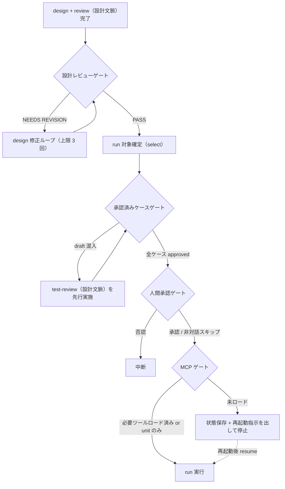

# 実行共通規範（execution-policy）

`deep-test` プラグインの実行フェーズ（run）に関わる全スキル共通の規範 SSOT。
オーケストレータ（`test`）のゲート判定と、実行スキル 6 種（`test-run-unit` / `test-run-functional` / `test-run-integration` / `test-run-scenario` / `test-run-performance` / `test-run-security`）の共通動作を定義する。

## 1. 実行フェーズのゲート（4 種）

run の前後に以下の 4 ゲートを配置する。**判定はすべてオーケストレータの責務**であり、実行スキルはゲート判定を行わない。



### 1.1 設計レビューゲート

| 項目 | 内容 |
|------|------|
| 位置 | review（設計文脈）後（フルフロー時のみ。再テスト・run-only では省略） |
| PASS 時 | run 対象確定へ進む |
| NEEDS REVISION 時 | **実行フェーズをブロック**し、test-design へ差し戻す修正ループ（design 修正 → test-review 再実行）を行う |
| 修正ループ上限 | 3 回。超過時: 対話時 = ユーザー判断（続行 / 中断 / 指摘を許容して進行）、非対話時 = エラー中断 |

### 1.2 承認済みケースゲート

| 項目 | 内容 |
|------|------|
| 位置 | run 対象確定時（select による scope 決定後） |
| 判定 | scope に `review_status: draft` のケースが含まれる場合、run を開始せず**先に test-review（設計文脈）を要求**する |
| 通過条件 | scope の全ケースが approved になった時点で通過（`review_status` の定義は yaml-schema-cases.md 参照） |

### 1.3 人間承認ゲート

| 項目 | 内容 |
|------|------|
| 位置 | run 前（scope 確定・承認済みケースゲート通過後） |
| 動作 | AskUserQuestion で「実行に進むか」を確認する |
| 提示必須項目 | 実行ケース数 / 対象テストレベル / 想定所要時間（ケース数とケースタイムアウト上限からの概算）/ **破壊的操作を含むケース数**（test-cases.yaml の `destructive: true` を select 出力から機械集計する。LLM の自由記述推測ではなく構造化フィールドに基づく） |
| 非対話時 | **スキップ**（自動進行。セクション 9 参照） |

文言例（提示必須項目を質問文に埋め込み、各選択肢に帰結を 1 行で添える）: 質問「テスト実行に進みますか？（対象 12 ケース / unit, functional / 想定 15 分 / 破壊的操作 0 件）」、選択肢「実行する」（run を開始する）/「対象を見直す」（select からやり直す）/「中断する」（実績未変更のまま終了する）

### 1.4 MCP ゲート

| 項目 | 内容 |
|------|------|
| 位置 | run 直前（人間承認ゲート通過後） |
| 判定対象 | Playwright MCP 必要レベルを scope に含む場合のみ判定。**unit のみの実行では MCP 不要のため通過**（unit 以外の 7 レベルはすべて MCP 必要） |
| 判定方法 | `mcp__playwright__` 系ツールの**実利用可否**を ToolSearch で確認する（実判定手順は playwright-mcp.md 参照） |
| 未ロード時 | 状態保存（test-cases.yaml / test-results.yaml は既に永続化済み）+ ユーザーへの再起動指示（再起動ハンドオフ）を出して**停止**する。利用可を装った続行は禁止 |
| 再開 | 再起動後のセッションで `resume` モードにより未実行ケースから継続する |

## 2. 条件付き動的検証（実行手段不在時の扱い）

原則: **未実施を問題なしと書かない**。実行手段が利用不可の場合、実行を偽装せず `skipped` + reason を記録し、報告書の「未確認事項」に転記する（report-format.md）。

| 実行手段 | 主な利用箇所 | 利用不可時の扱い |
|---------|-------------|----------------|
| Playwright MCP | unit 以外の 7 レベル | run 前: MCP ゲートで停止（セクション 1.4）。run 中の喪失: 以降の未実行ケースを skipped + reason |
| テストランナー（pytest / jest / dotnet test 等） | unit | 検出不可 → 対象ケースを skipped + reason |
| 対象アプリケーション | ブラウザ駆動レベル全般 | 対象 URL 到達不可・起動未確認 → 対象ケースを skipped + reason |
| 外部負荷ツール（k6 等） | performance の多重負荷 | 検出不可 → 多重負荷ケースのみ skipped。単一セッション応答時間計測は実施する |

- `skipped` / `blocked` の使い分け（status 意味論）・enum 定義は yaml-schema-results.md 6 章、skipped ケースの環境整備後 ng-only 再テスト対象化は retest-policy.md 参照

## 3. 実行スキルの責務境界

| 項目 | 規範 |
|------|------|
| 結果の返却 | 実行スキルは実行結果を**中間データとしてオーケストレータへ返却するのみ**（セクション 4 のフォーマット） |
| 実績 YAML 書き込み | `test-results.yaml` への書き込みは**オーケストレータが `results_manager.py`（record 等）経由で一元実行**する。実行スキルによる直接書き込み・Edit / Write は禁止 |
| 起動順序 | 実行スキルは**逐次起動**を原則とする（既定はレベル順: unit → functional → integration-internal → integration-external → system → uat → performance → security）。**Playwright MCP はブラウザセッションを共有するため実行スキルの並列起動は禁止** |
| scope 全件返却 | 割り当てられた scope の全ケースについて**必ず 1 エントリを返す**（実行不能でも skipped / blocked として返す）。finish-run の scope vs results 突合の前提 |
| エビデンス移送 | 実行スキルはステップ実行直後に raw 出力をケース単位の evidence/ へ移送してから、移送後パスを返却する（移送規約は data-locations.md 参照） |

進捗可視化（オーケストレータの責務）: レベル完了時にサマリ（レベル名・実行件数・pass / fail 内訳）を出力する。長時間レベル（scenario / uat / integration / performance / security）で 1 レベル内のケース数が多い場合は、レベル完了時サマリに加えて一定間隔（例: 5 ケースごと）に intra-level の簡易進捗（実行済み / 総数・pass / fail 内訳）も出力し、無反応に見える時間を作らない。

## 4. 中間結果返却フォーマット（実行スキル → オーケストレータ）

実行スキルは最終応答に、以下の JSON を 1 つのコードブロックで含めて返す。オーケストレータはこれを `results_manager.py record` の入力として 1 件ずつ記録する（例は fail 1 件。pass は `reason` / `defect` を null にする）。

```json
{
  "skill": "test-run-functional",
  "run_id": "R20260717-143000",
  "results": [
    {
      "case_id": "TC-FUNC-002",
      "case_revision": 1,
      "status": "fail",
      "reason": null,
      "executed_by": "playwright-mcp",
      "duration_sec": 34.0,
      "actual": "必須項目未入力でもエラーメッセージが表示されず登録された",
      "evidence": ["evidence/R20260717-143000/TC-FUNC-002/02_submitted.png"],
      "defect": {
        "severity": "high",
        "reproduction_steps": [
          "環境: Windows 11 / Chromium headless / 対象 https://localhost:5001",
          "1. ログイン後、顧客登録画面を開き全項目を未入力のまま登録ボタンをクリックする",
          "2. バリデーションエラーが表示されず登録が完了する（毎回再現）"
        ],
        "test_data": "入力値: 全項目空 / 期待値: 必須エラー表示・登録拒否 / 実際値: 登録成功",
        "evidence": ["evidence/R20260717-143000/TC-FUNC-002/02_submitted.png"],
        "extras": {}
      }
    }
  ]
}
```

results[] 各要素（1 ケース 1 エントリ）:

| フィールド | 型 | 必須 | 内容 |
|-----------|-----|------|------|
| `case_id` | string | 必須 | 対象ケース ID |
| `case_revision` | int | 必須 | 実行したケースの revision（監査トレーサビリティ） |
| `status` | string | 必須 | pass / fail / blocked / skipped / na |
| `reason` | string / null | blocked・skipped・na 時必須 | 未実施・対象外の理由（evidence-policy.md） |
| `executed_by` | string | 必須 | playwright-mcp / test-framework / api / human-assisted |
| `duration_sec` | number / null | 推奨 | 実行時間（秒） |
| `actual` | string | pass・fail 時必須 | 実際の結果 |
| `evidence` | string[] | fail 時 1 件以上必須 | エビデンス相対パスのリスト（**移送後**の evidence/ 配下パス） |
| `defect` | object / null | fail 時必須 | severity / reproduction_steps / test_data / evidence / extras。3 点セット要件は evidence-policy.md、severity 判定基準は severity-policy.md 参照 |

- フィールド意味論・enum 値の SSOT は yaml-schema-results.md（本フォーマットは record の JSON 入力と同一構造）。`run_id` はオーケストレータが start-run で採番した値をそのまま返す（実行スキルは採番しない）

## 5. テストデータ分離

| 原則 | 内容 |
|------|------|
| 前提の宣言 | ケースは `preconditions` でデータ前提（必要なマスタ・アカウント・初期状態）を宣言する |
| 復元 | `postconditions` で作成データの削除・状態復元を行い、共有環境の状態汚染を防ぐ |
| 順序非依存 | 実行順序非依存を原則とする（どの順で実行しても同じ結果になるようケースを設計する） |
| 依存の明示 | ケース間の依存が不可避な場合は `depends_on` で明示する。依存元 fail 時、後続ケースは blocked + reason で記録する |
| 復元失敗の記録 | postconditions の実施に失敗した場合は、その旨を actual / reason に記録し隠蔽しない |

## 6. 環境安全

- 破壊的操作（データ削除・更新・外部システムへの送信等）を含むケースは、**ケース設計時に明示**し（steps / preconditions に記載）、実行前の人間承認ゲートで提示・確認する
- **本番環境への実行は既定で禁止**。ユーザーの明示指示がある場合のみ例外とし、その場合も破壊的操作を含むケースは scope から除外する
- 対象 URL・証明書の扱いは playwright-mcp.md、認証情報等の機微情報の扱いは evidence-policy.md（マスキング）に従う

## 7. エビデンス自動収集

| 実行形態 | タイミング | 収集物 |
|---------|-----------|-------|
| Playwright 実行時（executed_by: playwright-mcp） | 各ステップ実行後 | スクリーンショット（`browser_take_screenshot`） |
| Playwright 実行時 | 失敗検出時（追加） | アクセシビリティスナップショット（`browser_snapshot`）+ コンソールログ（`browser_console_messages`）のテキスト保存 |
| テストランナー実行時（unit） | 実行完了時 | ランナーの実行ログ（stdout / stderr）のファイル保存 |
| テストランナー実行時 | 失敗検出時（追加） | 失敗テストのスタックトレース（defect.extras.stack_trace にも転記） |

- 収集物はケース単位で `evidence/{run_id}/{case_id}/` へ移送する（移送規約・命名は data-locations.md）。pass ケースのエビデンス要否（priority: high は必須）は evidence-policy.md 参照

## 8. タイムアウト

| 項目 | 規範 |
|------|------|
| ケース単位タイムアウト | 既定 **120 秒**。ケース定義に任意フィールド `timeout_sec`（秒）を指定して上書き可 |
| 超過（ハング）時 | 当該ケースを `blocked` + reason（タイムアウト発生の旨・経過時間・最後に完了したステップ）で記録し、次ケースへ進む |
| ブラウザ操作の待機 | 固定スリープではなく条件待機を優先する（playwright-mcp.md の待機規範） |

## 9. 非対話モード既定値表

`--non-interactive` 併用時は確認をスキップし、以下の既定値で進行する。

| 確認項目 | 非対話時の既定値 |
|---------|----------------|
| 報告形式 | Markdown |
| 人間承認ゲート | スキップ（自動進行） |
| 設計レビューゲートで NEEDS REVISION | 修正ループ（上限 3 回）→ 超過時はエラー中断 |
| `automation: manual-assist` のケース | 実行せず skipped + reason 記録 |
| run-only モードで `levels=` 未指定 | エラー中断（`levels=` の指定を要求。実行対象レベルを自動推測しない） |
| target-slug が複数存在 | エラー中断（自動選択しない） |
| 報告対象 run（report-only 時） | 最新 run（集計自体は latest 規則で run 横断。retest-policy.md） |
| MCP ゲートで未ロード | 再起動ハンドオフを出力して停止（非対話でも自動続行しない） |

## 10. 関連 references

| ファイル | 参照内容 |
|---------|---------|
| playwright-mcp.md | MCP 登録・実利用可否判定・ツールリスト・待機規範 |
| evidence-policy.md | fail 時 3 点セット・reason 必須・マスキング |
| yaml-schema-cases.md / yaml-schema-results.md | review_status・depends_on・timeout_sec（cases）/ status enum・results / defect フィールド定義（results） |
| retest-policy.md | 再テスト対象判定・latest 集計規則 |
| data-locations.md | エビデンス移送・パス規約・target-slug 解決 |
| severity-policy.md | defect.severity の判定基準 |
| report-format.md | 未確認事項（skipped 一覧）の報告方法 |
