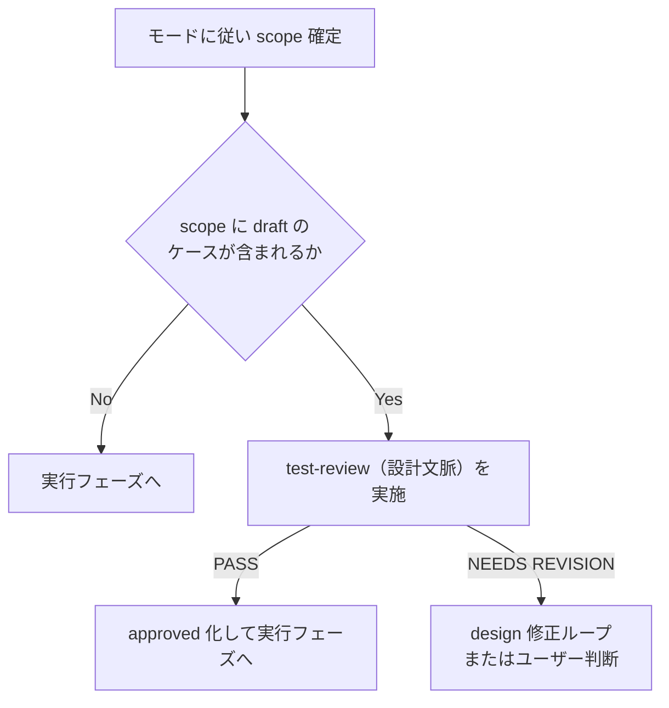

# 再テスト規約

再テストのモード定義・対象判定・集計・実績マージの規則を定義する唯一の SSOT である。
再テスト対象の抽出と集計は、常に本ファイルの規則に従い results_manager.py（`yaml-schema.md` 3 章）経由で機械的に行う。

---

## 1. 再テストモード

| モード | 引数例 | 対象抽出 | 用途 |
|-------|--------|---------|------|
| `full` | `retest full` | `na`・`deprecated` を除く承認済み全ケース | 修正後の全体回帰確認（**推奨**） |
| `ng-only` | `retest ng-only` | 最新 status が `fail` / `blocked` / `skipped` のケース + 未実行ケース | NG の修正確認を素早く回す |
| `ids` | `retest ids=TC-FUNC-002,TC-SYS-001` | 指定した case_id のみ | ピンポイントの再確認 |
| `resume` | `resume` | 中断 run の scope のうち results 未記録のケース | 中断からの継続（6 章。新規 run を作らない） |

- `full` / `ng-only` / `ids` は新規 run（新しい `run_id`）として実行する。`resume` のみ既存の中断 run を引き継ぐ
- モードの起動経路（コマンド・オーケストレータのモード判定）はオーケストレータ `test` スキル側の定義に従う

---

## 2. 対象判定マトリクス（status×モード）

対象判定は**ケースごとの最新 status**（test-results.yaml の `latest` セクション。`yaml-schema-results.md` 5 章）に基づく。

| 最新 status | full | ng-only | ids |
|------------|------|---------|-----|
| `pass` | 対象 | 対象外 | 指定時対象 |
| `fail` | 対象 | **対象** | 指定時対象 |
| `blocked` | 対象 | **対象** | 指定時対象 |
| `skipped` | 対象 | **対象**（環境整備後の再挑戦） | 指定時対象 |
| `na` | 対象外 | 対象外 | 指定時対象（警告付き） |
| 未実行（結果なし） | 対象 | **対象**（新規追加ケース） | 指定時対象 |

補足規則:

- `resume` は本マトリクスの対象外（status ではなく「中断 run の scope で results 未記録」により判定する。6 章）
- `deprecated: true` のケースはモードに関わらず対象外。`ids` で明示指定された場合も警告を表示して除外する
- `na` の `ids` 指定は「対象外判定そのものを再確認する」意図がある場合のみ許容する（警告付き）
- 未実行ケースを含むすべての scope には承認済みケースゲート（4 章）が適用される
- 対象抽出は results_manager.py の `select` サブコマンドが本マトリクスに従って行う（LLM が手動で抽出しない）
- ケース改訂（revision 更新→ draft 戻し）が発生した場合、ng-only は最新 status が `pass` のケースを対象にしないため改訂を検知しない。`select` の `warnings`（実績 revision と現行 revision の不一致警告）を確認し、改訂ケースは full または ids で明示的に再実行すること

---

## 3. ng-only は回帰テストの代替ではない（重要）

> **ng-only は「NG だったケースの修正確認」のみを行うモードであり、回帰テストの代替ではない。**
> 修正が pass 済みケースへ与える副作用（デグレード）は ng-only では検出できない。
> **修正の副作用検出には full を推奨**する。

- ng-only で pass に転じても、それは「当該ケースの修正確認」であって「回帰確認済み」を意味しない
- ng-only 実行時は、報告書にもその旨の注記を出力する（出力仕様は `report-format.md`）

---

## 4. 承認済みケースゲート

抽出した scope に `review_status: draft` のケース（未承認ケース）が含まれる場合、実行に進む前に **test-review（設計文脈）による承認を要求**する。

- ケース内容の変更（revision +1）で `draft` に戻ったケースも同様に扱う（`review_status` の遷移規則は `yaml-schema-cases.md` 3 章）
- 非対話モード時の既定挙動は `execution-policy.md` の非対話既定値表に従う

---

## 5. 集計規則（latest 採用・SSOT 一本化）

- 集計・報告・再テスト対象判定は、常に**ケースごとの最新 run 結果**（`latest` セクション）を採用する
- 過去 run の結果（results 履歴）は**推移情報**としてのみ扱う（報告書の推移表示に使用）
- この規則は **test-report の報告書生成にも同一に適用**する（集計規則の SSOT を本ファイルに一本化。表示フォーマットは `report-format.md`）
- `latest` の維持は results_manager.py が `record` 時に自動で行う（`yaml-schema-results.md` 5 章）

例: R20260701-090000 で `fail` だったケースが R20260710-140000（ng-only）で `pass` になった場合、集計上は `pass` として扱い、`fail` の履歴は推移情報として表示する。

---

## 6. resume（中断 run の再開）

中断した run を、未実行ケースから継続するための規約。

| 項目 | 規約 |
|------|------|
| 対象 run | `runs[].status` が `in_progress` または `interrupted` の run |
| 対象ケース | 当該 run の `scope` のうち、同一 `run_id` の results に**記録がない**ケース |
| run_id | **新規採番しない**。中断 run の `run_id` を引き継いで残りケースの結果を追記する |
| 完了処理 | 全ケース記録後に `finish-run` で scope と results を突合し、status を `completed` に確定する |
| 複数中断時 | 最新の 1 件（run_id 降順の先頭）を対象とする。それより古い中断 run は再開せず、ユーザー確認のうえ `aborted` に整理する |

- MCP ゲート（Playwright MCP 未ロード検知）による停止・再起動後の継続は resume で行う（ゲートの挙動は `execution-policy.md`）
- 実績 YAML は常に永続化済みのため、中断時点までの結果は resume 後もそのまま有効である

---

## 7. 実績マージ規約

- 再テストの結果は既存 test-results.yaml への **append + latest 更新**で記録する。既存の runs / results エントリの**上書き・書き換え・削除は禁止**（append-only。`yaml-schema-results.md` 3 章）
- `full` / `ng-only` / `ids` は新規 `run_id` を採番する（`resume` を除く）
- 過去 run の記録は監査証跡・推移集計のためすべて保持する（保持・クリーンアップ方針は `data-locations.md`）

---

## 8. 禁止事項

- ng-only の結果のみをもって「回帰確認済み」と報告すること（3 章）
- `latest` 以外（任意の過去 run の結果）を集計・判定・報告に使用すること
- results_manager.py の `select` を経ず、LLM の判断だけで再テスト対象を確定すること
- `review_status: draft` のケースを承認なしで実行すること（4 章のゲートを迂回すること）
- resume で新規 `run_id` を採番し、中断 run を `in_progress` のまま放置すること
- 再テスト結果で既存の results エントリを上書き・削除すること

---

## 9. 関連 references

| 参照先 | 内容 |
|-------|------|
| `yaml-schema.md` | results_manager.py 操作規約（3 章） |
| `yaml-schema-results.md` | status enum・runs[].status・latest セクション |
| `execution-policy.md` | MCP ゲート・非対話既定値表・条件付き動的検証（skipped の発生源） |
| `report-format.md` | 推移表示・ng-only 注記を含む報告書フォーマット |
| `data-locations.md` | 実績・エビデンスの配置と保持方針 |
