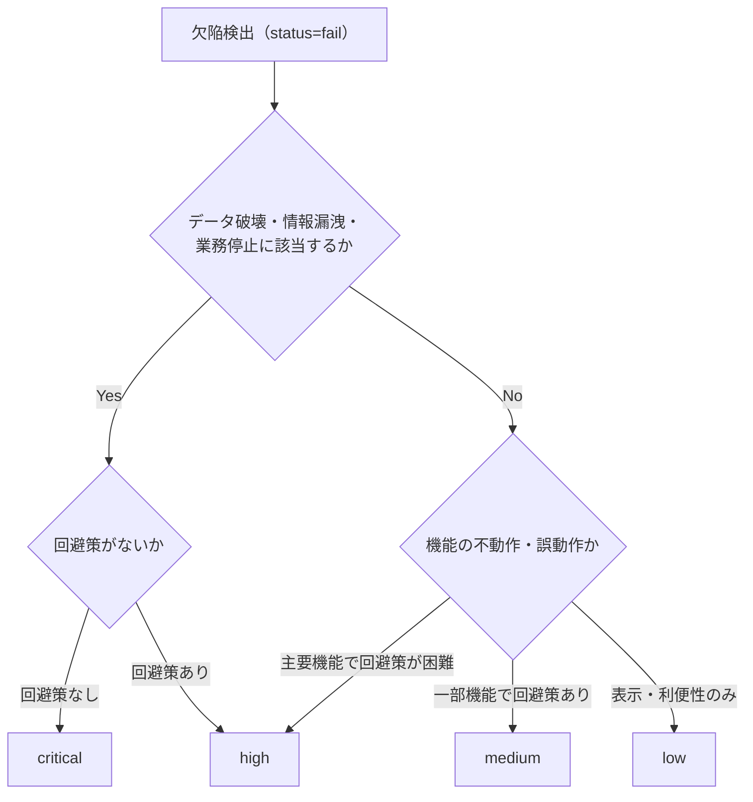

# 欠陥重要度（severity）ポリシー

テスト実行で検出した欠陥（`status: fail` の defect）に付与する重要度 `severity` の enum 値と判定基準を定義する**唯一の SSOT** である。
本プラグインの severity は「検出した欠陥が**本番運用に与える影響度**」を表し、コードレビューにおける指摘重大度とは異なる概念である。

---

## 1. 位置付けと参照方向

- severity の enum 値・判定基準を定義する場所は本ファイルのみとする
- `yaml-schema-results.md`（defect.severity フィールド）・`evidence-policy.md`・`report-format.md` は本ファイルへの**片方向参照**とし、値や基準を複製しない
- severity は `status: fail` の defect にのみ付与する。`blocked` / `skipped` / `na` は欠陥ではないため付与対象外（status の使い分けは `yaml-schema-results.md` 6 章）
- ケースの `priority`（テスト実施の優先度）と severity（検出欠陥の影響度）は独立した概念であり、混同しない

---

## 2. severity の定義（enum）

| severity | 定義（本番影響度） | 具体例 | 対応期待 |
|----------|------------------|--------|---------|
| `critical` | データ破壊・情報漏洩・業務停止のいずれかを引き起こし、**回避策がない** | 注文確定処理で保存データが破損する / 他ユーザーの個人情報が閲覧できる / ログイン不能で全業務が停止し代替手段がない | **即時修正**（修正完了までリリース・運用継続は不可） |
| `high` | **主要機能の不動作・誤動作**。回避策が困難、または非現実的 | 検索機能が結果を返さない / 帳票の金額計算が誤る（手計算での代替は非現実的） / 主要ブラウザで購入フローが完了できない | **リリース前必須**（リリース判定のブロッカーとして扱う） |
| `medium` | 機能の**一部**に不具合があるが、**回避策がある** | 特定条件でバリデーションメッセージが表示されない（再入力で回避可能） / 一覧のソート順が特定条件で誤る（手動並べ替えで回避可能） / CSV 出力の一部列の書式不正（後処理で補正可能） | **計画修正**（期日を定めて修正する） |
| `low` | 軽微な**表示崩れ・利便性**の問題 | ボタンの表示位置ずれ / 画面間の用語不統一 / フォーカス順の不自然さ | **任意**（改善バックログとして管理する） |

---

## 3. 判定フロー

- 判定に迷った場合は根拠なく低い側へ倒さず、**高い側に倒して** test-review（結果文脈）の defect-analyst レビューで補正する
- 「回避策」は本番の実運用で現実的に取れる代替手段を指す（テスト環境限定の裏道は回避策と見なさない）

---

## 4. テストレベル別の判定補足

### 4.1 性能テスト

閾値超過は fail とし、実測値と閾値を `defect.extras`（`measured_value` / `threshold`）に記録する（フィールド定義は `yaml-schema-results.md` 4 章）。
severity は**閾値超過率**と業務影響で判定する。

| 状況の目安 | severity |
|-----------|----------|
| タイムアウト・応答不能（計測不能を含む）で業務が継続できない | `critical` |
| 実測値が閾値の 2 倍以上（超過率 100% 以上） | `high` |
| 超過率 20% 以上 100% 未満 | `medium` |
| 超過率 20% 未満の軽微な超過 | `low` |

- 超過率 = （実測値 − 閾値）÷ 閾値
- 上表は目安であり、対象操作の業務重要度に応じて **1 段階までの補正**を許容する（補正した場合は理由を defect に記録する）
- 単一セッション応答時間計測を第一線とするスコープ境界は `test-levels.md` 参照

### 4.2 セキュリティテスト

OWASP 観点の動的チェックで検出した欠陥は、**悪用可能性と影響範囲**で判定する。該当カテゴリを `defect.extras.owasp_category` に記録する。

| 検出内容の例 | severity の目安 |
|-------------|----------------|
| 認証回避・アクセス制御不備（他者データへの到達）・インジェクションの成立 | `critical` |
| セッション管理不備（セッション固定・ログアウト後のセッション残存）・エラー詳細や内部情報の機微な露出 | `high` |
| セキュリティヘッダの欠如・Cookie 属性の不備（Secure / HttpOnly / SameSite） | `medium` |
| バージョンバナー露出など情報価値の低い露出 | `low` |

- 悪用の成立（実際に権限外データへ到達できた等）を確認できた場合は 1 段階の引き上げを検討する
- 機微情報を含むエビデンスの取り扱い（マスキング）は `evidence-policy.md` 参照
- ペネトレーションテストの代替ではないスコープ境界は `test-levels.md` 参照

---

## 5. 付与・検証の運用

| 工程 | 担当 | 内容 |
|------|------|------|
| 一次判定 | 実行スキル（test-run-*） | fail 検出時に本ポリシーへ照らして severity を判定し、中間データとして返却する |
| 妥当性レビュー | test-review（結果文脈）の defect-analyst | severity の妥当性・再現手順の完全性をレビューする（エージェント定義は `agents.md`） |
| 報告 | test-report | NG 一覧・レベル別詳細に severity を表示する（`report-format.md`） |

- fail 記録時の defect 必須 3 点セット（reproduction_steps / test_data / evidence）の検証は `evidence-policy.md`（二段バリデーション）参照

---

## 6. 禁止事項

- 本ファイル以外の場所（他 references・スキル・エージェント定義）に severity の enum 値や判定基準を複製すること
- コードレビュー指摘の重大度基準と混同すること（本プラグインの severity は「検出した欠陥の本番影響度」である）
- `blocked` / `skipped` / `na` の結果に severity を付与すること
- 判定に迷った際に根拠なく低い側へ倒すこと（高い側に倒し、defect-analyst のレビューで補正する）
- 補正（4.1 の 1 段階補正・4.2 の引き上げ）の理由を defect に記録せずに severity を変更すること

---

## 7. 関連 references

| 参照先 | 内容 |
|-------|------|
| `yaml-schema-results.md` | defect サブオブジェクトのフィールド定義（severity の格納先） |
| `evidence-policy.md` | NG 時提出物（再現手順・検証データ・エビデンス）の必須要件・マスキング |
| `report-format.md` | 報告書での severity 表示 |
| `test-levels.md` | 性能・セキュリティテストのスコープ境界 |
| `agents.md` | defect-analyst（severity 妥当性レビュー担当）の定義 |
