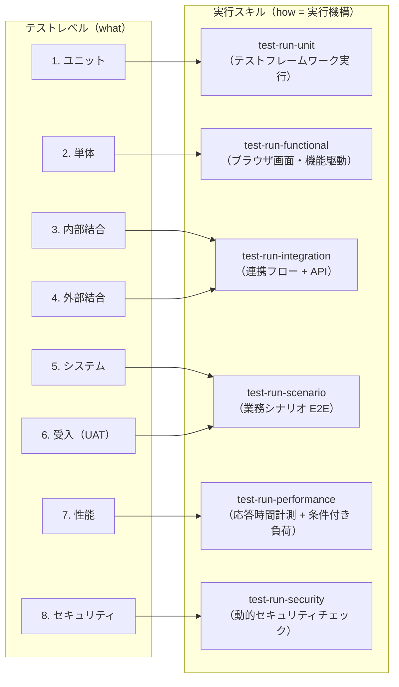

# テストレベル定義 — 詳細節（`test-levels.md` の条件付き参照）

`test-levels.md`（SSOT）のうち、**特定レベルの実行・設計時にのみ参照される節** を条件付きロード用に分離したもの。
代表的な unit 中心フローでは読み込み不要。節番号は `test-levels.md` と連続する（本ファイルは 2・5・6・7・8 章の本文を保持し、`test-levels.md` 側は各章に見出しと本ファイルへのポインタを温存する）。

| 節 | 内容 | 主な参照タイミング |
|----|------|------------------|
| 2 章 | スキル分割原理（実行機構による分割） | 分割設計の根拠確認時 |
| 5 章 | IT-a / IT-b の入口基準の違いとスタブポリシー | `test-run-integration`・IT-b ケース設計 |
| 6 章 | UAT の位置付け（免責） | `test-run-scenario`（uat）・UAT ケース設計 |
| 7 章 | 性能テストのスコープ境界 | `test-run-performance`・性能ケース設計 |
| 8 章 | セキュリティテストのスコープ境界 | `test-run-security`・security ケース設計 |

---

## 2. スキル分割原理（実行機構による分割）

実行スキルは**実行機構（how）**で分割されており、テストレベル分類（**what**）とは **1:N 対応**する。
これが 8 レベル → 6 実行スキルの集約（結合 2 レベル → `test-run-integration`、システム/UAT → `test-run-scenario`）と、ユニット（テストランナー機構）/ 単体（ブラウザ駆動機構）の分離の両方の根拠である。

## 5. IT-a / IT-b の入口基準の違いとスタブポリシー

### 5.1 入口基準の違い

| 観点 | 内部結合（IT-a） | 外部結合（IT-b） |
|------|----------------|----------------|
| 前提の完結範囲 | 自システム内で完結（自チームで統合状態を制御できる） | 外部接続先の準備状況に依存する |
| 追加の入口基準 | なし（IT-a 基準のみ） | 外部テスト用エンドポイントの疎通確認 / 接続用認証情報の準備 / 外部側テストデータの準備 |
| 基準未充足時 | 統合完了まで blocked | 節 5.2 のスタブポリシーで判断 |

### 5.2 外部システム接続不可時のスタブ利用ポリシー

外部接続先が利用できない場合、ケースの**検証目的**に応じて以下の基準で判断する。

| 条件 | 判断 | 記録 |
|------|------|------|
| ケースの目的が**自システム側の外部 IF 処理**（送信データ生成・応答処理・エラーハンドリング）の検証であり、スタブが存在するか簡易に用意できる | **スタブ実行** | 結果にスタブ利用である旨を記録（environment / actual）し、報告書の未確認事項に「実接続未検証」を含める |
| ケースの目的が**実外部システムとの疎通・契約整合そのもの**の検証 | **skipped**（スタブでは目的を達成できない） | `skipped` + reason（実接続でのみ検証可能） |
| スタブが存在せず、用意に大きな工数を要する | **skipped** | `skipped` + reason（スタブ未整備・実接続不可） |

- スタブ実行で pass しても、**実接続の検証は未実施**として扱う（IT-b レベルの完了と混同しない）
- skipped としたケースは再テスト時に ng-only の対象となる（環境整備後の再挑戦。`retest-policy.md`）

## 6. UAT の位置付け（免責）

- 本プラグインが実行するのは「**UAT 観点のシナリオ検証支援**」である。受入基準に基づくシナリオを機械的に実行し、判断材料（結果・エビデンス）を提供する
- **最終受入判断（顧客・業務担当者によるサインオフ）の代替ではない**。uat レベルの pass は「受入観点シナリオが検証で成立した」ことを意味し、「受入完了」を意味しない
- この免責は報告書にも必ず記載する（記載位置・文言は `report-format.md` 参照）

## 7. 性能テストのスコープ境界

| 区分 | 内容 | 実行条件 |
|------|------|---------|
| 第一線（既定） | **単一セッションの応答時間計測**（Playwright のタイミング計測: ページ表示・画面遷移・操作応答・API 応答）と閾値判定 | 常時実行可能 |
| 条件付き | 多重同時負荷・スループット計測 | **外部負荷ツール（k6 等）をプロジェクト環境で検出した場合のみ**実行。未検出時は該当ケースを skipped + reason で記録 |
| 対象外 | 専用負荷試験（キャパシティプランニング・ソークテスト・スパイクテスト等）の代替 | 実施しない（報告書に免責記載） |

## 8. セキュリティテストのスコープ境界

| 区分 | 内容 |
|------|------|
| 対象 | **OWASP 観点の動的チェック**: 認証 / セッション管理 / 入力検証 / セキュリティヘッダ / 情報露出（各観点の詳細は `test-levels.md` 節 4.8「主な確認観点」） |
| 対象外 | **ペネトレーションテスト**（攻撃連鎖・エクスプロイトの実証）および **SCA**（依存ライブラリの脆弱性スキャン）の代替。静的解析（SAST）も対象外 |
| 環境制約 | 本番環境への実行は既定で禁止（`execution-policy.md`） |
| エビデンス | 認証情報・個人情報・トークン等の機微情報は `evidence-policy.md` のマスキング方針に従って扱う |

対象外領域は「未確認」として報告書に明示し、「問題なし」とは記載しない。
