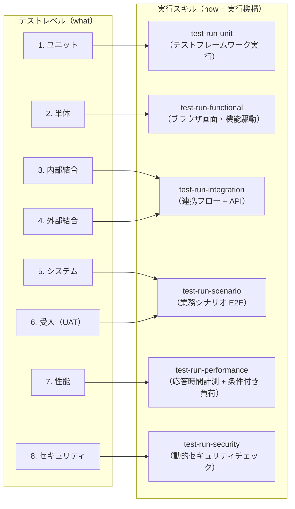

# テストレベル定義（SSOT）

`deep-test` プラグインが扱う 8 テストレベルの定義・入口/出口基準・担当実行スキル・ケース ID プレフィクスの唯一の定義場所。
スキル・エージェント・報告書がテストレベルに言及する際は、必ず本ファイルの定義に従う。

---

## 1. 用語注記（本プラグイン独自区分）

本プラグインの「**ユニットテスト**」（コードレベルの自動テスト）と「**単体テスト**」（実アプリの画面・機能単位のブラックボックステスト）の区分は、**日本の SI 慣行に基づく本プラグイン独自の区分**である。
JSTQB / ISTQB 標準ではこの粒度はいずれもコンポーネントテスト（component testing / unit testing）と呼ばれ、本プラグインの呼称体系とは一致しない。
外部のテスト標準・他プロジェクトの文書と照合する際は、**名称ではなく本ファイルの定義（節 4）で対応付ける**こと。

### 国際標準との対応（一次情報: ISTQB CTFL v4.0 / ISO/IEC 25010:2023）

本プラグインの 8 レベル運用体系（節 3・節 4）は維持したうえで、外部標準とは以下で対応付ける（名称の一致ではなく定義で対応付ける原則は上記のとおり）。

- **テストレベル（ISTQB CTFL v4.0）**: v4.0 は 5 レベル（コンポーネント / コンポーネント統合 / システム / システム統合 / 受入）を定義する。本プラグインの 8 レベルはこれを日本の SI 慣行に合わせて細分・運用したものであり、TC-UNIT 等の独自プレフィクスと対応表（節 3）はそのまま用いる
- **テスト技法（ISTQB CTFL v4.0）**: 技法カテゴリは ブラックボックス技法（旧称: 仕様ベース技法） / ホワイトボックス技法（旧称: 構造ベース技法） / 経験ベース技法 の 3 分類。ケース設計で技法に言及する際は v4.0 のこの名称を用いる
- **品質特性（ISO/IEC 25010:2023）**: 2023 改訂で製品品質モデルは 9 特性（機能適合性 / 性能効率性 / 互換性 / インタラクション能力 / 信頼性 / セキュリティ / 保守性 / 柔軟性 / 安全性）。2011 版からの主な変更は 使用性 → インタラクション能力（Interaction Capability）の改称、移植性 → 柔軟性（Flexibility）の改称、安全性（Safety）の新設。テスタビリティ（Testability）は従来どおり保守性の副特性である

## 2. スキル分割原理（実行機構による分割）

実行スキルは**実行機構（how）**で分割されており、テストレベル分類（**what**）とは **1:N 対応**する。
これが 8 レベル → 6 実行スキルの集約（結合 2 レベル → `test-run-integration`、システム/UAT → `test-run-scenario`）と、ユニット（テストランナー機構）/ 単体（ブラウザ駆動機構）の分離の両方の根拠である。

## 3. テストレベル一覧（サマリ）

| # | テストレベル | level 値 | ケース ID プレフィクス | 担当実行スキル | automation 既定値 |
|---|------------|---------|---------------------|--------------|-----------------|
| 1 | ユニットテスト | `unit` | `TC-UNIT` | `test-run-unit` | `test-framework` |
| 2 | 単体テスト | `functional` | `TC-FUNC` | `test-run-functional` | `playwright` |
| 3 | 内部結合テスト（IT-a） | `integration-internal` | `TC-ITA` | `test-run-integration` | `playwright` |
| 4 | 外部結合テスト（IT-b） | `integration-external` | `TC-ITB` | `test-run-integration` | `playwright`（API 直接検証のケースは `api`） |
| 5 | システムテスト | `system` | `TC-SYS` | `test-run-scenario` | `playwright` |
| 6 | 受入テスト（UAT） | `uat` | `TC-UAT` | `test-run-scenario` | `playwright` |
| 7 | 性能テスト | `performance` | `TC-PERF` | `test-run-performance` | `playwright` |
| 8 | セキュリティテスト | `security` | `TC-SEC` | `test-run-security` | `playwright` |

### 運用注記

- **level 値**は `test-cases.yaml` の `level` フィールドで用いる enum 値（スキーマ詳細は `yaml-schema-cases.md` 参照）
- **ケース ID** は `TC-{プレフィクス}-{連番}` 形式（例: `TC-UNIT-001`）。ID は改変せず、ケース内容の変更は revision で版管理する（採番規約は `yaml-schema.md` 2.2、revision 規則は `yaml-schema-cases.md` 3 章）
- **automation 既定値**はケース設計時の初期値であり、ケース単位で上書きできる（例: 人手の確認が不可欠なケースは `manual-assist`）。`manual-assist` ケースの非対話時挙動（skipped）は `execution-policy.md` の非対話既定値表に従う
- **`playwright-test` のオプトイン**: 本表の automation 既定値は据え置き（変更しない）。`playwright-test` は `fixtures.yaml`（フィクスチャ基盤）が存在するケースで再現可能な `.spec.ts` 実行を選ぶ **オプトイン** の選択肢であり、既定の探索的 MCP フロー（`playwright`）は崩さない（規約は `playwright-test.md`）
- **入口基準未充足時の記録**: テスト論理上の前提不成立（依存ケース fail・環境未統合等）は `blocked`、実行手段不在（MCP 未ロード・ランナー不在等）は `skipped` として reason 付きで記録する。実行を偽装しない（`execution-policy.md`）

## 4. 各レベルの定義

### 4.1 ユニットテスト（`unit` / TC-UNIT）

| 項目 | 内容 |
|------|------|
| 定義 | ソースコードの関数・クラス・メソッドを対象に、テストフレームワーク（pytest / jest / dotnet test 等）で実行するコードレベルの自動テスト |
| 目的 | 最小単位のロジックの正しさを最も安価な段階で検証し、回帰を防止する |
| 入口基準 | 対象コードがビルド・実行可能 / プロジェクトにテストランナーが存在し検出済み（`test-setup` の検出結果。不在時は skipped） |
| 出口基準 | scope 内の unit ケース全件の結果（status・reason）記録完了 / fail には defect 3 点セットと `extras.stack_trace` を記録済み / テストランナーの実行ログをエビデンスとして保存済み |
| 主な確認観点 | 正常系の戻り値 / 境界値・同値クラス / 異常系・例外処理 / 分岐の網羅 / 依存のモック・スタブ下での単位ロジック |

### 4.2 単体テスト（`functional` / TC-FUNC）

| 項目 | 内容 |
|------|------|
| 定義 | 実アプリケーションの**画面・機能単位**で行うブラックボックステスト。Playwright によるブラウザ実操作で確認する |
| 目的 | 個々の画面・機能が仕様どおりに動作することをユーザー操作レベルで確認する |
| 入口基準 | 対象機能がテスト環境にデプロイ済みで到達可能（URL・起動手段が確認済み） / Playwright MCP が利用可能（MCP ゲート通過） / テストデータ・アカウントが準備済み（preconditions 充足） |
| 出口基準 | scope 内の functional ケース全件の結果記録完了 / fail には defect 3 点セット記録済み / 各ケースのスクリーンショット等エビデンスが `evidence/` へ移送済み |
| 主な確認観点 | 画面表示・レイアウト崩れの有無 / 入力バリデーション / ボタン・リンク等の操作応答 / メッセージ・エラー表示 / 単機能の正常系・異常系 |

### 4.3 内部結合テスト（IT-a / `integration-internal` / TC-ITA）

| 項目 | 内容 |
|------|------|
| 定義 | 同一システム内のモジュール間・画面間の連携を対象とするテスト |
| 目的 | モジュール境界のインターフェース整合・データ受け渡し・遷移の正しさを確認する |
| 入口基準 | 連携対象モジュールが**すべて同一テスト環境に統合済み** / 各モジュールが単体（機能）レベルの確認を通過済み（または相当の品質確認済み） / Playwright MCP が利用可能 |
| 出口基準 | scope 内の IT-a ケース全件の結果記録完了 / fail には defect 3 点セット記録済み / モジュール間のデータ整合確認結果（登録値と参照値の突合）を actual に記録済み |
| 主な確認観点 | 画面遷移とパラメータ引き継ぎ / モジュール間のデータ整合（登録 → 参照・更新 → 反映） / 業務データの状態遷移 / モジュール境界でのエラー伝播 |

### 4.4 外部結合テスト（IT-b / `integration-external` / TC-ITB）

| 項目 | 内容 |
|------|------|
| 定義 | 外部システム・外部 API との連携を対象とするテスト |
| 目的 | 外部インターフェースの仕様整合と、正常・異常応答時の自システムの振る舞いを確認する |
| 入口基準 | IT-a の入口基準に**加えて**、外部接続先（テスト用エンドポイント）の疎通・認証情報・外部側テストデータの準備が確認済み。接続不可時は節 5 のスタブポリシーに従う |
| 出口基準 | scope 内の IT-b ケース全件の結果記録完了 / fail には defect 3 点セット記録済み / スタブ実行したケースは「実接続未検証」である旨を結果と報告書の未確認事項に明示済み |
| 主な確認観点 | 外部 API 呼び出しと応答処理 / データ形式変換・マッピング / タイムアウト・異常応答時のエラーハンドリング / リトライ・冪等性 |

### 4.5 システムテスト（`system` / TC-SYS）

| 項目 | 内容 |
|------|------|
| 定義 | 統合されたシステム全体を対象に、業務シナリオを最初から最後まで通す E2E テスト |
| 目的 | 実運用相当の一連の業務フローがシステム全体で成立することを確認する |
| 入口基準 | 結合レベル（IT-a / IT-b）の確認を通過済み / 全機能が統合された環境とシナリオ用業務データが準備済み / Playwright MCP が利用可能 |
| 出口基準 | scope 内の system ケース全件の結果記録完了 / fail には defect 3 点セット記録済み / シナリオの完遂状況（どのステップまで到達したか）を actual に記録済み |
| 主な確認観点 | 業務シナリオの完遂 / 複数機能・複数画面を跨ぐデータ整合 / 実運用相当の操作列での不整合 / シナリオ内の代替フロー・例外フロー |

### 4.6 受入テスト（UAT / `uat` / TC-UAT）

| 項目 | 内容 |
|------|------|
| 定義 | 利用者・業務担当者の受入観点で定義したシナリオを実行し、受入判断の**材料を提供する検証支援**テスト（位置付けの詳細は節 6） |
| 目的 | 業務要件・受入基準の充足状況を利用者目線で検証し、サインオフ判断に必要な結果・エビデンスを揃える |
| 入口基準 | システムテストレベルの確認を通過済み / 受入基準・業務シナリオが定義され、ケースの requirement に対応付け済み / Playwright MCP が利用可能 |
| 出口基準 | scope 内の uat ケース全件の結果記録完了 / fail には defect 3 点セット記録済み / 受入判断材料（結果 + エビデンス）が提示可能な状態 / 報告書に節 6 の免責注記を含めること |
| 主な確認観点 | 受入基準の充足 / 業務ユーザーの実利用手順での成立性 / 業務上重大なユーザビリティ問題 / 帳票・出力物の業務要件充足 |

### 4.7 性能テスト（`performance` / TC-PERF）

| 項目 | 内容 |
|------|------|
| 定義 | 主要操作の応答時間等の性能特性を計測し、ケースに定義した閾値と比較判定するテスト（スコープ境界は節 7） |
| 目的 | 応答時間が性能目標内であることを確認し、劣化を検出する |
| 入口基準 | 対象機能が機能レベルで安定動作している（該当機能ケースが pass） / ケースに計測対象と閾値（`extras.threshold` に対応する期待値）が定義済み / 計測条件（キャッシュ・並行処理の前提）が preconditions で宣言済み |
| 出口基準 | scope 内の performance ケース全件の結果記録完了 / 実測値と閾値を `extras.measured_value` / `extras.threshold` に記録済み / 多重負荷が未実施の場合は skipped + reason として未確認事項に記録済み |
| 主な確認観点 | 画面表示・遷移の応答時間 / API 応答時間 / 閾値超過の検出 /（外部負荷ツール検出時のみ）多重同時負荷時のスループット・エラー率 |

### 4.8 セキュリティテスト（`security` / TC-SEC）

| 項目 | 内容 |
|------|------|
| 定義 | 稼働中のアプリケーションに対する OWASP 観点の動的セキュリティチェック（スコープ境界は節 8） |
| 目的 | 認証・セッション管理・入力検証等の基本的なセキュリティ欠陥を早期に検出する |
| 入口基準 | 対象が**テスト環境**であることを確認済み（本番環境への実行は既定で禁止。`execution-policy.md` の環境安全） / テスト用アカウント・権限パターンが準備済み / Playwright MCP が利用可能 |
| 出口基準 | scope 内の security ケース全件の結果記録完了 / fail には defect 3 点セットと `extras.owasp_category` を記録済み / エビデンス中の機微情報のマスキング要否を確認済み（`evidence-policy.md`） / 対象外領域（節 8）が未確認である旨を報告書に明示 |
| 主な確認観点 | 認証（未認証アクセス・認可境界の突破可否） / セッション管理（Cookie 属性・ログアウト後の無効化・セッション固定化） / 入力検証（XSS・SQL インジェクションの基礎パターン） / セキュリティヘッダの有無・設定値 / 情報露出（詳細エラーメッセージ・コメント・メタ情報） |

## 5. IT-a / IT-b の入口基準の違いとスタブポリシー

### 5.1 入口基準の違い

| 観点 | 内部結合（IT-a） | 外部結合（IT-b） |
|------|----------------|----------------|
| 前提の完結範囲 | 自システム内で完結（自チームで統合状態を制御できる） | 外部接続先の準備状況に依存する |
| 追加の入口基準 | なし（IT-a 基準のみ） | 外部テスト用エンドポイントの疎通確認 / 接続用認証情報の準備 / 外部側テストデータの準備 |
| 基準未充足時 | 統合完了まで blocked | 節 5.2 のスタブポリシーで判断 |

### 5.2 外部システム接続不可時のスタブ利用ポリシー

外部接続先が利用できない場合、ケースの**検証目的**に応じて以下の基準で判断する。

| 条件 | 判断 | 記録 |
|------|------|------|
| ケースの目的が**自システム側の外部 IF 処理**（送信データ生成・応答処理・エラーハンドリング）の検証であり、スタブが存在するか簡易に用意できる | **スタブ実行** | 結果にスタブ利用である旨を記録（environment / actual）し、報告書の未確認事項に「実接続未検証」を含める |
| ケースの目的が**実外部システムとの疎通・契約整合そのもの**の検証 | **skipped**（スタブでは目的を達成できない） | `skipped` + reason（実接続でのみ検証可能） |
| スタブが存在せず、用意に大きな工数を要する | **skipped** | `skipped` + reason（スタブ未整備・実接続不可） |

- スタブ実行で pass しても、**実接続の検証は未実施**として扱う（IT-b レベルの完了と混同しない）
- skipped としたケースは再テスト時に ng-only の対象となる（環境整備後の再挑戦。`retest-policy.md`）

## 6. UAT の位置付け（免責）

- 本プラグインが実行するのは「**UAT 観点のシナリオ検証支援**」である。受入基準に基づくシナリオを機械的に実行し、判断材料（結果・エビデンス）を提供する
- **最終受入判断（顧客・業務担当者によるサインオフ）の代替ではない**。uat レベルの pass は「受入観点シナリオが検証で成立した」ことを意味し、「受入完了」を意味しない
- この免責は報告書にも必ず記載する（記載位置・文言は `report-format.md` 参照）

## 7. 性能テストのスコープ境界

| 区分 | 内容 | 実行条件 |
|------|------|---------|
| 第一線（既定） | **単一セッションの応答時間計測**（Playwright のタイミング計測: ページ表示・画面遷移・操作応答・API 応答）と閾値判定 | 常時実行可能 |
| 条件付き | 多重同時負荷・スループット計測 | **外部負荷ツール（k6 等）をプロジェクト環境で検出した場合のみ**実行。未検出時は該当ケースを skipped + reason で記録 |
| 対象外 | 専用負荷試験（キャパシティプランニング・ソークテスト・スパイクテスト等）の代替 | 実施しない（報告書に免責記載） |

## 8. セキュリティテストのスコープ境界

| 区分 | 内容 |
|------|------|
| 対象 | **OWASP 観点の動的チェック**: 認証（未認証アクセス・認可境界） / セッション管理（Cookie 属性・無効化・固定化） / 入力検証（XSS・SQL インジェクション基礎パターン） / セキュリティヘッダ / 情報露出（詳細エラー・メタ情報） |
| 対象外 | **ペネトレーションテスト**（攻撃連鎖・エクスプロイトの実証）および **SCA**（依存ライブラリの脆弱性スキャン）の代替。静的解析（SAST）も対象外 |
| 環境制約 | 本番環境への実行は既定で禁止（`execution-policy.md`） |
| エビデンス | 認証情報・個人情報・トークン等の機微情報は `evidence-policy.md` のマスキング方針に従って扱う |

対象外領域は「未確認」として報告書に明示し、「問題なし」とは記載しない。
