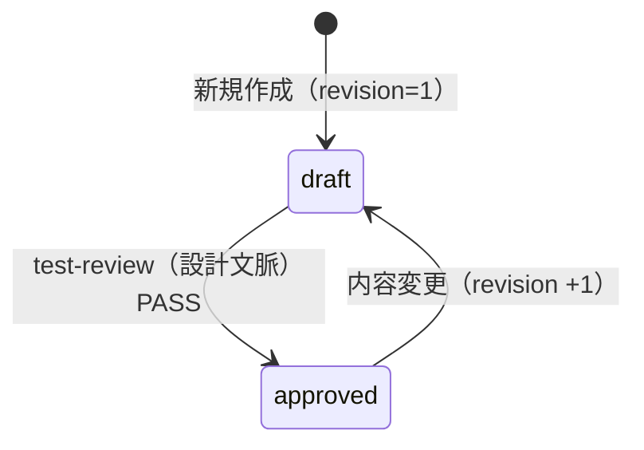

# test-cases.yaml スキーマ（yaml-schema-cases）

`test-cases.yaml`（テストケース定義）の完全スキーマを定義する SSOT である（`yaml-schema.md` からの分割ファイル）。
共通記述規約（YAML 記述規約・ID/採番規約）と操作規約（生成・更新主体、禁止事項）は `yaml-schema.md` を参照。
`test-results.yaml` 側のスキーマは `yaml-schema-results.md` を参照。

---

## 1. meta

| フィールド | 型 | 必須 | 説明 |
|-----------|-----|------|------|
| `target` | string | 必須 | テスト対象の名称 |
| `created_at` | string（ISO8601） | 必須 | ファイル作成日時 |
| `updated_at` | string（ISO8601） | 必須 | ファイル最終更新日時 |
| `schema_version` | integer | 必須 | スキーマ版数。現行 `1`。非互換変更時は本ファイルの改訂とセットでインクリメントする |

## 2. cases[]（テストケース）

| フィールド | 型 | 必須 | 説明 |
|-----------|-----|------|------|
| `id` | string | 必須 | ケース ID。`TC-{LEVEL}-{3桁連番}` 形式（`yaml-schema.md` 2.2 参照）。**改変禁止** |
| `revision` | integer | 必須 | ケース版数。初版 `1`、内容変更のたびに +1（3 章参照） |
| `review_status` | enum | 必須 | `draft` / `approved`。test-review（設計文脈）の PASS で `approved` になる。`draft` は実行対象外（承認済みケースゲートは `execution-policy.md` 参照） |
| `created_at` | string（ISO8601） | 必須 | ケース作成日時 |
| `updated_at` | string（ISO8601） | 必須 | ケース最終更新日時（revision 更新時に必ず更新する） |
| `level` | enum | 必須 | `unit` / `functional` / `integration-internal` / `integration-external` / `system` / `uat` / `performance` / `security`（定義は `test-levels.md`） |
| `title` | string | 必須 | ケース名（一覧で識別できる簡潔な表現） |
| `priority` | enum | 必須 | `high` / `medium` / `low`。テスト実施の優先度（欠陥の `severity` とは独立した概念） |
| `requirement` | string | 必須 | 対応する要件・仕様の参照（要件 ID・仕様書の節番号など） |
| `preconditions` | list[string] | 任意 | 前提条件。テストデータの前提はここで宣言する（テストデータ分離の規範は `execution-policy.md`） |
| `steps` | list[string] | 必須 | 実行手順。番号付き・環境非依存の表現で記述する（NG 時の再現手順の基礎になる） |
| `expected` | string | 必須 | 期待結果 |
| `data` | string または map | 任意 | 検証データ（入力値・期待値）。fail 時の `defect.test_data` の基礎になる |
| `postconditions` | list[string] | 任意 | 事後処理・データクリーンアップ。`preconditions` で宣言した状態変更を伴う場合は必ず復元手順を記載する |
| `depends_on` | list[string] | 任意 | 依存ケース ID のリスト。依存先が fail の場合、本ケースを `blocked` と判定する根拠になる（`yaml-schema-results.md` 6 章） |
| `automation` | enum | 必須 | 実行手段。`playwright` / `playwright-test` / `test-framework` / `api` / `manual-assist` / `exploratory`（人間主導のチャーターベース探索セッション。処理規範は `manual-execution.md`） |
| `fixtures` | list[string] | 任意 | 使用するフィクスチャ名（`fixtures.yaml` の `fixtures[].name` を参照）。`automation: playwright-test` のケースで指定する（fixtures.yaml スキーマは `playwright-test.md`） |
| `timeout_sec` | integer | 任意（既定 `120`） | ケース単位の実行タイムアウト秒。超過時は `blocked` 記録（規約は `execution-policy.md`）。`automation: exploratory` ではセッションのタイムボックス（計画時間）として扱い、超過 `blocked` は適用しない（本章末尾の注記） |
| `destructive` | boolean | 任意（既定 `false`） | データ削除・更新・本番接続・外部システムへの送信等の破壊的操作を含むケースは `true`（4 章参照） |
| `deprecated` | boolean | 任意（既定 `false`） | 論理削除フラグ。`true` のケースは以後の実行・集計対象外（物理削除禁止。3 章参照） |

`automation` と実行実績側 `executed_by` の対応: `playwright` → `playwright-mcp`、`playwright-test` → `playwright-test`、`test-framework` → `test-framework`、`api` → `api`、`manual-assist` → `human-assisted`、`exploratory` → `human-assisted`（人の実施・申告に基づく検証である点で `manual-assist` と同じ実行主体。`executed_by` enum への追加はない）。

`destructive: true` のケースは設計時に破壊的操作を明示し（`steps` / `preconditions` に記載）、人間承認ゲートで件数を機械集計して提示する。本番環境への実行時は scope から除外する（環境安全規約は `execution-policy.md` 1.3・6 章）。

`automation: exploratory`（チャーターベースの人間探索セッション。**1 チャーター = 1 ケース**）では、フィールド構造は不変のまま意味論を次のとおり読み替える: `title` = チャーター名 / `steps` = **探索指針（チャーター文の展開。手順書式ではない）** / `expected` = **発見目標・完了条件** / `data` = 探索に使う検証データ / `requirement` = 対応する要件・リスク領域 / `timeout_sec` = **セッションのタイムボックス（計画時間。超過 = blocked の既存規約は適用しない）**。セッションの進め方・記録・非対話縮退は `manual-execution.md` 参照。既存の `automation: playwright`（AI による MCP そのば操作）も探索的と呼ばれるが別概念である（`playwright` = AI 探索・`executed_by: playwright-mcp` / `exploratory` = 人間探索セッション・`executed_by: human-assisted`）。

## 3. revision・承認・削除の規則

- ケース内容（`steps` / `expected` / `data` 等）を変更する場合は `revision` を +1 し、`updated_at` を更新する
- `revision` を +1 したケースの `review_status` は `draft` に戻す（変更後の内容は未承認となるため。再度 test-review〔設計文脈〕の PASS で `approved` に戻る）
- 削除は `deprecated: true` による**論理削除のみ**とし、物理削除を禁止する（過去実績の `case_id` 参照を破壊しないため）
- `deprecated: true` のケースは以後の実行・集計対象外。過去の実績（results）はそのまま保持される



## 4. 記入例（3 ケース）

```yaml
meta:
  target: sample-web-app
  created_at: "2026-07-17T10:00:00+09:00"
  updated_at: "2026-07-17T13:00:00+09:00"
  schema_version: 1
cases:
  - id: TC-FUNC-001
    revision: 1
    review_status: approved
    created_at: "2026-07-17T10:00:00+09:00"
    updated_at: "2026-07-17T10:00:00+09:00"
    level: functional
    title: ログイン成功（有効な認証情報）
    priority: high
    requirement: REQ-AUTH-01（認証仕様 3.1）
    preconditions:
      - テストユーザー user01 が有効状態で登録済みであること
    steps:
      - "1. ログイン画面を開く"
      - "2. ユーザー ID に user01 を入力する"
      - "3. パスワードに有効な値を入力する"
      - "4. ログインボタンを押下する"
    expected: ダッシュボード画面に遷移し、ヘッダーにユーザー名 user01 が表示される
    data: "ユーザー ID: user01 / パスワード: 環境設定の有効値を使用"
    postconditions:
      - ログアウトしてセッションを破棄する
    depends_on: []
    automation: playwright
  - id: TC-FUNC-002
    revision: 2                      # 仕様変更に伴い内容を更新済み（初版から +1）
    review_status: approved          # revision 2 の内容で再承認済み
    created_at: "2026-07-17T10:05:00+09:00"
    updated_at: "2026-07-17T12:40:00+09:00"
    level: functional
    title: ダッシュボードの受注サマリ表示
    priority: high
    requirement: REQ-DASH-03（ダッシュボード仕様 2.2）
    preconditions:
      - TC-FUNC-001 の手順でログイン済みであること
      - 当日受注データが 3 件投入済みであること
    steps:
      - "1. ダッシュボード画面を開く"
      - "2. 受注サマリパネルの件数表示を確認する"
    expected: 受注サマリに当日受注件数 3 件が表示される
    data: "当日受注データ 3 件（受注番号 ORD-001〜ORD-003）"
    postconditions:
      - 投入した受注データ 3 件を削除する
    depends_on: [TC-FUNC-001]
    automation: playwright
  - id: TC-UAT-006
    revision: 1
    review_status: approved
    created_at: "2026-07-17T10:10:00+09:00"
    updated_at: "2026-07-17T10:10:00+09:00"
    level: uat
    title: 受注登録まわりの探索セッション（入力揺らぎと帳票整合）
    priority: medium
    requirement: REQ-ORDER-01〜03（受注仕様 2 章のリスク領域）
    preconditions:
      - テストユーザー user01 でログイン可能であること
    steps:                        # チャーター = 探索指針（手順書式ではない）
      - "1. 受注登録フォームの入力揺らぎ（全半角・境界長・貼り付け）を試す"
      - "2. 登録直後の帳票プレビューと一覧表示の整合を突き合わせる"
      - "3. 気付いた挙動はその都度セッションノートに記録する"
    expected: 入力揺らぎ起因のデータ不整合・帳票崩れが発見されないこと（発見時は事象を記録して fail）
    data: "探索用アカウント user01 / 受注データは postconditions で削除可能な範囲のみ作成"
    postconditions:
      - セッション中に作成した受注データを削除する
    automation: exploratory
    timeout_sec: 3600             # タイムボックス 60 分（超過 blocked は適用しない）
```

## 5. 関連 references

| 参照先 | 内容 |
|-------|------|
| `yaml-schema.md` | 共通記述規約（2 章: YAML 記述規約・ID/採番規約）・操作規約（3 章） |
| `yaml-schema-results.md` | test-results.yaml のスキーマ（status の使い分けを含む） |
| `test-levels.md` | `level` enum の定義・入口/出口基準 |
| `execution-policy.md` | 承認済みケースゲート・テストデータ分離・タイムアウト規約 |
