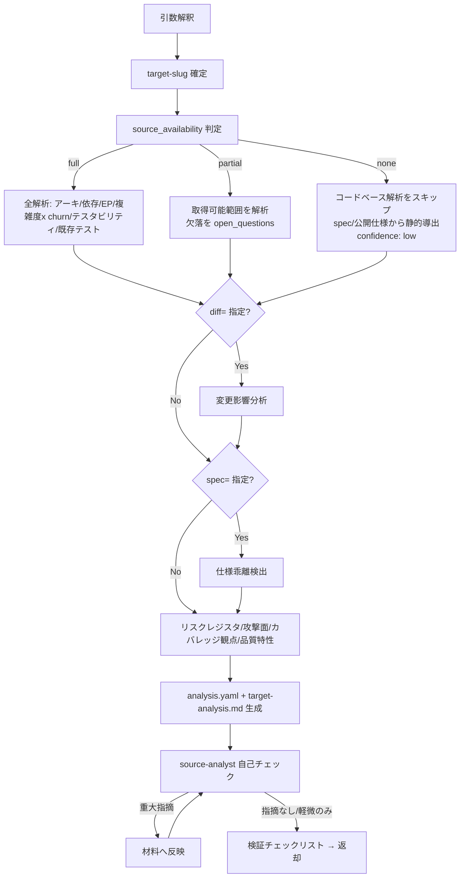

<!-- TEST-ANALYZE-PROCEDURES-SENTINEL-v1 -->
# test-analyze 詳細手順（入力解決 → 縮退判定 → 材料生成 → 自己チェック）

`test-analyze` スキルの実行手順の詳細。SKILL.md の実行フローから参照される。
`analysis.yaml` のスキーマ・enum・ID 形式・縮退動作・リスク二軸注記の SSOT は `${CLAUDE_PLUGIN_ROOT}/references/yaml-schema-analysis.md`、配置・target-slug 解決は同 `data-locations.md`、エージェント運用は同 `agents.md` および `${CLAUDE_SKILL_DIR}/references/agents.md` である。本書はそれらの適用手順のみを定義し、規範本文は複製しない。

> **環境構築（setup）について**: 本スキルは Python を既定で同梱しないため `scripts/setup/`（venv）を持たない。churn は Bash の git 読み取り、複雑度は存在する read-only ツールのみ、analysis.yaml / target-analysis.md は LLM が Write で直接生成する。したがって setup 手順は不要である。

---

## 1. 全体フロー



## 2. 入力解釈と target-slug の確定

| 起動形態 | target-slug の確定方法 |
|---------|----------------------|
| 委譲（`target-slug=` 受領） | 受領値をそのまま使用する（解決はオーケストレータ済み） |
| 単独起動 | `${CLAUDE_PLUGIN_ROOT}/references/data-locations.md` 4 章の解決フローに従う（既存一覧の提示 → 選択 or 新規作成。非対話時は唯一の既存 slug 採用・複数はエラー中断） |

- 配置先は基準ディレクトリ配下の `.claude/.local/plugins/deep-test/{target-slug}/`（基準ディレクトリの解決は data-locations.md 1 章）
- テスト対象（`対象説明=` または位置引数）が未指定の場合: 対話時は AskUserQuestion で確認し、非対話時はエラーで中断する
- `spec=` / `diff=` / `base=` を解釈し、`meta.spec_provided` / `meta.diff_ref` / `meta.base_ref` に反映する（未指定は `false` / `null`）

## 3. source_availability の判定

`meta.source_availability` は縮退動作の分岐キー（yaml-schema-analysis.md 16 章）。以下で判定する。

| 判定 | 状況 | 例 |
|------|------|----|
| `full` | 対象ソースツリー全体を read-only で取得できる | リポジトリパスが与えられ全モジュールを Glob / Read できる |
| `partial` | 一部モジュール / 生成物のみ取得できる | 一部ディレクトリのみ提供・ビルド生成物のみ・依存の一部が非公開 |
| `none` | ソースなし（仕様書のみ / デプロイ済み外部システム） | アプリ URL と spec のみ・ソース非提供 |

- 判定根拠（何を確認して full / partial / none としたか）を target-analysis.md 冒頭に明記する
- `test-setup`（Phase 1）から検出済みのランナー・複雑度 / カバレッジツール情報を受領していればツール有無判定に用いる。無ければ本スキルで自力検出する

## 4. 材料生成（`full` 時の解析手順）

以下を実施し、結果を `analysis.yaml` の各セクションと `target-analysis.md` に落とす。フィールド定義・enum・ID 形式は yaml-schema-analysis.md が SSOT。

### 4.1 アーキ・技術スタック把握（`architecture`）
Glob / Read でビルド定義（package.json / pom.xml / build.gradle / *.csproj / go.mod / pyproject.toml 等）・ディレクトリ構成を確認し、`languages` / `frameworks` / `layers`（name・responsibility）/ `build_run` を整理する。

### 4.2 依存グラフ・エントリポイント抽出（`entry_points` / `dependency_summary`）
- Grep で import / 呼出関係、ルーティング定義（controllers / routes / pages / api）、CLI エントリ、メッセージ購読、スケジュールジョブ、UI 画面、公開関数を探索する
- 各 EP に `id`（`EP-{3桁}`）/ `kind`（`http-route` / `api` / `cli` / `message-consumer` / `scheduled-job` / `ui-page` / `public-function`）/ `signature` / `exposure`（`public` / `authenticated` / `internal`）/ `auth` / `source_ref`（`file:line`）を付与する。`source_ref` は確認できた範囲のみ記載し、捏造しない
- `dependency_summary` に `internal_module_count` / `key_edges`（`"moduleA -> moduleB"`）/ `external_dependencies`（`name` / `kind`=db|http|queue|fs|thirdparty / `usage`）を整理する

### 4.3 複雑度・変更頻度（ホットスポット）（`hotspots`）
- **churn（変更頻度）**: Bash の git 読み取りで取得する（read-only・言語非依存）。allowed-tools は git 読み取りコマンドに限定するため、パイプ集計（grep / sort / uniq / head）は使わず、単一 `git log` の出力をモデル側で集計して変更頻度 Top N を求める。実コマンド例:

  ```bash
  git log --format= --name-only --since="90 days ago" -- <対象パス>
  ```

  出力に現れる各ファイルの出現回数をモデルが数え、頻度上位（目安 Top 20）を抽出する（決定的な集計が必要になった場合の scripts/setup 追加方針は README を参照）。

- **循環的複雑度**: 存在する read-only ツール（radon / lizard 等）が利用可能な場合のみ計測する。利用不可なら `cyclomatic_complexity: null` + `measured: false` とし、捏造しない
- 複雑度（ツール有時）× churn の掛け合わせで高リスク Top N を `HS-{3桁}` として抽出し、`location` / `cyclomatic_complexity` / `churn` / `measured` / `rationale` を付与する

### 4.4 既存テスト資産分析（`existing_tests_summary`）
既存テスト（test / spec / __tests__ 等）を Glob / Read で確認し、`frameworks` / `test_file_count` / `covered_areas_estimated`（推定である旨を保つ）/ `gaps_suspected` を整理する。

### 4.5 テスタビリティ評価（`testability_findings`）
DI 欠如 / グローバル状態 / ハードコード依存 / 隠れ I/O / 非決定性 / 時刻結合を Grep で検出し、`TF-{3桁}` として `concern`（`di-missing` / `global-state` / `hardcoded-dependency` / `hidden-io` / `nondeterminism` / `time-coupling`）/ `location` / `impact` / `seam_suggestion`（任意）を付与する。

### 4.6 対象種別判定（`meta.target_type`）
検出したアーキ・EP から `web-app` / `api` / `batch` / `library` / `data-pipeline` / `cli` / `mixed` / `unknown` を判定する（複合は `mixed`、判定不能は `unknown`）。

### 4.7 リスクレジスタ算出（`risk_register`）
- `likelihood`（発生確率）: 複雑度 / churn / 外部依存から判定し `likelihood_basis` に根拠を列挙する
- `impact`（影響度）: 露出（exposure）・業務重要度（spec / user 由来。無ければ推定）から判定し `impact_basis` に列挙する
- `risk_level` = likelihood × impact（ISTQB product risk）
- `quality_characteristics`: ISO/IEC 25010:2023 の 9 特性（`functional-suitability` / `performance-efficiency` / `compatibility` / `interaction-capability` / `reliability` / `security` / `maintainability` / `flexibility` / `safety`。Testability は保守性の副特性）から関連特性を付与する
- `suggested_focus`: 重点候補の **提案のみ**（`level_hint` / `technique_hint`）。レベル / 技法 / 優先度 / ケースを確定しない（決定は test-design）
- `confidence`: 材料の確信度（縮退時は `low`）
- 各リスクは `RISK-{3桁}`。product risk と severity（`severity-policy.md`）を混同しない（analysis.yaml に severity は無い。yaml-schema-analysis.md 10 章）

### 4.8 攻撃面・軽量脅威モデリング（`attack_surface_summary`）
公開 EP・信頼境界から `public_entry_points`（EP-id 参照）/ `trust_boundaries` / `stride_notes`（`category`=spoofing|tampering|repudiation|info-disclosure|dos|elevation・`note`）を静的に付与する。動的検査は行わない（`test-run-security` の責務）。

### 4.9 カバレッジ観点の提示（`coverage_viewpoints`）
- `measurable_in_this_env`: 当該環境で実測可能かの見立て（実測は本スキルでは行わない）
- `proposed_commands`: 検出スタック別の計測コマンドを **提案のみ**（例: `pytest --cov=...` / `jest --coverage` / JaCoCo / `go test -cover`）
- `criteria_hint`: リスクに応じた推奨網羅基準（`statement` / `branch` 等）。MC/DC は高信頼性対象（DO-178C / ISO 26262 等）のみ

### 4.10 品質特性マッピング（4.7 と連動）
対象・EP から関連する ISO/IEC 25010:2023 の 9 特性を判定し、risk_register の `quality_characteristics` および target-analysis.md の品質特性マッピングに反映する（例: web-app はインタラクション能力・セキュリティ、data-pipeline は信頼性）。

### 4.11 変更影響分析（`change_impact`・`diff=` 指定時のみ）
`git diff --name-only <diff-ref>` 等の読み取りで `changed_files` を取得し、依存逆引きで `impacted_modules` / `impacted_entry_points`（EP-id 参照）/ `suggested_regression_scope`（**提案のみ**）を算出する。`diff=` 未指定時は本セクションを出力しない。

### 4.12 仕様乖離検出（`spec_divergence`・`spec=` 指定時のみ）
`spec=` を Read し（ディレクトリは Glob で列挙）、主要ルート / ルールを実装と粗く突合し、`spec_ref` / `code_ref` / `finding` / `confidence` を記録する。`spec=` 未指定時は本セクションを出力せず、必要事項は `open_questions` へ回す。

## 5. 縮退動作（`partial` / `none`）

yaml-schema-analysis.md 16 章に従う。

| source_availability | 動作 |
|--------------------|------|
| `partial` | 取得可能範囲のみ 4 章を実施し、欠落を `open_questions` に明記。数値は `measured: false` を厳守 |
| `none` | コードベース解析（複雑度・churn・依存グラフ・seam）を **スキップ**。EP は `spec=` / API ドキュメント / 公開仕様から静的に導出（稼働アプリへの能動プローブはしない）。risk_register の likelihood は仕様 complexity・外部 IF 数から弱く推定し `confidence: low` を付与。attack_surface は文書化された公開 EP から STRIDE 所見を作成 |

- 縮退したセクションは target-analysis.md に「縮退（ソース不在）」と明示し、確信度を下げる
- **推定値の捏造は禁止**（`execution-policy.md` の SKIPPED 原則に整合）。確認できない事項は必ず `open_questions` に記録する
- 本スキルは read-only の静的理解であり、SUT のプロダクションコードへは一切書き込まない（書き込み境界厳守）

## 6. analysis.yaml / target-analysis.md の生成

### 6.1 analysis.yaml（機械可読）
`{target-slug}/analysis.yaml` を Write で生成する。yaml-schema-analysis.md 2 章の代表スキーマに完全準拠する。

1. `meta` を作成する（`schema_version: 1` / `target_slug` / `analyzed_at`〔`date` コマンドの ISO8601〕 / `analyzer: test-analyze` / `source_availability` / `target_type` / `base_ref` / `diff_ref` / `spec_provided`）
2. 4〜5 章で得た各セクションを ID 形式（`EP-` / `HS-` / `TF-` / `RISK-`）・enum 値・必須フィールドを守って埋める
3. `spec=` / `diff=` 未指定時は該当セクション（`spec_divergence` / `change_impact`）を出力しない
4. `open_questions` に未確認事項を必ず記録する（空でも可。捏造しない）
5. YAML 記述規約（UTF-8・日本語そのまま・インデント 2・タブ禁止）は `yaml-schema.md` 2.1 章を継承する
6. **analysis.yaml は妥当な（parse 可能な）YAML でなければならない**（機械可読 SSOT のため parse 不能は不許容）。自由記述の文字列値（`rationale` / `responsibility` / `signature` / `note` / `build_run` / `finding` / `impact` 等）で、`:`（コロン）・`` ` ``（バッククォート）・`<` `>` `#` `[` `]` `{` `}` を含む、または含みうるもの、および先頭が `-` / `?` / `@` 等で始まるものは、**必ずダブルクォートで囲む**か `>-` / `|-` ブロックスカラーを用いる。特にコマンド例やコード断片（バッククォート付き）は値全体をダブルクォートする（未クォートのバッククォートや `key: ` と誤認される `:` は ScannerError を招く）
7. 生成後に analysis.yaml を自分で読み返し、全ての自由記述値が 6 の規則でクォート / ブロックスカラー化されているか自己確認する（YAML パーサが利用可能な環境なら安全のため parse 検証してもよいが、既定は記法規則の厳守と自己確認とする）

### 6.2 target-analysis.md（人間可読）
`{target-slug}/target-analysis.md` を Write で生成する。以下を含める。

| 章 | 内容 |
|----|------|
| 概要 | 対象名・対象種別・source_availability と判定根拠・使用した情報源 |
| アーキ概要 | 技術スタック・レイヤー・ビルド / 実行基盤 |
| 依存グラフ | mermaid 記法（主要な内部エッジ・外部依存）。セクション記号（U+00A7）は使用しない |
| エントリポイント一覧 | EP-id・種別・露出・認証・出所 |
| ホットスポット Top N | 複雑度（measured の別）× churn・リスク根拠 |
| テスタビリティ所見 | 阻害要因と seam 提案 |
| リスク / 品質特性 | product risk（likelihood × impact）と ISO 25010:2023 品質特性マッピング |
| 攻撃面 | 公開 EP・信頼境界・STRIDE 所見 |
| カバレッジ観点 | 計測コマンド案（提案）・推奨網羅基準 hint |
| 仕様乖離 / 変更影響 | `spec=` / `diff=` 指定時のみ |
| 推奨事項（提案） | 重点候補の hint（決定は test-design。「決定ではなく提案」である旨を明記） |
| 未確認事項 | open_questions と同内容。縮退セクションは「縮退（ソース不在）」と明示 |

## 7. source-analyst 自己チェック

エージェント選定・起動方式・プロンプト組み立て・共通注入事項は `${CLAUDE_PLUGIN_ROOT}/references/agents.md` および `${CLAUDE_SKILL_DIR}/references/agents.md` が SSOT（source-analyst は単独起動）。

1. プロンプトを組み立てる（source-analyst エージェント定義のプロンプトテンプレートの `{{変数}}` を解決済みの値に差し替える）:
   - 対象の説明と target-slug・analysis.yaml / target-analysis.md の**解決済み絶対パス**
   - `target_type` / `source_availability`・要件 / 仕様への参照
   - 参照 references 指示（`${CLAUDE_PLUGIN_ROOT}/references/yaml-schema-analysis.md`）
   - 共通注入事項ブロック（agents.md 4.3 章）を必ず含める
2. Agent ツールで起動する（`subagent_type: "deep-test:source-analyst"`）
3. 結果の反映:

| 指摘の種類 | 対応 |
|-----------|------|
| 重大な指摘（EP / 依存 / リスク / 品質特性の抜け・弱い根拠・捏造の疑い・縮退整合の不備・責務境界の逸脱） | 材料（analysis.yaml / target-analysis.md）へ反映する |
| 軽微な指摘・提案 | 反映するか、反映しない理由を付して返却の所見に残す |
| 信頼度の低い指摘・入力不足による未確認 | 未確認事項・所見として返却に記載する（黙殺しない） |

- source-analyst に材料を直接修正させない（評価のみ。反映は本スキルが行う。agents.md 冒頭の構造規範）

## 8. 返却レポートの組み立て

SKILL.md「引き渡し」のフォーマットに従い、以下を確実に含める。

- 生成ファイル（analysis.yaml / target-analysis.md）の絶対パス
- 対象種別・source_availability
- セクション別件数サマリ（entry_points / hotspots / risk_register / testability_findings）
- source-analyst 所見（反映済み / 反映不要と判断した指摘と理由）
- open_questions（未確認事項）
- 「analysis.yaml を材料に test-design がレベル / 技法 / 優先度 / ケースを決定する」の明記
