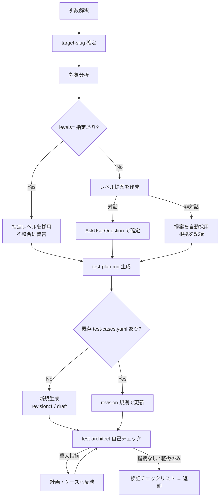

# test-design 詳細手順（分析 → 計画 → ケース設計）

`test-design` スキルの実行手順の詳細。SKILL.md の実行フローから参照される。
スキーマ・レベル定義・エージェント運用の SSOT は `${CLAUDE_PLUGIN_ROOT}/references/`（yaml-schema.md / test-levels.md / agents.md）であり、本書はその適用手順のみを定義する（規範本文は複製しない）。
ケース内容の設計原則（技法・レベル別観点・実行可能性基準）は `${CLAUDE_SKILL_DIR}/references/case-design-principles.md` を併読する。

---

## 1. 全体フロー

## 2. 入力解釈と target-slug の確定

| 起動形態 | target-slug の確定方法 |
|---------|----------------------|
| 委譲（`target-slug=` 受領） | 受領値をそのまま使用する（解決はオーケストレータ済み） |
| 単独起動 | `${CLAUDE_PLUGIN_ROOT}/references/data-locations.md` 4 章の解決フローに従う（既存一覧の提示 → 選択 or 新規作成。非対話時は唯一の既存 slug 採用・複数はエラー中断） |

- 配置先は基準ディレクトリ配下の `.claude/.local/plugins/deep-test/{target-slug}/`（基準ディレクトリの解決は data-locations.md 1 章）
- テスト対象（`対象説明=` または位置引数）が未指定の場合: 対話時は AskUserQuestion で確認し、非対話時はエラーで中断する（誤対象への設計を防ぐ）

## 3. 対象分析の手順

分析の目的は、(1) レベル選定の根拠、(2) ケースの requirement 対応付け、(3) 画面・API 操作手順の具体化材料を得ること。

### 3.1 入力別の分析方法

| 入力 | 分析方法 |
|------|---------|
| `spec=` 仕様書あり | Read で読解し、要件 ID・機能一覧・画面一覧・API 一覧・受入基準を抽出する。ディレクトリ指定時は Glob で対象ファイルを列挙してから読む |
| リポジトリパス | Glob / Grep でルーティング・画面・API 定義を探索する（探索の当たり: ルーティング定義、`controllers` / `pages` / `views` / `api` / `routes` 系ディレクトリ、OpenAPI 定義、DB スキーマ定義） |
| アプリ URL のみ | 提供された情報（URL・ユーザーの説明）の範囲で分析する。設計フェーズではブラウザアクセスによる探索は行わない（実動作確認は実行フェーズの責務）。不明点は未確認事項に列挙する |

- 分析量が大きい場合（多数ファイルの横断読解が必要）、調査をエージェントへ委譲してよい（結果は要約で受け取る）
- 分析で確認できなかった事項は推測で補わず「未確認事項」として保持し、返却に含める

### 3.2 分析結果の整理（レベル選定・ケース設計の入力）

以下を箇条書き・表で整理する: 機能一覧 / 画面一覧と主要遷移 / API 一覧 / 主要データ（マスタ・トランザクション） / 外部 IF（外部システム・外部 API）の有無 / 認証・権限の構成 / 非機能の期待（性能目標・セキュリティ要件）。

## 4. テストレベル選定の手順

レベルの定義・入口/出口基準は `${CLAUDE_PLUGIN_ROOT}/references/test-levels.md` に従う。

### 4.1 提案の作成（`levels=` 未指定時）

分析結果から該当レベルを判定する目安:

| 分析結果 | 提案に含めるレベル |
|---------|------------------|
| テストランナー・テストコードが存在（または追加予定） | `unit` |
| 画面を持つアプリケーション | `functional`（原則含める） |
| 複数モジュール・画面間のデータ連携がある | `integration-internal` |
| 外部システム・外部 API 連携がある | `integration-external`（外部 IF が無ければ含めない） |
| 業務フローが複数機能を跨ぐ | `system` |
| 受入基準・業務シナリオが定義されている（UAT 支援の要望がある） | `uat` |
| 性能目標・応答時間の期待がある | `performance` |
| 認証・外部公開・機微データの取り扱いがある | `security` |

### 4.2 確定

| モード | 確定方法 |
|-------|---------|
| 対話 | AskUserQuestion（複数選択）で提案レベルを提示して確定する。各選択肢に「そのレベルで何を確認するか」の 1 行説明を付ける |
| 非対話 | 提案を自動採用し、採用根拠（上表のどの判定に該当したか）を返却に明記する |

- `levels=` 指定時も、明らかな不整合（例: 外部 IF が存在しないのに `integration-external` 指定）は警告を返却に含める（指定自体は尊重する）
- 選定しなかったレベルとその理由も test-plan.md のレベル別スコープに記録する（「未実施レベルの明示」が報告時の未確認事項の基礎になる）

## 5. test-plan.md の章構成

`{target-slug}/test-plan.md` に以下の 6 セクションで生成する。

| セクション | 内容 |
|-----------|------|
| 1. 対象概要 | 対象名・対象 URL / リポジトリ・技術構成の要約・分析に使用した情報源（仕様書パス等）・未確認事項 |
| 2. テスト方針 | 重視する観点（ユーザー目線の実動作確認を第一とする等）・実行手段の方針（Playwright MCP / テストランナー）・本プラグインのスコープ境界に関わる注記（UAT の位置付け・性能/セキュリティの境界は test-levels.md 6〜8 章を参照として明記） |
| 3. レベル別スコープ | 選定レベルごとの対象範囲・確認内容・想定ケース数。選定しなかったレベルと理由 |
| 4. 環境前提 | テスト環境 URL / ビルド・テストアカウント・入口基準（test-levels.md 4 章）充足の前提・本番環境を対象にしない旨（execution-policy.md 6 章） |
| 5. データ方針 | テストデータの準備方法・preconditions / postconditions による分離と復元の方針（execution-policy.md 5 章）・機微情報の扱い（実値を書かない） |
| 6. スケジュール目安 | レベル別の想定所要（ケース数 × ケースタイムアウト上限からの概算）・実行順序（レベル順の逐次） |

- 図解が必要な場合は mermaid 記法を使用する。セクション記号（U+00A7）は使用しない

## 6. test-cases.yaml の生成手順（新規）

スキーマ・必須フィールド・enum 値は `${CLAUDE_PLUGIN_ROOT}/references/yaml-schema-cases.md` が SSOT。以下は生成時の作業手順のみを定める。

1. `meta` を作成する（target / created_at / updated_at / schema_version: 1）。日時は `date` コマンドで取得した ISO8601（タイムゾーンオフセット付き）を用いる
2. レベルごとにケースを設計する（設計原則は case-design-principles.md）
3. ID を採番する: `TC-{LEVEL}-{3桁連番}`。LEVEL トークンと level 値の対応・連番規則は yaml-schema.md 2.2 章に従う（レベルごとに 001 から昇順）
4. 各ケースに必須フィールドを漏れなく設定する（フィールド定義は yaml-schema-cases.md 2 章）:
   - `id` / `revision: 1` / `review_status: draft` / `created_at` / `updated_at` / `level` / `title` / `priority` / `requirement` / `steps` / `expected` / `automation`
   - 任意フィールドも原則設定する: `preconditions` / `data` / `postconditions` / `depends_on`（依存なしは `[]`） / `timeout_sec`（既定 120。長時間ケースのみ上書き）
5. `automation` の初期値は test-levels.md 3 章の automation 既定値に従い、ケース単位で上書きする（人手確認が不可欠なケースは `manual-assist`）
6. YAML 記述規約（UTF-8・日本語そのまま・インデント 2・タブ禁止）は yaml-schema.md 2.1 章に従う

## 7. 既存 test-cases.yaml の更新手順

revision・承認・削除の規則は yaml-schema-cases.md 3 章が SSOT。以下は適用手順。

1. 既存ファイルを Read し、既存ケースの ID・revision・review_status・内容を把握する
2. 変更要求と突き合わせ、ケースごとに分類する:

| 分類 | 操作 |
|------|------|
| 内容変更（steps / expected / data 等が変わる） | 該当フィールドを更新 + `revision` を +1 + `review_status: draft` に戻す + `updated_at` 更新 |
| 削除相当 | `deprecated: true` を設定（物理削除しない）。ID は欠番として保持し再利用しない |
| 追加 | 当該レベルの既存最大連番 +1 で採番（deprecated の ID も最大値の対象に含める）。`revision: 1` / `review_status: draft` |
| 変更なし | 一切変更しない（approved のケースの承認状態を維持する） |

3. `meta.updated_at` を更新する
4. revision のインクリメントは**設計セッションでの内容確定時に 1 回**とする（自己チェック反映等でセッション内の編集を重ねても、確定内容と更新前内容の比較で +1 は 1 回のみ）

## 8. test-architect 自己チェック

エージェント選定・起動方式・プロンプト組み立て・共通注入事項は `${CLAUDE_PLUGIN_ROOT}/references/agents.md` が SSOT（test-architect は単独起動）。

1. プロンプトを組み立てる:
   - 共通入力（agents.md 4.1 章）: 対象の説明と target-slug・test-plan.md / test-cases.yaml の解決済みパス・references 参照指示
   - test-architect の追加入力（agents.md 4.2 章）: 対象分析結果（技術スタック・画面 / API 一覧）・要件 / 仕様情報・レベル選定案と根拠・test-levels.md の参照指示
   - 共通注入事項ブロック（agents.md 4.3 章）を必ず含める
   - 出力形式（agents.md 4.4 章）を明記する
2. Agent ツールで起動する（`subagent_type: "deep-test:test-architect"`）
3. 結果の反映:

| 指摘の種類 | 対応 |
|-----------|------|
| 重大な指摘（レベル選定の欠落・主要機能のケース欠落・実行不能な設計・破壊的操作の未明示 等） | 計画・ケースへ反映する。反映後の内容は初回生成中であれば revision 据え置き（7 章の確定時 1 回規則） |
| 軽微な指摘・提案 | 反映するか、反映しない理由を付して返却レポートの所見に残す |
| 信頼度の低い指摘・入力不足による未確認 | 未確認事項・所見として返却に記載する（黙殺しない） |

- test-architect に成果物を直接修正させない（評価のみ。反映は本スキルが行う）

## 9. 返却レポートの組み立て

SKILL.md「引き渡し」のフォーマットに従い、以下を確実に含める。

- 生成・更新ファイルの絶対パス
- 選定レベルと根拠（非対話の自動採用時はその旨）
- レベル別ケースサマリ表（新規 / 更新 / deprecated / 有効ケース計）
- test-architect 所見（反映済み / 反映不要と判断した指摘と理由）
- 未確認事項
- 「全ケース draft のため test-review（設計文脈）の承認が必要」の明記
