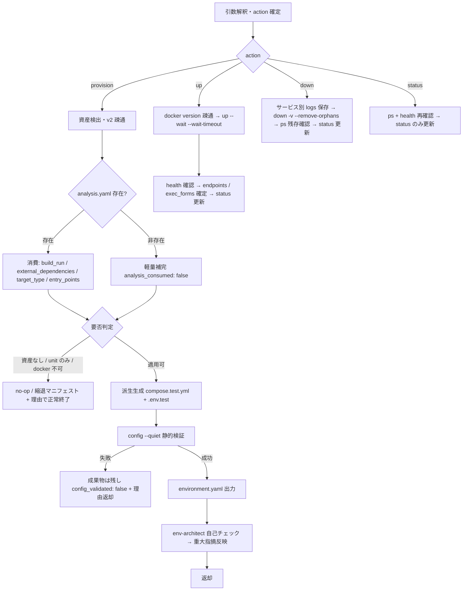

<!-- TEST-ENVIRONMENT-PROCEDURES-SENTINEL-v1 -->
# test-environment 詳細手順（検出 → 消費 → 派生 → 検証 → up / down / status）

`test-environment` スキルの実行手順の詳細。SKILL.md の実行フローから参照される。
`environment.yaml` のスキーマ・enum・コマンド規約形（10.1）の SSOT は `${CLAUDE_PLUGIN_ROOT}/references/yaml-schema-environment.md`、消費する `analysis.yaml` の完全スキーマは同 `yaml-schema-analysis.md`、配置・target-slug 解決・SUT docker 資産の read-only 注記は同 `data-locations.md`、縮退（skipped）・非対話既定値は同 `execution-policy.md`、エージェント運用は同 `agents.md` および `${CLAUDE_SKILL_DIR}/references/agents.md` である。本書はそれらの適用手順のみを定義し、規範本文は複製しない。派生ファイルの書き方は `${CLAUDE_SKILL_DIR}/references/compose-derivation.md` を参照する。

> **環境構築（setup）について**: 本スキルは Python を同梱しないため `scripts/setup/`（venv）を持たない。docker 操作は Bash 直実行（docker CLI の単発呼出）で完結し、`environment.yaml` / 派生成果物は LLM が Write で直接生成する。タイムスタンプは `date` で ISO8601 を取得する。

---

## 1. 全体フロー



## 2. 入力解決と action の確定

| 起動形態 | target-slug の確定方法 |
|---------|----------------------|
| 委譲（`target=` 受領） | 受領値をそのまま使用する（解決はオーケストレータ済み） |
| 単独起動 | `${CLAUDE_PLUGIN_ROOT}/references/data-locations.md` 4 章の解決フローに従う（非対話時は唯一の既存 slug 採用・複数はエラー中断） |

- `base=` は委譲時に受領、単独時は data-locations.md 1 章で解決する（同一セッション中は切り替えない）
- `project=`（SUT のプロジェクトルート）は docker 資産探索の起点。未指定時はカレント作業ディレクトリを起点とする
- `action=` の既定は `provision`。up / down / status では既存 `{base}/{target-slug}/environment.yaml` を Read で確認し、非存在なら「先に provision が必要」と案内して終了する（推定でコマンドを組み立てない）
- `run-id=` は up / down 時に任意で受領し、logs 保存先（8 章）と `status.last_run_id` に使う。未受領なら run 外の単独操作として扱う

## 3. 資産検出・v2 疎通（provision）

`project=` 起点に以下を Glob で検出する。**有無・パスのみ**を記録し、内容・値（特に `.env` の実値）は読まない。

| 検出対象 | Glob パターン | environment.yaml への記録 |
|---------|--------------|--------------------------|
| compose ファイル | `compose.y*ml` / `docker-compose.y*ml` | `derived_from.compose_files`（`-f` の先頭群 = 相対パス解決の基準） |
| override ファイル | `compose.override.y*ml` / `docker-compose.override.y*ml` | `derived_from.override_files_detected`（自動読込対象。全ファイルを明示 `-f` で渡して混入を回避） |
| Dockerfile | `Dockerfile*` | `derived_from.dockerfiles` |
| docker ディレクトリ | `docker/`（配下の compose / Dockerfile も検出対象） | 検出パスを compose_files / dockerfiles に反映 |
| env ファイル | `.env` / `.env.*`（`.env.example` 等のサンプル系も有無のみ） | `derived_from.env_files_detected`（**有無のみ。内容は読まない**） |

コマンド疎通の確認:

1. `docker compose version` — 成功なら v2 系。`compose_command: "docker compose"` を記録する
2. v2 が失敗し `docker-compose --version` のみ成功する場合 — v1 のみ検出。`compose_command: "docker-compose"` + `status.notes` に警告を記録し **best-effort で続行**する（v1 は EOL 済み。試行失敗時は unavailable と同じ縮退）
3. どちらも失敗 / docker CLI 不在 — `applicability: unavailable` の縮退（9 章）

## 4. analysis.yaml の消費（provision・重複解析の回避）

test-environment は対象を**再解析しない**。`{base}/{target-slug}/analysis.yaml` から次を派生方針の材料に用いる（単方向・read-only）。

| analysis.yaml のセクション | 使う内容 | 派生への反映 |
|--------------------------|---------|-------------|
| `architecture.build_run` | ビルド・実行基盤の記述 | `services[].source`（image / build）の当たり付け・起動見込み時間（`wait_timeout_sec` の調整材料） |
| `dependency_summary.external_dependencies[]` | 外部依存（HTTP API・決済・メール・DB 等） | 分離対象・モック profiles の選定・**本番誤爆疑義の突合**（compose-derivation.md 6 章） |
| `meta.target_type` | web-app / api / batch / library 等 | 環境要否判定（5 章）・endpoints の purpose（browser / api） |
| `entry_points[]` | 公開 EP・ポート・認証 | `endpoints[].base_url` / `purpose` の当たり付け・healthcheck 補助ポーリングの対象パス |

- 非存在時（単独起動・analyze スキップ運用）は Read/Glob/Grep で compose 内サービス構成から**軽量補完**し、`meta.analysis_consumed: false` を記録する（推定を確定情報として書かない）

## 5. 要否判定（provision・no-op 分岐）

以下のいずれかに該当する場合、派生を行わず **no-op / 縮退マニフェスト**（`applicability` + `reason`）を出力して正常終了する（9 章の縮退表が正）。

- docker 資産なし（compose / Dockerfile とも不在）→ `not-applicable`。従来前提（ユーザー起動 URL）を案内する
- `levels=` が unit のみ → 環境不要。委譲前にオーケストレータでも抑制されるが、起動された場合も `not-applicable` で no-op（MCP ゲートの「unit のみ判定不要」と同型）
- docker CLI 不在・デーモン未起動（`docker version` 失敗）→ `unavailable`。従来前提へのフォールバックを案内する

> 判定に迷う場合は「作らない」を既定とし、理由を明記する。ユーザーが起動済み URL を渡している場合は従来前提が常に優先され、本スキルの不成立はフローを止めない（新ゲートは追加しない）。

## 6. 派生生成 → config 検証（provision）

1. `${CLAUDE_SKILL_DIR}/references/compose-derivation.md` の各パターンに従い、`{base}/{target-slug}/environment/compose.test.yml` と `environment/.env.test` を Write する（SUT 側へは書かない）
2. 本番誤爆突合（compose-derivation.md 6 章）を実施する。疑義はモック / ダミー値へ差替（非対話）or ユーザーへ明示確認（対話）
3. コマンド規約形（yaml-schema-environment.md 10.1 の共通プレフィクス）で静的検証する:

```bash
docker compose -f <SUT compose> -f environment/compose.test.yml -p {slug}-test --env-file environment/.env.test config --quiet
```

- `--quiet` は**必須**（省略すると解決済み env 値が stdout に展開され秘匿値漏えいリスク）。exit code で成否を判定する
- 失敗時は派生成果物を**残したまま** `derived_artifacts.config_validated: false` + 失敗理由を environment.yaml と返却に記録し、**up へ進まない**（`ports: !override` タグが実環境の compose で受理されない場合もここで検出される）
- 成功時は `config_validated: true` を記録する

## 7. environment.yaml 出力 → 自己チェック（provision）

1. `yaml-schema-environment.md` に完全準拠して `{base}/{target-slug}/environment.yaml` を Write する。`provisioned_at` / `updated_at` は `date` の ISO8601。`endpoints[].health` は up 前のため `unknown`（healthy を捏造しない）。`lifecycle.up_command` / `down_command` は 10.1 の規約形を実パスで実体化する
2. 自由記述値（`overrides` / `notes` / `reason`）・URL・コマンド文字列・ポート表記は**ダブルクォート**する（同 2.1 の YAML 記法遵守）。生成後に読み返して parse 可能性を自己確認する
3. `env-architect` を単独起動して自己チェックする（`${CLAUDE_SKILL_DIR}/references/agents.md`）。重大指摘（read-only 境界逸脱・秘匿値の混入・分離不備・本番誤爆疑義の未解消）は成果物へ反映してから返却する
   - `env-architect` が Agent として解決できない環境（プラグイン未インストールのセッション等）では、`agents.md` の評価観点を読み込んで**同じ観点で自己チェックを自分で実施**し、代替実施した旨を返却の env-architect 所見に明記する（自己チェックの省略は不可）

## 8. up / down / status の手順

### 8.1 action=up（全ゲート通過後・start-run 直前 = Phase 5 手順 0）

1. `docker version` でデーモン疎通を確認する（失敗なら `applicability: unavailable` + 理由で縮退。up を試みない）
2. environment.yaml の `lifecycle.up_command`（共通プレフィクス + `up --wait --wait-timeout {N}`、既定 N=120）を実行する。`--wait` は detached モードを含意するため `-d` は付けない
3. health 確認:
   - healthcheck 宣言済みサービス（`services[].healthcheck: declared`）→ `--wait` の通過で healthy と判定する
   - healthcheck 未定義サービス（`none`）→ `--wait` は running 到達で通過してしまうため、`endpoints[]` の 127.0.0.1 base URL へ curl で**条件付きポーリング**して補助確認する（固定スリープ禁止。試行間隔と上限回数を決めて打ち切る）。なお `up --wait` の進捗表示は healthcheck 未定義サービスでも「Healthy」と表示されることがある（実体は running 到達）ため、表示を healthy の根拠にしない
   - healthcheck 未定義かつ HTTP エンドポイントを持たないサービス（DB・キャッシュ等）→ curl 補助が使えないため、`ps` の状態（Up 継続・再起動ループなし）を確認し、判定根拠を `status.notes` に記録して代替する
4. 結果を反映する: 全達 → `status.state: healthy`・`endpoints[].health: healthy`。未達 → 9 章の health 未達行に従う。up 自体の失敗（ビルド失敗・起動即死）→ logs を取得して理由と共に返却し `status.state: down`
5. `exec_forms[]` の `command_template`（共通プレフィクス + `exec -T <service> <runner コマンド>`）と `runner_hint` を確定し、`status`（`last_action: up` / `last_action_at` / `last_run_id`）を更新する
6. 返却に `start-run --environment` の材料（project 名・base URL・イメージ要約）と、performance レベル見込み時の免責注記材料（8.4）を含める

### 8.2 action=down（Phase 6 判定後）

1. **logs 保存（down より先）**: サービスごとに `logs` を取得し保存する。保存先は `run-id=` ありなら `evidence/{run_id}/environment/{service}.log`、なしなら `environment/logs/{timestamp}/{service}.log`。**`evidence-policy.md` 5 章の機微情報マスキング方針を適用**する（トークン・パスワード等はマスクして保存する）
2. environment.yaml の `lifecycle.down_command`（**up と同一の `-f` 群 + `-p {slug}-test` に固定** + `down -v --remove-orphans`）を実行する。`-p` 単独 down のラベル解決には依存しない（安全側の規約）
3. `ps` で残存確認する: 共通プレフィクス + `ps` が空であることを確認し、結果を `status.notes` に記録する。external volume は `-v` でも削除されないため、存在する場合はその旨も notes に記録する
4. `status` を更新する（`state: down` / `last_action: down`）。残存が検出された場合は notes に残し、返却で手動対処（8.5 と同じ手順）を案内する

### 8.3 action=status / resume・retest 時の再利用

1. 共通プレフィクス + `ps` でコンテナ状態を取得し、`endpoints[]` の base URL へ curl で health を再確認する
2. `status` のみ更新する（`state`: 実測に基づき healthy / degraded / up / down / unknown。実測なしに healthy と書かない）
3. **resume / retest の再利用判定**: `status.state` + `ps` + health 再確認で健全なら**再利用する（再 up 不要）**。不健全なら down → up で作り直す（オーケストレータの復帰手順から本 action が呼ばれる）

### 8.4 performance 免責注記（annotate 連携）

performance レベルが `levels=` / scope に見込まれる場合、返却サマリに「コンテナ派生環境（`{slug}-test`）での計測であり、本番構成の性能を代表しない」旨の免責注記材料を必ず含める。オーケストレータ / test-report がこれを annotate（所見・注記の機械記録）経由で報告書の「所見・注記」へ反映する（本スキルは材料の提供まで）。

### 8.5 中断・停止ハンドオフ時の残存確認と手動 down

MCP ゲート停止・セッション中断等で down が実施されないまま終了する場合（`status.state: up` のまま）、ハンドオフ・停止案内に以下を**必ず**含める。

```bash
# 残存確認（up と同一の -f 群 + -p。environment.yaml の lifecycle から転記する）
docker compose -f <SUT compose> -f environment/compose.test.yml -p {slug}-test --env-file environment/.env.test ps

# 手動 down（残存があった場合）
docker compose -f <SUT compose> -f environment/compose.test.yml -p {slug}-test --env-file environment/.env.test down -v --remove-orphans
```

- resume 時は 8.3 の再利用判定を先に行う（健全なら down せず再利用してよい）

## 9. 縮退表（applicability / status との対応）

原則: `execution-policy.md` 2 章「実行を偽装しない」に整合し、**新ゲートは追加しない**（ユーザー起動済み URL があれば従来どおり続行できるため、停止ではなく縮退で扱う）。run 側 status の skipped（実行手段不在）/ blocked（テスト論理上の前提不成立）の意味論は `yaml-schema-results.md` / `test-levels.md` 3 章に整合させる。

| 状況 | 検出タイミング | test-environment の動作 | environment.yaml | run 側 status への影響 |
|------|--------------|------------------------|------------------|----------------------|
| docker 資産なし（compose / Dockerfile 不在） | provision | **no-op**。従来前提（ユーザー起動 URL）を案内 | `applicability: not-applicable` + reason | 影響なし（URL があれば従来どおり実行） |
| `levels=` が unit のみ | provision（委譲前にオーケストレータでも抑制） | **no-op**（環境不要） | 生成しない（委譲スキップ）or `not-applicable` | 影響なし |
| docker CLI 不在・デーモン未起動 | provision / up | 縮退。従来前提へフォールバック案内 | `applicability: unavailable` + reason | ユーザー URL なしの browser レベルは実行時 **skipped**（実行手段不在） |
| compose v1 のみ検出 | provision | 警告 + `docker-compose` 形で best-effort | `compose_command: "docker-compose"` + notes | 試行失敗時は unavailable と同じ |
| `config --quiet` 検証失敗 | provision | 派生成果物は残し、失敗理由を返す。up へ進まない | `config_validated: false` | ユーザー URL なしなら **skipped** 材料 |
| up 失敗（ビルド失敗・起動即死） | up | 失敗理由 + logs を返す。対話時はユーザー URL の提示を確認、非対話は縮退確定 | `status.state: down` + notes | **skipped**（実行手段不在。デーモン不可と同列） |
| health 未達（`--wait-timeout` 超過） | up | logs 保存 → 対話: 維持 / down を確認。非対話: down して理由返却 | `status.state: degraded` + notes（degraded は health 判定時点の中間状態。down 実施後は `status.state: down` とし notes に degraded 由来〔health 未達〕を残す） | **blocked**（環境はあるが前提不成立。タイムアウト系の既存意味論と整合） |
| 非対話モード | 全 action | up を**許可**（down までのワンサイクル完結を条件とする一時的副作用。永続的副作用は作らない） | 通常どおり | 通常どおり |
| 中断・停止ハンドオフ（MCP 喪失等） | run 中 | down は実施されない。ハンドオフに 8.5 の残存確認 + 手動 down 手順を必須で含める | `status.state: up` のまま | resume 時に 8.3 の再利用判定 |
| resume / retest | up | `ps` + health 再確認 → 健全なら再利用（再 up 不要）・不健全なら down → up | `status` 更新 | 通常どおり |

## 10. 返却レポートの組み立て

SKILL.md「引き渡し」のフォーマットに従い、以下を確実に含める。

- environment.yaml の絶対パス・action・`applicability`（縮退時は reason）・`analysis_consumed`・`compose_command`
- 派生成果物のパスと `config_validated`・project 名（`{slug}-test`）・profiles
- services（source / 派生後 ports / healthcheck）・endpoints（base_url / purpose / health）・exec_forms 件数（記録のみの旨）
- `status.state` と残存確認結果（down 時は `ps` の結果・up 維持時は 8.5 の手動 down 手順）
- env-architect 所見（反映済み / 反映不要と判断した指摘と理由）
- performance 免責注記材料（8.4。該当時）
- 次フェーズへの引き継ぎ（provision → test-design の環境前提材料 / up → `start-run --environment` 材料・browser 系の endpoints 受領）
