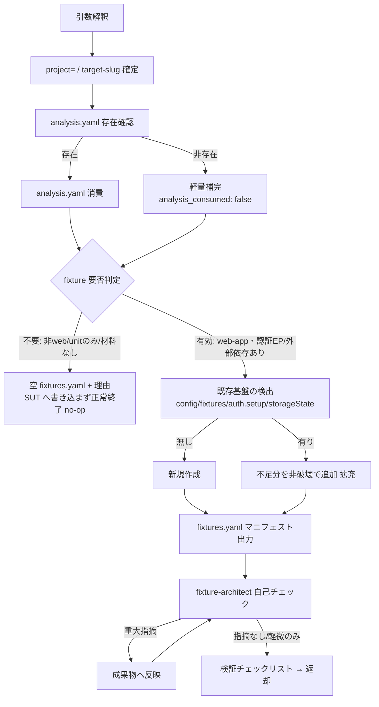

<!-- TEST-FIXTURE-PROCEDURES-SENTINEL-v1 -->
# test-fixture 詳細手順（入力解決 → 消費 → 既存検出 → 生成/拡充 → 出力 → 自己チェック）

`test-fixture` スキルの実行手順の詳細。SKILL.md の実行フローから参照される。
`fixtures.yaml` のスキーマ・enum・Playwright Test 実行規約・認証/モック/シード/base のパターン規範・**書き込み境界**の SSOT は `${CLAUDE_PLUGIN_ROOT}/references/playwright-test.md`、消費する `analysis.yaml` の完全スキーマは同 `yaml-schema-analysis.md`、配置・target-slug 解決は同 `data-locations.md`、エージェント運用は同 `agents.md` および `${CLAUDE_SKILL_DIR}/references/agents.md` である。本書はそれらの適用手順のみを定義し、規範本文は複製しない。パターン別の最小コード例は `${CLAUDE_SKILL_DIR}/references/fixture-patterns.md` を参照する。

> **環境構築（setup）について**: 本スキルは Python を同梱しないため `scripts/setup/`（venv）を持たない。フィクスチャコードは LLM が Write/Edit で直接生成し、`fixtures.yaml` は Write で直接生成する。Playwright のインストール確認・雛形生成に read-only の `npx playwright` を用いる場合がある（ブラウザの実インストール等の環境構築は `test-setup` の責務であり、本スキルでは行わない）。

---

## 1. 全体フロー

## 2. 入力解決と target-slug の確定

| 起動形態 | target-slug の確定方法 |
|---------|----------------------|
| 委譲（`target-slug=` 受領） | 受領値をそのまま使用する（解決はオーケストレータ済み） |
| 単独起動 | `${CLAUDE_PLUGIN_ROOT}/references/data-locations.md` 4 章の解決フローに従う（非対話時は唯一の既存 slug 採用・複数はエラー中断） |

- `base=` は委譲時に受領、単独時は data-locations.md 1 章で解決する（同一セッション中は切り替えない）
- `project=`（SUT のプロジェクトルート）は**テストコード生成先の基準**であり、既存 `playwright.config.ts` 検出の起点でもある。未指定時はカレント作業ディレクトリを起点とする
- 材料 `analysis.yaml` は引数ではなく `{base}/{target-slug}/analysis.yaml` を Read で解決する（存在時は 3 章で消費・非存在時は 3.2 の補完）
- 対象（`対象説明=` または位置引数）が未指定でも、`analysis.yaml` の `meta` から対象種別・対象名を補える場合は継続する。材料も対象情報も皆無なら、非対話時はエラーで中断し、対話時はユーザーに確認する

## 3. analysis.yaml の消費（重複分析の回避）

test-fixture は対象アプリを**再分析しない**。`analysis.yaml` から次のセクションを材料に用いる（単方向・read-only）。

### 3.1 消費する材料（存在時）

| analysis.yaml のセクション | fixture が使う内容 | 生成物への反映 |
|--------------------------|------------------|--------------|
| `entry_points[]`（`auth` / `exposure` / `kind` / `signature`） | 認証方式（none/session/token…）と認証が要る EP・露出度 | 認証フィクスチャ（auth.setup.ts の対象・storageState のロール分割）。`source_refs` に EP-id を記録 |
| `dependency_summary.external_dependencies[]`（`name` / `kind` / `usage`） | モック対象の外部依存（HTTP API・決済・メール・キュー） | モックフィクスチャ（route.fulfill / interception の対象選定）。`source_refs` に EXT 名を記録 |
| `attack_surface_summary`（`public_entry_points` / `trust_boundaries` / `stride_notes`） | 認証境界・信頼境界（未認証/認証の切替テスト基盤の要否） | 認証状態別フィクスチャ（authenticated / unauthenticated context） |
| `meta.target_type` / `meta.source_availability` | web-app 判定・縮退状態（材料の確からしさ） | fixture 要否判定・`confidence` の伝播 |
| `architecture.frameworks` / `build_run` | フロント/バックの技術スタック・実行基盤 | `playwright.config.ts` の `baseURL` / `webServer` 設定の当たり付け |

- 消費して得た確度は各 fixture の `confidence` に反映する。縮退（`source_availability: partial` / `none`）由来の材料は `confidence` を下げる

### 3.2 未生成時の軽量補完

`analysis.yaml` が存在しない場合（fixture 単独起動・analyze スキップ運用）に限り、Read/Glob/Grep で認証入口・外部依存・テストディレクトリ構成を**軽量に補完**する。

- 補完で得た所見は `fixtures.yaml` の `meta.analysis_consumed: false` と各 fixture の `confidence`（medium / low）に反映し、**推定を確定情報として書かない**
- 対象アプリへの能動プローブ（実ログイン試行等）は行わない（静的 Read に留める）。実ログインフロー探索が要る場合の Playwright MCP 利用可否は SKILL.md frontmatter への MCP 追加判断とする（既定は追加しない）

## 4. fixture 要否判定（no-op 分岐）

以下のいずれかに該当する場合、SUT に**何も書かず**、空マニフェスト（`fixtures: []`）＋ `meta` に判定理由を残して正常終了する（非破壊 no-op）。

- `meta.target_type` が非 web（`library` / `cli` / `batch` の純粋なもの等）で UI 経路の再現テストが不要
- 見込みが unit テストのみ（`.spec.ts` + ブラウザ基盤が不要）
- 認証 EP も外部依存も無く、再現可能フィクスチャの価値が乏しい

> これにより、探索的 MCP テスト（fixture なし）は従来どおり Phase 1.5 → Phase 2 に直行でき、既存フローを壊さない。判定に迷う場合は「作らない」を既定とし、理由を明記する（過剰生成を避ける）。

## 5. 既存基盤の検出（新規作成か拡充かの分岐）

`project=` を起点に、以下を Glob/Grep で検出する。

| 検出対象 | 判定 |
|---------|------|
| `playwright.config.ts` / `playwright.config.js` | 有れば拡充（`config_artifact` に相対パス）・無ければ新規作成 |
| `{tests}/fixtures/*.ts`（`test.extend` 定義） | 既存フィクスチャの `name`・提供内容を把握し、重複生成を避ける |
| `auth.setup.ts` / `*.setup.ts` | 認証 setup の有無。storageState 出力先（`.auth/*.json`）の設定も確認 |
| 既存 `testDir` / `tests` ディレクトリ構成 | `test_root` を決める（`project=` からの相対。例: `tests`） |

- 既存フィクスチャの `name`・`type` を `fixtures.yaml` に `status: existing` として記録し、本 run で変更していないことを明示する

## 6. 生成 or 拡充

`${CLAUDE_SKILL_DIR}/references/fixture-patterns.md` の各パターンに従う。

| 状況 | 動作 |
|------|------|
| 既存基盤なし（新規作成） | `playwright.config.ts`・`auth.setup.ts`・`{tests}/fixtures/*.ts`・seed を生成する。`status: created` |
| 既存基盤あり（拡充） | 既存の書式・命名を尊重し、**不足分のみ非破壊で追加**する（未カバーの認証パターン・未モックの外部依存等）。既存 fixture を破壊的に上書きしない。`status: extended` |

### 6.1 書き込み境界（MANDATORY・`playwright-test.md` 4 章が SSOT）

| 対象 | 操作 | 境界 |
|------|------|------|
| SUT の**テストディレクトリ**（`{project}/{test_root}/` 配下・`playwright.config.ts`） | Write / Edit 可 | フィクスチャ・setup・シード・config の生成/拡充に限る |
| SUT の**プロダクションコード**（アプリ本体・DB スキーマ・業務ロジック） | 不可 | 一切変更しない（プロダクションコード不変原則） |
| SUT の `.gitignore` | 追記の**提案のみ**（storageState / `.auth` の除外） | 実トークンのコミット防止（対話確認 or 提案に留める） |
| deep-test データ領域 `{base}/{target-slug}/fixtures.yaml` | Write 可 | マニフェストの生成/更新 |
| `test-results.yaml` / `test-cases.yaml` / `analysis.yaml` | 不可 | 各所有スキルの専有 |

- 認証情報の実値を config / fixture / setup に**ハードコードしない**。環境変数・credentials-manager 経由の取得コードとして記述する（credentials-management ルール MANDATORY）
- storageState 出力先（例: `tests/.auth/*.json`）はセッショントークンを含むため `.gitignore` 前提。追記を提案し、実トークンをコミットしない

## 7. fixtures.yaml マニフェスト出力

`{base}/{target-slug}/fixtures.yaml` を Write で生成する。`${CLAUDE_PLUGIN_ROOT}/references/playwright-test.md` 1 章のスキーマに完全準拠する。

1. `meta` を作成する（`target` / `target_slug` / `created_at`・`updated_at`〔`date` の ISO8601〕 / `schema_version: 1` / `analysis_consumed` / `test_root` / `config_artifact`〔無ければ `null`〕）
2. `fixtures[]` を作成する（`name` / `type`〔auth|mock|seed|base〕 / `provides` / `artifact`〔SUT 内相対パス〕 / `usage`〔任意〕 / `depends_on`〔任意〕 / `source_refs`〔任意・消費した EP/EXT ID〕 / `status`〔created|extended|existing〕 / `confidence`〔high|medium|low〕）
3. 拡充時は `meta.updated_at` を更新する。既存検出のみのフィクスチャは `status: existing`
4. **fixtures.yaml は妥当な（parse 可能な）YAML でなければならない**。自由記述値（`provides` / `usage` 等）で `:`・`` ` ``・`<` `>` `#` `[` `]` `{` `}` を含む、または先頭が `-` / `?` / `@` で始まるものは**ダブルクォートで囲む**（`usage` はコード断片を含むため原則クォートする）
5. 生成後に fixtures.yaml を自分で読み返し、全ての自由記述値が 4 の規則でクォートされているか自己確認する（`playwright-test.md` 1.4）
6. no-op 時は `fixtures: []` とし、`meta` に `analysis_consumed` と判定理由を残す（SUT へは書き込まない）

## 8. fixture-architect 自己チェック

エージェント選定・起動方式・プロンプト組み立て・共通注入事項は `${CLAUDE_PLUGIN_ROOT}/references/agents.md` および `${CLAUDE_SKILL_DIR}/references/agents.md` が SSOT（fixture-architect は単独起動）。

1. プロンプトを組み立てる（fixture-architect エージェント定義のプロンプトテンプレートの `{{変数}}` を解決済みの値に差し替える）:
   - 対象の説明と target-slug・`fixtures.yaml` / 生成した SUT テストコードの**解決済み絶対パス**・消費した `analysis.yaml` パス
   - `target_type` / `analysis_consumed`・SUT テストディレクトリ（書き込み境界の対象）
   - 参照 references 指示（`${CLAUDE_PLUGIN_ROOT}/references/playwright-test.md`）
   - 共通注入事項ブロック（agents.md 4.3 章）を必ず含める
2. Agent ツールで起動する（`subagent_type: "deep-test:fixture-architect"`）
3. 結果の反映:

| 指摘の種類 | 対応 |
|-----------|------|
| 重大な指摘（書き込み境界の逸脱・認証情報のハードコード・責務分離の崩れ・再利用性の欠如・存在しない依存） | 成果物（fixtures.yaml / SUT テストコード）へ反映する |
| 軽微な指摘・提案 | 反映するか、反映しない理由を付して返却の所見に残す |
| 信頼度の低い指摘・入力不足による未確認 | 未確認事項・所見として返却に記載する（黙殺しない） |

- fixture-architect に成果物を直接修正させない（評価のみ。反映は本スキルが行う。agents.md 冒頭の構造規範）

## 9. 返却レポートの組み立て

SKILL.md「引き渡し」のフォーマットに従い、以下を確実に含める。

- 生成ファイル（`fixtures.yaml`）の絶対パス・`analysis_consumed`
- 対象種別・判定（生成 / 拡充 / no-op〔理由〕）
- type 別件数と `status` 内訳（created / extended / existing）
- 生成 / 拡充した SUT テストコードの相対パス一覧
- fixture-architect 所見（反映済み / 反映不要と判断した指摘と理由）
- `.gitignore` 追記提案の有無
- 「fixtures.yaml を材料に test-design が `fixtures:` と `automation: playwright-test` を決定する」の明記
