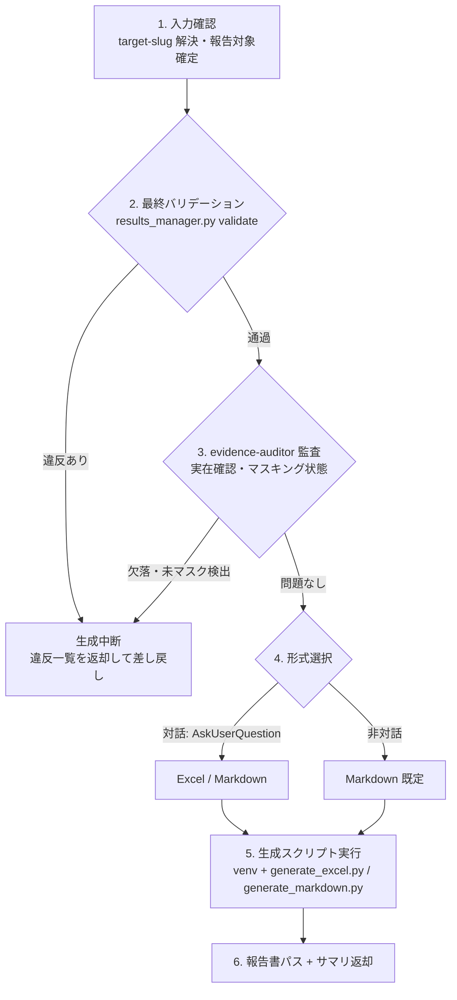

# test-report スキル

## 責務

実績 YAML（test-results.yaml + test-cases.yaml）を入力として、以下の 2 つを担う。

| # | 責務 | 内容 |
|---|------|------|
| 1 | **報告書生成** | Excel または Markdown のテスト報告書を **1 ファイル**生成（複数テストレベルの一括報告は Excel = シート分け / Markdown = セクション分け。フォーマット SSOT は `${CLAUDE_PLUGIN_ROOT}/references/report-format.md`） |
| 2 | **エビデンス完全性の最終バリデーション** | 生成前に validate（fail の defect 3 点セット・scope/results 突合）と evidence-auditor 監査（エビデンス実在・マスキング状態）を通し、違反があれば**生成せずに差し戻す**（`${CLAUDE_PLUGIN_ROOT}/references/evidence-policy.md` 二段バリデーションの最終段） |

## 責務外（他スキルが担当）

| 業務 | 担当 |
|------|------|
| テストの実行 | `test-run-*` 実行スキル 6 種 |
| 実績 YAML（test-results.yaml）への書き込み・修正 | オーケストレータ `test`（results_manager.py 経由のみ） |
| 一次バリデーション（fail 記録直後の 3 点セット検証） | オーケストレータ `test` の record 時 |
| 欠陥の修正・再テストの起動 | 修正は対象プロジェクト側 / 再テストはオーケストレータ `test` |
| テスト設計・成果物レビュー | `test-design` / `test-review` |
| リリース可否・受入可否の判断 | 人間（報告書の総合判定は機械的集計にとどまる） |

## トリガー条件

- オーケストレータ `test` の report フェーズ（フルフロー末尾・再テスト末尾・report-only モード）から Skill ツール経由で委譲された
- 「テスト報告書を作成して」「テスト結果を Excel にまとめて」「実績から報告書を再生成して」と言われた

起動しないケース:

- テスト実行そのものの依頼（オーケストレータ `test` / `test-run-*` へ）
- 実績 YAML の修正・記録の依頼（オーケストレータ `test` へ）

## 前提

- `${CLAUDE_PLUGIN_ROOT}/references/data-locations.md` の基準ディレクトリ配下に `{target-slug}/test-cases.yaml` と `{target-slug}/test-results.yaml` が存在し、run が 1 件以上記録されている
- results_manager.py（`${CLAUDE_PLUGIN_ROOT}/skills/test/references/scripts/results/results_manager.py`）が存在する（validate 実行に使用）
- evidence-auditor エージェント定義が `${CLAUDE_PLUGIN_ROOT}/agents/` に存在する
- Python 3.9+ / Bash が利用可能である（venv 構築は `${CLAUDE_SKILL_DIR}/references/setup.md`）

## 実行モード判定

| 入力 | モード | 動作 |
|-----|-------|------|
| オーケストレータから委譲（引数に `--non-interactive` を含む） | 非対話 | AskUserQuestion を使わず **Markdown 既定**で生成（`${CLAUDE_PLUGIN_ROOT}/references/execution-policy.md` 9 章の非対話既定値表）。target-slug は引数受領値。複数 slug 未指定時はエラー中断 |
| オーケストレータから委譲(対話) | 委譲・対話 | target-slug・報告対象は引数で確定済み。**形式選択のみ** AskUserQuestion で確認 |
| ユーザーが直接起動 | 単独・対話 | target-slug 解決（data-locations.md 4 章のフロー）から実施し、形式選択も AskUserQuestion で確認 |

## 実行フロー



### 1. 入力確認
target-slug を解決（委譲時は引数値をそのまま使用。単独起動時は `${CLAUDE_PLUGIN_ROOT}/references/data-locations.md` 4 章の解決フロー）。報告対象は既定で**全 run（推移表示） + latest 集計**（集計規則は `${CLAUDE_PLUGIN_ROOT}/references/retest-policy.md` 5 章）。

### 2. 最終バリデーション
venv の Python で results_manager.py の `validate` サブコマンドを実行（引数の詳細はオーケストレータ `test` スキルのドキュメントに従う）。fail の defect 3 点セット（reproduction_steps / test_data / evidence）欠落と、run の scope vs results 不整合（欠落ケース）を検出する。**違反あり → 報告書を生成せず、違反一覧を「引き渡し」の差し戻しフォーマットで返却して中断する**。

### 3. エビデンス監査
evidence-auditor を Agent ツールで起動（`${CLAUDE_PLUGIN_ROOT}/references/agents.md` 準拠。単独起動・共通注入事項を必ず含める）。エビデンスファイルの実在確認と機微情報のマスキング状態を監査させ、欠落・未マスクの指摘（高信頼のもの）があれば生成を中断して差し戻す。

### 4. 形式選択
対話時は AskUserQuestion で Excel / Markdown を選択。非対話時は Markdown 既定。

### 5. 生成
`${CLAUDE_SKILL_DIR}/references/scripts/report/generate_excel.py` または `generate_markdown.py` を venv で実行（コマンドは `${CLAUDE_SKILL_DIR}/references/procedures.md`）。出力先は**セッション作業領域直下**、ファイル名は `test-report_{target-slug}_{yyyyMMdd}.xlsx|.md`（`${CLAUDE_PLUGIN_ROOT}/references/report-format.md` 2 章）。

### 6. 返却
報告書の絶対パスとサマリ（総合判定・レベル別集計・NG 件数・未確認事項件数）を「引き渡し」のフォーマットで返す。

- test-results.yaml の annotations（annotate サブコマンドで登録された注釈）は、生成スクリプトが報告書の「所見・注記」として自動出力する（YAML 由来の機械出力。手動転記の禁止は維持）

## 検証

- 生成スクリプトの exit code = 0 と出力ファイルの実在を確認する
- 返却サマリ（総合判定・集計値・シート / 章構成）は**スクリプト標準出力の値をそのまま転記**する（LLM による手計算・再集計をしない）
- 生成失敗（exit code != 0）時はエラー内容を提示して中断する（形式を変えた再試行で失敗を握りつぶさない）
- validate が実行不能（results_manager.py 不在・エラー終了）の場合は前提不成立として**生成に進まず**中断・報告する

## 引き渡し

正常時（呼び出し元 = オーケストレータ `test` またはユーザー）:

```markdown
## テスト報告結果
- 報告書: <絶対パス>（形式: Excel | Markdown）
- 総合判定: PASS | FAIL | INCOMPLETE
- 集計（latest）: 対象 N / pass N / fail N / blocked N / skipped N / na N
- NG 件数: N / 未確認事項（skipped）: N
- シート / 章構成: <スクリプト出力の転記>
```

差し戻し時（ステップ 2・3 で違反検出）:

```markdown
## テスト報告差し戻し（生成中断）
- 中断理由: 最終バリデーション違反 | エビデンス監査指摘
- 違反一覧: ケース ID / 違反内容（欠落項目・不整合・未マスク箇所）
- 必要な対応: エビデンス追加取得・record 補完・マスキング適用 等
```

## 重要な制約

- **test-results.yaml を Edit / Write で直接編集しない**（本スキルは読み取りのみ。書き込みはオーケストレータの責務。`${CLAUDE_PLUGIN_ROOT}/references/yaml-schema.md` 3 章）
- **最終バリデーション・監査を通過していない実績から報告書を生成しない**（report-format.md 1 章。未通過での生成は禁止）
- 集計・報告は**ケースごとの最新 run 結果（latest）採用**・deprecated ケース対象外。集計は生成スクリプトの機械集計に委ね、LLM が手計算しない（retest-policy.md 5 章）
- 報告書は **1 ファイル・セッション作業領域直下**に出力する。`{target-slug}/` 配下に置かない（data-locations.md 6 章）
- 機微情報はマスク済み状態でのみ転載する（evidence-policy.md 5 章）。監査で未マスクを検出したまま生成しない
- 列定義・スタイル値・免責注記の内容は report-format.md（SSOT）にのみ定義する。本ファイル・スキル references に複製しない
- セクション記号（U+00A7）を出力しない（生成スクリプトが置換保証。スキルの応答文でも使用しない）

## 参照

| 区分 | 参照先 | 内容 |
|------|--------|------|
| 共通 references | `${CLAUDE_PLUGIN_ROOT}/references/common-references.md`（3.4 報告時） | プラグイン内 SSOT に集約済み |
| スキル固有 | `${CLAUDE_SKILL_DIR}/references/setup.md` | venv 構築・依存パッケージ・削除手順 |
| スキル固有 | `${CLAUDE_SKILL_DIR}/references/procedures.md` | 生成スクリプトの実行手順・引数・実測記録・トラブルシュート |
