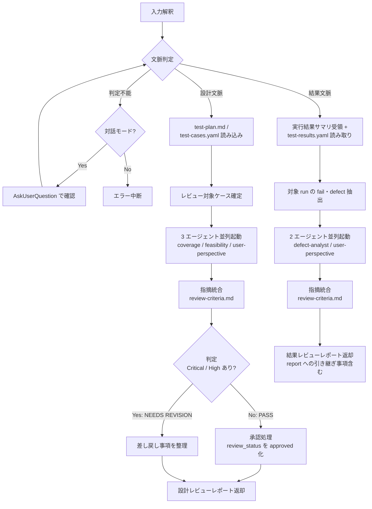

# test-review 詳細手順（文脈判定・エージェント起動・統合・判定）

`test-review` スキルの実行手順の詳細。SKILL.md の実行フローから参照される。
エージェントの選定・起動方式・プロンプト組み立て・共通注入事項は `${CLAUDE_PLUGIN_ROOT}/references/agents.md` が SSOT。
判定基準・統合規則は `${CLAUDE_SKILL_DIR}/references/review-criteria.md` を併読する。

---

## 1. 全体フロー

## 2. 文脈判定規則

上から順に評価し、最初に該当した規則で確定する。

| # | 判定材料 | 文脈 |
|---|---------|------|
| 1 | `context=design` / `context=results` の明示指定 | 指定どおり |
| 2 | `results=`（test-results.yaml パス）または実行結果サマリが入力に含まれる | 結果文脈 |
| 3 | `plan=` / `cases=`（または test-plan.md / test-cases.yaml のパス）のみが入力に含まれる | 設計文脈 |
| 4 | 依頼文言が「テスト結果・実行結果・NG・欠陥」のレビューを指す | 結果文脈 |
| 5 | 依頼文言が「テストケース・テスト計画・設計」のレビューを指す | 設計文脈 |
| 6 | 上記で確定しない（両方の材料が混在・いずれも欠落） | 対話: AskUserQuestion で確認 / 非対話: エラー中断（推測で進めない） |

## 3. 設計文脈の手順

### 3.1 入力読み込みと対象確定

1. `plan=` / `cases=`（省略時は `.claude/.local/plugins/deep-test/{target-slug}/` 直下）の test-plan.md / test-cases.yaml を Read する。存在しない場合はエラー中断（レビュー対象なしで進めない）
2. レビュー対象ケースを確定する:

| 条件 | 対象 |
|------|------|
| `scope=` 指定あり | 指定 ID のケース（`deprecated: true` は除外し警告） |
| `scope=` 指定なし | `review_status: draft` かつ `deprecated: true` でない全ケース |
| 対象が 0 件（全ケース approved 済み等） | エージェントを起動せず「レビュー対象の draft ケースなし」を返却する（再レビューが目的なら `scope=` の明示を案内） |

### 3.2 エージェント起動（3 並列）

coverage-reviewer / feasibility-reviewer / user-perspective-reviewer を **1 メッセージ内で並列起動**する（agents.md 1 章の文脈別構成・3 章の並列原則）。

プロンプトの組み立て（agents.md 4 章準拠）:

| 構成要素 | 内容 |
|---------|------|
| 共通入力（4.1 章） | 対象の説明と target-slug / test-plan.md・test-cases.yaml の**解決済み**パス / 読むべき共通 references の参照指示 |
| エージェント別追加入力（4.2 章） | coverage: 要件・仕様への参照と test-levels.md の確認観点参照指示 / feasibility: 実行環境情報（test-setup の検出結果。未受領なら「環境情報未提供」と明示して評価前提に含めさせる）と execution-policy.md 参照指示 / user-perspective: 業務シナリオ・ユーザー要件 |
| 共通注入事項（4.3 章） | 規定ブロックを**全エージェントに必ず**含める |
| 出力形式（4.4 章） | 指摘リスト（信頼度付き）・所見・未確認事項の構造を明記する |
| レビュー範囲 | レビュー対象ケース ID の一覧を明示し、対象外ケースへの指摘は範囲外と伝える |

### 3.3 統合と判定

1. 各エージェントの結果を要約して取り込む（agents.md 5 章。生の全文を保持し続けない）
2. review-criteria.md 3 章の統合規則で重複排除・ランキングする
3. review-criteria.md 2 章のゲート基準で PASS / NEEDS REVISION を判定する（エージェントの所見は意見として扱い、判定は統合後の指摘から本スキルが行う）

### 3.4 承認処理（PASS 時のみ）

1. レビュー対象とした draft ケース全件の `review_status` を `approved` へ Edit で更新する
2. `meta.updated_at` を現在時刻（`date` コマンドの ISO8601）へ更新する
3. **書き換え範囲の制約**: 上記 2 点以外（revision・updated_at〔ケース側〕・steps 等の内容フィールド・レビュー対象外のケース）には一切触れない
4. 更新後の整合確認: レビュー対象ケースに `review_status: draft` が残っていないことを Grep で確認する

- NEEDS REVISION 時は test-cases.yaml に**一切書き込まない**（draft のまま維持。`yaml-schema-cases.md` 3 章の遷移図のとおり、draft → approved の遷移は PASS のみ）

### 3.5 差し戻し事項の整理（NEEDS REVISION 時）

Critical / High 指摘を test-design が着手できる粒度の修正指示に変換する（対象ケース ID / 何をどう直すか / 根拠）。修正ループの実行・回数管理はオーケストレータの責務（`execution-policy.md` 1.1 章）のため、本スキルは差し戻し事項の提示までとする。

### 3.6 差し戻し再レビュー（2 巡目以降）

差し戻し（NEEDS REVISION → test-design 修正）後の再レビューは、初回と同じフル構成を既定としない。修正規模に応じて構成を選ぶ。

| 差し戻しの規模 | 再レビュー構成 |
|---------------|---------------|
| 通常（既定） | **指摘元エージェントのみ**を再起動し、指摘対応の充足（指摘どおり修正されたか・修正が新たな問題を生んでいないか）を確認する |
| 大規模変更（ケースの大半が更新・test-plan の方針変更を伴う） | 初回と同じフル 3 並列（3.2 章）で再実施する |
| 軽微（ケース追加・文言修正のみ） | エージェントを起動せず、本スキル本体による差分チェック（指摘リストと修正内容の突合）で代替してよい |

- 構成を簡略化した場合（指摘元のみ / 本体差分チェック）は、その旨と選択理由を判定記録・引き渡し（レポート）に必ず明記する
- 判定基準（review-criteria.md 2 章）・承認処理（3.4 章）は構成に関わらず同一に適用する

## 4. 結果文脈の手順

### 4.1 入力読み込みと対象確定

1. 実行結果サマリ（レベル別集計・fail 概要）を引数から受領する。未受領の場合は test-results.yaml から自ら要約する
2. `results=`（省略時は `{target-slug}/test-results.yaml`）を Read する（**読み取りのみ**。Edit / Write は禁止）
3. 対象 run を確定する: `run=` 指定があればその run、なければ最新 run（run_id 降順の先頭）
4. 対象 run の結果から以下を抽出・整理する:
   - fail 全件の defect 詳細（severity / reproduction_steps / test_data / evidence / extras）と results[] 直下の extras（measured_value / threshold 等・存在する場合。defect.extras とは別領域）、対応するケース定義（test-cases.yaml の steps / expected / data）
   - defect.evidence / results[].evidence のパス一覧（実在確認は Glob で行い、欠落はそのまま指摘材料にする）
   - blocked / skipped の件数と reason（未確認事項の材料）

### 4.2 エージェント起動（2 並列）

defect-analyst / user-perspective-reviewer を **1 メッセージ内で並列起動**する。

| 構成要素 | 内容 |
|---------|------|
| 共通入力（agents.md 4.1 章） | 対象の説明と target-slug / 解決済みパス / references 参照指示 |
| defect-analyst 追加入力（4.2 章） | fail 全件の defect 詳細 + results[] 直下の extras（test-results.yaml からの抜粋）/ エビデンスのパス一覧 / severity-policy.md の参照指示 |
| user-perspective-reviewer 追加入力（4.2 章） | 業務シナリオ・ユーザー要件 / 実行結果サマリ（レベル別集計・fail 概要） |
| 共通注入事項（4.3 章） | 規定ブロックを必ず含める |
| 出力形式（4.4 章） | 指摘リスト（信頼度付き）・所見・未確認事項 |

### 4.3 検証観点

| 観点 | 内容 |
|------|------|
| NG の原因分類 | fail ごとに分類する: アプリケーション欠陥 / テストケース不備（期待値誤り・手順誤り） / 環境起因 / テストデータ起因。分類に確信が持てない場合は候補を併記する |
| 再現手順完全性 | defect の 3 点セット（reproduction_steps / test_data / evidence）が `evidence-policy.md` 1 章の要件（環境情報・第三者再現可能な粒度・入力/期待/実際値・実在するエビデンス）を満たすか検証する |
| severity 妥当性 | 付与された severity を `severity-policy.md` の判定基準・レベル別補足へ照らして検証する。不適切な場合は補正案と根拠を作る（**実績には反映しない**。引き継ぎ事項として提案する） |
| ユーザー影響 | fail・skipped が業務・ユーザー体験に与える影響の評価（報告書の総合所見の材料） |

### 4.4 統合とレポート

1. review-criteria.md 3 章の統合規則で重複排除・ランキングする（結果文脈では PASS / NEEDS REVISION ゲートは適用しない。review-criteria.md 4 章）
2. report フェーズへの引き継ぎ事項を組み立てる: 報告書へ注記すべき事項（原因分類・ng-only 時の注意等）/ エビデンス補完の要否（欠落・不十分な defect）/ severity 補正案（対象 case_id・現行値 → 提案値・根拠）

## 5. エージェント結果の取り扱い（両文脈共通）

agents.md 5 章の運用を適用する: 要約して取り込む / 同一趣旨は 1 件に統合し出所を併記 / 矛盾は両論保持してユーザー判断材料にする / 信頼度を優先順位付けに使う / 未確認事項は必ずレポートへ転記する（黙殺・「問題なし」への書き換え禁止）。

## 6. レポートの組み立て

SKILL.md「引き渡し」の文脈別フォーマットに従う。共通の記載規則:

- 指摘一覧は重要度降順 → 信頼度降順で並べ、各指摘に 対象（ケース ID / 欠陥）・内容・根拠・重要度・信頼度・出所エージェント・推奨対応 を含める
- Low の指摘が多数の場合は要約列挙してよい（省略はしない）
- 参考指摘（信頼度が review-criteria.md の下限未満）は判定カウント外である旨を明示して別掲する
- 未確認事項は 0 件でも「なし」と明記する
