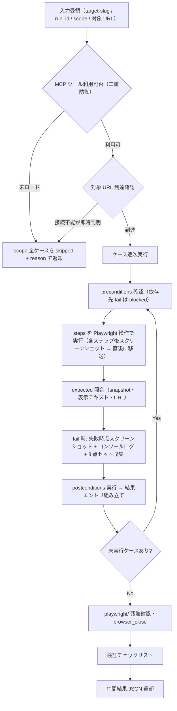

# test-run-functional スキル

単体テスト（`level: functional` / `TC-FUNC`）を、Playwright MCP によるブラウザ実操作機構で実施する実行スキル。
実アプリケーションの画面・機能単位の動作をユーザー操作レベルで確認し、ステップごとのエビデンスを収集してケース単位の中間結果 JSON を返却する（実績 YAML への書き込みは行わない）。

## 責務

| 責務 | 内容 |
|------|------|
| steps の操作対応付け | ケースの steps を Playwright 操作（browser_navigate / browser_click / browser_type / browser_snapshot 等）に対応付けて実行する |
| エビデンス収集・移送 | ステップごとに browser_take_screenshot（filename: `{case_id}_{NN}_{label}.png`）を取得し、**直後に** evidence ディレクトリへ移送する |
| expected の照合 | browser_snapshot のアクセシビリティツリー・表示テキスト・URL 遷移で期待結果と実際を照合する |
| defect 収集 | fail 時に失敗時点のスクリーンショット・browser_console_messages・実施した操作列から組み立てた再現手順（環境情報含む）をその場で収集する |
| 結果返却 | ケースごとの中間結果 JSON を組み立ててオーケストレータへ返却する |

## 責務外（他スキルが担当）

| 責務外 | 担当 |
|--------|------|
| functional 以外のテストレベルの実行 | `test-run-unit` / `test-run-integration` / `test-run-scenario` / `test-run-performance` / `test-run-security` |
| 実績 YAML（test-results.yaml）への書き込み | オーケストレータ `test`（results_manager.py 経由で一元実行） |
| 報告書生成 | `test-report` |
| Playwright MCP の登録・再起動ハンドオフ・環境構築 | `test-setup` |
| MCP ゲート判定（run 前の実利用可否判定） | オーケストレータ `test`（本スキルは二重防御としての確認のみ行う） |
| テストケースの設計・修正（test-cases.yaml の生成・更新） | `test-design` |
| 実行結果のレビュー・severity 妥当性の検証 | `test-review`（結果文脈） |
| run_id 採番・再テスト対象選択 | オーケストレータ `test` |

## トリガー条件

- オーケストレータ `test` の run フェーズから、scope に functional レベル（TC-FUNC）のケースを含む実行として Skill 経由で委譲された場合
- ユーザーが「単体テストレベル（画面・機能単位）のケースを実行して」等と直接依頼した場合（後述の実行モード判定に従う）

## 前提

- run_id がオーケストレータ側で採番済みであること（本スキルは採番しない）
- scope のケースが `review_status: approved` であること（承認済みケースゲートはオーケストレータで通過済み）
- MCP ゲート（Playwright MCP の実利用可否判定）をオーケストレータで通過済みであること（本スキルでも二重防御として確認する）
- 対象機能がテスト環境にデプロイ済みで、対象 URL・起動手段が入力として渡されていること
- 対象 URL は、test-environment（Phase 1.7）が生成する environment.yaml の `endpoints[]` 由来の base URL（テスト用派生環境）として受領する場合がある（受領形・実行手順は不変。出所の注記のみ。スキーマは `${CLAUDE_PLUGIN_ROOT}/references/yaml-schema-environment.md`）
- テストデータ・アカウントが準備済みであること（各ケースの preconditions で宣言）
- 本番環境ではないことが確認済みであること（本番実行は既定で禁止。execution-policy.md）

## 実行モード判定

| 入力 | 起動形態 | 動作 |
|------|---------|------|
| オーケストレータから Skill 委譲（target-slug / run_id / 対象ケースリスト / 対象アプリ情報〔URL 等〕を受領） | 委譲（標準） | 非対話で scope 全ケースを実行し、中間結果 JSON を返却する |
| ユーザー直接起動で必須入力（target-slug / run_id / 対象ケース / 対象 URL）が欠落 | 単独 | 実行せず、`/deep-test:test`（run-only モード等）経由の起動を案内する。run_id 採番・実績記録はオーケストレータの責務のため、単独実行では実績が記録されない旨を伝える |

- ケース定義本体が引数で渡されない場合は、`.claude/.local/plugins/deep-test/{target-slug}/test-cases.yaml` から該当ケースを Read で参照する（読み取りのみ）
- `automation: manual-assist` / `exploratory` のケース: 対話時はユーザーに手動確認を依頼し `executed_by: human-assisted` で記録する（提示 3 要素・聴取・エビデンス受領・記録規約は `${CLAUDE_PLUGIN_ROOT}/references/manual-execution.md` に従う）。非対話時は skipped + reason（非対話既定値表は execution-policy.md。オーケストレータから `manual-sheet=` で手順書パスを受領した場合は reason に含める）
- `automation: playwright-test` のケース: fixtures.yaml と SUT テストコード（`test_root` 配下の `.spec.ts` / `playwright.config.ts`）を前提に `npx playwright test`（Bash 実行）で実走し、pass / fail と JUnit / レポートをエビデンス化して `executed_by: playwright-test` で記録する。Playwright・ランナー未導入または fixtures.yaml 不在時は実行を偽装せず skipped + reason（手順は `${CLAUDE_SKILL_DIR}/references/functional-execution.md` 7 章・SKIPPED 規範は execution-policy.md / playwright-test.md）。既存の MCP（`automation: playwright`）・manual-assist 経路は不変

## 実行フロー



### 1. 入力確認
target-slug / run_id / 対象ケースリスト（functional）/ 対象アプリ情報（URL 等）を受領する。

### 2. MCP 二重防御
初回ブラウザ操作前に `mcp__playwright__*` ツールの実利用可否を確認する。未ロード・呼び出し不能の場合は実行を偽装せず scope 全ケースを skipped + reason で返却する（オーケストレータの MCP ゲートで通常は事前遮断されるが、run 中の喪失・直接起動に備える）。

### 3. 対象到達確認
browser_navigate で対象 URL へ遷移する。接続不能が即時判明した場合は skipped、応答なしのままタイムアウトした場合は blocked（分岐表は `${CLAUDE_SKILL_DIR}/references/functional-execution.md` 5 章）。

### 4. ケース逐次実行（共通手順）
preconditions 確認（`depends_on` の依存先が同一 run 内で fail / blocked なら当該ケースを blocked） → steps を Playwright 操作に対応付けて実行（対応表は functional-execution.md 1 章）。各ステップ後に browser_take_screenshot（filename: `{case_id}_{NN}_{label}.png`）を取得し、**直後に** `.claude/.local/plugins/deep-test/{target-slug}/evidence/{run_id}/{case_id}/` へ移送する → expected と実際の照合（functional-execution.md 2 章） → postconditions 実行（復元失敗は隠蔽せず記録） → 結果エントリ組み立て。

### 5. fail 時
失敗時点のスクリーンショット・browser_snapshot・browser_console_messages を保存し、実施した操作列から再現手順（環境情報を先頭に付す）を組み立て、severity を判定する（functional-execution.md 4 章）。

### 6. タイムアウト
ケースタイムアウト（既定 120 秒・`timeout_sec` で上書き可）超過は blocked + reason（経過時間・最後に完了したステップ）として記録し、次ケースへ進む。

### 7. 後片付け
`playwright/`（raw 出力先）の残骸を確認し、browser_close でページを閉じる。

### 8. 返却
検証チェックリストを通過後、中間結果 JSON を返却する。

### playwright-test 実走経路（automation: playwright-test）
上記 1〜8 は Playwright MCP 経路（`automation: playwright`）の手順である。`automation: playwright-test` のケースは、MCP のその場操作ではなく fixtures.yaml + SUT テストコードを前提に `npx playwright test` で実走する。実行手順・エビデンス化・SKIPPED 判定は `${CLAUDE_SKILL_DIR}/references/functional-execution.md` 7 章（playwright-test 実走経路）に従う。既存の MCP・manual-assist 経路と併存し、置き換えない。

## 検証（チェックリスト）

中間結果 JSON の返却前に以下を確認する。未達項目は解消してから返却する。

```
[ ] scope 全ケースについて 1 エントリずつ結果を返している（欠落なし。finish-run 突合の前提）
[ ] fail 全件に defect 3 点セット（reproduction_steps / test_data / evidence）と severity がある
[ ] fail の evidence に失敗時点のスクリーンショットとコンソールログが含まれる
[ ] blocked / skipped / na 全件に reason がある
[ ] エビデンスをステップ直後に移送済みで、playwright/（raw 出力先）に残骸がない
[ ] evidence のパスが実在するファイルを指している（{target-slug}/ 直下基準の相対パス）
[ ] priority: high の pass ケースにもエビデンス（主要ステップのスクリーンショット）がある
[ ] executed_by（playwright-mcp）・case_revision を全エントリに記録している
[ ] 実行していない操作を実行済みとして報告していない（偽装禁止）
[ ] test-results.yaml を Edit / Write していない
```

## 引き渡し（中間結果 JSON 返却）

最終応答に、execution-policy.md 4 章の中間結果返却フォーマットに従う JSON を 1 つのコードブロックで含めて返す。オーケストレータがこれを results_manager.py record の入力として 1 件ずつ記録する。

```json
{
  "skill": "test-run-functional",
  "run_id": "<受領した run_id をそのまま設定>",
  "results": []
}
```

- `results[]` は 1 ケース 1 エントリ。フィールド定義・必須制約は execution-policy.md 4 章および yaml-schema-results.md を正とする（本書では複製しない）
- `executed_by` は `playwright-mcp`（`automation: playwright-test` のケースを `npx playwright test` で実走した場合は `playwright-test`・manual-assist ケースを人手確認した場合のみ `human-assisted`）

## 重要な制約

- **test-results.yaml への書き込み禁止**（Edit / Write とも）。結果は返却のみとし、記録はオーケストレータが一元実行する
- run_id を採番しない（受領値をそのまま返す）
- MCP ツール不可時に実行を偽装しない（skipped + reason。「未実施」を「問題なし」と書かない）
- scope 全件について必ず 1 エントリを返す（実行不能でも skipped / blocked として返す）
- エビデンス移送は**ステップ実行直後**に行う（後回しにして raw 出力先に滞留させない）
- browser_take_screenshot は必ず filename を指定する（未指定の自動命名は禁止。playwright-mcp.md）
- 固定時間スリープではなく browser_wait_for による条件待機を優先する
- 本番環境への実行は既定で禁止（破壊的操作を含むケースは設計時に明示され、承認ゲートで確認済みであることを前提とする）
- 対象アプリケーションのソースコード・データベースを直接修正しない（確認はブラウザ操作経由で行う）

## 参照

| 参照先 | 内容 |
|-------|------|
| `${CLAUDE_PLUGIN_ROOT}/references/common-references.md` | worker スキル共通参照の集約インデックス（実行時の共通規範一式はここから到達する） |
| `${CLAUDE_SKILL_DIR}/references/functional-execution.md` | steps と Playwright 操作の対応表・照合方法・エビデンス取得/移送手順・status 分岐・playwright-test 実走経路（本スキル固有） |
| `${CLAUDE_PLUGIN_ROOT}/references/playwright-test.md` | `npx playwright test` + fixtures.yaml の実行規約（`automation: playwright-test` 経路。既定の MCP 経路と併存） |

> **正本ツールリストとの同期（同期義務）**: frontmatter の allowed-tools に列挙した `mcp__playwright__browser_*` ツールは、`${CLAUDE_PLUGIN_ROOT}/references/playwright-mcp.md` 5 章（正本ツールリスト）から同期している。正本リストの改訂時は本スキルの frontmatter へ必ず反映すること。Playwright MCP が `playwright` 以外の名前で登録されている場合のプレフィクス読み替えは同 2 章に従う。
