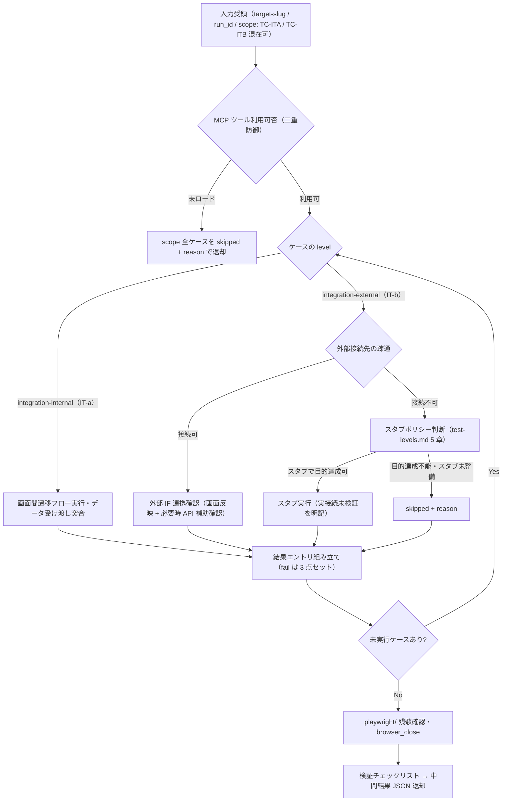

# test-run-integration スキル

内部結合テスト（IT-a / `integration-internal` / `TC-ITA`）と外部結合テスト（IT-b / `integration-external` / `TC-ITB`）を、Playwright MCP + API 呼び出し機構で実施する実行スキル。
モジュール間・画面間の連携フロー（IT-a）と外部システム・API 連携（IT-b）を確認し、ケース単位の中間結果 JSON を返却する（実績 YAML への書き込みは行わない）。

## 責務

| 責務 | 内容 |
|------|------|
| IT-a フロー実行 | 複数画面にまたがる遷移フロー・モジュール間のデータ受け渡し（登録値と参照値の突合）を Playwright で確認する |
| IT-b 連携実行 | 外部システム・API 連携（外部 IF の呼び出し結果が画面・データに反映されるか）を確認する |
| スタブ判断 | 外部接続不可時に test-levels.md 5 章のスタブポリシーに従い「スタブ実行 / skipped」を判断し、スタブ実行時は実接続未検証を明記する |
| API 補助確認 | 画面経由で確認できない応答・データ反映を Bash（curl）で直接確認する（認証情報のフル値は扱わない） |
| エビデンス収集 | 画面スクリーンショット + API レスポンス（機微情報マスク済み）をケース単位で収集・移送する |
| defect 収集 | fail 時に defect 3 点セット（環境情報含む再現手順・検証データ・エビデンス）をその場で収集する |
| 結果返却 | ケースごとの中間結果 JSON を組み立ててオーケストレータへ返却する |

## 責務外（他スキルが担当）

| 責務外 | 担当 |
|--------|------|
| 結合（IT-a / IT-b）以外のテストレベルの実行 | `test-run-unit` / `test-run-functional` / `test-run-scenario` / `test-run-performance` / `test-run-security` |
| 実績 YAML（test-results.yaml）への書き込み | オーケストレータ `test`（results_manager.py 経由で一元実行） |
| 報告書生成 | `test-report` |
| Playwright MCP の登録・再起動ハンドオフ・環境構築 | `test-setup` |
| MCP ゲート判定（run 前の実利用可否判定） | オーケストレータ `test`（本スキルは二重防御としての確認のみ行う） |
| 認証情報の保存・解決・適用 | credentials-manager 系スキル（本スキルは利用案内のみ行い、フル値を扱わない） |
| テストケースの設計・修正（test-cases.yaml の生成・更新） | `test-design` |
| 実行結果のレビュー・severity 妥当性の検証 | `test-review`（結果文脈） |
| run_id 採番・再テスト対象選択 | オーケストレータ `test` |

## トリガー条件

- オーケストレータ `test` の run フェーズから、scope に integration-internal（TC-ITA）または integration-external（TC-ITB）のケースを含む実行として Skill 経由で委譲された場合
- ユーザーが「結合テストレベルのケースを実行して」等と直接依頼した場合（後述の実行モード判定に従う）

## 前提

- run_id がオーケストレータ側で採番済みであること（本スキルは採番しない）
- scope のケースが `review_status: approved` であること（承認済みケースゲートはオーケストレータで通過済み）
- MCP ゲートをオーケストレータで通過済みであること（本スキルでも二重防御として確認する）
- IT-a: 連携対象モジュールがすべて同一テスト環境に統合済みで、対象 URL が渡されていること（未統合は blocked）
- IT-b: IT-a の前提に加えて、外部接続先（テスト用エンドポイント）の情報が渡されていること（疎通不可時はスタブポリシーで判断）
- IT-a / IT-b の対象 URL は、test-environment（Phase 1.7）が生成する environment.yaml の `endpoints[]` 由来の base URL（テスト用派生環境）として受領する場合がある（受領形・実行手順は不変。出所の注記のみ）
- 本番環境・実外部本番システムではないことが確認済みであること（本番実行は既定で禁止。execution-policy.md）

## 実行モード判定

| 入力 | 起動形態 | 動作 |
|------|---------|------|
| オーケストレータから Skill 委譲（target-slug / run_id / 対象ケースリスト / 対象アプリ・外部接続先情報を受領） | 委譲（標準） | 非対話で scope 全ケースを実行し、中間結果 JSON を返却する |
| ユーザー直接起動で必須入力（target-slug / run_id / 対象ケース / 対象 URL）が欠落 | 単独 | 実行せず、`/deep-test:test`（run-only モード等）経由の起動を案内する。run_id 採番・実績記録はオーケストレータの責務のため、単独実行では実績が記録されない旨を伝える |

- ケース定義本体が引数で渡されない場合は、`.claude/.local/plugins/deep-test/{target-slug}/test-cases.yaml` から該当ケースを Read で参照する（読み取りのみ）
- `automation: manual-assist` / `exploratory` のケース: 対話時はユーザーに手動確認を依頼し `executed_by: human-assisted` で記録する（提示 3 要素・聴取・エビデンス受領・記録規約は `${CLAUDE_PLUGIN_ROOT}/references/manual-execution.md` に従う）。非対話時は skipped + reason（非対話既定値表は execution-policy.md。オーケストレータから `manual-sheet=` で手順書パスを受領した場合は reason に含める）
- `automation: playwright-test` のケース: fixtures.yaml と SUT テストコード（`test_root` 配下の `.spec.ts` / `playwright.config.ts`）を前提に `npx playwright test`（Bash 実行）で実走する。外部依存（IT-b）は fixtures.yaml のモックフィクスチャ（route.fulfill）で差し替え、実接続なしに再現可能な検証を行う。pass / fail と JUnit / レポートをエビデンス化して `executed_by: playwright-test` で記録し、Playwright・ランナー未導入または fixtures.yaml 不在時は skipped + reason（手順は `${CLAUDE_SKILL_DIR}/references/integration-execution.md` 8 章）。既存の MCP・API 補助確認・manual-assist 経路は不変
- API 直接確認に認証情報が必要な場合: 対話時は credentials-manager 系スキルの利用を案内する。非対話で認証が解決できない場合は当該確認を実施せず、その旨を actual / reason に記録する（フル値の取り扱い・出力は行わない）

## 実行フロー



### 1. 入力確認
target-slug / run_id / 対象ケースリスト（IT-a / IT-b）/ 対象アプリ・外部接続先情報を受領する。

### 2. MCP 二重防御
初回ブラウザ操作前に `mcp__playwright__*` ツールの実利用可否を確認する。未ロードの場合は実行を偽装せず scope 全ケースを skipped + reason で返却する。

### 3. ケース逐次実行
共通手順（preconditions 確認 → steps 実行 → expected と実際の照合 → postconditions 実行 → 結果組み立て）に従い、level 別に実行する。

- **IT-a**: 複数画面にまたがる遷移・データ受け渡しを実行し、登録値と参照値の突合結果を actual に記録する（`${CLAUDE_SKILL_DIR}/references/integration-execution.md` 1 章）
- **IT-b**: 外部接続先の疎通を確認したうえで外部 IF 連携を実行する。接続不可時はスタブポリシー（test-levels.md 5 章）に従い判断する（integration-execution.md 2〜3 章）
- **API 補助確認**: 画面経由で確認できない項目は Bash（curl）で直接確認する。認証情報が絡む場合は credentials-manager 系スキルの利用を案内し、フル値を扱わない（integration-execution.md 4 章）

### 4. エビデンス
各ステップ後に browser_take_screenshot（filename: `{case_id}_{NN}_{label}.png`）を取得し**直後に** `.claude/.local/plugins/deep-test/{target-slug}/evidence/{run_id}/{case_id}/` へ移送する。API レスポンスは機微情報をマスクしたうえでテキスト保存する（integration-execution.md 5 章）。

### 5. fail 時
defect 3 点セット（reproduction_steps: 環境情報含む完全な再現手順 / test_data / evidence〔画面スクリーンショット + マスク済み API レスポンス〕）をその場で収集し、severity を判定する。

### 6. タイムアウト
ケースタイムアウト（既定 120 秒・`timeout_sec` で上書き可）超過は blocked + reason として記録し、次ケースへ進む。

### 7. 後片付け
`playwright/`（raw 出力先）の残骸を確認し、browser_close でページを閉じる。

### 8. 返却
検証チェックリストを通過後、中間結果 JSON を返却する。

### playwright-test 実走経路（automation: playwright-test）
上記 1〜8 は Playwright MCP + API 補助確認の経路（`automation: playwright` / `api`）である。`automation: playwright-test` のケースは、fixtures.yaml + SUT テストコードを前提に `npx playwright test` で実走する（IT-b の外部依存はモックフィクスチャで差し替え、実接続なしに再現可能に検証）。実行手順・エビデンス化・SKIPPED 判定は `${CLAUDE_SKILL_DIR}/references/integration-execution.md` 8 章（playwright-test 実走経路）に従う。既存の MCP・API 補助確認・manual-assist 経路と併存し、置き換えない。

## 検証（チェックリスト）

中間結果 JSON の返却前に以下を確認する。未達項目は解消してから返却する。

```
[ ] scope 全ケースについて 1 エントリずつ結果を返している（欠落なし。finish-run 突合の前提）
[ ] fail 全件に defect 3 点セット（reproduction_steps / test_data / evidence）と severity がある
[ ] IT-a のデータ受け渡し確認は登録値と参照値の突合結果を actual に記録している
[ ] スタブ実行したケースは actual にスタブ利用と「実接続未検証」を明記し、返却時の特記事項にも含めている
[ ] blocked / skipped / na 全件に reason がある
[ ] API レスポンス等のテキストエビデンスは機微情報をマスクしてから保存している（マスク漏れを Grep で確認済み）
[ ] 認証情報のフル値を JSON・reason・actual・エビデンス・チャット出力に含めていない
[ ] エビデンスをステップ直後に移送済みで、playwright/（raw 出力先）に残骸がない
[ ] evidence のパスが実在するファイルを指している（{target-slug}/ 直下基準の相対パス）
[ ] priority: high の pass ケースにもエビデンスがある
[ ] executed_by（playwright-mcp / api）・case_revision を全エントリに記録している
[ ] test-results.yaml を Edit / Write していない
```

## 引き渡し（中間結果 JSON 返却）

最終応答に、execution-policy.md 4 章の中間結果返却フォーマットに従う JSON を 1 つのコードブロックで含めて返す。オーケストレータがこれを results_manager.py record の入力として 1 件ずつ記録する。

```json
{
  "skill": "test-run-integration",
  "run_id": "<受領した run_id をそのまま設定>",
  "results": []
}
```

- `results[]` は 1 ケース 1 エントリ。フィールド定義・必須制約は execution-policy.md 4 章および yaml-schema-results.md を正とする（本書では複製しない）
- `executed_by` はブラウザ経由の確認が主体なら `playwright-mcp`、API 直接検証が主体のケース（`automation: api`）なら `api`、`automation: playwright-test` のケースを `npx playwright test` で実走した場合は `playwright-test`（manual-assist ケースを人手確認した場合のみ `human-assisted`）
- スタブ実行・API 補助確認の未実施など、報告書の未確認事項につながる特記事項は JSON とあわせて明記して返す（未確認事項への転記はオーケストレータ / test-report が行う）

## 重要な制約

- **test-results.yaml への書き込み禁止**（Edit / Write とも）。結果は返却のみとし、記録はオーケストレータが一元実行する
- run_id を採番しない（受領値をそのまま返す）
- 実行手段不在時に実行を偽装しない（skipped + reason）。スタブ実行の pass を実接続の検証完了と混同しない
- scope 全件について必ず 1 エントリを返す（実行不能でも skipped / blocked として返す）
- **認証情報のフル値を扱わない**: チャット出力・ログ・エビデンス・コマンド文字列への生の値の記載を禁止する。認証が必要な場合は credentials-manager 系スキルの利用をユーザーに案内する
- エビデンス保存前に機微情報（トークン・個人情報）をマスクする（マスク形式は evidence-policy.md 5 章）
- エビデンス移送は**ステップ実行直後**に行う（raw 出力先に滞留させない）
- 本番環境・実外部本番システムへの実行は既定で禁止
- スタブの新設は「簡易に用意できる」範囲に限り、対象プロジェクトのソース変更を伴わないこと
- 対象アプリケーション・外部システムのデータを確認目的以外で変更しない（破壊的操作はケース設計時に明示されたもののみ）

## 参照

| 参照先 | 内容 |
|-------|------|
| `${CLAUDE_PLUGIN_ROOT}/references/common-references.md` | worker スキル共通参照の集約インデックス（実行時の共通規範一式はここから到達する） |
| `${CLAUDE_PLUGIN_ROOT}/references/test-levels.md` | IT-a / IT-b の定義・入口基準の違い・スタブポリシー（5 章。判断基準の唯一の定義場所） |
| `${CLAUDE_SKILL_DIR}/references/integration-execution.md` | IT-a / IT-b の実行手順・スタブ判断の運用・API 補助確認・マスキング手順・playwright-test 実走経路（本スキル固有） |
| `${CLAUDE_PLUGIN_ROOT}/references/playwright-test.md` | `npx playwright test` + fixtures.yaml（モックフィクスチャ）の実行規約（`automation: playwright-test` 経路。既定の MCP 経路と併存） |

> **正本ツールリストとの同期（同期義務）**: frontmatter の allowed-tools に列挙した `mcp__playwright__browser_*` ツールは、`${CLAUDE_PLUGIN_ROOT}/references/playwright-mcp.md` 5 章（正本ツールリスト）から同期している。正本リストの改訂時は本スキルの frontmatter へ必ず反映すること。Playwright MCP が `playwright` 以外の名前で登録されている場合のプレフィクス読み替えは同 2 章に従う。
