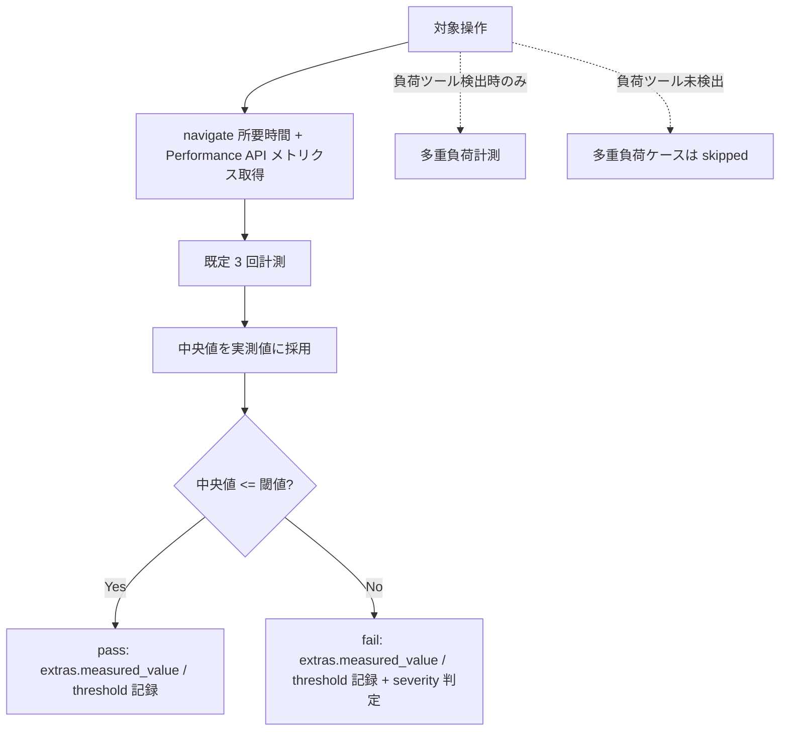

# test-run-performance スキル

性能テスト（`performance` / TC-PERF）のケースを、Playwright のタイミング計測で実行する実行スキル。
単一セッション応答時間の複数回計測（既定 3 回・中央値採用）と閾値判定を第一線とし、外部負荷ツール検出時のみ多重負荷を条件付き実行する。結果は中間データとしてオーケストレータ `test` に返却する。

## このドキュメントについて

このファイルは **人間向けのリファレンス** です。Claude Code がスキル動作中に参照することはありません。
スキルが実行時に参照するのは `SKILL.md` と `references/` 配下、および `${CLAUDE_PLUGIN_ROOT}/references/` の共通 SSOT です。

## 導入手順

本スキル `test-run-performance` は `deep-test` プラグインに同梱されており、**追加インストールは不要**です。プラグインの導入手順（マーケットプレイス登録・インストール・自動更新の設定）は [`deep-test` プラグインの README](../../README.md) を参照してください。

- **起動トリガー**: オーケストレータ `test` の run フェーズから scope に performance レベルのケースが含まれる場合に委譲される。必須入力（target-slug／run_id／ケースリスト／アプリ情報）が揃わない直接依頼時は実行せずオーケストレータ経由を案内する

## 担当テストレベル

| テストレベル | level 値 | ケース ID | 実行アプローチ |
|------------|---------|----------|--------------|
| 性能テスト | `performance` | TC-PERF | Playwright タイミング計測（第一線）+ 条件付き外部負荷 |

## 計測アプローチ



- 取得メトリクス: TTFB・DOMContentLoaded・load・LCP・サーバ応答時間（`browser_evaluate` で Navigation Timing / Performance API を読む）
- 実測値は**中央値**を採用（環境の負荷変動による外れ値の影響を抑える）
- severity は閾値超過率バンド（`${CLAUDE_PLUGIN_ROOT}/references/severity-policy.md` 4.1）で判定

## スコープ境界（重要）

- **第一線**: 単一セッション応答時間計測（常時実行）
- **条件付き**: 多重同時負荷・スループット計測は k6 / ab / Locust 等を検出した場合のみ実行
- **対象外**: 専用負荷試験（キャパシティプランニング・ソーク・スパイク）の代替ではない（`${CLAUDE_PLUGIN_ROOT}/references/test-levels.md` 7 章）

負荷ツール未検出時に多重負荷ケースを skipped とし、単一セッション計測は必ず実施します。

## 位置付け（デリゲーション）

- 本スキルは **実行と結果返却のみ**を担い、`test-results.yaml` への書き込みは行わない（オーケストレータが一元実行）
- 実行スキルはブラウザセッション共有のため逐次起動が前提

## 使い方

### トリガーフレーズ例（通常はオーケストレータ経由）

```
性能テストを実行して
主要画面の応答時間を計測して閾値判定して
負荷ツールがあれば多重負荷も見て
```

## カスタマイズ・拡張

| 拡張対象 | 方法 |
|---------|------|
| 計測手順・中央値算出・閾値判定の変更 | `references/performance-execution.md`（1〜3 章）を更新する |
| 負荷ツールの追加・多重負荷手順の変更 | `references/performance-execution.md` 4 章（条件付き多重負荷）を更新する（「専用負荷試験の代替ではない」スコープ境界は維持する） |
| 動作分岐の検証ケース追加 | `evals/` に `case-NN_<slug>.md` を追加し、`evals/README.md` の一覧表を更新する |

## ファイル構成

```
plugins/deep-test/skills/test-run-performance/
├── SKILL.md                          # Claude が実行時に読むスキル定義
├── README.md                         # 本ファイル（人間向け）
├── references/
│   └── performance-execution.md      # 計測手順・メトリクス取得コード例・中央値算出・負荷ツール検出・閾値判定・達成チェックリスト
└── evals/                            # 動作分岐検証ケース（case-01〜10 + README・10 ケース）
```

## スコープ外

- unit / functional / integration / system / uat / security レベルの実行（各 `test-run-*` が担当）
- `test-results.yaml` の更新・報告書生成（オーケストレータ / `test-report`）
- 専用負荷試験の代替（対象外）

## 関連スキル

- `test`（オーケストレータ） — ライフサイクル制御・実績記録・ゲート判定
- `test-run-functional` / `test-run-scenario` — 機能・シナリオレベルの Playwright 実行
- `test-report` — 実績 YAML からの報告書生成
