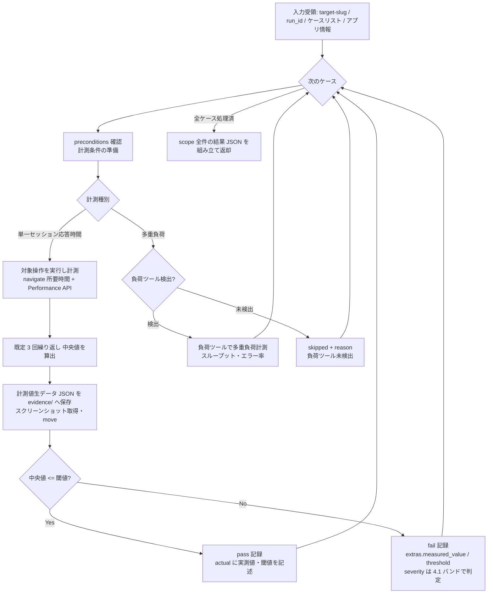

# test-run-performance スキル

性能テスト（`performance` / TC-PERF）のケースを、Playwright のタイミング計測で実行する実行スキル。
単一セッション応答時間の複数回計測（既定 3 回・中央値採用）と閾値判定を第一線とし、外部負荷ツール検出時のみ多重負荷を条件付き実行する。結果は中間データとしてオーケストレータ `test` に返却する（`test-results.yaml` への書き込みは行わない）。

## 責務

| 責務 | 内容 |
|------|------|
| 応答時間計測 | scope の performance レベルのケースについて、対象操作の**単一セッション応答時間**を計測する（`browser_navigate` の所要時間 + `browser_evaluate` による Navigation Timing API / Performance API メトリクス: TTFB・DOMContentLoaded・load・LCP 等） |
| 複数回計測・中央値採用 | 同一計測を**既定 3 回**繰り返し、**中央値**を実測値として採用する（`${CLAUDE_SKILL_DIR}/references/performance-execution.md`） |
| 閾値判定 | ケースの expected が持つ閾値（例: 3 秒以内）と実測値を比較し pass / fail を判定する |
| defect 記録 | fail 時に `defect.extras.measured_value` / `defect.extras.threshold` を記録し、severity を `${CLAUDE_PLUGIN_ROOT}/references/severity-policy.md` 4.1（閾値超過率バンド）で判定する |
| 条件付き多重負荷 | 多重負荷は k6 / ab / Locust 等を Bash で検出した場合のみ実行し、未検出なら該当ケースを `skipped` + reason で返す（偽装しない） |
| エビデンス収集 | 計測値の生データ（JSON）・スクリーンショットをエビデンスとして収集・移送する |

## 責務外（他スキルが担当）

| 責務外の事項 | 担当 |
|------------|------|
| unit / functional / integration / system / uat / security の各レベル実行 | 各 `test-run-*` スキル |
| `test-results.yaml` への書き込み・latest 更新 | オーケストレータ `test`（`results_manager.py` 経由） |
| **専用負荷試験（キャパシティプランニング・ソーク・スパイク等）の代替** | 対象外。本スキルは実施しない（`${CLAUDE_PLUGIN_ROOT}/references/test-levels.md` 7 章。報告書に免責記載） |
| 報告書の生成 | `test-report` |
| ケース設計・閾値の定義 | `test-design` / `test-review` |
| MCP ゲート・人間承認ゲートの判定 | オーケストレータ `test`（`${CLAUDE_PLUGIN_ROOT}/references/execution-policy.md`） |

## トリガー条件

- オーケストレータ `test` の run フェーズから Skill ツール経由で performance レベルの実行を委譲された場合
- 「性能テストを実行して」「応答時間を計測して閾値判定して」と指示された場合（単独起動時は実行モード判定を参照）

## 前提

- Playwright MCP が現セッションでロード済み（MCP ゲートはオーケストレータが通過済み。未ロード検出時は偽装せず skipped で返却する）
- 入力として `target-slug` / `run_id` / 対象ケースリスト / 対象アプリ情報（URL 等）を受領していること
- 各 performance ケースの expected / `data` に計測対象と閾値が定義されていること（`${CLAUDE_PLUGIN_ROOT}/references/test-levels.md` 4.7 入口基準）
- 対象機能が機能レベルで安定動作していること（計測条件は preconditions で宣言済み）
- 共通参照は `${CLAUDE_PLUGIN_ROOT}/references/common-references.md` に集約（本スキルは実行時セクション 3.3 を参照）

## 実行モード判定

| 入力 | 起動形態 | 動作 |
|-----|---------|------|
| オーケストレータから委譲（引数が確定） | 委譲（既定） | 非対話で応答時間計測を実行し、中間結果 JSON を返却する |
| ユーザーが直接起動（引数不足） | 単独 | オーケストレータ `test` 経由での実行を案内する（実績記録・ゲート判定を伴うため単独完結しない） |

計測種別の分岐（各 performance ケースの計測目的で自動分岐）:

| 計測種別 | 実行条件 | 未充足時 |
|---------|---------|---------|
| 単一セッション応答時間（第一線） | 常時実行 | — |
| 多重同時負荷・スループット（条件付き） | k6 / ab / Locust 等の外部負荷ツールを Bash で検出した場合のみ | 該当ケースを `skipped` + reason（負荷ツール未検出）。単一セッション計測は実施する |

- `automation: manual-assist` のケース: 対話時はユーザーに手動確認を依頼し結果を `executed_by: human-assisted` で記録する。非対話時は skipped + reason 記録（`execution-policy.md` 9 章）

## 実行フロー

- メトリクス取得コード（`browser_evaluate` で実行する JavaScript）・複数回計測と中央値の算出・負荷ツール検出コマンド・閾値判定は `${CLAUDE_SKILL_DIR}/references/performance-execution.md` を参照
- ケースタイムアウト（既定 120 秒）超過・応答不能は当該ケースを blocked + reason で記録し次ケースへ進む（応答不能を性能 fail とするか blocked とするかの判断は performance-execution.md 参照）

## 検証（チェックリスト）

中間結果 JSON を返却する前に、`${CLAUDE_SKILL_DIR}/references/performance-execution.md` の達成チェックリストを通過すること。要点:

- 単一セッション応答時間を既定 3 回計測し、中央値を実測値として採用している
- 閾値と実測値を比較して pass / fail を判定している
- fail に `extras.measured_value` / `extras.threshold` を記録し、severity を `severity-policy.md` 4.1 のバンドで判定している
- 負荷ツール未検出時に多重負荷ケースを `skipped` + reason で返し、「多重負荷・スループット計測は専用負荷試験の代替ではない」旨と整合している
- 計測値の生データ（JSON）をエビデンスに含めている
- scope の全ケースについて 1 エントリを返している
- `test-results.yaml` を直接編集していない（返却のみ）

## 引き渡し（中間結果 JSON 返却）

最終応答に、`${CLAUDE_PLUGIN_ROOT}/references/execution-policy.md` 4 章の中間結果返却フォーマットに準拠した JSON を 1 つのコードブロックで含めて返す。スキーマ SSOT は `${CLAUDE_PLUGIN_ROOT}/references/yaml-schema-results.md`。

本スキル固有の埋め方（フォーマット自体は複製しない）:

- `executed_by`: `playwright-mcp`（応答時間計測）。多重負荷を外部ツールで実施した場合の記録方法は performance-execution.md 参照
- `actual`: 実測値（中央値）・計測回数・閾値・判定結果を記述する
- `defect.extras.measured_value`: 実測値（中央値、単位を明記）
- `defect.extras.threshold`: ケースの閾値
- `duration_sec`: 計測に要した時間（応答時間の実測値そのものではない点に注意）
- 多重負荷ケース未実施: `status: skipped` + `reason`（負荷ツール未検出）

## 重要な制約

- `test-results.yaml` への書き込み・Edit / Write を行わない（返却のみ）
- **多重負荷・スループット計測は専用負荷試験（キャパシティプランニング・ソーク・スパイク）の代替ではない**（`test-levels.md` 7 章）。負荷ツール未検出時に多重負荷を「実施済み」と扱わない
- Playwright MCP 未ロード検出時は偽装せず skipped + reason で返却する（`execution-policy.md` 条件付き動的検証）
- 実行環境の負荷変動により計測がぶれるため、複数回計測（既定 3 回）と中央値採用を省略しない
- エビデンス（計測値生データ・スクリーンショット）はステップ直後に `evidence/{run_id}/{case_id}/` へ move する（`data-locations.md` 5 章）
- 実行スキルは逐次起動が前提。他実行スキルと並列起動しない（`execution-policy.md` 3 章）

## 参照

| 参照先 | 内容 |
|-------|------|
| `${CLAUDE_PLUGIN_ROOT}/references/common-references.md` | worker スキル共通参照の集約インデックス（実行時の共通規範一式はここから到達する） |
| `${CLAUDE_SKILL_DIR}/references/performance-execution.md` | 計測手順・メトリクス取得コード例・複数回計測と中央値・負荷ツール検出・閾値判定・達成チェックリスト（本スキル固有） |

> **正本ツールリストとの同期（同期義務）**: frontmatter の allowed-tools に列挙した `mcp__playwright__browser_*` ツールは、`${CLAUDE_PLUGIN_ROOT}/references/playwright-mcp.md` 5 章（正本ツールリスト）から同期している。正本リストの改訂時は本スキルの frontmatter へ必ず反映すること。Playwright MCP が `playwright` 以外の名前で登録されている場合のプレフィクス読み替えは同 2 章に従う。
