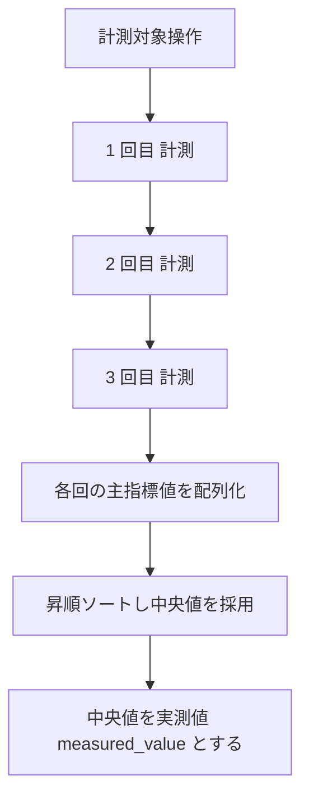

# 性能計測手順（test-run-performance 固有）

`test-run-performance` が単一セッション応答時間計測と条件付き多重負荷を実行する際の固有手順。
実行共通規範・エビデンス要件・データ配置・severity 判定・中間結果フォーマットは重複記載せず、`${CLAUDE_PLUGIN_ROOT}/references/` の各 SSOT を参照する（本ファイルは性能計測特有のフローと算出のみを扱う）。

---

## 1. 計測の第一線: 単一セッション応答時間

性能ケースの計測対象は「対象操作 1 回あたりの応答時間」である。以下 2 系統の値を取得する。

| 系統 | 取得方法 | 主な用途 |
|------|---------|---------|
| 操作所要時間 | `browser_navigate` / 操作前後の経過時間 | 画面遷移・操作応答の体感時間 |
| ブラウザ内部メトリクス | `browser_evaluate` で Navigation Timing API / Performance API を読む | TTFB・DOMContentLoaded・load・LCP 等の内訳 |

### 1.1 メトリクス取得コード（browser_evaluate で実行する JavaScript）

対象ページへ遷移し描画が安定した後（`browser_wait_for` で主要要素の出現を待機）に、`browser_evaluate` で以下の JavaScript を実行してメトリクスを取得する。

```javascript
// browser_evaluate に渡す関数。Navigation Timing Level 2 + Paint/LCP を 1 回分まとめて返す
() => {
  const nav = performance.getEntriesByType('navigation')[0] || {};
  const paint = performance.getEntriesByType('paint');
  const fcp = (paint.find(p => p.name === 'first-contentful-paint') || {}).startTime ?? null;
  const lcpEntries = performance.getEntriesByType('largest-contentful-paint');
  const lcp = lcpEntries.length ? lcpEntries[lcpEntries.length - 1].startTime : null;
  return {
    // すべてミリ秒。navigationStart を 0 とした相対値
    ttfb_ms: nav.responseStart ?? null,                       // Time To First Byte
    dom_content_loaded_ms: nav.domContentLoadedEventEnd ?? null,
    load_ms: nav.loadEventEnd ?? null,
    response_time_ms: (nav.responseEnd != null && nav.requestStart != null)
      ? (nav.responseEnd - nav.requestStart) : null,          // サーバ応答時間
    first_contentful_paint_ms: fcp,
    largest_contentful_paint_ms: lcp,
    transfer_size_bytes: nav.transferSize ?? null
  };
}
```

- API 応答時間そのものを計りたいケースでは、`browser_network_requests` で対象リクエストの所要時間を取得する（該当エンドポイントの request/response タイミング）
- LCP は計測タイミングに依存するため、主要コンテンツ描画完了を待ってから取得する。取得できない場合は `null` とし、応答時間の主判定は TTFB / load / 操作所要時間で行う
- 単位は本手順ではミリ秒（ms）で取得し、閾値（秒指定が多い）と比較する際に単位を揃える（秒換算する場合は `/1000`）

### 1.2 計測の前処理（計測条件の統一）

- ケースの preconditions に宣言された計測条件（キャッシュ有無・ログイン状態・データ量）を満たす（`${CLAUDE_PLUGIN_ROOT}/references/execution-policy.md` 5 章）
- キャッシュ影響を排除する指定があるケースでは、初回アクセスと再アクセスを区別して計測する（どちらを閾値対象とするかはケース定義に従う）
- 計測中は他の実行スキルを動かさない（逐次起動が前提。`execution-policy.md` 3 章）

## 2. 複数回計測と中央値採用

実行環境の負荷変動で単発計測はぶれるため、**同一計測を既定 3 回繰り返し中央値を採用**する。



- 回数は既定 3 回。ケースに計測回数の指定がある場合はそれに従う（奇数回を推奨。偶数回時は中央 2 値の平均）
- **中央値**（median）を採用し、外れ値の影響を受ける平均値は主判定に使わない（参考として各回の値・平均・最小/最大を生データに残す）
- 主指標（閾値と比較する値）はケース定義に従う（例: 「画面表示 3 秒以内」なら load または操作所要時間、「API 応答 500ms 以内」なら該当リクエストの応答時間）
- 3 回の値が大きくばらつく（例: 最大が中央値の 2 倍超）場合は、その旨を actual に記録する（環境要因の可能性を残す）

## 3. 閾値判定と severity

### 3.1 pass / fail 判定

| 条件 | 判定 |
|------|------|
| 実測値（中央値）≦ 閾値 | `pass`（results[].extras に measured_value / threshold を記録し、actual に実測値・閾値・計測回数を記述） |
| 実測値（中央値）> 閾値 | `fail`（results[].extras に measured_value / threshold を記録。fail 時は defect.extras への併記も従来互換として任意） |
| 応答不能・タイムアウト（計測不能） | 業務継続不能なら `fail`（severity は 3.2 の critical 行）。ハングで計測自体が完了しない場合は `blocked` + reason（タイムアウト）とし切り分けを actual に記す |

- 閾値・単位はケースの expected / `data` から取得する。単位を実測値と揃えてから比較する

### 3.2 severity（severity-policy.md 4.1 のバンドに従う）

閾値超過は fail とし、severity は**閾値超過率**と業務影響で判定する。判定基準の SSOT は `${CLAUDE_PLUGIN_ROOT}/references/severity-policy.md` 4.1（本ファイルには複製しない）。超過率の算出のみ示す。

```
超過率 = （実測値 − 閾値）÷ 閾値
```

- 実測値・閾値は results[].extras に記録し、超過率・（補正した場合は理由）は defect に記録する（severity-policy.md 4.1 の 1 段階補正を行った場合は理由必須。fail 時に実測値・閾値を defect.extras へ併記するのは従来互換として任意）

## 4. 条件付き多重負荷（外部負荷ツール検出時のみ）

多重同時負荷・スループット計測は、外部負荷ツールを**プロジェクト環境で検出した場合のみ**実行する（`${CLAUDE_PLUGIN_ROOT}/references/test-levels.md` 7 章）。

### 4.1 負荷ツールの検出

Bash で代表的な負荷ツールの有無を確認する（検出できたツールのみ利用する）。

```bash
# 検出のみ（存在すればパスを表示、無ければ空）。実行はしない
for t in k6 ab wrk locust hey vegeta; do
  p="$(command -v "$t" 2>/dev/null)"
  [ -n "$p" ] && echo "FOUND: $t -> $p"
done
```

| 検出結果 | 動作 |
|---------|------|
| いずれかを検出 | 検出したツールで多重負荷計測を実行する（下記 4.2） |
| いずれも未検出 | 多重負荷ケースを `skipped` + reason（負荷ツール未検出）で返す。**単一セッション応答時間計測は実施する** |

### 4.2 多重負荷計測の実行（検出時）

- ケース定義の並列数・継続時間・シナリオ（対象 URL・リクエスト）に従って負荷ツールを実行する
- 取得指標: スループット（req/s）・エラー率・応答時間のパーセンタイル（p50 / p95 等）
- 実行ログ・集計結果を JSON / テキストで evidence/ へ保存する
- この計測を実施したケースの `executed_by` は実際の主実行手段に合わせる（Playwright 計測部分は `playwright-mcp`、負荷ツール部分の実行主体・ツール名は actual に明記する）

### 4.3 スコープ境界の遵守

- 多重負荷を実施しても、それは**専用負荷試験（キャパシティプランニング・ソーク・スパイク）の代替ではない**。この免責を逸脱した「性能保証」の表現を actual / defect に書かない（test-levels.md 7 章。報告書側の免責記載は report-format.md）

## 5. エビデンス

| エビデンス | 内容 | 取得タイミング |
|-----------|------|--------------|
| 計測値生データ（JSON） | 各回のメトリクス・中央値・平均・最小/最大・閾値・判定 | 計測完了直後 |
| スクリーンショット | 計測対象画面の表示（描画完了時） | 各計測ステップ直後 |
| 多重負荷ログ（検出時） | 負荷ツールの実行ログ・集計結果 | 負荷計測完了時 |

- すべてステップ実行直後に `evidence/{run_id}/{case_id}/` へ move する（`${CLAUDE_PLUGIN_ROOT}/references/data-locations.md` 5 章）
- 計測値生データはケースの再検証・監査のため必ず保存する（数値だけを actual に書いて生データを捨てない）

## 6. 達成チェックリスト（返却前）

```
[ ] 単一セッション応答時間を既定 3 回計測し、中央値を実測値 measured_value として採用している
[ ] 閾値と実測値（中央値）を比較して pass / fail を判定している
[ ] pass / fail を問わず results[] 直下の extras.measured_value / extras.threshold を記録している（fail 時の defect.extras 併記は従来互換）
[ ] severity を severity-policy.md 4.1 のバンド（超過率）で判定している（補正時は理由を記録）
[ ] 負荷ツールを Bash で検出し、未検出時は多重負荷ケースを skipped + reason で返している
[ ] 単一セッション応答時間計測は負荷ツール未検出でも実施している
[ ] 多重負荷を「専用負荷試験の代替」と表現していない
[ ] 計測値の生データ（JSON）を evidence/ に保存・move 済み
[ ] scope の全ケースに 1 エントリを返している（skipped/blocked も reason 付きで返す）
[ ] executed_by / duration_sec / evidence を各エントリに埋めている
[ ] test-results.yaml を直接編集していない（返却のみ）
```

## 7. 関連 references

| 参照先 | 内容 |
|-------|------|
| `${CLAUDE_PLUGIN_ROOT}/references/test-levels.md` | performance の定義・入口/出口基準・スコープ境界（7 章） |
| `${CLAUDE_PLUGIN_ROOT}/references/severity-policy.md` | 4.1 性能テストの severity 判定（閾値超過率バンド） |
| `${CLAUDE_PLUGIN_ROOT}/references/execution-policy.md` | 中間結果返却フォーマット（4 章）・タイムアウト・テストデータ分離・条件付き動的検証 |
| `${CLAUDE_PLUGIN_ROOT}/references/playwright-mcp.md` | browser_evaluate / browser_network_requests・条件待機・エビデンス出力 |
| `${CLAUDE_PLUGIN_ROOT}/references/evidence-policy.md` | fail 時 defect 3 点セット・エビデンス要件 |
| `${CLAUDE_PLUGIN_ROOT}/references/data-locations.md` | エビデンス移送（5 章）・パス規約 |
| `${CLAUDE_PLUGIN_ROOT}/references/yaml-schema-results.md` | results / defect / extras（measured_value / threshold） |
