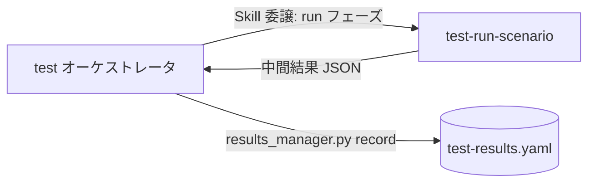

# test-run-scenario スキル

システムテスト（`system` / TC-SYS）と受入テスト（`uat` / TC-UAT）のケースを、Playwright MCP による業務シナリオ E2E で実行する実行スキル。
ログインから業務操作・結果確認・ログアウトまでを通しで実行し、ケースごとの結果を中間データとしてオーケストレータ `test` に返却する。

## このドキュメントについて

このファイルは **人間向けのリファレンス** です。Claude Code がスキル動作中に参照することはありません。
スキルが実行時に参照するのは `SKILL.md` と `references/` 配下、および `${CLAUDE_PLUGIN_ROOT}/references/` の共通 SSOT です。

## 担当テストレベル

| テストレベル | level 値 | ケース ID | 実行アプローチ |
|------------|---------|----------|--------------|
| システムテスト | `system` | TC-SYS | Playwright による業務シナリオ E2E（複数機能・複数画面を通し） |
| 受入テスト（UAT） | `uat` | TC-UAT | 上記に加え、業務担当者の受入観点で検証（検証支援。最終受入判断は人間） |

## 位置付け（デリゲーション）



- 本スキルは **実行と結果返却のみ**を担い、`test-results.yaml` への書き込みは行わない（オーケストレータが一元実行）
- 実行スキルはブラウザセッション共有のため逐次起動が前提（他の `test-run-*` と並列起動しない）

## 使い方

### トリガーフレーズ例（通常はオーケストレータ経由）

```
システムテストを実行して
業務シナリオを最初から最後まで通しで検証して
受入観点でシナリオを流して結果を見せて
```

単独起動時は引数（target-slug / run_id / ケースリスト / アプリ情報）が揃わないため、`/deep-test:test` 経由での実行を案内します。

## 動作の要点

- **通し実行**: 業務シナリオを途中で分割せず、ログインから業務操作・結果確認・ログアウトまで一貫して実行
- **途中 fail の扱い**: シナリオ途中のステップ失敗はケースを fail とし、以降のステップは打ち切り（未検証を actual に明示）。依存する後続ケースは blocked
- **UAT 検証支援**: 導線・エラーメッセージ・業務データでの成立性を確認し、受入判断の材料を提供（サインオフは人間）
- **中断耐性**: ケース単位で結果を確定し、中断時も scope 全件のエントリを返却

## UAT の免責（重要）

UAT レベルの pass は「受入観点シナリオが検証で成立した」ことを意味し、**「受入完了」を意味しません**。
最終受入判断（顧客・業務担当者のサインオフ）は人間が行います（`${CLAUDE_PLUGIN_ROOT}/references/test-levels.md` 6 章）。

## ファイル構成

```
plugins/deep-test/skills/test-run-scenario/
├── SKILL.md                       # Claude が実行時に読むスキル定義
├── README.md                      # 本ファイル（人間向け）
├── references/
│   └── scenario-execution.md      # シナリオ実行手順・途中 fail 判断・UAT 観点チェックリスト・達成チェックリスト
└── evals/                         # 動作分岐検証ケース（case-01〜16 + README・16 ケース）
```

## スコープ外

- unit / functional / integration / performance / security レベルの実行（各 `test-run-*` が担当）
- `test-results.yaml` の更新・報告書生成（オーケストレータ / `test-report`）
- UAT の最終受入判断（人間の責務）

## 関連スキル

- `test`（オーケストレータ） — ライフサイクル制御・実績記録・ゲート判定
- `test-run-functional` / `test-run-integration` — 単体・結合レベルの Playwright 実行
- `test-report` — 実績 YAML からの報告書生成
