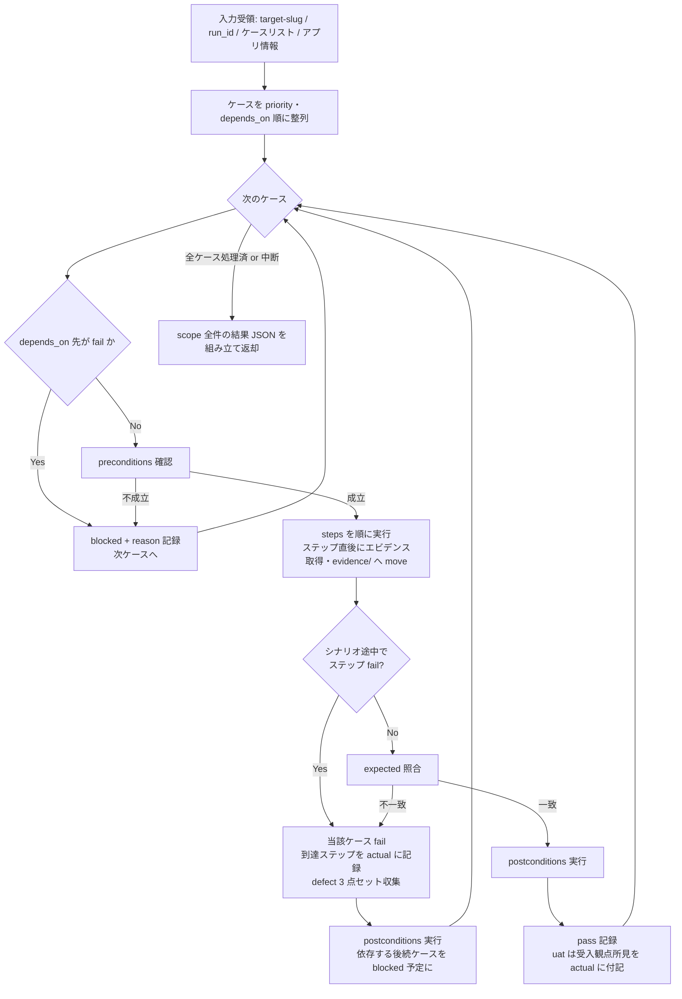

# test-run-scenario スキル

システムテスト（`system` / TC-SYS）と受入テスト（`uat` / TC-UAT）のケースを、Playwright MCP による業務シナリオ E2E で実行する実行スキル。
複数機能を跨ぐ業務フローを通しで実行し、ケースごとの結果を中間データとしてオーケストレータ `test` に返却する（`test-results.yaml` への書き込みは行わない）。

## 責務

| 責務 | 内容 |
|------|------|
| シナリオ通し実行 | 割り当てられた scope の system / uat レベルのケースを、`preconditions → steps 実行（エビデンス取得）→ expected 照合 → postconditions` の順で通しで実行する |
| 完遂状況の記録 | 業務シナリオの完遂状況（どのステップまで到達したか）を `actual` に記録する（`test-levels.md` の system / uat 出口基準） |
| 途中 fail 時の後続判断 | シナリオ途中のステップ fail 時に、以降のステップと依存する後続ケースの扱い（fail / blocked）を判断する（`${CLAUDE_SKILL_DIR}/references/scenario-execution.md`） |
| UAT 観点の検証 | UAT レベルはユーザー受入観点（導線のわかりやすさ・エラーメッセージの妥当性・業務データでの動作）で検証し、受入判断の材料（結果・エビデンス）を揃える |
| defect 収集 | fail 検出時に defect 3 点セット（再現手順・検証データ・エビデンス）を収集する（`${CLAUDE_PLUGIN_ROOT}/references/evidence-policy.md`） |
| 中断耐性 | 長大シナリオの中断に備え、各ケースの進行状況を返却データに含め、中断時も scope 全件のエントリを返す |

## 責務外（他スキルが担当）

| 責務外の事項 | 担当 |
|------------|------|
| unit / functional / integration-internal / integration-external / performance / security の各レベル実行 | 各 `test-run-*` スキル |
| `test-results.yaml` への書き込み・latest 更新 | オーケストレータ `test`（`results_manager.py` 経由） |
| **UAT の最終受入判断（顧客・業務担当者のサインオフ）** | 人間（本スキルは検証支援のみ。`${CLAUDE_PLUGIN_ROOT}/references/test-levels.md` 6 章免責） |
| 報告書（Excel / Markdown）の生成 | `test-report` |
| ケース設計・test-cases.yaml の生成・承認 | `test-design` / `test-review` |
| MCP ゲート・人間承認ゲートの判定 | オーケストレータ `test`（`${CLAUDE_PLUGIN_ROOT}/references/execution-policy.md`） |

## トリガー条件

- オーケストレータ `test` の run フェーズから Skill ツール経由で system / uat レベルの実行を委譲された場合
- 「システムテストを実行して」「業務シナリオを通しで検証して」「受入観点でシナリオを流して」と指示された場合（単独起動時は実行モード判定を参照）

## 前提

- Playwright MCP が現セッションでロード済み（MCP ゲートはオーケストレータが通過済み。本スキルは初回ブラウザ操作前に未ロードを検出したら偽装せず skipped で返却する）
- 入力として `target-slug` / `run_id` / 対象ケースリスト / 対象アプリ情報（URL 等）を受領していること
- 対象アプリ情報（URL 等）は、test-environment（Phase 1.7）が生成する environment.yaml の `endpoints[]` 由来の base URL（テスト用派生環境）として受領する場合がある（受領形・実行手順は不変。出所の注記のみ）
- 対象は**テスト環境**であること（本番実行は既定で禁止。`${CLAUDE_PLUGIN_ROOT}/references/execution-policy.md` 環境安全）
- 共通参照は `${CLAUDE_PLUGIN_ROOT}/references/common-references.md` に集約（本スキルは実行時セクション 3.3 を参照）

## 実行モード判定

| 入力 | 起動形態 | 動作 |
|-----|---------|------|
| オーケストレータから委譲（`target-slug` / `run_id` / ケースリスト / アプリ情報が引数で確定） | 委譲（既定） | 非対話で scope を通しで実行し、中間結果 JSON を返却する |
| ユーザーが直接起動（引数不足） | 単独 | オーケストレータ `test` 経由（`/deep-test:test`）での実行を案内する。実績記録・ゲート判定を伴うため単独完結はしない |

レベル文脈の判定（scope 内の各ケースの `level` で自動分岐）:

| level | 文脈 | 追加観点 |
|-------|------|---------|
| `system` | システムシナリオ | 業務フローの完遂・複数機能/画面を跨ぐデータ整合 |
| `uat` | 受入観点シナリオ | 上記に加え、業務担当者目線の導線・エラーメッセージ妥当性・業務データでの成立性（`references/scenario-execution.md` の UAT 観点チェックリスト） |

- `automation: manual-assist` / `exploratory` のケース: 対話時はユーザーに手動確認を依頼し結果を `executed_by: human-assisted` で記録する（提示 3 要素・聴取・エビデンス受領・記録規約は `${CLAUDE_PLUGIN_ROOT}/references/manual-execution.md` に従う）。非対話時は skipped + reason 記録（`execution-policy.md` 9 章。オーケストレータから `manual-sheet=` で手順書パスを受領した場合は reason に含める）
- `automation: playwright-test` のケース: fixtures.yaml（認証・シードフィクスチャ）と SUT テストコード（`test_root` 配下の `.spec.ts` / `playwright.config.ts`）を前提に `npx playwright test`（Bash 実行）で system / uat シナリオを再現可能に実走し、pass / fail と JUnit / レポートをエビデンス化して `executed_by: playwright-test` で記録する。Playwright・ランナー未導入または fixtures.yaml 不在時は skipped + reason（手順は `${CLAUDE_SKILL_DIR}/references/scenario-execution.md` 7 章）。既存の MCP・manual-assist 経路は不変

## 実行フロー

- エビデンス取得・移送の手順（raw 出力先からの move）は `${CLAUDE_PLUGIN_ROOT}/references/data-locations.md` 5 章、収集タイミングは `${CLAUDE_PLUGIN_ROOT}/references/execution-policy.md` 7 章に従う
- シナリオ途中 fail 時の後続ステップ・依存ケースの扱いは `${CLAUDE_SKILL_DIR}/references/scenario-execution.md` を参照
- ケースタイムアウト（既定 120 秒）超過は当該ケースを blocked + reason（到達ステップ含む）で記録し次ケースへ進む
- `automation: playwright-test` のケースは fixtures.yaml（認証・シードフィクスチャ）+ SUT テストコードを前提に `npx playwright test` で system / uat シナリオを実走する（手順・エビデンス化・SKIPPED 判定は `${CLAUDE_SKILL_DIR}/references/scenario-execution.md` 7 章）。既存 MCP・manual-assist 経路と併存し置き換えない

## 検証（チェックリスト）

中間結果 JSON をオーケストレータへ返却する前に、`${CLAUDE_SKILL_DIR}/references/scenario-execution.md` の達成チェックリストを通過すること。要点:

- scope の全ケースについて 1 エントリを返している（中断時も未到達ケースを blocked / skipped + reason で返す）
- 各ケースの `actual` にシナリオ完遂状況（到達ステップ）を記録している
- fail ケースに defect 3 点セット（`reproduction_steps` / `test_data` / `evidence`）を収集している
- uat ケースの fail はユーザー影響（業務担当者への影響）を `actual` / defect に明記している
- UAT の結果は「受入観点シナリオが検証で成立した」ことを意味し「受入完了」ではない旨を逸脱していない
- `test-results.yaml` を直接編集していない（返却のみ）

## 引き渡し（中間結果 JSON 返却）

最終応答に、`${CLAUDE_PLUGIN_ROOT}/references/execution-policy.md` 4 章の中間結果返却フォーマット（`skill` / `run_id` / `results[]`）に準拠した JSON を 1 つのコードブロックで含めて返す。スキーマ SSOT は `${CLAUDE_PLUGIN_ROOT}/references/yaml-schema-results.md`。

本スキル固有の埋め方（フォーマット自体は複製しない）:

- `executed_by`: `playwright-mcp`（Playwright MCP 実行時）。`automation: playwright-test` のケースを `npx playwright test` で実走した場合は `playwright-test`。manual-assist / exploratory ケースを人手確認した場合のみ `human-assisted`
- `actual`: シナリオの完遂状況（到達ステップ・完了/中断）を必ず記述する
- system 途中 fail で依存する後続ケース: `status: blocked` + `reason`（依存元ケース ID とその fail）
- 中断時の未到達ケース: `status: blocked`（前提未到達）または `skipped`（実行手段喪失）+ `reason`
- uat の fail: `defect` にユーザー影響を含める（`extras` にレベル別拡張は任意）

## 重要な制約

- `test-results.yaml` への書き込み・Edit / Write を行わない（返却のみ。書き込みはオーケストレータの責務）
- Playwright MCP 未ロードを検出した場合、利用可を装って続行せず skipped + reason で返却する（`execution-policy.md` 条件付き動的検証）
- **UAT の pass をもって「受入完了」と結論しない**。最終受入判断は人間の責務（`test-levels.md` 6 章）
- エビデンスはステップ実行直後に `evidence/{run_id}/{case_id}/` へ move する（`data-locations.md` 5 章）
- 実行スキルは逐次起動が前提。ブラウザセッションを共有するため他実行スキルと並列起動しない（`execution-policy.md` 3 章）

## 参照

| 参照先 | 内容 |
|-------|------|
| `${CLAUDE_PLUGIN_ROOT}/references/common-references.md` | worker スキル共通参照の集約インデックス |
| `${CLAUDE_SKILL_DIR}/references/scenario-execution.md` | シナリオ実行手順・途中 fail 時の後続判断・UAT 観点チェックリスト・達成チェックリスト・playwright-test 実走経路（本スキル固有） |
| `${CLAUDE_PLUGIN_ROOT}/references/playwright-test.md` | `npx playwright test` + fixtures.yaml（認証・シードフィクスチャ）の実行規約（`automation: playwright-test` 経路。既定の MCP 経路と併存） |

> **正本ツールリストとの同期（同期義務）**: frontmatter の allowed-tools に列挙した `mcp__playwright__browser_*` ツールは、`${CLAUDE_PLUGIN_ROOT}/references/playwright-mcp.md` 5 章（正本ツールリスト）から同期している。正本リストの改訂時は本スキルの frontmatter へ必ず反映すること。Playwright MCP が `playwright` 以外の名前で登録されている場合のプレフィクス読み替えは同 2 章に従う。
