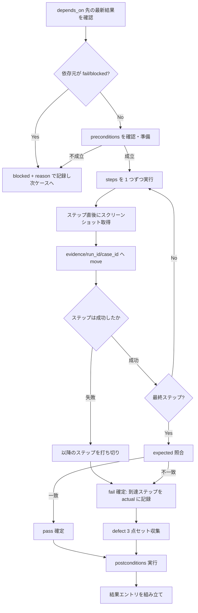

# シナリオ実行手順（test-run-scenario 固有）

`test-run-scenario` が system / uat レベルの業務シナリオ E2E を実行する際の固有手順。
実行共通規範・エビデンス要件・データ配置・severity 判定・中間結果フォーマットは重複記載せず、`${CLAUDE_PLUGIN_ROOT}/references/` の各 SSOT を参照する（本ファイルはシナリオ特有のフローと判断のみを扱う）。

---

## 1. 前段: 入力の解決と整列

1. 入力（`target-slug` / `run_id` / 対象ケースリスト / 対象アプリ情報）を確認する
2. 対象ケースを実行順に整列する
   - `depends_on` の依存グラフに従い、依存元を先に実行する（循環がある場合はエラーとしてオーケストレータへ返す）
   - 同順位内は `priority`（high → medium → low）で並べる
3. Playwright MCP のロード状態を初回ブラウザ操作前に確認する。未ロードなら全対象ケースを `skipped` + reason（MCP 未ロード）で返却する（`${CLAUDE_PLUGIN_ROOT}/references/execution-policy.md` 条件付き動的検証）

## 2. 1 ケース（1 シナリオ）の実行手順

各ケースは「1 本の業務シナリオ」を表す。以下を順に行う。



### 2.1 preconditions（前提確認）

- ログイン状態・初期データ・アカウント権限など、ケースが宣言した前提を準備・確認する
- 前提を成立させられない場合は当該ケースを `blocked` + reason（前提不成立の内容）で記録する（`skipped` ではない。論理上のブロックのため）
- テストデータの前提宣言と復元の原則は `${CLAUDE_PLUGIN_ROOT}/references/execution-policy.md` 5 章（テストデータ分離）に従う

### 2.2 steps（シナリオ実行とエビデンス取得）

- steps を先頭から 1 つずつ実行する。業務シナリオは「ログイン → 業務操作（登録・検索・更新等）→ 結果確認 → ログアウト」のように複数機能・複数画面を跨ぐ
- **各ステップ実行直後**にスクリーンショット（`browser_take_screenshot`、filename 指定必須）を取得し、`evidence/{run_id}/{case_id}/` へ **move** する（移送規約は `${CLAUDE_PLUGIN_ROOT}/references/data-locations.md` 5 章）
- 待機は固定スリープではなく `browser_wait_for` の条件待機を用いる（`${CLAUDE_PLUGIN_ROOT}/references/playwright-mcp.md` 7.2）
- 画面遷移でパラメータ・業務データが引き継がれることを、遷移先の表示値で確認する（system の主な確認観点）

### 2.3 expected 照合と postconditions

- 最終ステップまで到達したら expected と実際の表示・状態を照合する
- postconditions（作成データの削除・状態復元・ログアウト等）を必ず実行し、共有環境を汚染しない。復元に失敗した場合はその旨を actual / reason に記録し隠蔽しない

## 3. シナリオ途中 fail 時の後続判断（本スキルの中核判断）

業務シナリオは「通し」で成立してこそ意味を持つため、途中ステップの失敗は 2 つのレベルで影響を扱う。

### 3.1 同一ケース内（シナリオ内の以降のステップ）

| 事象 | 判断 | 記録 |
|------|------|------|
| シナリオの途中ステップが失敗した | 当該ケースは `fail`。以降のステップは**実行不能として打ち切る**（無理に続行しない） | `actual` に「到達ステップ（例: ステップ 4 まで到達、ステップ 5 でエラー）」を明記。以降のステップは「未到達（先行 fail のため）」として actual に含める |
| 失敗ステップの証跡 | 追加でアクセシビリティスナップショット（`browser_snapshot`）・コンソールログ（`browser_console_messages`）をテキスト保存し evidence/ へ move | defect.evidence に含める |

- 「以降のステップを blocked にする」とは、シナリオ内の残ステップを**独立に成功扱いしない**ことを指す。ケース全体の status は `fail`（欠陥を検出したため）であり、残ステップの未検証は actual に明示する

### 3.2 後続ケース（depends_on による連鎖）

| 事象 | 判断 | 記録 |
|------|------|------|
| fail したケースを `depends_on` に持つ後続ケースがある | 後続ケースを `blocked` として扱う | `reason` に「依存元 {case_id} が fail のため実行不能」を記載（`defect` は付与しない） |
| depends_on 先が blocked（さらに上流の連鎖） | 連鎖的に blocked | `reason` に連鎖元を記載 |

- blocked と fail の使い分け（論理ブロック vs 欠陥検出）は `${CLAUDE_PLUGIN_ROOT}/references/yaml-schema-results.md` 6 章に従う

## 4. UAT 観点チェックリスト（uat レベルのケースで追加適用）

uat レベルのケースは system の確認に加え、**業務担当者が実際に使えるか**の受入観点で評価する。以下を確認し、逸脱は fail または所見として `actual` / defect に記録する。

| 観点 | 確認内容 | 逸脱時の扱い |
|------|---------|-------------|
| 導線のわかりやすさ | 業務担当者が迷わず目的の操作に到達できる導線か（次操作の手がかり・ラベルの明確さ） | 業務遂行を妨げる導線不備は fail、軽微は所見 |
| エラーメッセージの妥当性 | エラー時に、原因と次に取るべき行動が業務担当者に伝わるメッセージか（内部例外の生表示でないか） | 業務担当者が回復不能な不親切メッセージは fail |
| 業務データでの動作 | サンプル値ではなく実運用相当の業務データ（桁数・全角/半角・実在しうる組合せ）で成立するか | 実業務データで破綻するなら fail |
| 帳票・出力物 | 出力帳票が業務要件（項目・書式・体裁）を満たすか | 業務要件を満たさない出力は fail |

- uat の fail は必ず**ユーザー影響（どの業務担当者のどの業務がどう困るか）**を `actual` と `defect.reproduction_steps` に含める
- severity は本番影響度で判定する（`${CLAUDE_PLUGIN_ROOT}/references/severity-policy.md`）。「使いにくい」だけの軽微問題を過大評価しない
- **本スキルは受入判断そのものを行わない**。UAT の pass は「受入観点シナリオが検証で成立した」ことを示すに留め、サインオフは人間に委ねる（`${CLAUDE_PLUGIN_ROOT}/references/test-levels.md` 6 章）

## 5. 長大シナリオの中断耐性

システム/UAT シナリオは長時間に及ぶため、中断（タイムアウト・MCP 喪失・ユーザー停止）に備える。

- **1 ケース完了ごとに結果エントリを確定**し、途中まで完了したケースの結果を失わない構造で進める
- 実行中のケースがタイムアウト（既定 120 秒・`timeout_sec` で上書き可）した場合は当該ケースを `blocked` + reason（タイムアウト・到達ステップ・経過時間）で記録し、次ケースへ進む
- 中断で以降のケースに到達できない場合も、**scope 全件のエントリを返す**（未到達ケースは `blocked`〔前提未到達〕または `skipped`〔MCP 喪失等の実行手段不在〕+ reason）。これは finish-run の scope vs results 突合の前提（`${CLAUDE_PLUGIN_ROOT}/references/execution-policy.md` 3 章）
- 各ケースの `actual` に進行状況（到達ステップ）を残すことで、オーケストレータ側で resume（`${CLAUDE_PLUGIN_ROOT}/references/retest-policy.md` 6 章）を判断できるようにする

## 6. 達成チェックリスト（返却前）

中間結果 JSON をオーケストレータへ返却する前に以下を確認する。

```
[ ] scope の全ケースに 1 エントリを返している（中断・未到達も blocked/skipped + reason で返す）
[ ] 各ケースの actual にシナリオ完遂状況（到達ステップ・完了/中断）を記録している
[ ] シナリオ途中 fail のケースは status=fail で、残ステップの未検証を actual に明示している
[ ] fail を depends_on に持つ後続ケースを blocked + reason（依存元 ID）にしている
[ ] fail ケースに defect 3 点セット（reproduction_steps / test_data / evidence）を収集している
[ ] uat の fail にユーザー影響を明記している（業務担当者への影響）
[ ] UAT を「受入完了」と結論していない（検証支援の位置付けを逸脱していない）
[ ] エビデンスをステップ直後に evidence/{run_id}/{case_id}/ へ move 済み（raw 出力先に残骸なし）
[ ] executed_by / duration_sec / evidence を各エントリに埋めている
[ ] test-results.yaml を直接編集していない（返却のみ）
[ ] 機微情報（認証情報・個人情報）を actual / reason に生値で書いていない（evidence-policy.md 5 章）
```

## 7. 関連 references

| 参照先 | 内容 |
|-------|------|
| `${CLAUDE_PLUGIN_ROOT}/references/execution-policy.md` | 中間結果返却フォーマット（4 章）・タイムアウト・テストデータ分離・環境安全・条件付き動的検証 |
| `${CLAUDE_PLUGIN_ROOT}/references/test-levels.md` | system / uat の定義・入口/出口基準・UAT 免責（6 章） |
| `${CLAUDE_PLUGIN_ROOT}/references/playwright-mcp.md` | MCP ツール・スクリーンショット filename 規約・条件待機 |
| `${CLAUDE_PLUGIN_ROOT}/references/data-locations.md` | エビデンス移送（5 章）・パス規約 |
| `${CLAUDE_PLUGIN_ROOT}/references/evidence-policy.md` | defect 3 点セット・機微情報マスキング |
| `${CLAUDE_PLUGIN_ROOT}/references/severity-policy.md` | severity 判定基準 |
| `${CLAUDE_PLUGIN_ROOT}/references/yaml-schema-results.md` | results / defect / status enum |
| `${CLAUDE_PLUGIN_ROOT}/references/retest-policy.md` | resume（中断 run の再開）判定 |
