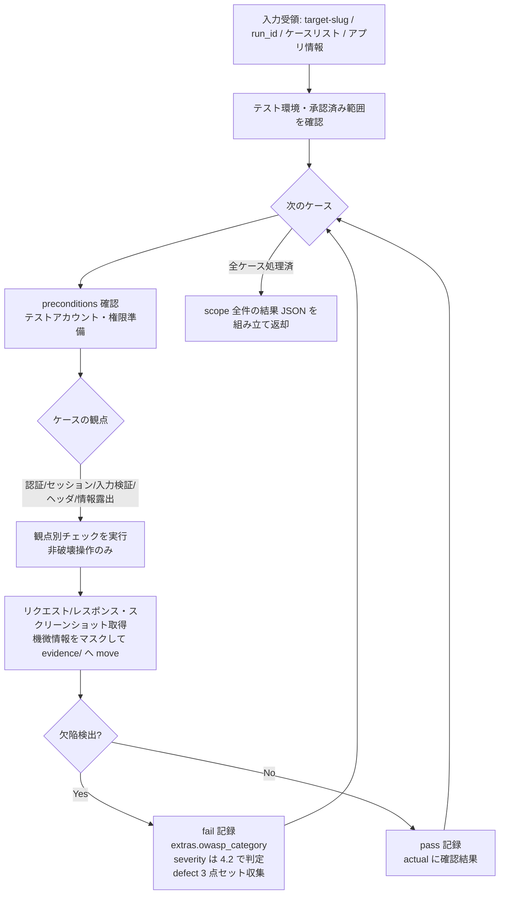

# test-run-security スキル

セキュリティテスト（`security` / TC-SEC）のケースを、Playwright MCP + Bash による OWASP 観点の動的チェックとして実行する実行スキル。
承認済みケースに記載された範囲でのみ確認し、結果を中間データとしてオーケストレータ `test` に返却する（`test-results.yaml` への書き込みは行わない）。

## 責務

scope の security レベルのケースについて、OWASP 観点（`${CLAUDE_PLUGIN_ROOT}/references/test-levels.md` 8 章のスコープ境界に準拠）の動的チェックを担う。観点別の確認手順・確認コマンド例・実行してよい操作/禁止操作の境界は `${CLAUDE_SKILL_DIR}/references/security-execution.md` に従う。

| 責務 | 内容 |
|------|------|
| 認証の確認 | 未認証アクセス制御（保護リソースへの未認証到達可否）・認証エラー時の情報露出 |
| セッション管理の確認 | ログアウト後のセッション無効化・Cookie 属性（Secure / HttpOnly / SameSite） |
| 入力検証の確認 | XSS 反射確認（無害ペイロード）・SQL エラーメッセージ露出・パストラバーサル基礎 |
| セキュリティヘッダの確認 | CSP・X-Frame-Options・HSTS 等を `browser_network_requests` / `curl -I` で確認 |
| 情報露出の確認 | エラーページのスタックトレース・コメント内機密・ディレクトリリスティング |
| defect 記録 | fail 検出時に `defect.extras.owasp_category` を記録し、severity を `${CLAUDE_PLUGIN_ROOT}/references/severity-policy.md` 4.2（OWASP 対応表）で判定する |
| 機微情報マスキング | エビデンス（リクエスト/レスポンス記録・スクリーンショット）の機微情報（トークン・パスワード・個人情報）を、保管時に可能な限り・報告転載時に必須でマスクする（`${CLAUDE_PLUGIN_ROOT}/references/evidence-policy.md` 5 章） |

## 責務外（他スキルが担当）

| 責務外の事項 | 担当 / 扱い |
|------------|-----------|
| unit / functional / integration / system / uat / performance の各レベル実行 | 各 `test-run-*` スキル |
| `test-results.yaml` への書き込み・latest 更新 | オーケストレータ `test`（`results_manager.py` 経由） |
| 報告書の生成 | `test-report` |
| ケース設計・承認 | `test-design` / `test-review` |
| **ペネトレーションテスト（攻撃連鎖・エクスプロイト実証）の代替** | 対象外（`test-levels.md` 8 章。未確認として報告書に明示） |
| **SCA（依存ライブラリ脆弱性スキャン）・SAST（静的解析）の代替** | 対象外 |
| **破壊的攻撃（実データ改変・削除・DoS・総当たり）の実行** | **禁止**（`security-execution.md` の禁止操作。承認済みケースの範囲=対象システム所有者の合意範囲内でのみ実行） |
| MCP ゲート・人間承認ゲートの判定 | オーケストレータ `test`（`${CLAUDE_PLUGIN_ROOT}/references/execution-policy.md`） |

## トリガー条件

- オーケストレータ `test` の run フェーズから Skill ツール経由で security レベルの実行を委譲された場合
- 「セキュリティテストを実行して」「OWASP 観点で動的チェックして」「ヘッダ・セッション・入力検証を確認して」と指示された場合（単独起動時は実行モード判定を参照）

## 前提

- Playwright MCP が現セッションでロード済み（MCP ゲートはオーケストレータが通過済み。未ロード検出時は偽装せず skipped で返却する）
- 入力として `target-slug` / `run_id` / 対象ケースリスト / 対象アプリ情報（URL 等）を受領していること
- **対象がテスト環境**であることを確認済み（本番実行は既定で禁止。`${CLAUDE_PLUGIN_ROOT}/references/execution-policy.md` 環境安全）
- 実行する操作は**承認済みケース（test-cases.yaml）に記載された範囲のみ**（対象システム所有者の合意範囲内）
- テスト用アカウント・権限パターンが準備済み（`${CLAUDE_PLUGIN_ROOT}/references/test-levels.md` 4.8 入口基準）
- 共通参照は `${CLAUDE_PLUGIN_ROOT}/references/common-references.md` に集約（本スキルは実行時セクション 3.3 を参照）

## 実行モード判定

| 入力 | 起動形態 | 動作 |
|-----|---------|------|
| オーケストレータから委譲（引数が確定） | 委譲（既定） | 非対話で承認済みケース範囲の動的チェックを実行し、中間結果 JSON を返却する |
| ユーザーが直接起動（引数不足） | 単独 | オーケストレータ `test` 経由での実行を案内する（実績記録・ゲート判定・承認済み範囲の確認を伴うため単独完結しない） |

観点の分岐（各 security ケースの確認観点で自動分岐。手順は `references/security-execution.md`）:

| 観点 | 主な実行手段 |
|------|------------|
| 認証 | Playwright（未認証遷移・認証エラー画面）|
| セッション管理 | Playwright（ログアウト後アクセス）+ `browser_network_requests` / Bash `curl -I`（Cookie 属性） |
| 入力検証 | Playwright（無害ペイロード入力・反射確認・エラーメッセージ確認） |
| セキュリティヘッダ | `browser_network_requests` / Bash `curl -I` |
| 情報露出 | Playwright（エラーページ・HTML コメント）+ Bash（ディレクトリリスティング確認） |

- `automation: manual-assist` のケース: 対話時はユーザーに手動確認を依頼し結果を `executed_by: human-assisted` で記録する。非対話時は skipped + reason 記録（`execution-policy.md` 9 章）
- `automation: playwright-test` のケース: fixtures.yaml の認証フィクスチャ（`type: auth`・storageState）と SUT テストコード（`test_root` 配下の `.spec.ts` / `playwright.config.ts`）を前提に `npx playwright test`（Bash 実行）で実走する。認証済み context（storageState）と未認証 context の挙動差（保護リソースへの到達可否等）を非破壊で検証し、pass / fail と JUnit / レポートをエビデンス化して `executed_by: playwright-test` で記録する。Playwright・ランナー未導入または fixtures.yaml 不在時は skipped + reason（手順は `${CLAUDE_SKILL_DIR}/references/security-execution.md` 7 章）。既存の MCP・`curl` 経路は不変

## 実行フロー

- 破壊的攻撃・承認範囲外の操作は実行しない。禁止操作に該当する検証は実施せず、その旨を actual / reason に記録する（`references/security-execution.md` の実行してよい操作/禁止操作の境界）
- ケースタイムアウト（既定 120 秒）超過は当該ケースを blocked + reason で記録し次ケースへ進む
- `automation: playwright-test` のケースは、fixtures.yaml の認証フィクスチャ（storageState）で認証済み/未認証を切替え `npx playwright test` で実走する。手順・エビデンス化・SKIPPED 判定は `${CLAUDE_SKILL_DIR}/references/security-execution.md` 7 章（playwright-test 実走経路）に従う（既存 MCP・`curl`・manual-assist 経路と併存し置き換えない・非破壊の範囲は不変）

## 検証（チェックリスト）

中間結果 JSON を返却する前に、`${CLAUDE_SKILL_DIR}/references/security-execution.md` の達成チェックリストを通過すること。要点:

- 各ケースを承認済み範囲・非破壊操作のみで実行している（破壊的攻撃・範囲外操作を行っていない）
- fail に `extras.owasp_category` を記録し、severity を `severity-policy.md` 4.2 で判定している
- 対象外領域（ペネトレーションテスト・SCA・SAST）を「問題なし」ではなく「未確認」として扱っている
- エビデンス中の機微情報をマスクしている（保管時は可能な限り・報告転載時は必須）
- reason / actual に機微情報の生値を書いていない
- scope の全ケースについて 1 エントリを返している
- `test-results.yaml` を直接編集していない（返却のみ）

## 引き渡し（中間結果 JSON 返却）

最終応答に、`${CLAUDE_PLUGIN_ROOT}/references/execution-policy.md` 4 章の中間結果返却フォーマットに準拠した JSON を 1 つのコードブロックで含めて返す。スキーマ SSOT は `${CLAUDE_PLUGIN_ROOT}/references/yaml-schema-results.md`。

本スキル固有の埋め方（フォーマット自体は複製しない）:

- `executed_by`: `playwright-mcp`（ブラウザ操作主体の場合）。ヘッダ確認等を Bash `curl` で行った場合はその旨を actual に明記する。`automation: playwright-test` のケースを `npx playwright test` で実走した場合は `playwright-test`
- `actual`: 確認した観点と結果（例: 「HSTS ヘッダが未設定」「ログアウト後もセッション Cookie が有効」）。機微情報はマスク値で記述する
- `defect.extras.owasp_category`: 該当 OWASP カテゴリ（例: A05:2021 Security Misconfiguration）
- `evidence`: リクエスト/レスポンス記録・スクリーンショット（機微情報マスク済み）

## 重要な制約

- `test-results.yaml` への書き込み・Edit / Write を行わない（返却のみ）
- **破壊的攻撃（実データの改変・削除・DoS・総当たり）を実行しない**。実行は承認済みケースに記載された範囲=対象システム所有者の合意範囲内に限る
- **ペネトレーションテスト・SCA・SAST の代替ではない**。対象外領域は「未確認」として扱い「問題なし」と結論しない（`test-levels.md` 8 章）
- 本番環境への実行は既定で禁止（`execution-policy.md` 環境安全）
- 機微情報（トークン・パスワード・個人情報）はエビデンス保管時に可能な限りマスクし、報告転載時は必須マスク（`evidence-policy.md` 5 章）。reason / actual / チャット出力に生値を書かない
- Playwright MCP 未ロード検出時は偽装せず skipped + reason で返却する（`execution-policy.md` 条件付き動的検証）
- エビデンスはステップ直後に `evidence/{run_id}/{case_id}/` へ move する（`data-locations.md` 5 章）
- 実行スキルは逐次起動が前提。他実行スキルと並列起動しない（`execution-policy.md` 3 章）

## 参照

| 参照先 | 内容 |
|-------|------|
| `${CLAUDE_PLUGIN_ROOT}/references/common-references.md` | worker スキル共通参照の集約インデックス（実行時の共通規範一式はここから到達する） |
| `${CLAUDE_SKILL_DIR}/references/security-execution.md` | 観点別チェック手順・確認コマンド例・マスキング手順・実行してよい操作/禁止操作の境界・達成チェックリスト・playwright-test 実走経路（本スキル固有） |
| `${CLAUDE_PLUGIN_ROOT}/references/playwright-test.md` | `npx playwright test` + fixtures.yaml（認証フィクスチャ storageState）の実行規約（`automation: playwright-test` 経路。既定の MCP 経路と併存） |

> **正本ツールリストとの同期（同期義務）**: frontmatter の allowed-tools に列挙した `mcp__playwright__browser_*` ツールは、`${CLAUDE_PLUGIN_ROOT}/references/playwright-mcp.md` 5 章（正本ツールリスト）から同期している。正本リストの改訂時は本スキルの frontmatter へ必ず反映すること。Playwright MCP が `playwright` 以外の名前で登録されている場合のプレフィクス読み替えは同 2 章に従う。
