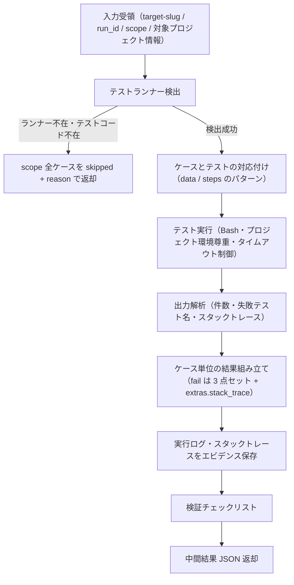

# test-run-unit スキル

ユニットテスト（`level: unit` / `TC-UNIT`）を、テストフレームワーク（pytest / jest / vitest / dotnet test 等）で実施する実行スキル。
オーケストレータ `test` から受領した scope をテストランナーで実行し、出力を解析してケース単位の中間結果 JSON を返却する（実績 YAML への書き込みは行わない）。

## 責務

| 責務 | 内容 |
|------|------|
| テストランナー検出 | `pyproject.toml` / `package.json` / `*.csproj` / `*.sln` 等の構成ファイルから pytest・jest・vitest・dotnet test 等を特定する |
| テスト実行 | Bash で実行する。venv・node_modules 等のプロジェクト環境を尊重し、システム環境を汚染しない |
| 出力解析 | pass / fail / error 件数・失敗テスト名・スタックトレースを抽出する |
| ケースマッピング | ケースの `data` / `steps` に記載されたテスト名・パターンで、実行結果とテストケースを対応付ける |
| defect 収集 | fail 時に defect 3 点セット（環境情報含む再現手順・検証データ・エビデンス）と `extras.stack_trace` をその場で収集する |
| 結果返却 | ケースごとの中間結果 JSON を組み立ててオーケストレータへ返却する |

## 責務外（他スキルが担当）

| 責務外 | 担当 |
|--------|------|
| unit 以外のテストレベルの実行 | `test-run-functional` / `test-run-integration` / `test-run-scenario` / `test-run-performance` / `test-run-security` |
| 実績 YAML（test-results.yaml）への書き込み | オーケストレータ `test`（results_manager.py 経由で一元実行） |
| 報告書生成 | `test-report` |
| テストランナー・実行環境の導入・構築 | `test-setup` |
| テストケースの設計・修正（test-cases.yaml の生成・更新） | `test-design` |
| 実行結果のレビュー・severity 妥当性の検証 | `test-review`（結果文脈） |
| run_id 採番・ゲート判定・再テスト対象選択 | オーケストレータ `test` |

## トリガー条件

- オーケストレータ `test` の run フェーズから、scope に unit レベル（TC-UNIT）のケースを含む実行として Skill 経由で委譲された場合
- ユーザーが「ユニットテストレベルのケースを実行して」等と直接依頼した場合（後述の実行モード判定に従う）

## 前提

- run_id がオーケストレータ側で採番済みであること（results_manager.py の start-run が採番する。本スキルは採番しない）
- scope のケースが `review_status: approved` であること（承認済みケースゲートはオーケストレータで通過済み）
- 対象プロジェクトのソース・テストコードがローカルで参照可能であること
- テストランナーの検出・検証は `test-setup` で実施済みであることが望ましい（未導入でも本スキルは skipped 返却で継続する）
- unit のみの実行では Playwright MCP を使用しない（MCP ゲートの対象外。`${CLAUDE_PLUGIN_ROOT}/references/execution-policy.md`）

## 実行モード判定

| 入力 | 起動形態 | 動作 |
|------|---------|------|
| オーケストレータから Skill 委譲（target-slug / run_id / 対象ケースリスト / 対象プロジェクト情報を受領） | 委譲（標準） | 非対話で scope 全ケースを実行し、中間結果 JSON を返却する |
| ユーザー直接起動で必須入力（target-slug / run_id / 対象ケース）が欠落 | 単独 | 実行せず、`/deep-test:test`（run-only モード等）経由の起動を案内する。run_id 採番・実績記録はオーケストレータの責務のため、単独実行では実績が記録されない旨を伝える |

- ケース定義本体が引数で渡されない場合は、`.claude/.local/plugins/deep-test/{target-slug}/test-cases.yaml` から該当ケースを Read で参照する（読み取りのみ。更新は test-design の責務）
- `automation: manual-assist` / `exploratory` のケース: 対話時はユーザーに手動確認を依頼し `executed_by: human-assisted` で記録する（提示 3 要素・聴取・エビデンス受領・記録規約は `${CLAUDE_PLUGIN_ROOT}/references/manual-execution.md` に従う）。非対話時は skipped + reason（非対話既定値表は execution-policy.md。オーケストレータから `manual-sheet=` で手順書パスを受領した場合は reason に含める）
- コンテナ内 exec 実行（代替経路）: ホストにランタイム / テストランナーが無い場合でも、environment.yaml（test-environment・Phase 1.7）の `exec_forms[]` に該当ランナーの実行形があり環境が稼働状態（`status.state: up / healthy`）なら、記録値の実行形によるコンテナ内実行を代替経路として選択できる。ホストにランナーがあれば従来どおりホスト実行が既定。どちらの手段も無ければ従来どおり skipped + reason（手順・優先順位は `${CLAUDE_SKILL_DIR}/references/unit-execution.md` 7 章）

## 実行フロー



### 1. 入力確認
target-slug / run_id / 対象ケースリスト（unit）/ 対象プロジェクト情報を受領する。

### 2. ランナー検出
`${CLAUDE_SKILL_DIR}/references/unit-execution.md` 1 章の検出表に従う。ランナー不在・テストコード不在・実行不能の場合は scope 全ケースを skipped + reason で返却する（条件付き動的検証。実行を偽装しない）。

### 3. ケース実行
共通手順（preconditions 確認 → steps 実行 → expected と実際の照合 → postconditions 実行 → 結果組み立て）に従う。本スキルでは steps 実行 = ランナー実行、照合 = 実行結果とケースの突合。実行方式（一括 / ケース別）・出力解析・マッピングの詳細は unit-execution.md 2〜4 章。

### 4. fail 時
defect 3 点セット（reproduction_steps: 環境情報含む完全な再現手順 / test_data / evidence）を**その場で**収集し、severity を判定（severity-policy.md）、スタックトレースを `defect.extras.stack_trace` に記録する（unit-execution.md 6 章）。

### 5. タイムアウト
ケースタイムアウト（既定 120 秒・`timeout_sec` で上書き可）超過は blocked + reason（経過時間・最後に完了したステップ）として記録し、次ケースへ進む。

### 6. エビデンス保存
ランナー実行ログ・fail 時スタックトレースをケース単位で `.claude/.local/plugins/deep-test/{target-slug}/evidence/{run_id}/{case_id}/` へ保存する（unit-execution.md 5 章）。

### 7. 返却
検証チェックリストを通過後、中間結果 JSON を返却する。

### コンテナ内 exec 実行経路（environment.yaml の exec_forms[]・代替経路）
ステップ 2 のランナー検出はホスト実行（既定・不変）が第一。ホストにランタイム / ランナーが無い場合に限り、environment.yaml の `exec_forms[]` と環境の稼働状態を確認し、成立すればコンテナ内 exec 実行を代替経路として用いる（優先順位・成立条件・skipped / blocked 判定は `${CLAUDE_SKILL_DIR}/references/unit-execution.md` 7 章）。実行形は environment.yaml の記録値をそのまま用い、結果解釈は上記 3〜6 と同一規範。既存のホスト実行・manual-assist 経路と併存し置き換えない。

## 検証（チェックリスト）

中間結果 JSON の返却前に以下を確認し、未達項目は解消してから返却する。

```
[ ] scope 全ケースについて 1 エントリずつ結果を返している（欠落なし。finish-run 突合の前提）
[ ] fail 全件に defect 3 点セット（reproduction_steps / test_data / evidence）・severity・extras.stack_trace がある
[ ] blocked / skipped / na 全件に reason がある
[ ] evidence のパスが実在するファイルを指している（{target-slug}/ 直下基準の相対パス）
[ ] priority: high の pass ケースにもエビデンス（実行ログ）を保存している
[ ] executed_by（test-framework）・case_revision を全エントリに記録している
[ ] 実行していないテストを実行済みとして報告していない（偽装禁止）
[ ] test-results.yaml を Edit / Write していない
```

## 引き渡し（中間結果 JSON 返却）

最終応答に、execution-policy.md 4 章の中間結果返却フォーマットに従う JSON を 1 つのコードブロックで含めて返す。オーケストレータがこれを results_manager.py record の入力として 1 件ずつ記録する。

```json
{
  "skill": "test-run-unit",
  "run_id": "<受領した run_id をそのまま設定>",
  "results": []
}
```

- `results[]` は 1 ケース 1 エントリ。フィールド定義・必須制約は execution-policy.md 4 章および yaml-schema-results.md を正とする（本書では複製しない）
- `executed_by` は `test-framework`（manual-assist ケースを人手確認した場合のみ `human-assisted`）
- コンテナ内 exec 実行（unit-execution.md 7 章の代替経路）でも `executed_by` は `test-framework` のまま変えない（新しい enum 値を追加しない）。実行場所がコンテナ内である旨（用いた実行形・サービス名）は actual / defect の reproduction_steps に記録する

## 重要な制約

- **test-results.yaml への書き込み禁止**（Edit / Write とも）。結果は返却のみとし、記録はオーケストレータが一元実行する
- run_id を採番しない（受領値をそのまま返す）
- 実行手段不在時に実行を偽装しない（skipped + reason。「未実施」を「問題なし」と書かない）
- scope 全件について必ず 1 エントリを返す（実行不能でも skipped / blocked として返す）
- テストランナー・依存パッケージの導入を試みない（環境構築は test-setup の責務）
- 対象プロジェクトのソースコード・テストコードを修正しない
- システム環境へのパッケージインストールを行わない（プロジェクト既存環境を尊重する）
- コンテナ内 exec 実行時は environment.yaml の `exec_forms[].command_template`（lifecycle の `-f` 群 + `-p {slug}-test` を含む完全形）の記録値をそのまま用いる（`-f` 群・`-p`・サービス名を自分で組み立てない）。environment.yaml は読み取りのみとし、environment.yaml・SUT の docker 資産へ書き込まない。環境の up / down も行わない（test-environment の責務）

## 参照

| 参照先 | 内容 |
|-------|------|
| `${CLAUDE_PLUGIN_ROOT}/references/common-references.md` | worker スキル共通参照の集約インデックス |
| `${CLAUDE_SKILL_DIR}/references/unit-execution.md` | ランナー別実行・出力解析・ケースマッピング・エビデンス保存の手順（本スキル固有） |
| `${CLAUDE_PLUGIN_ROOT}/references/yaml-schema-environment.md` | environment.yaml（`exec_forms[]` / `status.state` / `applicability`）のスキーマ SSOT（コンテナ内 exec 代替経路の入力。読み取りのみ・生成は test-environment） |
