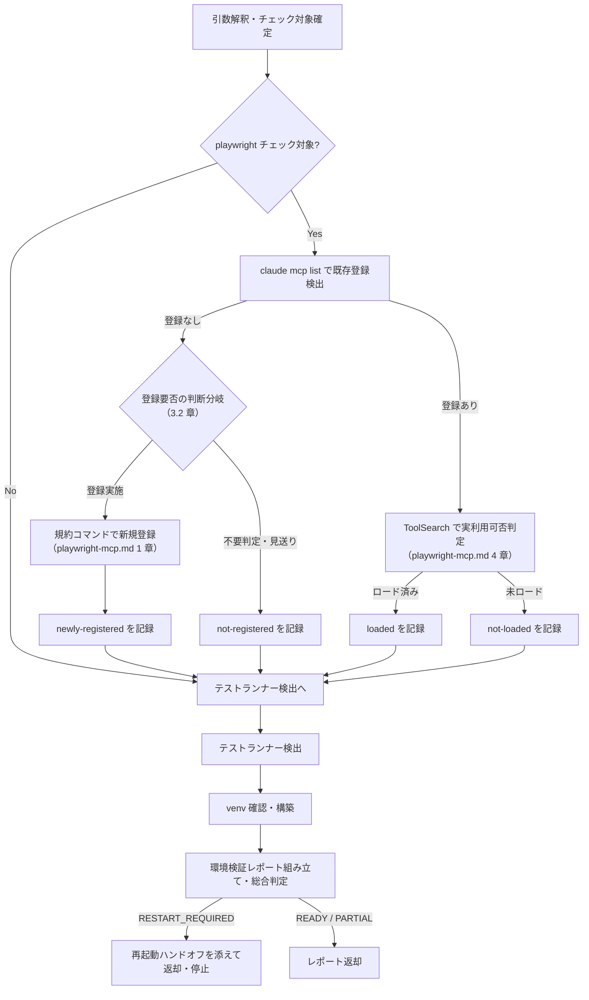

# test-setup 詳細手順（検出・登録・判定・ハンドオフ）

`test-setup` スキルの実行手順の詳細。SKILL.md の実行フローから参照される。
Playwright MCP に関する規範（登録コマンド・検出条件・実判定手順・ハンドオフ文面）の SSOT は
`${CLAUDE_PLUGIN_ROOT}/references/playwright-mcp.md` であり、本書はその適用手順のみを定義する（規範本文は複製しない）。

---

## 1. 全体フロー



- 再起動が必要と判明しても、残りのチェック（ランナー・venv）は**継続して完了させてから**停止する。ランナー検出と venv はセッション再起動の影響を受けないため、再起動後に test-setup を再実行する必要をなくす

## 2. Step 1: チェック対象の確定

| 入力 | 導出されるチェック対象 |
|------|----------------------|
| `checks=` 指定あり | 指定された項目のみ（`playwright` / `runner` / `venv`） |
| `levels=` 指定あり | `playwright`: レベル別 MCP 要否表（`execution-policy.md` 1.4 章）で必要と判定される場合のみ / `runner`: `unit` を含む場合のみ / `venv`: 常に対象 |
| いずれも未指定 | 全チェック（playwright + runner + venv） |

- 例: `levels=unit` のみ → playwright チェックは対象外（unit は MCP 不要）。runner と venv をチェックする
- チェック対象外の項目は、レポートで状態 `not-checked` として明示する（省略しない）

## 3. Step 2: Playwright MCP チェック

### 3.1 既存登録の検出

1. `claude mcp list` を実行する
2. 出力から playwright 系サーバーを特定する。検出条件（登録名が `playwright`、または起動コマンドに Playwright MCP を含む）は `playwright-mcp.md` 2 章に従う
3. 検出結果ごとの対応:

| 検出結果 | 対応 |
|---------|------|
| 0 件 | 3.2 の登録要否の判断分岐へ |
| 1 件 | その登録を採用し、3.3 の実利用可否判定へ。output-dir が規約と異なる場合の扱いは `playwright-mcp.md` 2 章の表に従う（レポートの詳細欄に実際の output-dir を記録する） |
| 複数件 | 対話時: AskUserQuestion で採用する登録を確認する。非対話時: 登録名 `playwright` を優先採用し、無ければ最初に検出した 1 件を採用する（採用しなかった登録はレポートに列挙する） |

### 3.2 登録要否の判断分岐と新規登録（未登録時のみ）

未登録でも無条件では新規登録に進まない。MCP 登録はセッションを跨いで残る**永続的副作用**のため、先に登録要否を判断する。

| # | 条件 | 対応 |
|---|------|------|
| a | `levels=` に Playwright 必要レベル（`execution-policy.md` 1.4 章）が含まれない | 登録しない。登録状態を `not-registered` とし、詳細欄に理由（levels に MCP 必要レベルなし）を記録する |
| b | Playwright 必要レベルを含む（または `levels=` 未指定で必要性を否定できない）+ 対話 | AskUserQuestion で登録実施を確認し、承認された場合のみ登録する。否認時は `not-registered` + 理由を詳細欄に記録する |
| c | 同上 + 非対話 | 登録しない。`not-registered` とし、「Playwright 必要レベルは実行時に skipped になる」旨を引き継ぎ事項に報告する（永続的副作用を非対話で勝手に作らない） |

登録を実施する場合:

1. `playwright-mcp.md` 1 章の規約コマンドを**そのまま**実行する（オプションの追加・省略・変更をしない）
2. `claude mcp list` を再実行し、登録されたことを確認する
3. 結果の記録:

| 結果 | 登録状態 | 備考 |
|------|---------|------|
| 登録成功 | `newly-registered` | ロード状態は判定不要で `not-loaded`（登録直後のセッションではロードされない。`playwright-mcp.md` 3 章） |
| 登録失敗（コマンドエラー） | `failed` | エラー内容を詳細欄に記録する。リトライは 1 回まで |

### 3.3 実利用可否判定（登録済み時のみ）

`playwright-mcp.md` 4 章の実判定手順に従う。

1. ToolSearch で `mcp__playwright__` 系ツールを検索する（例: `select:mcp__playwright__browser_snapshot`）。登録名が `playwright` 以外の場合は実プレフィクスに読み替える（同 2 章の注記）
2. スキーマが取得できた → `loaded`（利用可）
3. 1 件もマッチしない → `not-loaded`（未ロード。再起動が必要）

### 3.4 再起動ハンドオフ

以下のいずれかに該当する場合、総合判定を `RESTART_REQUIRED` とし、レポートに続けて再起動ハンドオフを出力して停止する。

| 該当条件 | ハンドオフの趣旨 |
|---------|----------------|
| 新規登録を実施した（`newly-registered`） | 登録直後は同一セッションで MCP ツールを利用できないため再起動が必要 |
| 登録済みだが未ロード（`not-loaded`） | 現セッションでロードされていないため再起動が必要（再登録はしない） |

- ハンドオフに含める 3 要素（状態保存の確認・再起動依頼・再開手順）とメッセージ例は `playwright-mcp.md` 3 章に従う
- 委譲時: レポート + ハンドオフ文面を返却し、停止の提示はオーケストレータが行う。単独起動時: 本スキルが自らユーザーへ提示して終了する
- setup フェーズ時点では run 未開始のため、再開手順は「再起動後に元のコマンドを再実行」が基本となる（`playwright-mcp.md` 3 章の再開手順の記載に従う）

## 4. Step 3: テストランナー検出（検出規則の SSOT）

本章はテストランナー検出規則のプラグイン内 SSOT である。実行フェーズ側の再確認（`test-run-unit` の `unit-execution.md` 1 章）も本章を参照し、検出表を複製しない。
対象プロジェクトルート（`project=`、既定はカレント）に対して検出する。**テストは実行しない**（ランナー実体の起動確認は `--version` 等の無害なコマンドに限る）。

### 4.1 検出根拠の 3 段評価

上の段から順に評価し、検出できた時点で `detected` とする。(2)(3) による検出は、どの根拠で検出したかを詳細欄に必ず記録する。

| 段 | 検出根拠 | 扱い |
|----|---------|------|
| (1) 構成ファイル | 4.2 の表（`pyproject.toml` / `pytest.ini` / `package.json` / `*.csproj` 等） | 主根拠。Glob で探索し、Read / Grep で判定根拠（該当セクション・依存名）を確認する |
| (2) フォールバック: テストファイル規約 + ランナー実体 | テストファイル規約（`test_*.py` / `*_test.py` / `tests/` ディレクトリ、`*.test.js` / `*_test.go` 等）の存在、**かつ**ランナー実体の起動確認（プロジェクト venv / システムの `pytest --version` 等）の成功 | 構成ファイルなしの素朴なプロジェクト（test_*.py + 仕様書宣言のみ等）を detected にできる。両方成立が条件（テストファイルのみでは不足） |
| (3) 仕様書・README の宣言 | 仕様書・README・テスト計画にランナー名・実行コマンドが宣言されている | 補助証跡。単独では detected にせず、(2) の判断材料（どのランナーの実体を確認するか等）として用いる。採用時は出典を詳細欄に記録する |

### 4.2 構成ファイルの判定材料

| ランナー | 検出根拠（いずれか） | 実行コマンド例 |
|---------|---------------------|---------------|
| pytest | `pyproject.toml` の `[tool.pytest.ini_options]` または依存に pytest / `pytest.ini` / `setup.cfg` の `[tool:pytest]` / `conftest.py` / `tox.ini` | `python -m pytest` |
| jest | `package.json` の devDependencies・scripts に jest / `jest.config.*` | `npx jest` |
| vitest | `package.json` の devDependencies に vitest / `vitest.config.*` | `npx vitest run` |
| npm test | `package.json` の scripts.test（jest / vitest 以外の定義） | `npm test`（プロジェクトの script 定義を尊重） |
| dotnet test | `*.csproj` / `*.sln` にテストフレームワーク参照（xunit / NUnit / MSTest.TestFramework） | `dotnet test` |
| go test | `go.mod` + `*_test.go` の存在 | `go test ./...` |
| JUnit（Maven / Gradle） | `pom.xml` / `build.gradle`（`.kts` 含む）にテスト依存 | `mvn test` / `gradle test` |
| RSpec | `Gemfile` の rspec / `.rspec` | `bundle exec rspec` |
| cargo test | `Cargo.toml`（Rust プロジェクト） | `cargo test` |
| PHPUnit | `phpunit.xml`（`.dist` 含む） / `composer.json` の phpunit | `vendor/bin/phpunit` |

### 4.3 手順と状態値

1. 4.2 の構成ファイル群を Glob で探索する（モノレポを考慮しサブディレクトリも対象。`node_modules` / `.venv` / `bin` / `obj` 等の生成物ディレクトリは除外する）
2. (1) で検出できない場合は (2) を評価する: テストファイル規約を Glob で探索し、該当があれば（(3) の宣言も参考に）ランナー実体を起動確認する
3. 検出結果を整理する。複数ランナー検出（モノレポ・多言語構成）はすべて列挙する

| 状態 | 意味 |
|------|------|
| `detected` | 1 件以上検出。詳細欄にランナー・検出の段（(1)〜(3)）・根拠（根拠ファイルの相対パス・起動確認の結果）・実行コマンド例・対象ディレクトリを列挙する |
| `none` | (1)(2) とも不成立。unit レベルのケースは実行時に skipped となる見込みである旨を引き継ぎ事項に記録する（`execution-policy.md` 2 章） |

### 4.4 構成ファイルなし + ランナー実体なしの場合

テストファイル規約には該当するがランナー実体を起動確認できない場合（(2) 不成立）の扱い:

| モード | 扱い |
|-------|------|
| 対話 | AskUserQuestion でユーザーに確認のうえ、セッション venv（5 章）へテストランナーを導入して `detected` 扱いにできる。導入した事実・導入先・バージョンを検出結果の詳細欄に必ず記録し、実行コマンド例はセッション venv の python 経由（例: `<セッション venv の python> -m pytest`）とする |
| 非対話 | 導入せず `none` とする（unit 等の該当レベルのケースは実行時に skipped。`execution-policy.md` 2 章） |

## 5. Step 4: venv の確認・構築

venv はオーケストレータ `test` の実績管理スクリプト（PyYAML）と `test-report` の報告書生成スクリプト（openpyxl）が使用する。

1. セッション作業領域を確定する: `session=` 指定があればその値、無ければ現行セッションの作業領域（`.claude/.local/work/{yyyyMMdd_nn_summary}/`）を解決する
2. `<セッション作業領域>/workspace/.venv/Scripts/python.exe`（Windows）または `<...>/workspace/.venv/bin/python` の存在を確認する
3. 存在すれば `ready`。存在しなければプラグイン共通の setup スクリプトで構築する:

```bash
bash "${CLAUDE_PLUGIN_ROOT}/references/scripts/setup/setup_venv.sh" "<セッション作業領域>/workspace"
```

| 結果 | 状態 |
|------|------|
| 既存 venv あり | `ready` |
| 構築成功 | `created` |
| 構築失敗・setup スクリプト不在 | `failed`（詳細欄に失敗理由を記録する。構築を偽装しない） |

- venv を本スキル独自の手順で直接構築しない（依存パッケージ定義はプラグイン共通の `${CLAUDE_PLUGIN_ROOT}/references/scripts/setup/requirements.txt` が所有するため、必ず setup スクリプト経由とする）

## 6. Step 5: 状態値と総合判定

### 6.1 チェック項目の状態値

| チェック項目 | 状態値 | 意味 |
|-------------|--------|------|
| Playwright MCP 登録 | `registered` | 既存登録を検出し再利用 |
| | `newly-registered` | 本スキルで新規登録（再起動必要） |
| | `not-registered` | 登録不要判定または登録見送り（3.2 章 a / b 否認 / c）。詳細欄に理由必須 |
| | `failed` | 登録試行が失敗 |
| | `not-checked` | チェック対象外 |
| Playwright MCP ロード | `loaded` | ToolSearch でスキーマ取得成功（利用可） |
| | `not-loaded` | 未ロード（再起動必要） |
| | `not-checked` | チェック対象外・登録なしで判定不能 |
| テストランナー | `detected` / `none` / `not-checked` | 4 章参照 |
| venv | `ready` / `created` / `failed` / `not-checked` | 5 章参照 |

### 6.2 総合判定

優先順位の高い順に判定する（上から最初に該当したもの）。

| 総合判定 | 条件 | 後続の扱い |
|---------|------|-----------|
| `RESTART_REQUIRED` | 登録状態が `newly-registered`、またはロード状態が `not-loaded` | 再起動ハンドオフを添えて停止。再起動後に続行 |
| `PARTIAL` | 停止は不要だが、いずれかの項目が `failed` / `none`、または Playwright 必要レベルを含むのに `not-registered`（3.2 章 b 否認 / c。例: ランナー未検出・venv 構築失敗・MCP 登録失敗・登録見送り） | 続行可否はオーケストレータが判断。利用不可項目に対応するケースは実行時に skipped となる見込み |
| `READY` | 要求された全チェックが利用可（`loaded` / `detected` / `ready` / `created`、`not-checked`〔対象外〕、または必要レベルなしの `not-registered`〔3.2 章 a。levels が unit のみ等〕のみ） | そのまま後続フェーズへ |

## 7. 環境検証レポートの組み立て

SKILL.md「引き渡し」のフォーマットに従い、以下を必ず含める。

1. 総合判定（6.2 章の 3 値）
2. チェック項目表（4 項目すべて。チェック対象外も `not-checked` として行を残す）
3. 引き継ぎ事項:
   - MCP ゲートの判定材料（登録・ロード状態。ハンドオフを実施した場合はその旨）
   - 検出ランナーの詳細（`test-run-unit` がそのまま利用できる粒度: ランナー・対象ディレクトリ・実行コマンド例）
   - 利用不可項目と後続影響（どのレベルのケースが skipped 見込みか）
   - 採用しなかった playwright 系登録（複数検出時のみ）

## 8. トラブルシュート

| 症状 | 確認・対応 |
|------|-----------|
| `claude mcp list` がエラーになる | `claude` CLI の導入状態を確認する。解消しない場合は登録状態を `not-checked` とし、理由を詳細欄に記録して続行する |
| 登録コマンドが失敗する | エラー出力を詳細欄に記録し `failed` とする。1 回だけ再試行してよい。規約コマンドの改変による回避はしない |
| ToolSearch で別名プレフィクスが見つかる | 実プレフィクスを引き継ぎ事項に記録する（実行スキルは実プレフィクスで読み替える。`playwright-mcp.md` 2 章の注記） |
| setup スクリプトが見つからない | venv 状態を `failed` とし、オーケストレータ `test` スキルの導入状態の確認を促す文言を詳細欄に記録する |
