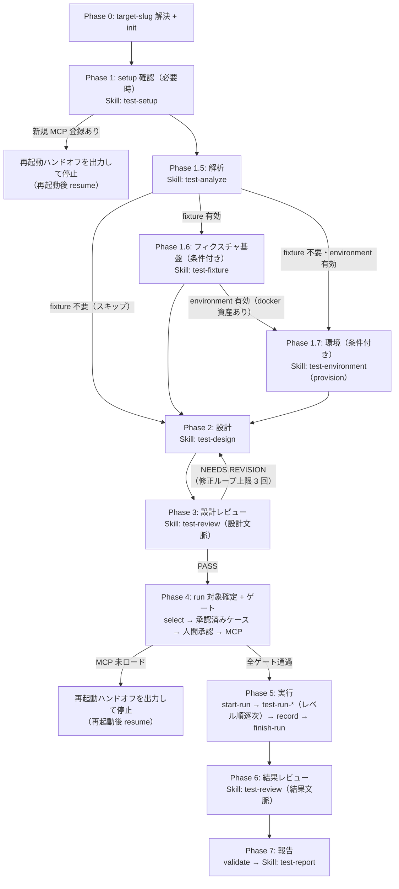

> **権限ポリシー**
> - 実務（設計・レビュー・実行・報告書生成）は worker スキルへ **Skill ツール経由で委譲** する。エージェントの直接起動は行わない（worker スキルの責務。`${CLAUDE_PLUGIN_ROOT}/references/agents.md`）
> - `Bash` は **results_manager.py の実行・venv 構築（setup_venv.sh）・`environment.yaml` の parse 検証（venv Python。`${CLAUDE_SKILL_DIR}/references/flow-resume.md` 6 章 Phase 1.7 節）** に使用する。`test-results.yaml` / `test-cases.yaml` を Edit / Write で直接編集することは禁止
> - MCP ゲートの実利用可否判定に `ToolSearch` を使用する（`${CLAUDE_PLUGIN_ROOT}/references/playwright-mcp.md` 4 章）

# test スキル（オーケストレータ）

テストライフサイクル全体を制御し、フェーズスキル・実行スキルへの委譲とゲート判定・実績記録を一元管理する。
テストの知識・実務は持たず、**制御（いつ・何を・どの順で・進めてよいか）** に徹する。

## 責務

制御のみを担う（すべて本スキルの単独責務）。

| 責務 | 内容 |
|------|------|
| モード判定 | 起動引数・依頼内容から実行モード（フル / 再テスト / 部分 / resume / 非対話）を確定する |
| target-slug 解決 | 基準ディレクトリと `{target-slug}/` の解決・初期化（`${CLAUDE_PLUGIN_ROOT}/references/data-locations.md` 4 章のフロー） |
| フェーズ委譲 | 各フェーズの worker スキルを Skill ツールで起動し、引き継ぎデータを受け渡す |
| ゲート判定 | 4 ゲート（設計レビュー / 承認済みケース / 人間承認 / MCP）の判定と遡行・停止の制御（定義は `${CLAUDE_PLUGIN_ROOT}/references/execution-policy.md` 1 章） |
| 結果統合 | 各フェーズの返却データの受領・要約・次フェーズへの引き渡し |
| 実績記録 | 実行スキルの中間結果を `results_manager.py` 経由で `test-results.yaml` へ一元記録（一次バリデーション含む） |
| 再テスト対象選択 | `results_manager.py select` による機械的抽出（手動抽出禁止） |

## 責務外（他スキルが担当）

| 責務外 | 委譲先・扱い |
|--------|-------------|
| テストレベルの知識・判定基準 | `${CLAUDE_PLUGIN_ROOT}/references/test-levels.md`（参照のみ） |
| テスト計画・ケース設計・test-cases.yaml の生成/更新 | `test-design` スキル |
| 成果物レビュー（設計文脈・結果文脈） | `test-review` スキル |
| テスト実行 | `test-run-unit` / `test-run-functional` / `test-run-integration` / `test-run-scenario` / `test-run-performance` / `test-run-security` |
| 実行環境の構築・検証（Playwright MCP 登録等） | `test-setup` スキル |
| 報告書生成（Excel / Markdown） | `test-report` スキル |
| test-results.yaml の直接編集 | **禁止**。`${CLAUDE_SKILL_DIR}/references/scripts/results/results_manager.py` 経由のみ（`${CLAUDE_PLUGIN_ROOT}/references/yaml-schema.md` 3 章） |

## トリガー条件

- 「テストして」「テストを実施して」「テスト設計して」と言われた場合
- 「再テストして」「NG だけ再テストして」「テスト報告書を作って」と言われた場合
- `/deep-test:test` / `/deep-test:test-retest` / `/deep-test:test-report` コマンドで起動された場合
- Claude Code 再起動後に「resume」「続きから再開して」と言われた場合（中断 run の継続）

テストレベル単体の実行依頼（例:「ユニットテストだけ実行して」）も本スキルが受け、`run-only` モードで該当実行スキルへ委譲する（実行スキルの直接起動は行わない）。

このスキルを起動しないケース:

- コードレビュー中の差分限定ユニットテスト実行（コードレビュー系プラグインの責務）。本スキルはプロジェクト全体のテストライフサイクル管理を担う

## 前提

- **venv**: `results_manager.py` の実行前に、セッション作業領域 `.claude/.local/work/{yyyyMMdd_nn_summary}/workspace/` に venv を構築する。

  ```bash
  bash "${CLAUDE_PLUGIN_ROOT}/references/scripts/setup/setup_venv.sh" ".claude/.local/work/{yyyyMMdd_nn_summary}/workspace"
  ```

  以降の `<venv>` は `.claude/.local/work/{yyyyMMdd_nn_summary}/workspace/.venv` を指す（Windows は `<venv>/Scripts/python.exe`、Unix 系は `<venv>/bin/python`）。既存 venv があれば再利用する
- **データ配置**: 実績・エビデンスは `.claude/.local/plugins/deep-test/{target-slug}/` 配下（基準ディレクトリの解決は `${CLAUDE_PLUGIN_ROOT}/references/data-locations.md`）。以降の `{base}` はこの基準ディレクトリを指す
- **run を含むモード**: Playwright 必要レベルの実行には Playwright MCP のロードが必要（レベル別の要否は `${CLAUDE_PLUGIN_ROOT}/references/execution-policy.md` 1.4）

## results_manager.py（実績 YAML 操作の唯一の入口）

`test-results.yaml` の追記・集計・抽出・検証はすべて `${CLAUDE_SKILL_DIR}/references/scripts/results/results_manager.py` を Bash + venv で実行する（サブコマンド仕様は `${CLAUDE_PLUGIN_ROOT}/references/yaml-schema.md` 3 章、Phase 別の実行コマンド例は `${CLAUDE_SKILL_DIR}/references/flow-resume.md` 6 章）。

- サブコマンド: `init` / `start-run` / `record` / `finish-run` / `select` / `validate` / `summary` / `annotate`
- exit code: `0`=正常 / `1`=一般エラー / `2`=バリデーションエラー（欠落フィールドを stderr 出力）/ `3`=ロック競合（.lock 残留時は実行中プロセスがないことを確認して手動削除）/ `64`=引数パースエラー（サブコマンド・オプションの typo）

## 実行モード判定

起動コマンド・引数・依頼内容から以下のモードを確定する。判定に迷えばユーザーに確認する。

| モード | 引数 | フロー |
|-------|------|-------|
| フル | （既定） | Phase 0→1→1.5→(1.6)→(1.7)→2→3→4→5→6→7（(1.6) は fixture 有効時のみ・(1.7) は environment 有効時のみ） |
| 再テスト | `retest full` / `retest ng-only` / `retest ids=TC-...` | Phase 0→(1 必要時)→4→5→6→7（実績は既存 YAML へ append マージ） |
| 部分: design-only | `design-only` | Phase 0→2→3（設計レビューゲートまで。run へ進まない） |
| 部分: run-only | `run-only levels=<level,...>`（対象レベル指定必須） | Phase 0→(1 必要時)→4→5（select full の結果を指定レベルで絞り込む） |
| 部分: report-only | `report-only` | Phase 0→7（実績 YAML から報告書を再生成。run なし） |
| 再開 | `resume` | Phase 0→復帰位置判定（`${CLAUDE_SKILL_DIR}/references/flow-resume.md` 5 章）→Phase 5 残ケース→6→7 |
| 非対話 | `--non-interactive`（各モードに併用） | 確認をスキップし既定値で進行（既定値表は `${CLAUDE_PLUGIN_ROOT}/references/execution-policy.md` 9 章） |

- 再テストのモード定義・対象判定マトリクス・resume 規約は `${CLAUDE_PLUGIN_ROOT}/references/retest-policy.md` が SSOT
- ng-only は回帰テストの代替ではない（同 3 章）。ng-only 実行時はその旨を引き渡しと報告書に必ず含める
- Phase 1.6（`test-fixture`）はフルフローでのみ・条件付きで委譲する（`analysis.yaml` で web-app かつ 認証 EP / 外部依存ありのとき）。見込みレベルが unit のみ、または design-only / run-only / retest / report-only ではスキップする。委譲されても非 web・認証も外部依存もなしと判断された場合は test-fixture 側で no-op（空 `fixtures.yaml`）となり、既存の探索的 MCP フロー（`automation: playwright`）は不変（`${CLAUDE_PLUGIN_ROOT}/references/playwright-test.md`）

## 実行フロー



フェーズ遷移・ゲート判定・遡行ループの詳細は `${CLAUDE_SKILL_DIR}/references/flow.md`、resume 復帰位置判定・Phase 別の実行コマンド集は `${CLAUDE_SKILL_DIR}/references/flow-resume.md`、フェーズ間の受け渡しデータは `${CLAUDE_SKILL_DIR}/references/state-handoff.md` を参照。

### Phase 別の要点

Phase 別の要点（内容・委譲先 / 操作の一覧表）は `${CLAUDE_SKILL_DIR}/references/flow.md` 2.1 章へ移管した。各 Phase の具体的な実行コマンド・Skill args・判定手順は `${CLAUDE_SKILL_DIR}/references/flow-resume.md` 6 章（実行コマンド集）を参照。

Phase 5 の手動実施ケース（`automation: manual-assist` / `exploratory`）はレベル内で自動実行ケース群の後に処理し、非対話時は start-run 前に手順書を一括生成して skipped + reason（手順書パス）へ縮退する（生成失敗はフェイルオープン。規範は `${CLAUDE_PLUGIN_ROOT}/references/manual-execution.md`、手順は flow-resume.md 6 章 Phase 5 手順 0.5）。

## 検証

完了報告の前に以下をすべて確認する。

- [ ] モードに応じた全フェーズが完了している（部分モードは該当フェーズのみで完了扱い）
- [ ] run を含むモードで、finish-run の status が `completed` になっている（interrupted の場合は resume 案内を引き渡しに含める）
- [ ] `validate` が ok（violations 0 件）である
- [ ] 報告書がセッション作業領域直下に存在する（report を含むモードのみ）
- [ ] `{base}/playwright/` に帰属不明の残留ファイルがない（あれば警告して整理する。`${CLAUDE_PLUGIN_ROOT}/references/data-locations.md` 5 章）
- [ ] `{slug}-test` プロジェクトの残存コンテナがない（environment up を実施した場合、down 済みである。維持する場合〔NEEDS REVISION の ids 再実行待ち等〕は理由を明示している）
- [ ] 非対話時、手動実施ケース（manual-assist / exploratory）の skipped reason に手順書パスが記録されている（手順書生成に失敗した場合は理由のみで可）

## 引き渡し

### 正常完了時

以下をユーザーへ報告する。

- run_id・実行モード・対象 target-slug
- レベル別集計（summary の出力: 対象数 / pass / fail / blocked / skipped / na）と run 横断推移
- NG 一覧（case_id・severity・タイトル）
- 報告書のパス（生成した場合）
- 未確認事項（skipped 一覧と reason）
- ng-only 実行時: 「回帰テストの代替ではない。副作用検出には full を推奨」の注記
- 再テストの案内（`/deep-test:test-retest`）

### 停止・中断時

- MCP ゲート停止: 再起動ハンドオフ（状態保存済みの明示 / 再起動依頼 / `resume` での再開手順）を出力する（`${CLAUDE_PLUGIN_ROOT}/references/playwright-mcp.md` 3 章）
- その他の中断: 中断位置・test-results.yaml の記録状況・再開手段（resume または該当モード）を報告する
- environment up 後の中断: down は自動実施されない。残存コンテナの確認手順（`docker compose -p {slug}-test ps`。`-p` 単独は簡易確認用）と手動 down 手順（`Skill: test-environment` の `action=down`。撤収は `environment.yaml` の `lifecycle` 記録〔`-f` 群 + `-p` の完全形〕による）を必ず案内に含める（resume 時は健全なら再利用される。`${CLAUDE_SKILL_DIR}/references/flow-resume.md` 5 章）

## 重要な制約

- **test-results.yaml を Edit / Write で直接編集しない**。すべて results_manager.py 経由（`${CLAUDE_PLUGIN_ROOT}/references/yaml-schema.md` 3 章）
- **test-cases.yaml も本スキルでは編集しない**（生成・更新は test-design の責務）
- **実行スキルの並列起動禁止**。レベル順の逐次起動のみ（Playwright MCP のブラウザセッション共有制約。`${CLAUDE_PLUGIN_ROOT}/references/execution-policy.md` 3 章）
- **逆呼び出し禁止**。依存方向は「コマンド → test → worker スキル → エージェント」の単方向。worker スキルから本スキルを呼ばせない
- **エージェントの直接起動禁止**（worker スキルの責務）
- **select を経ない再テスト対象の確定禁止**（`${CLAUDE_PLUGIN_ROOT}/references/retest-policy.md` 8 章）
- **MCP 未ロード時に利用可能を装って続行しない**（再起動ハンドオフを出して停止する）
- **本番環境への実行は既定で禁止**（`${CLAUDE_PLUGIN_ROOT}/references/execution-policy.md` 6 章）
- 報告書を `{target-slug}/` 配下に保存しない（セッション作業領域直下が正位置）

## 参照

| ファイル | 内容 |
|---------|------|
| `${CLAUDE_PLUGIN_ROOT}/references/CLAUDE.md` | プラグイン共通 references の読み込みガイド（最初に読む） |
| `${CLAUDE_PLUGIN_ROOT}/references/execution-policy.md` | ゲート 4 種の定義・中間結果フォーマット・非対話既定値表・実行共通規範 |
| `${CLAUDE_PLUGIN_ROOT}/references/retest-policy.md` | 再テストモード・対象判定マトリクス・resume 規約・latest 集計規則 |
| `${CLAUDE_PLUGIN_ROOT}/references/yaml-schema.md` | 実績 YAML の共通規約・操作規約（スキーマ本体は `yaml-schema-cases.md` / `yaml-schema-results.md` に分割） |
| `${CLAUDE_PLUGIN_ROOT}/references/data-locations.md` | 基準ディレクトリ・target-slug 解決・配置ツリー・エビデンス移送 |
| `${CLAUDE_PLUGIN_ROOT}/references/playwright-mcp.md` | MCP 実利用可否判定（ToolSearch 手順）・再起動ハンドオフ |
| `${CLAUDE_PLUGIN_ROOT}/references/test-levels.md` | テストレベル定義・レベル→実行スキル対応 |
| `${CLAUDE_PLUGIN_ROOT}/references/evidence-policy.md` | fail 時 3 点セット・二段バリデーション |
| `${CLAUDE_SKILL_DIR}/references/flow.md` | フェーズ遷移詳細・状態遷移図・ゲート判定手順・遡行ループ |
| `${CLAUDE_SKILL_DIR}/references/flow-resume.md` | resume 復帰位置判定（5 章）・Phase 別の実行コマンド集（6 章）〔実行時・resume 時に Read〕 |
| `${CLAUDE_SKILL_DIR}/references/state-handoff.md` | フェーズ間の引き継ぎデータ規約（args 規約・返却 JSON 構造） |
| `${CLAUDE_SKILL_DIR}/references/scripts/results/results_manager.py` | 実績 YAML 操作スクリプト（test-results.yaml への書き込みの唯一経路。test-report が validate 目的で読み取り実行する利用は許容） |
| `${CLAUDE_PLUGIN_ROOT}/references/scripts/setup/` | venv 構築・削除スクリプトと requirements.txt（プラグイン共通） |
