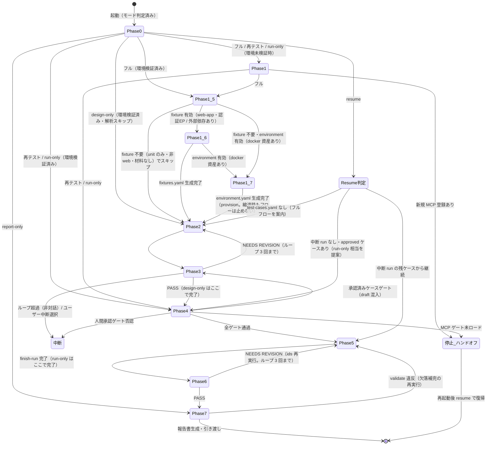
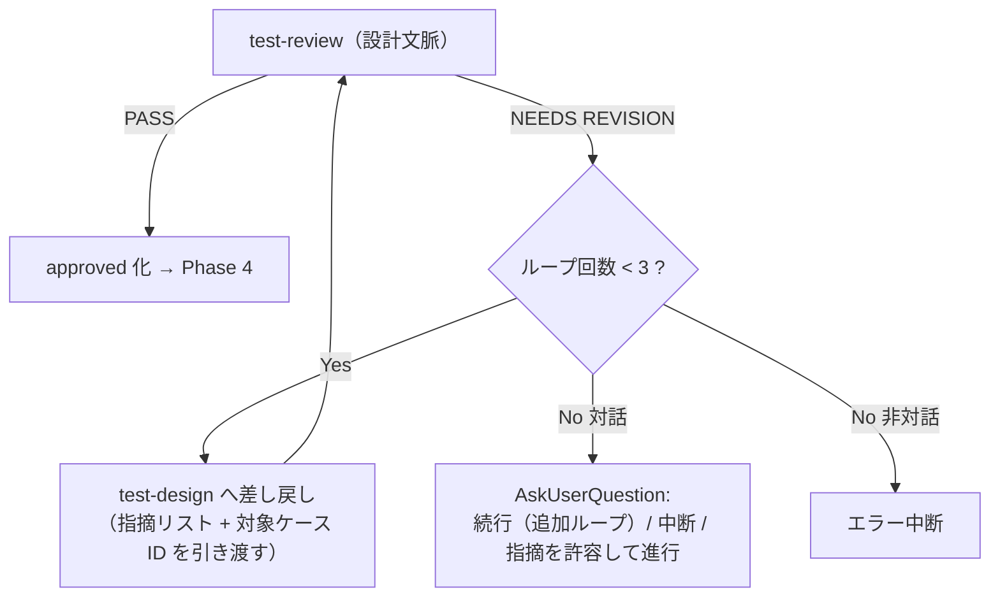

# フェーズ遷移詳細（test オーケストレータ）

オーケストレータ `test` のフェーズ遷移・各フェーズの入出力・ゲート判定手順・NEEDS REVISION 時の遡行ループ・resume の途中復帰位置判定を定義する。
ゲートそのものの定義（4 種）と非対話既定値は `${CLAUDE_PLUGIN_ROOT}/references/execution-policy.md` が SSOT であり、本書は**オーケストレータ側の運用手順**（判定の実施方法・遷移制御）のみを定義する。

---

## 1. フェーズ状態遷移図



## 2. フェーズ入出力一覧

各フェーズの受け渡しデータの詳細構造は `state-handoff.md` を参照。

| フェーズ | 入力 | 処理（委譲先） | 出力 |
|---------|------|--------------|------|
| Phase 0: target 解決 | 起動引数・依頼内容 | 基準ディレクトリ解決 → slug 選択（AskUserQuestion）→ venv 準備 → `init` | `{base}` / `{target-slug}` / 解決済みパス集合 |
| Phase 1: setup 確認 | target-slug・必要レベルの見込み | `Skill: test-setup` | 環境検出結果（MCP / ランナー / venv） |
| Phase 1.5: 解析 | target-slug・（`spec=` / `diff=` があれば）仕様 / 差分 | `Skill: test-analyze` | `analysis.yaml` / `target-analysis.md`（read-only の対象理解材料） |
| Phase 1.6: フィクスチャ基盤（条件付き） | target-slug・`analysis.yaml`（材料）・SUT `project` ルート | `Skill: test-fixture` | `fixtures.yaml`（マニフェスト）+ SUT テストコード（フィクスチャ / config）。fixture 不要時は空マニフェストで no-op |
| Phase 1.7: 環境（条件付き） | target-slug・`analysis.yaml`（材料）・SUT `project` ルート・見込み `levels` | `Skill: test-environment`（provision。up は Phase 5 手順 0・down は Phase 6 判定後 = 状態機械上は Phase4→Phase5 / Phase6→Phase7 遷移の間に位置する） | `environment.yaml`（マニフェスト）+ 派生成果物（`environment/compose.test.yml`・`environment/.env.test`）。docker 資産なし / unit のみ / docker 不可は no-op（`applicability` + `reason`） |
| Phase 2: 設計 | 対象説明・要件情報・（差し戻し時）レビュー指摘 | `Skill: test-design` | `test-plan.md` / `test-cases.yaml`（draft） |
| Phase 3: 設計レビュー | test-cases.yaml のパス・対象説明 | `Skill: test-review`（設計文脈） | PASS / NEEDS REVISION + 指摘リスト |
| Phase 4: 対象確定 + ゲート | モード・（ids 時）ケース ID | `select` → 3 ゲート判定 | 確定 scope（approved のみ）・ゲート通過記録 |
| Phase 5: 実行 | scope・run_id・環境情報（`environment.yaml` があれば project 名・base URL・イメージ情報から組み立てる） | `start-run` → `Skill: test-run-*`（逐次）→ `record` → `finish-run` | 確定 run（test-results.yaml 反映済み） |
| Phase 6: 結果レビュー | run_id・fail 概要・集計 | `Skill: test-review`（結果文脈） | PASS / NEEDS REVISION + 指摘リスト |
| Phase 7: 報告 | target-slug・（形式指定があれば）形式 | `validate` → `Skill: test-report` | 報告書パス（セッション作業領域直下） |

### 2.1 Phase 別の要点（委譲・操作の要点）

SKILL.md の実行フロー（mermaid・モード表）に対応する各 Phase の運用要点（SKILL.md「Phase 別の要点」から移管）。具体的な実行コマンド・Skill args・判定手順は 6 章（実行コマンド集）。

| Phase | 内容 | 委譲先 / 操作 |
|-------|------|-------------|
| 0: target 解決 | `{base}` 解決 → 既存 slug は **AskUserQuestion** で選択（非対話: 唯一の既存 slug、複数はエラー中断）→ venv 準備 → `init` | results_manager |
| 1: setup 確認 | run を含むモードで環境未検証の場合のみ。検出結果（MCP ロード状況・ランナー・venv）を受領。新規 MCP 登録時は再起動ハンドオフを出力して**停止**。総合判定 **PARTIAL**（一部チェック失敗 + 一部成功）受領時は、利用可能なレベルは続行し、利用不可レベルに属するケースは実行時に skipped 記録となる旨を確認して進む（詳細な判定は test-setup の検出結果に従う） | Skill: test-setup |
| 1.5: 解析 | フルフローで対象ソースを read-only 解析し、`analysis.yaml` / `target-analysis.md`（下流消費材料）を生成。決定は行わず提案（hint）に留める。`spec=` / `diff=` 指定時は仕様乖離 / 変更影響も材料化 | Skill: test-analyze |
| 1.6: フィクスチャ基盤（条件付き） | フルフローで fixture が有効な場合のみ（unit のみ・design-only / run-only / retest / report-only はスキップ）。`analysis.yaml` を消費し、再現可能な Playwright Test 基盤（`fixtures.yaml` + SUT テストコード）を生成 / 拡充。非 web・認証も外部依存もなしは no-op（空マニフェスト） | Skill: test-fixture |
| 1.7: 環境（条件付き） | フルフローで docker 資産が見込まれる場合のみ委譲（unit のみ・design-only / run-only / retest / report-only はスキップ。run-only / retest / resume は provision 済み `environment.yaml` があれば up / down のライフサイクル呼出のみ）。`analysis.yaml` を消費し、SUT の docker 資産から非破壊でテスト用派生環境（`environment.yaml` + `environment/compose.test.yml`・`.env.test`）を provision。資産なし / docker 不可は no-op（`applicability` + reason）でフローを止めない。受領後は `environment.yaml` の parse 検証を venv Python で行う（失敗は再委譲 1 回 → 環境なし縮退・venv 不在は目視縮退。6 章 Phase 1.7 節） | Skill: test-environment |
| 2: 設計 | test-plan.md + test-cases.yaml（全ケース draft）の生成 | Skill: test-design |
| 3: 設計レビュー | PASS → test-review が approved 化まで実施。NEEDS REVISION → test-design へ差し戻し（**上限 3 回**、超過時は対話=AskUserQuestion / 非対話=エラー中断） | Skill: test-review（design） |
| 4: 対象確定 + ゲート | `select` で scope を機械確定（LLM 判断禁止）→ 承認済みケースゲート → 人間承認ゲート（**AskUserQuestion**。非対話はスキップ）→ MCP ゲート（ToolSearch 実判定。未ロードは再起動ハンドオフで**停止**、unit のみは判定不要） | results_manager + AskUserQuestion + ToolSearch |
| 5: 実行 | 手順 0: `environment.yaml` が applicable なら environment up（`action=up`。失敗は縮退でフローを止めない。down は Phase 6 判定後 = PASS → down・NEEDS REVISION → ids 再実行に備え維持）→ 手順 0.5（非対話時のみ）: 手動系ケース（`automation: manual-assist` / `exploratory`）の手順書一括生成（生成失敗はフェイルオープンで続行）→ `start-run` → レベル順**逐次**で test-run-* を Skill 起動（並列禁止。レベル内の `cases=` は自動 → 手動の順・手動系ケースを含むレベルには非対話・生成成功時のみ `manual-sheet={path}` を付与）→ 中間結果を 1 件ずつ `record`（exit 2 は当該実行スキルへ追加取得を指示して再 record）→ `finish-run`（欠落検出時は補完実行後に再確定） | Skill: test-run-* + results_manager + Skill: test-environment（up / down） |
| 6: 結果レビュー | 欠陥分析・severity 妥当性の検証。NEEDS REVISION の遡行は 4 章（上限 3 回） | Skill: test-review（results） |
| 7: 報告 | `validate`（違反があれば差し戻して生成しない）→ test-report 起動（形式選択は test-report が実施、非対話既定 Markdown）。報告書はセッション作業領域直下 | results_manager + Skill: test-report |

## 3. ゲート判定手順（オーケストレータ側の運用）

ゲートの定義・配置・非対話時挙動は `${CLAUDE_PLUGIN_ROOT}/references/execution-policy.md` 1 章が SSOT。本節は判定の実施方法のみを定める。

| ゲート | 判定材料 | 判定手順 | 不通過時の遷移 |
|-------|---------|---------|---------------|
| 設計レビューゲート | test-review（設計文脈）の返却（PASS / NEEDS REVISION） | 返却 JSON の `verdict` を読む。判定があいまいな返却（verdict 欠落）は NEEDS REVISION として扱う | 4 章の修正ループへ |
| 承認済みケースゲート | `select` 出力の `draft_cases` | `draft_cases` が空 → 通過。非空 → test-review（設計文脈）を draft ケースに対して実施（PASS 時の approved 化は test-review が実施）→ `select` を再実行して確認 | Phase 3（対象は draft ケースのみ） |
| 人間承認ゲート | `select` 出力の `cases` / `details` | AskUserQuestion で提示（ケース数・レベル別内訳・想定所要時間 = details の timeout_sec 合計を上限とする概算・破壊的操作ケース数 = select 出力の `destructive` 集計・手動実施ケース件数 = select 出力の `details.automation` の `manual-assist` / `exploratory` を destructive と同型で機械集計〔提示項目の定義は execution-policy.md 1.3・処理規範は `${CLAUDE_PLUGIN_ROOT}/references/manual-execution.md`〕）。非対話時はスキップ | 中断（scope・実績は未変更のまま） |
| MCP ゲート | scope のレベル構成 + ToolSearch 結果 | scope が unit のみ → 判定不要で通過。それ以外 → ToolSearch で `mcp__playwright__` 系を検索（手順・判定基準は `${CLAUDE_PLUGIN_ROOT}/references/playwright-mcp.md` 4 章） | 再起動ハンドオフを出力して停止（run 開始前なら start-run しない。run 中の喪失は skipped 記録で継続） |

ゲート判定の順序は固定: `select` → 承認済みケースゲート → 人間承認ゲート → MCP ゲート → environment up（`environment.yaml` が applicable のときのみ実施する Phase 5 手順 0。ゲートではなく、失敗は縮退でフローを止めない）→ 手動手順書の一括生成（非対話時のみ実施する Phase 5 手順 0.5。ゲートではなく、生成失敗はフェイルオープンで続行）→ `start-run`。
`start-run` は**全ゲート通過後**にのみ実行する（未実行の run レコードを残さないため）。

## 4. NEEDS REVISION 時の遡行ループ

### 4.1 設計文脈（Phase 3 → Phase 2）



- **ループ回数の数え方**: 「test-design への差し戻し」を 1 回と数える（初回設計は 0 回目。test-review の実行回数 − 1 に一致する）
- 差し戻し時は test-review の指摘リスト（指摘内容・根拠・対象ケース ID・信頼度）をそのまま test-design に引き渡す（要約で情報を落とさない）
- test-design は指摘対象ケースのみ更新する（revision +1 → draft 戻り。規則は `${CLAUDE_PLUGIN_ROOT}/references/yaml-schema-cases.md` 3 章）
- 差し戻し後の再レビューの構成（指摘元エージェントのみ / フル並列 / 本体差分チェック）は `${CLAUDE_PLUGIN_ROOT}/skills/test-review/references/review-procedures.md` の差し戻し再レビュー規定に従う
- ユーザーが「指摘を許容して進行」を選んだ場合、未解消の指摘を results_manager.py の `annotate` サブコマンドで**必ず注釈として登録**する（例: `annotate --source test-review/design --text "..."`）。登録した注釈は報告書の「所見・注記」に機械出力される（手動転記はしない）
- ループ超過時の AskUserQuestion 選択肢の文言例（各選択肢に帰結を 1 行で添える）:
  - 「続行（追加ループ）: 指摘の修正と再レビューをもう 1 回実施します」
  - 「中断: ここで処理を終了します（test-cases.yaml は draft のまま保存済み。resume 対象ではなく design-only 等での再開になります）」
  - 「指摘を許容して進行: 未解消の指摘は annotate で注釈登録され、報告書の所見・注記に出力されます」

### 4.2 結果文脈（Phase 6 → Phase 5）

結果は append-only（上書き不可）のため、遡行は「再実行による上書きではなく追加 run」で行う。

| 指摘の種類 | 遡行方法 |
|-----------|---------|
| 再現手順・検証データ・エビデンスの不備（fail の 3 点セット品質） | 該当ケースを `ids` モードで再実行（新規 run）し、充足した defect で再記録する |
| severity の妥当性への疑義 | defect-analyst の指摘（`${CLAUDE_PLUGIN_ROOT}/references/severity-policy.md` 基準）を採用する場合も、実績の書き換えはせず該当ケースを `ids` 再実行で再記録する |
| 分析・所見レベルの指摘（実績の変更不要） | オーケストレータが results_manager.py の `annotate` サブコマンドで注釈として登録する（例: `annotate --source test-review/results --text "..."`）。報告書の所見・注記に機械出力される（遡行しない） |

- ループ上限は設計文脈と同じ **3 回**。超過時の挙動も 4.1 と同一（対話 = ユーザー判断 / 非対話 = エラー中断）

## 5. resume の途中復帰位置判定

resume 対象・run_id 引き継ぎ・複数中断時の整理の規約は `${CLAUDE_PLUGIN_ROOT}/references/retest-policy.md` 6 章が SSOT。オーケストレータは以下の手順で復帰位置を決める。

### 5.1 判定手順

1. Phase 0 を実施する（target-slug 解決。resume でも省略しない）
2. `summary` を実行し、`runs[]` から `status` が `in_progress` または `interrupted` の run を抽出する
3. 復帰位置を判定する:

| 状態 | 復帰位置 |
|------|---------|
| 中断 run が 1 件以上ある | 最新の 1 件（run_id 降順の先頭）を対象に **Phase 5** から再開。それより古い中断 run は AskUserQuestion で確認のうえ `finish-run --status aborted` で整理する |
| 中断 run がなく、approved ケースがある | 実行可能な状態のため、run-only 相当（Phase 4 から）を提案する |
| 中断 run がなく、test-cases.yaml が存在しない | resume 対象なし。フルフロー（Phase 2 から）を案内する |

4. 中断 run から再開する場合、残ケースを機械的に確定する: `validate` の `resumable_runs` フィールド（`{run_id, status, missing}` の構造化リスト）から当該 run の `missing` を resume scope として採用する（副作用なしで取得できる。`finish-run` の仮実行や件数のみでの推定は行わない）
5. resume scope に Playwright 必要レベルが含まれる場合は **MCP ゲートを再判定**する（resume の主用途が MCP 未ロード停止からの復帰であるため必須）
6. `environment.yaml` が存在する場合は、まず 6 章 Phase 1.7 節と同形の parse 検証を行う（段 2 の parse 失敗は破損マニフェストの修復に限り再委譲 1 回〔resume では通常 provision を再委譲しない原則〔本節冒頭・Phase 1.7〕の例外〕 → それでも不能なら環境なし縮退・段 1 失敗/venv 不在は目視縮退。中断中に破損した `environment.yaml` を applicable 判定にそのまま用いないため）。parse 可能かつ `applicability: applicable` の場合は**環境を再確認**する: `docker compose -p {slug}-test ps` + health 再確認（`Skill: test-environment` の `action=status`）で健全なら**再利用**する（再 up 不要）。不健全なら `action=down` → `action=up` で作り直す（呼出例は 6 章）。なお `-p` 単独の `ps` は簡易確認用であり、撤収の権威操作（down）は `environment.yaml` の `lifecycle` 記録（up と同一の `-f` 群 + `-p` の完全形）を用いる
7. **run_id は新規採番しない**。中断 run の run_id をそのまま実行スキルへ引き渡し、残ケースの record を追記する
8. 全ケース記録後に `finish-run` で `completed` に確定し、Phase 6 → Phase 7 へ進む

### 5.2 注意事項

- resume では `start-run` を実行しない（新規 run を作らない）
- 中断時点までの record 済み結果は永続化済みであり、再実行・再記録しない（重複 record は exit 2 で拒否される）
- 中断 run が MCP ゲート停止由来か（scope に Playwright 必要レベルが残っているか）を確認してから実行スキルを起動する
- 中断時に environment が `status.state: up` のまま残っている場合、down は自動実施されていない。`docker compose -p {slug}-test ps`（`-p` 単独は簡易確認用。down の完全形は 5.1 手順 6 の注記のとおり）で残存コンテナを確認し、resume するなら 5.1 手順 6 の環境再確認で再利用 / 作り直しを判定する。resume しない場合は `Skill: test-environment`（`action=down`）による手動 down を案内する

## 6. 実行コマンド集（Phase 別）

SKILL.md の実行フローおよび 2.1 章「Phase 別の要点」に対応する具体的な実行コマンド・Skill args。`<venv>` はセッション作業領域の venv、`{base}` は data-locations.md の基準ディレクトリを指す。

### Phase 0: target-slug 解決 + init

1. 基準ディレクトリ `{base}` を解決する（`${CLAUDE_PLUGIN_ROOT}/references/data-locations.md` 1 章・4 章）
2. 既存 `{target-slug}/` があれば AskUserQuestion で既存一覧 +「新規作成」を提示して選択させる。非対話時は唯一の既存 slug を採用（複数存在はエラー中断）
3. venv を準備し、初期化する:

   ```bash
   "<venv>/Scripts/python.exe" "${CLAUDE_SKILL_DIR}/references/scripts/results/results_manager.py" init      --base "{base}" --target "{target-slug}"
   ```

### Phase 1: setup 確認（必要時）

run を含むモードで実行環境が未検証の場合に起動する（`levels=` には依頼内容・既存ケースから見込んだテストレベルの CSV を渡す）:

```text
Skill(skill: "deep-test:test-setup", args: "target={target-slug} base={base} levels={見込みレベルCSV}")
```

- レベル見込みが unit のみの場合、playwright チェックは not-checked となり MCP 登録に進まない（levels 未指定は全チェックになるため、見込みがあれば必ず渡す）

検出結果（MCP ロード状況・テストランナー・venv）を受領する。対象アプリへの到達可否は実行フェーズで判定する（execution-policy.md の条件付き動的検証）。新規に MCP 登録を行った場合は再起動ハンドオフ（`${CLAUDE_PLUGIN_ROOT}/references/playwright-mcp.md` 3 章）を出力して停止する。

### Phase 1.5: 解析（test-analyze）

フルフローで `test-setup`（Phase 1）の後・`test-design`（Phase 2）の前に起動する。テスト対象ソースを read-only で静的に理解し、下流が消費する解析材料（`analysis.yaml` / `target-analysis.md`）を生成する:

```text
Skill(skill: "deep-test:test-analyze", args: "target={target-slug} base={base} 対象説明={...} spec={仕様パス} diff={差分ref} --non-interactive")
```

- `spec=` / `diff=` は指定がある場合のみ付与する（未指定時は仕様乖離検出 / 変更影響分析をスキップ）。`--non-interactive`（モード指定）は非対話時のみ付与する
- 出力の `analysis.yaml`（機械可読・`${CLAUDE_PLUGIN_ROOT}/references/yaml-schema-analysis.md` 準拠）を Phase 2 の `test-design` が消費し、レベル / 技法 / 優先度 / ケースを決定する（材料の単方向消費）
- test-analyze は決定を行わず read-only の材料生成に徹する（逆呼び出し禁止・2 段委譲を厳守）。`test-fixture`（Phase 1.6）/ `test-environment`（Phase 1.7）も本材料を消費する（材料の単方向消費）

### Phase 1.6: フィクスチャ基盤（test-fixture・条件付き）

フルフローで `test-analyze`（Phase 1.5）の後・`test-design`（Phase 2）の前に、**fixture が有効な場合のみ**起動する（見込みレベルが unit のみ、または design-only / run-only / retest / report-only ではスキップ）。`analysis.yaml` を単方向消費し、再現可能な Playwright Test 基盤（`fixtures.yaml` + SUT テストコード）を生成 / 拡充する:

```text
Skill(skill: "deep-test:test-fixture", args: "target={target-slug} base={base} project={SUT プロジェクトルート} 対象説明={...} --non-interactive")
```

- 材料 `analysis.yaml`（`{base}/{target-slug}/analysis.yaml`）は引数で渡さず、test-fixture が Read で解決する（非存在時は test-fixture 側で軽量補完する）
- 出力の `fixtures.yaml`（機械可読・`${CLAUDE_PLUGIN_ROOT}/references/playwright-test.md` 1 章準拠）を Phase 2 の `test-design` が消費し、各ケースの `fixtures:` と `automation: playwright-test` を決定する（材料の単方向消費）
- 起動されても fixture 対象なし（非 web・認証も外部依存もなし）と判断した場合は、SUT に何も書かず空の `fixtures.yaml`（`fixtures: []`）+ 理由を返して正常終了する（no-op。既存の探索的 MCP フローは Phase 1.5 → Phase 2 に直行する）
- test-fixture は SUT のテストディレクトリにのみ書き込む（プロダクションコード不変・逆呼び出し禁止・2 段委譲を厳守）

### Phase 1.7: 環境（test-environment・条件付き）

フルフローで `test-fixture`（Phase 1.6。スキップ時は `test-analyze`）の後・`test-design`（Phase 2）の前に、docker 資産が見込まれる場合のみ provision を委譲する（見込みレベルが unit のみ、または design-only / run-only / retest / report-only ではスキップ。run-only / retest / resume では provision 済み `environment.yaml` があれば up / down のライフサイクル呼出のみ行う）。SUT の docker 資産から非破壊でテスト用派生環境を生成する:

```text
Skill(skill: "deep-test:test-environment", args: "target={target-slug} base={base} project={SUT プロジェクトルート} action=provision levels={見込みレベルCSV} --non-interactive")
```

- `--non-interactive`（モード指定）は非対話時のみ付与する（Phase 1.5 と同じ条件注記。オーケストレータの対話 / 非対話モードを test-environment へ伝播する。Phase 5 手順 0 の `action=up`・Phase 6 判定後の `action=down` の呼出でも同じ）
- 材料 `analysis.yaml`（`{base}/{target-slug}/analysis.yaml`）は引数で渡さず、test-environment が Read で解決する（非存在時は test-environment 側で軽量補完する）
- 出力の `environment.yaml`（機械可読・`${CLAUDE_PLUGIN_ROOT}/references/yaml-schema-environment.md` 準拠）と派生成果物（`environment/compose.test.yml`・`environment/.env.test`）を、Phase 2 の `test-design` が preconditions / 環境前提の材料に、Phase 5 のオーケストレータが `start-run --environment` の環境文字列の材料に消費する（材料の単方向消費）
- **受領後の parse 検証**: provision 受領後、`environment.yaml` が YAML として parse 可能であることを venv の Python で 2 段確認する（PyYAML は共通 requirements.txt に固定済み。確認するのは parse 可能性のみ・値の解釈やスキーマ妥当性の再判定はしない〔生成品質は test-environment の自己チェックの責務〕）:

  ```bash
  # 段 1: PyYAML の可用性（壊れた venv の切り分け）。ここでの失敗は parse 失敗ではなく「検証不能」
  "<venv>/Scripts/python.exe" -c "import yaml"
  # 段 2: parse 可能性の確認
  "<venv>/Scripts/python.exe" -c "import sys, yaml; sys.stdout.reconfigure(encoding='utf-8'); yaml.safe_load(open(sys.argv[1], encoding='utf-8')); print('environment.yaml parse OK')" "{base}/{target-slug}/environment.yaml"
  ```

  - **段 2 が失敗（parse 失敗）**: test-environment へ provision の再委譲を **1 回だけ** 試み（失敗内容を args の依頼文脈に含める）、再委譲の受領後は本検証を再適用する。それでも parse 失敗の場合は環境なし前提（従来フロー）へ縮退して続行する（フローを止めない。縮退した旨を進捗と報告材料に記録する）
  - **段 1 が失敗（PyYAML 欠落の壊れた venv・稀）、または venv 未構築の時点で受領した場合**（通常は Phase 0 で構築済みのため稀）: 機械検証を行えないため、Read によるファイルの存在・可読性の目視確認に縮退する（parse 失敗〔再委譲〕とは振り分けを分ける = 検証不能を再委譲の無限誘発に使わない。目視は値・キーの妥当性を判定しない粗い代替であり、test-environment の自己チェックを代替しない）
- 起動されても docker 資産なし / docker 利用不可 / unit のみと判断した場合は、SUT に何も書かず no-op マニフェスト（`applicability: not-applicable | unavailable` + `reason`）を返して正常終了する（縮退はフローを止めない。ユーザーが起動済み URL を渡した場合は従来前提が常に優先）
- test-environment は SUT の docker 資産へ書き込まない（派生は deep-test データ領域のみ・逆呼び出し禁止・2 段委譲を厳守）
- up は Phase 5 手順 0（全ゲート通過後・`start-run` 直前）・down は Phase 6 判定後に、本節と同形の Skill 呼出（`action=up` / `action=down`）で行う（呼出例は Phase 5 / Phase 6 の節）

### Phase 2: 設計

```text
Skill(skill: "deep-test:test-design", args: "target={target-slug} base={base} 対象説明={...}")
```

出力: `{base}/{target-slug}/test-plan.md` と `test-cases.yaml`（全ケース `review_status: draft`）。

### Phase 3: 設計レビュー + 設計レビューゲート

```text
Skill(skill: "deep-test:test-review", args: "context=design target={target-slug} base={base}")
```

- PASS → test-review が承認反映（`review_status: approved` 化）まで実施して返却する。承認確定時に、test-plan.md のスコープ外宣言（未検証領域・対象外レベルと理由）を `annotate --source test-plan` で**必ず登録**する（未登録時のみ。報告書の「所見・注記」へ機械出力され、Phase 7 での再登録は不要）。その後 Phase 4 へ進む:

  ```bash
  "<venv>/Scripts/python.exe" "${CLAUDE_SKILL_DIR}/references/scripts/results/results_manager.py" annotate      --base "{base}" --target "{target-slug}" --source test-plan --text "スコープ外: {宣言内容}"
  ```

- NEEDS REVISION → 指摘リストを添えて test-design へ差し戻す修正ループ（上限 3 回）。超過時: 対話 = AskUserQuestion でユーザー判断（続行 / 中断 / 指摘許容）、非対話 = エラー中断（execution-policy.md 1.1）

### Phase 4: run 対象確定とゲート

1. select で scope を機械的に確定する（LLM の判断で対象を確定しない）:

   ```bash
   "<venv>/Scripts/python.exe" "${CLAUDE_SKILL_DIR}/references/scripts/results/results_manager.py" select      --base "{base}" --target "{target-slug}" --mode ng-only
   # フル/再テスト full → --mode full / 再テスト ids → --mode ids --ids "TC-FUNC-002,TC-SYS-001"
   ```

2. 承認済みケースゲート: 出力の `draft_cases` が空でなければ、先に test-review（設計文脈）を実施して approved 化してから進む（approved 化は test-review が実施）
3. 人間承認ゲート: AskUserQuestion で「実行に進むか」を確認する。提示必須項目（ケース数 / 対象レベル / 想定所要時間 / 破壊的操作ケース数 = select の `destructive` 集計 / 手動実施ケース件数（select `details.automation` の機械集計））は execution-policy.md 1.3。非対話時はスキップ
4. MCP ゲート: scope に Playwright 必要レベルが含まれる場合のみ、ToolSearch で `mcp__playwright__*` の実利用可否を判定する（playwright-mcp.md 4 章）。未ロード → 再起動ハンドオフを出力して停止（利用可を装った続行は禁止）。unit のみの scope は判定不要で通過

### Phase 5: 実行（レベル順逐次 → record → finish-run）

0. **手順 0: environment up**（`environment.yaml` が `applicability: applicable` の場合のみ。全ゲート通過後・`start-run` 直前）。失敗は縮退であり、ユーザー起動 URL があれば従来どおり続行し、なければ該当レベルは実行時 skipped の材料とする（フローは止めない）:

   ```text
   Skill(skill: "deep-test:test-environment", args: "target={target-slug} base={base} action=up --non-interactive")
   ```

   `--non-interactive`（モード指定）は非対話時のみ付与する（Phase 1.7 と同じ条件注記）

   up 完了後の endpoints（base URL）・project 名（`{slug}-test`）は `environment.yaml` から読み、`--environment` の環境文字列と実行スキルへ渡す対象アプリ情報に用いる

0.5. **手順 0.5: 手動手順書の一括生成**（**非対話時のみ**。scope に `automation: manual-assist` / `exploratory` のケース〔select 出力の `details.automation` で判別〕を含む場合のみ。`start-run` 直前）。`generate_manual_sheet.py` で scope 内の手動系ケースの手順書（exploratory はチャーターシート様式）を一括生成する:

   ```bash
   "<venv>/Scripts/python.exe" "${CLAUDE_SKILL_DIR}/references/scripts/manual/generate_manual_sheet.py"      --cases "{base}/{target-slug}/test-cases.yaml"      --ids "TC-FUNC-010,TC-UAT-006"      --out "{base}/{target-slug}/manual/manual-sheet_{yyyyMMdd-HHmmss}.md"      --target "{target-slug}"
   ```

   `--ids` には scope 内の手動系ケース ID の CSV を渡す（`--automation` は既定 both = manual-assist / exploratory の両方が対象。exit code: 0 = 成功〔stdout に生成パスを 1 行出力〕/ 2 = 対象なし / 1 = エラー / 64 = 引数不正）。成功時は生成パスを手順 2 の Skill args `manual-sheet={path}` として実行スキルへ引き渡す（実行スキルは skipped の reason に転記する）。**exit 非 0 はフェイルオープン**とし、`manual-sheet=` を付与せず従来どおり理由のみの skipped で続行する（フローは止めない。規範は `${CLAUDE_PLUGIN_ROOT}/references/manual-execution.md` 7 章）。対話時は本手順を実施せず、手動ケース到達時に実行スキルが `manual-execution.md`（提示 3 要素・聴取・エビデンス受領）に従いユーザーへ確認する。ユーザーが「後で実施」を選択した場合のみ、オーケストレータが本コマンドと同型のオンデマンド生成（`--ids` に当該ケースのみ指定）で同じ縮退（skipped + reason に手順書パス）を行う

1. run を開始し run_id を取得する:

   ```bash
   run_id=$("<venv>/Scripts/python.exe" "${CLAUDE_SKILL_DIR}/references/scripts/results/results_manager.py" start-run      --base "{base}" --target "{target-slug}" --mode full      --scope "TC-UNIT-001,TC-FUNC-001,TC-FUNC-002"      --environment "Windows 11 / Chromium headless / https://localhost:5001（build 1.4.2）" | python -c "import sys,json; print(json.load(sys.stdin)['run_id'])")
   ```

   `start-run` は `{run_id, mode, scope_size, active_runs_warning}` の JSON を stdout に出力する。上記のように `run_id` を取り出して以降で使う。`active_runs_warning` が空でなければ未完了の run が残っているため、resume 要否を確認する。
   `--environment` の環境文字列は自由文字列のまま、`environment.yaml` がある場合（applicable・up 済み）は project 名（`{slug}-test`）・`endpoints[]` の base URL・イメージ情報から組み立てる（例: `"compose project {slug}-test / Chromium headless / http://127.0.0.1:18080（web: nginx:1.27）"`）。無ければ従来どおり実行環境の実情を記録する。

2. scope をレベル別にグループ化し、レベル→実行スキル対応（test-levels.md）に従ってレベル順に逐次 Skill 起動する（並列起動禁止）:

   ```text
   Skill(skill: "deep-test:test-run-unit",       args: "target={target-slug} base={base} run-id={run_id} cases=TC-UNIT-001")
   # 完了後に次レベル:
   Skill(skill: "deep-test:test-run-functional", args: "target={target-slug} base={base} run-id={run_id} cases=TC-FUNC-001,TC-FUNC-002")
   ```

   各レベルの実行完了時（当該レベル全ケースの record 完了後）、簡潔な進捗サマリ（レベル名・実行件数・pass / fail 内訳）を出力してから次レベルの実行スキルを起動する

   レベル内の `cases=` は**自動実行ケース群（`automation: playwright` / `playwright-test` / `test-framework` / `api`）→ 手動実施ケース群（`manual-assist` / `exploratory`）の順**に並べて渡す（対話の分断を防ぎ、人間の拘束を後半へ集約する。実行スキルは受領順に処理する）。手動系ケースを含むレベルへの委譲では、非対話・手順書生成成功時のみ args に `manual-sheet={path}`（手順 0.5 の生成パス）を付与する（対話時は付与しない。`state-handoff.md` 1 章）

3. 実行スキルの中間結果 JSON（execution-policy.md 4 章）を受領し、results[] の要素を 1 件ずつ `--result-json -`（標準入力）で record する。中間結果 JSON の完全な構造は execution-policy.md 4 章・yaml-schema-results.md 参照:

   ```bash
   echo '{"case_id":"TC-FUNC-001","case_revision":1,"status":"pass","executed_by":"playwright-mcp","duration_sec":12.4,"actual":"ダッシュボードへ遷移した","evidence":["evidence/{run_id}/TC-FUNC-001/03_dashboard.png"],"defect":null}' \
     | "<venv>/Scripts/python.exe" "${CLAUDE_SKILL_DIR}/references/scripts/results/results_manager.py" record      --base "{base}" --target "{target-slug}" --run-id "$run_id" --result-json -
   ```

   record が exit 2（fail の defect 3 点セット欠落等）を返した場合は、stderr の欠落フィールドを添えて当該実行スキルへ追加取得を指示し、充足後に再 record する（一次バリデーション。evidence-policy.md 2 章）
4. 全レベル完了後に run を確定する:

   ```bash
   "<venv>/Scripts/python.exe" "${CLAUDE_SKILL_DIR}/references/scripts/results/results_manager.py" finish-run      --base "{base}" --target "{target-slug}" --run-id "$run_id"
   ```

   欠落ケースが stdout に出力された場合（status=interrupted）は原因を確認し、続行可能なら該当ケースを実行・record して再度 finish-run する

### Phase 6: 結果レビュー

```text
Skill(skill: "deep-test:test-review", args: "context=results target={target-slug} base={base} run-id={run_id}")
```

- PASS → 結果レビューの報告書注記事項（fail の原因分類・ユーザー影響所見など、実績の変更を伴わない総括的な所見）を `annotate --source test-review/results` で**必ず登録**する（Phase 3 のスコープ外宣言 annotate と対称。未登録時のみ）。登録した注記は報告書の「所見・注記」へ機械出力され、Phase 7 での再登録は不要。その後 Phase 7 へ進む:

  ```bash
  "<venv>/Scripts/python.exe" "${CLAUDE_SKILL_DIR}/references/scripts/results/results_manager.py" annotate      --base "{base}" --target "{target-slug}" --source test-review/results --text "原因分類・ユーザー影響所見: {総括内容}"
  ```

- performance 実行時に test-environment / 実行スキルから環境免責注記（コンテナ派生環境での計測であり本番構成の性能を代表しない）が返却されている場合は、上記と同様に `annotate`（`--source` は `test-environment` 等の出所）で所見・注記へ登録する（未登録時のみ。報告書へ機械出力される）

- NEEDS REVISION（再現手順不備・severity 不当等）の場合の遡行は 4 章に従う（上限 3 回。分析・所見レベルの指摘も annotate --source test-review/results で登録する）。

- 判定後の environment down（environment が `status.state: up` の場合のみ）: PASS → down して Phase 7 へ進む・NEEDS REVISION → ids 再実行（4.2）に備えて**維持**する（down は再実行完了後の PASS 判定時に実施する）:

  ```text
  Skill(skill: "deep-test:test-environment", args: "target={target-slug} base={base} action=down run-id={run_id} --non-interactive")
  ```

  `--non-interactive`（モード指定）は非対話時のみ付与する（Phase 1.7 と同じ条件注記）

### Phase 7: 報告

スコープ外宣言の annotate は Phase 3 PASS（承認確定）時に登録済みのため、本フェーズでは繰り返さない。report-only 起動でスコープ外宣言が未登録の場合のみ、Phase 3 と同じ `annotate --source test-plan` を最終バリデーション前に実行する。

1. 最終バリデーション（違反があれば報告書生成へ進まず差し戻す）:

   ```bash
   "<venv>/Scripts/python.exe" "${CLAUDE_SKILL_DIR}/references/scripts/results/results_manager.py" validate      --base "{base}" --target "{target-slug}"
   ```

2. `Skill(skill: "deep-test:test-report", args: "target={target-slug} base={base}")` を起動する。報告形式（Excel / Markdown）の選択は test-report が AskUserQuestion で行う（非対話時の既定は Markdown）。報告書はセッション作業領域直下に出力される

## 7. 関連 references

| 参照先 | 内容 |
|-------|------|
| `${CLAUDE_PLUGIN_ROOT}/references/execution-policy.md` | ゲート 4 種の定義・修正ループ上限・非対話既定値表（SSOT） |
| `${CLAUDE_PLUGIN_ROOT}/references/retest-policy.md` | resume 規約・対象判定マトリクス・承認済みケースゲートの規約（SSOT） |
| `${CLAUDE_PLUGIN_ROOT}/references/playwright-mcp.md` | MCP 実利用可否判定手順・再起動ハンドオフの文面 |
| `state-handoff.md` | フェーズ間の受け渡しデータ構造 |
