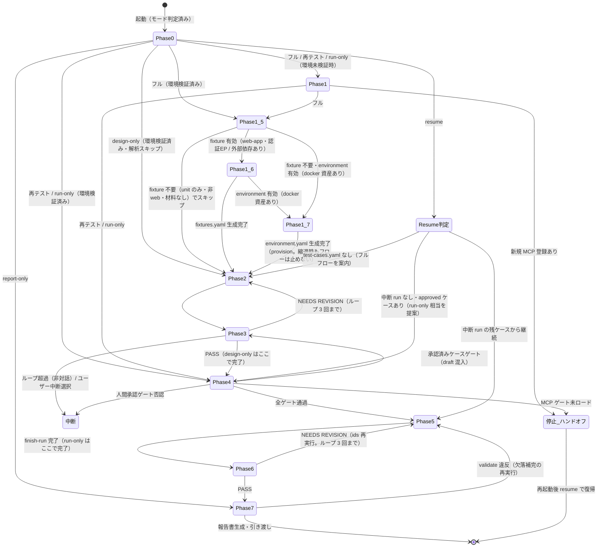
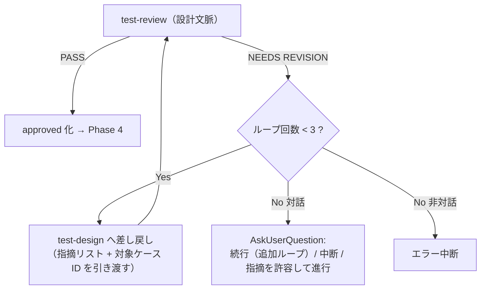

# フェーズ遷移詳細（test オーケストレータ）

オーケストレータ `test` のフェーズ遷移・各フェーズの入出力・ゲート判定手順・NEEDS REVISION 時の遡行ループを定義する。
ゲートそのものの定義（4 種）と非対話既定値は `${CLAUDE_PLUGIN_ROOT}/references/execution-policy.md` が SSOT であり、本書は**オーケストレータ側の運用手順**（判定の実施方法・遷移制御）のみを定義する。
resume の途中復帰位置判定（5 章）と Phase 別の実行コマンド集（6 章）は `${CLAUDE_SKILL_DIR}/references/flow-resume.md` へ移管した。**各 Phase の実行時・resume 時に** `flow-resume.md` を Read すること（本書は状態遷移・フェーズ順序・ゲート判定・遡行ループの定義に徹する。節番号は 5 章・6 章を維持）。

---

## 1. フェーズ状態遷移図

## 2. フェーズ入出力一覧

各フェーズの受け渡しデータの詳細構造は `state-handoff.md` を参照。

| フェーズ | 入力 | 処理（委譲先） | 出力 |
|---------|------|--------------|------|
| Phase 0: target 解決 | 起動引数・依頼内容 | 基準ディレクトリ解決 → slug 選択（AskUserQuestion）→ venv 準備 → `init` | `{base}` / `{target-slug}` / 解決済みパス集合 |
| Phase 1: setup 確認 | target-slug・必要レベルの見込み | `Skill: test-setup` | 環境検出結果（MCP / ランナー / venv） |
| Phase 1.5: 解析 | target-slug・（`spec=` / `diff=` があれば）仕様 / 差分 | `Skill: test-analyze` | `analysis.yaml` / `target-analysis.md`（read-only の対象理解材料） |
| Phase 1.6: フィクスチャ基盤（条件付き） | target-slug・`analysis.yaml`（材料）・SUT `project` ルート | `Skill: test-fixture` | `fixtures.yaml`（マニフェスト）+ SUT テストコード（フィクスチャ / config）。fixture 不要時は空マニフェストで no-op |
| Phase 1.7: 環境（条件付き） | target-slug・`analysis.yaml`（材料）・SUT `project` ルート・見込み `levels` | `Skill: test-environment`（provision。up は Phase 5 手順 0・down は Phase 6 判定後 = 状態機械上は Phase4→Phase5 / Phase6→Phase7 遷移の間に位置する） | `environment.yaml`（マニフェスト）+ 派生成果物（`environment/compose.test.yml`・`environment/.env.test`）。docker 資産なし / unit のみ / docker 不可は no-op（`applicability` + `reason`） |
| Phase 2: 設計 | 対象説明・要件情報・（差し戻し時）レビュー指摘 | `Skill: test-design` | `test-plan.md` / `test-cases.yaml`（draft） |
| Phase 3: 設計レビュー | test-cases.yaml のパス・対象説明 | `Skill: test-review`（設計文脈） | PASS / NEEDS REVISION + 指摘リスト |
| Phase 4: 対象確定 + ゲート | モード・（ids 時）ケース ID | `select` → 3 ゲート判定 | 確定 scope（approved のみ）・ゲート通過記録 |
| Phase 5: 実行 | scope・run_id・環境情報（`environment.yaml` があれば project 名・base URL・イメージ情報から組み立てる） | `start-run` → `Skill: test-run-*`（逐次）→ `record` → `finish-run` | 確定 run（test-results.yaml 反映済み） |
| Phase 6: 結果レビュー | run_id・fail 概要・集計 | `Skill: test-review`（結果文脈） | PASS / NEEDS REVISION + 指摘リスト |
| Phase 7: 報告 | target-slug・（形式指定があれば）形式 | `validate` → `Skill: test-report` | 報告書パス（セッション作業領域直下） |

### 2.1 Phase 別の要点（委譲・操作の要点）

SKILL.md 実行フロー（mermaid・モード表）に対応する各 Phase の運用要点（SKILL.md「Phase 別の要点」から移管）。実行コマンド・Skill args・判定手順は `flow-resume.md` 6 章（実行コマンド集）。

| Phase | 内容 | 委譲先 / 操作 |
|-------|------|-------------|
| 0: target 解決 | `{base}` 解決 → 既存 slug は **AskUserQuestion** で選択（非対話: 唯一の既存 slug、複数はエラー中断）→ venv 準備 → `init` | results_manager |
| 1: setup 確認 | run を含むモードで環境未検証の場合のみ。検出結果（MCP ロード状況・ランナー・venv）を受領。新規 MCP 登録時は再起動ハンドオフを出力して**停止**。総合判定 **PARTIAL**（一部チェック失敗 + 一部成功）受領時は、利用可能レベルは続行し、利用不可レベルのケースは実行時 skipped 記録となる旨を確認して進む（詳細判定は test-setup の検出結果に従う） | Skill: test-setup |
| 1.5: 解析 | フルフローで対象ソースを read-only 解析し、`analysis.yaml` / `target-analysis.md`（下流消費材料）を生成。決定は行わず提案（hint）に留める。`spec=` / `diff=` 指定時は仕様乖離 / 変更影響も材料化 | Skill: test-analyze |
| 1.6: フィクスチャ基盤（条件付き） | フルフローで fixture が有効な場合のみ（unit のみ・design-only / run-only / retest / report-only はスキップ）。`analysis.yaml` を消費し、再現可能な Playwright Test 基盤（`fixtures.yaml` + SUT テストコード）を生成 / 拡充。非 web・認証も外部依存もなしは no-op（空マニフェスト） | Skill: test-fixture |
| 1.7: 環境（条件付き） | フルフローで docker 資産が見込まれる場合のみ委譲（unit のみ・design-only / run-only / retest / report-only はスキップ。run-only / retest / resume は provision 済み `environment.yaml` があれば up / down のライフサイクル呼出のみ）。`analysis.yaml` を消費し、SUT の docker 資産から非破壊でテスト用派生環境（`environment.yaml` + `environment/compose.test.yml`・`.env.test`）を provision。資産なし / docker 不可は no-op（`applicability` + reason）でフローを止めない。受領後は `environment.yaml` の parse 検証を venv Python で行う（失敗は再委譲 1 回 → 環境なし縮退・venv 不在は目視縮退。`flow-resume.md` 6 章 Phase 1.7 節） | Skill: test-environment |
| 2: 設計 | test-plan.md + test-cases.yaml（全ケース draft）の生成 | Skill: test-design |
| 3: 設計レビュー | PASS → test-review が approved 化まで実施。NEEDS REVISION → test-design へ差し戻し（**上限 3 回**、超過時は対話=AskUserQuestion / 非対話=エラー中断） | Skill: test-review（design） |
| 4: 対象確定 + ゲート | `select` で scope を機械確定（LLM 判断禁止）→ 承認済みケースゲート → 人間承認ゲート（**AskUserQuestion**。非対話はスキップ）→ MCP ゲート（ToolSearch 実判定。未ロードは再起動ハンドオフで**停止**、unit のみは判定不要） | results_manager + AskUserQuestion + ToolSearch |
| 5: 実行 | 手順 0: `environment.yaml` が applicable なら environment up（`action=up`。失敗は縮退でフローを止めない。down は Phase 6 判定後 = PASS → down・NEEDS REVISION → ids 再実行に備え維持）→ 手順 0.5（非対話時のみ）: 手動系ケース（`automation: manual-assist` / `exploratory`）の手順書一括生成（生成失敗はフェイルオープンで続行）→ `start-run` → レベル順**逐次**で test-run-* を Skill 起動（並列禁止。レベル内の `cases=` は自動 → 手動の順・手動系ケースを含むレベルには非対話・生成成功時のみ `manual-sheet={path}` を付与）→ 中間結果を 1 件ずつ `record`（exit 2 は当該実行スキルへ追加取得を指示して再 record）→ `finish-run`（欠落検出時は補完実行後に再確定） | Skill: test-run-* + results_manager + Skill: test-environment（up / down） |
| 6: 結果レビュー | 欠陥分析・severity 妥当性の検証。NEEDS REVISION の遡行は 4 章（上限 3 回） | Skill: test-review（results） |
| 7: 報告 | `validate`（違反があれば差し戻して生成しない）→ test-report 起動（形式選択は test-report が実施、非対話既定 Markdown）。報告書はセッション作業領域直下 | results_manager + Skill: test-report |

## 3. ゲート判定手順（オーケストレータ側の運用）

ゲートの定義・配置・非対話時挙動は `${CLAUDE_PLUGIN_ROOT}/references/execution-policy.md` 1 章が SSOT。本節は判定の実施方法のみを定める。

| ゲート | 判定材料 | 判定手順 | 不通過時の遷移 |
|-------|---------|---------|---------------|
| 設計レビューゲート | test-review（設計文脈）の返却（PASS / NEEDS REVISION） | 返却 JSON の `verdict` を読む。判定があいまいな返却（verdict 欠落）は NEEDS REVISION として扱う | 4 章の修正ループへ |
| 承認済みケースゲート | `select` 出力の `draft_cases` | `draft_cases` が空 → 通過。非空 → test-review（設計文脈）を draft ケースに対して実施（PASS 時の approved 化は test-review が実施）→ `select` を再実行して確認 | Phase 3（対象は draft ケースのみ） |
| 人間承認ゲート | `select` 出力の `cases` / `details` | AskUserQuestion で提示（ケース数・レベル別内訳・想定所要時間 = details の timeout_sec 合計を上限とする概算・破壊的操作ケース数 = select 出力の `destructive` 集計・手動実施ケース件数 = select 出力の `details.automation` の `manual-assist` / `exploratory` を destructive と同型で機械集計〔提示項目の定義は execution-policy.md 1.3・処理規範は `${CLAUDE_PLUGIN_ROOT}/references/manual-execution.md`〕）。非対話時はスキップ | 中断（scope・実績は未変更のまま） |
| MCP ゲート | scope のレベル構成 + ToolSearch 結果 | scope が unit のみ → 判定不要で通過。それ以外 → ToolSearch で `mcp__playwright__` 系を検索（手順・判定基準は `${CLAUDE_PLUGIN_ROOT}/references/playwright-mcp.md` 4 章） | 再起動ハンドオフを出力して停止（run 開始前なら start-run しない。run 中の喪失は skipped 記録で継続） |

ゲート判定の順序は固定: `select` → 承認済みケースゲート → 人間承認ゲート → MCP ゲート → environment up（`environment.yaml` が applicable のときのみ実施する Phase 5 手順 0。ゲートではなく、失敗は縮退でフローを止めない）→ 手動手順書の一括生成（非対話時のみ実施する Phase 5 手順 0.5。ゲートではなく、生成失敗はフェイルオープンで続行）→ `start-run`。
`start-run` は**全ゲート通過後**にのみ実行する（未実行の run レコードを残さないため）。

## 4. NEEDS REVISION 時の遡行ループ

### 4.1 設計文脈（Phase 3 → Phase 2）

- **ループ回数の数え方**: 「test-design への差し戻し」を 1 回と数える（初回設計は 0 回目。test-review の実行回数 − 1 に一致する）
- 差し戻し時は test-review の指摘リスト（指摘内容・根拠・対象ケース ID・信頼度）をそのまま test-design に引き渡す（要約で情報を落とさない）
- test-design は指摘対象ケースのみ更新する（revision +1 → draft 戻り。規則は `${CLAUDE_PLUGIN_ROOT}/references/yaml-schema-cases.md` 3 章）
- 差し戻し後の再レビューの構成（指摘元エージェントのみ / フル並列 / 本体差分チェック）は `${CLAUDE_PLUGIN_ROOT}/skills/test-review/references/review-procedures.md` の差し戻し再レビュー規定に従う
- ユーザーが「指摘を許容して進行」を選んだ場合、未解消の指摘を results_manager.py の `annotate` サブコマンドで**必ず注釈として登録**する（例: `annotate --source test-review/design --text "..."`）。登録した注釈は報告書の「所見・注記」に機械出力される（手動転記はしない）
- ループ超過時の AskUserQuestion 選択肢の文言例（各選択肢に帰結を 1 行で添える）:
  - 「続行（追加ループ）: 指摘の修正と再レビューをもう 1 回実施します」
  - 「中断: ここで処理を終了します（test-cases.yaml は draft のまま保存済み。resume 対象ではなく design-only 等での再開になります）」
  - 「指摘を許容して進行: 未解消の指摘は annotate で注釈登録され、報告書の所見・注記に出力されます」

### 4.2 結果文脈（Phase 6 → Phase 5）

結果は append-only（上書き不可）のため、遡行は「再実行による上書きではなく追加 run」で行う。

| 指摘の種類 | 遡行方法 |
|-----------|---------|
| 再現手順・検証データ・エビデンスの不備（fail の 3 点セット品質） | 該当ケースを `ids` モードで再実行（新規 run）し、充足した defect で再記録する |
| severity の妥当性への疑義 | defect-analyst の指摘（`${CLAUDE_PLUGIN_ROOT}/references/severity-policy.md` 基準）を採用する場合も、実績の書き換えはせず該当ケースを `ids` 再実行で再記録する |
| 分析・所見レベルの指摘（実績の変更不要） | オーケストレータが results_manager.py の `annotate` サブコマンドで注釈として登録する（例: `annotate --source test-review/results --text "..."`）。報告書の所見・注記に機械出力される（遡行しない） |

- ループ上限は設計文脈と同じ **3 回**。超過時の挙動も 4.1 と同一（対話 = ユーザー判断 / 非対話 = エラー中断）

## 5. resume の途中復帰位置判定

resume の途中復帰位置判定（判定手順・注意事項）は `${CLAUDE_SKILL_DIR}/references/flow-resume.md` **5 章**へ移管した。**resume モードの実行時のみ** 同ファイルを Read すること（節番号は 5 章を維持）。

## 6. 実行コマンド集（Phase 別）

Phase 別の実行コマンド・Skill args は `${CLAUDE_SKILL_DIR}/references/flow-resume.md` **6 章**へ移管した。各 Phase の**実行時・resume 時に** 同ファイルを Read すること（本書 2.1 章「Phase 別の要点」の運用要点に対応。節番号は 6 章を維持）。

## 7. 関連 references

| 参照先 | 内容 |
|-------|------|
| `${CLAUDE_PLUGIN_ROOT}/references/execution-policy.md` | ゲート 4 種の定義・修正ループ上限・非対話既定値表（SSOT） |
| `${CLAUDE_PLUGIN_ROOT}/references/retest-policy.md` | resume 規約・対象判定マトリクス・承認済みケースゲートの規約（SSOT） |
| `${CLAUDE_PLUGIN_ROOT}/references/playwright-mcp.md` | MCP 実利用可否判定手順・再起動ハンドオフの文面 |
| `${CLAUDE_SKILL_DIR}/references/flow-resume.md` | resume の途中復帰位置判定（5 章）・Phase 別の実行コマンド集（6 章）〔本書から移管。実行時・resume 時に Read〕 |
| `state-handoff.md` | フェーズ間の受け渡しデータ構造 |
