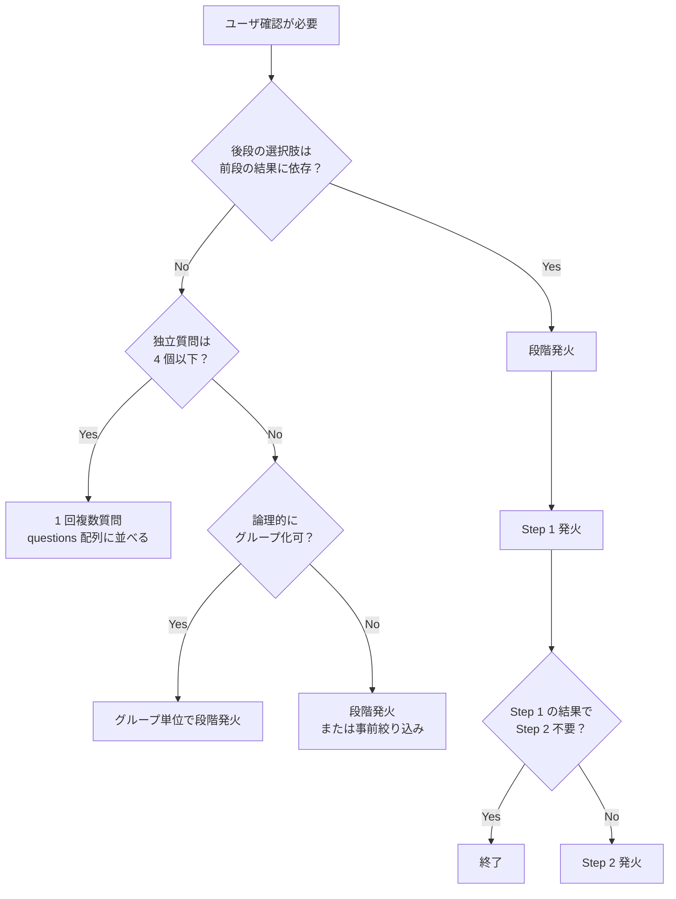

# AskUserQuestion 発火戦略（SSOT）

`AskUserQuestion` の発火タイミング・回数・複数質問束ね方の最適化ルール。
[`user-interaction.md`](user-interaction.md) の利用原則と組み合わせて読む。

A-6（改善バックログ由来、分岐 = 段階発火 / 非分岐 = 1 回複数質問）を SSOT 化したもの。経緯は git 履歴を参照。

---

## 1. 原則

### 1.1 「分岐の有無」で発火戦略を切り替える

| 状況 | 戦略 | 効果 |
|------|------|------|
| 後段の選択肢が前段の選択結果に **依存する** | **段階発火**（複数回に分けて呼ぶ） | 不適切な選択肢の混入を防ぐ |
| 後段の選択肢が前段の選択結果に **依存しない** | **1 回複数質問**（`questions` 配列に並べる） | 対話往復を最小化 |

### 1.2 発火回数最小化の原則

- 同等の情報量を得るのに、対話往復は **少ない方が良い**
- ただし「依存関係を無視した詰め込み」は禁止（不適切な選択肢の混入は UX を著しく損なう）
- 迷う場合は「段階発火」を選ぶ（情報品質を優先）

---

## 2. 段階発火（分岐型）

前段の選択結果が後段の `options` を構築するための入力となる場合に使用する。

### 2.1 適用パターン

| 例 | 段階構造 |
|----|---------|
| `/sync-map-delete` | Step 1: 削除対象を選択 → Step 2: 最終確認（対象の概要表示）|
| プラグイン公開フロー | Step 1: 重複検出時の対応（マージ/別名/キャンセル）→ Step 2: 別名選択時の新規プラグイン名入力 → Step 3: 公開モード（ハンドオフ/フルオート）|
| 削除系操作 | Step 1: 削除可否 → Step 2: 削除範囲（部分/全体）→ Step 3: バックアップ要否 |

### 2.2 段階発火の判定基準

以下のいずれかが当てはまれば段階発火を選ぶ。

| 基準 | 例 |
|------|-----|
| 前段の選択で **後段の `options` 内容が変わる** | Step 1 で「既存に追加」を選んだら、Step 2 は「既存プラグイン一覧」を options に表示 |
| 前段の選択で **後段の質問自体が不要になる** | Step 1 で「キャンセル」が選ばれたら Step 2 以降は発火しない |
| 前段の選択で **後段の質問内容（質問文）が変わる** | Step 1 で「DryRun」を選んだら、Step 2 では「dry-run 範囲」を聞く。「Apply」なら「実適用範囲」を聞く |

### 2.3 段階発火の実装例

```text
# Step 1: 削除対象の選択
AskUserQuestion({
  questions: [{
    question: "削除するマッピングを選択してください",
    header: "削除対象",
    options: [
      { label: "global: dmajima/claude-plugins:main", description: "..." },
      { label: "project: foo-repo: dev", description: "..." },
      { label: "キャンセル", description: "削除を中止" }
    ],
    multiSelect: false
  }]
})

# Step 1 の選択結果を読み取り、Step 2 を構築
# 「キャンセル」なら終了

# Step 2: 削除対象の最終確認（Step 1 で選んだ対象の詳細を表示）
AskUserQuestion({
  questions: [{
    question: "以下のマッピングを削除します。よろしいですか？\n  対象: <Step 1 の選択結果>\n  紐づくキャッシュ: <ファイル数 / サイズ>",
    header: "最終確認",
    options: [
      { label: "削除を実行", description: "選択した対象を完全削除" },
      { label: "キャンセル", description: "削除せず終了" }
    ],
    multiSelect: false
  }]
})
```

---

## 3. 1 回複数質問（非分岐型）

前段と後段の質問が **互いに独立** で、すべての組合せが妥当な場合に使用する。
`questions` 配列に 2〜4 個の質問を並べ、1 度に UI を発火する。

### 3.1 適用パターン

| 例 | 並列質問構造 |
|----|------------|
| `/cleanup-config` | (a) 保存日数 / (b) keep-recent 件数 / (c) スコープ / (d) 進行中閾値分 — どれも他の選択に影響しない |
| プラグイン作成時の初期設定 | (a) プラグイン名 / (b) 説明 / (c) 著作権者 — 互いに独立 |
| README 生成オプション | (a) 出力先 / (b) 言語 / (c) サンプル含有 — 互いに独立 |

### 3.2 1 回複数質問の判定基準

以下を **すべて満たす** 場合のみ 1 回複数質問を選ぶ。

| 基準 | 内容 |
|------|------|
| 全質問が独立 | どの質問も他の質問の選択結果に依存しない |
| 全選択肢が妥当 | 組合せのうちに「選んではいけない組合せ」が存在しない |
| 質問数 ≤ 4 | AskUserQuestion 公式仕様の上限 |
| 各質問 options 2-4 個 | 公式仕様 |

### 3.3 1 回複数質問の実装例

```text
AskUserQuestion({
  questions: [
    {
      question: "保存期間（日数）を選択",
      header: "保存期間",
      options: [
        { label: "30 日", description: "比較的長期保存" },
        { label: "14 日", description: "標準" },
        { label: "7 日", description: "短期保存" },
        { label: "変更しない", description: "現状維持" }
      ],
      multiSelect: false
    },
    {
      question: "keep-recent 件数を選択",
      header: "保護件数",
      options: [
        { label: "5 件", description: "多めに保護" },
        { label: "3 件", description: "標準" },
        { label: "1 件", description: "最新のみ" },
        { label: "変更しない", description: "現状維持" }
      ],
      multiSelect: false
    },
    {
      question: "スコープを選択",
      header: "スコープ",
      options: [
        { label: "global", description: "全プロジェクト共通" },
        { label: "project", description: "現プロジェクトのみ" },
        { label: "変更しない", description: "現状維持" }
      ],
      multiSelect: false
    }
  ]
})
```

---

## 4. 戦略判断フローチャート



---

## 5. アンチパターン

| パターン | 問題 | 修正 |
|---------|------|------|
| 分岐型を 1 回複数質問で詰め込む | 不適切な選択肢の混入。例: Step 1「キャンセル」を選ぶつもりでも Step 2 の質問が UI に表示される | 段階発火に分割 |
| 非分岐型を逐次発火する | 対話往復が増えて UX 低下。例: 4 つの独立設定を 4 回連続で発火 | `questions` 配列に並べる |
| `questions` が 5 個以上 | 公式仕様違反（最大 4） | グループ化して段階発火 |
| 1 つの質問の `options` が 5 個以上 | 公式仕様違反（最大 4、`Other` 自動付与で実質 4） | 段階的選択（カテゴリ → 詳細）に分解 |
| 重要な操作で「キャンセル」を含めない | 中断不能になる | 必ず「キャンセル」相当を含める |

---

## 6. 既存スキル・コマンドからの実装例

### 6.1 段階発火型（分岐あり）

| 対象 | 段階構造 | 分岐根拠 |
|------|---------|---------|
| `maintenance:sync-map-delete` | 削除対象選択 → 最終確認 | Step 1 で選んだ対象が Step 2 の表示内容を変える |
| `marketplace-publisher` の重複検出時 | 重複対応選択 → （別名選択時のみ）新規名入力 → 公開モード選択 | Step 1 で「キャンセル」を選ぶと以降不要 |
| `mit-license-toolkit` の複数ライセンス選択 | ライセンス選択 → （新規追加時のみ）著作権者・年入力 | Step 1 で既存ライセンス選択時は Step 2 不要 |

### 6.2 1 回複数質問型（分岐なし）

| 対象 | 並列質問 | 独立性根拠 |
|------|---------|---------|
| `maintenance:cleanup-workspace` の設定 | 保存日数 / keep-recent / スコープ / 進行中閾値分 | どれも他に影響しない設定値 |
| `plugin-toolkit` の初期設定 | プラグイン名 / 概要 / 著作権者 | 互いに独立した属性 |
| `readme-toolkit` の生成オプション | 出力先 / 言語 / サンプル含有 | 互いに独立 |

---

## 7. 関連ドキュメント

- [`user-interaction.md`](user-interaction.md) — AskUserQuestion 利用原則・利用不可ケース・フォールバック
- [`argument-policy.md`](../policies/argument-policy.md) — コマンド引数を「単純な 1 引数」に圧縮し、不足情報を AskUserQuestion に集める原則（A-4）
- ADR-013 — Claude UI（AskUserQuestion）の必須化
