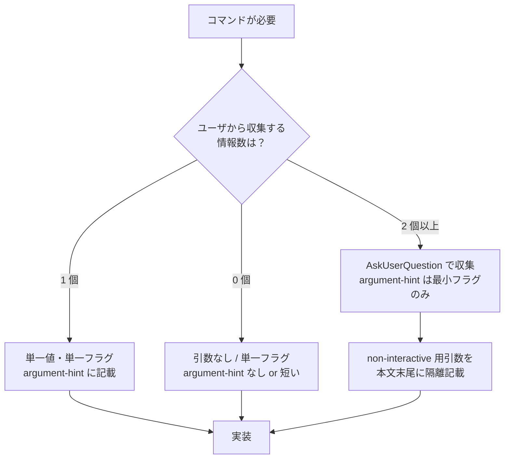

# コマンド引数ポリシー（SSOT）

`extension-toolkit` プラグインが生成・改修するすべてのスラッシュコマンドが従う引数仕様のルール。

A-4「コマンド引数の AskUserQuestion 強制化（単純 1 引数を除く）」（改善バックログ由来、経緯は git 履歴を参照）を SSOT 化したもの。

---

## 1. 原則

### 1.1 コマンド引数は「単純な 1 引数」のみ許可

スラッシュコマンドの `argument-hint` は **単純な 1 引数** に圧縮する。
それを超える情報収集は `AskUserQuestion`（対話モード）または `--non-interactive` フラグ + 引数値（自動化向け）で行う。

### 1.2 「単純な 1 引数」の定義

以下のいずれか **1 つのみ** を `argument-hint` に記載してよい。

| 形式 | 例 | 用途 |
|------|---|------|
| 単一フラグ | `[--dry-run]` / `[--show]` / `[--clean]` | 動作モード切替 |
| 単一値 | `<path>` / `[session-uuid]` / `<on\|off>` | 主対象を 1 つ指定 |
| 単一の選択値 | `[list\|add\|update\|delete]` | アクション選択（範囲確定） |
| 単一の引数ペア（限定的） | `[--scope <scope>]` | 1 つの設定を変更する用途 |

### 1.3 禁止される `argument-hint`

| 禁止 | 理由 |
|------|------|
| 複数の `--key value` ペア併記 | スキャナビリティ低下、フラグ仕様の暗記負担増 |
| 複数の独立フラグ並列（3 つ以上） | コマンドの責務が不明瞭になる |
| 60 文字超過 | 公式仕様の表示制約に違反、UI で省略表示される |
| 「\| 区切り」のオプション値で 5 種以上 | 選択肢が UI で読みにくい |

---

## 2. 違反例と修正例

### 2.1 違反例（A-4 のバックログ記載パターン）

```yaml
# 違反: 4 つの --set-* フラグを CLI 引数として並べる
argument-hint: --set-days 60 --set-keep-recent 5 --set-scope global --set-active-minutes 10
```

**問題点**:
- フラグ仕様（`--set-days` `--set-keep-recent` 等）を暗記する必要がある
- 引数省略・タイポでサイレント失敗
- どの値が何を意味するかが UI 上で分からない

### 2.2 修正例

```yaml
# 修正: 単一フラグのみ。複数情報は AskUserQuestion で対話的に収集
argument-hint: "[--show] [--reset]"
```

実行時の動作:
- 引数なし → AskUserQuestion で 4 つの設定（保存日数 / keep-recent / スコープ / 進行中分）を 1 度に発火（`askquestion-strategy.md` 節 3 「1 回複数質問」適用）
- `--show` → 現在の設定を表示して終了
- `--reset` → 既定値にリセット（その前に AskUserQuestion で確認）

---

## 3. 1 引数を超える情報の収集方法

### 3.1 対話モード（既定）

複数情報が必要な場合、`AskUserQuestion` で対話的に収集する。
発火戦略は [`askquestion-strategy.md`](../guides/askquestion-strategy.md) に従う。

| ケース | 戦略 |
|--------|------|
| 設定項目が独立 | 1 回複数質問（`questions` 配列に 2-4 個並べる）|
| 設定項目が依存関係を持つ | 段階発火（複数回） |

### 3.2 非対話モード（自動化・上級者向け）

CI / バッチ実行向けに `--non-interactive` フラグ + 個別引数を許容する。
ただし以下を厳守する。

| 厳守事項 | 内容 |
|---------|------|
| (a) 非推奨パスとして明示 | コマンド本文末尾に「上級者・自動化向け」と明記し、本文冒頭では推奨しない |
| (b) `--non-interactive` が無いと無効 | `--set-*` 等の個別フラグは `--non-interactive` フラグなしでは無視 or エラー |
| (c) `argument-hint` には含めない | 非推奨パスは `argument-hint` から除外し、本文の「非対話モード」セクションに記載 |
| (d) 全パラメータ明示が必須 | `--non-interactive` 指定時は必須引数の不足でエラー終了（既定値補完しない）|

---

## 4. コマンド設計手順

新規コマンド作成時または既存コマンド改修時の手順。



---

## 5. 既存コマンドの遡及適用方針

### 5.1 適用範囲

本ポリシーは **新規作成・改修されるコマンド** に適用する。既存コマンドの遡及修正は次の優先度で順次実施する。

| 優先度 | 対象 | 理由 |
|--------|------|------|
| High | `argument-hint` が 60 文字超過 | 公式仕様に明確に違反 |
| Medium | 3 つ以上の `--key value` ペア | 暗記負担が大きい |
| Low | 2 個以下の単純フラグ並列 | 影響軽微 |

### 5.2 既存コマンド現状サマリー（2026-05-18 時点・参考）

リポジトリ内コマンド `argument-hint` の現状（網羅的レビューは別作業）:

| コマンド | 現状 | 評価 |
|----------|------|------|
| `/router-toggle` | `<on\|off>` | OK（単一値）|
| `/router-status` | `[--clean]` | OK（単一フラグ）|
| `/session-usage` | `[session-uuid]` | OK（単一値）|
| `/manage` | `[list\|add\|update\|delete]` | OK（単一選択値）|
| `/sync-map-list` | `[--show]` | OK（単一フラグ）|
| `/extension` | `<種別> <対象名> [--non-interactive] [--full-auto]` | 要レビュー（2 引数 + 2 フラグ）|
| `/convert-html-full` | `<入力MDパス> [出力HTMLパス] [--title タイトル]` | 要レビュー（path 2 つ + 1 フラグ）|
| `/convert-pptx` | `<入力MDパス> [出力PPTXパス] [--title タイトル] [--subtitle 副題]` | 要レビュー（path 2 + 2 フラグ）|
| `/cleanup-config` | `[--show] [--set-... N\|name] [--reset --yes]` | 要レビュー（4 フラグ）|
| `/sync-map-set` | `[--scope ...] [--repo URL] [--branch B] [--targets CSV]` | 要レビュー（4 フラグ）|
| `/sync-pull` | `[--scope ...] [--strategy ...] [--dry-run] [--yes]` | 要レビュー（4 フラグ）|
| `/sync-push` | `[--scope ...] [--no-pr] [--dry-run] [--yes]` | 要レビュー（4 フラグ）|

「要レビュー」コマンドは、本ポリシー策定後の改修サイクルで本ポリシー適合に圧縮する（別作業）。
新規追加コマンドは初版から本ポリシーに適合させる。

---

## 6. `argument-hint` 記述ルール

### 6.1 文字数制限

- **目安**: 30 文字以内
- **上限**: 60 文字（公式仕様の表示制約）

### 6.2 表記法

| 表記 | 意味 | 例 |
|------|------|-----|
| `<value>` | 必須引数 | `<path>` / `<on\|off>` |
| `[value]` | 任意引数 | `[session-uuid]` |
| `<a\|b>` | 必須選択（2-4 値）| `<on\|off>` |
| `[a\|b\|c]` | 任意選択 | `[list\|add\|update\|delete]` |
| `--flag` | フラグ（値なし）| `--dry-run` |
| `--key <value>` | フラグ + 値 | `--scope <scope>` |

### 6.3 言語

- 半角英数字を基本とする（公式エコシステムの慣用）
- 日本語の意味補足は **コマンド本文** に記載し、`argument-hint` には含めない
- 区切り文字は半角スペース

---

## 7. アンチパターン

| パターン | 問題 | 修正 |
|---------|------|------|
| `[--set-A x] [--set-B y] [--set-C z]` | 3 つ以上の独立フラグ並列 | フラグなしで AskUserQuestion 起動 + non-interactive 用に末尾隔離 |
| `<source> <target> [--type X] [--mode Y]` | 必須 2 値 + 任意 2 フラグ | 必須 1 値に絞り、残りは AskUserQuestion |
| 引数省略時に静かにデフォルト値で実行 | サイレント挙動でユーザ混乱 | AskUserQuestion で確認するか、エラーで終了 |
| `argument-hint: "全引数を CLI で指定可能"` のような自然文 | 仕様としての価値が低い | 機械可読な記号表現に圧縮 |

---

## 8. 関連ドキュメント

- [`user-interaction.md`](../guides/user-interaction.md) — AskUserQuestion の利用原則・利用不可ケース・フォールバック
- [`askquestion-strategy.md`](../guides/askquestion-strategy.md) — AskUserQuestion の発火戦略（A-6）
- ADR-013 — Claude UI 必須化
- ADR-023 — `argument-hint` の必須化
