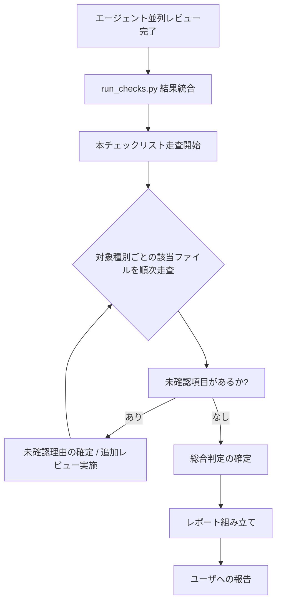

# レビュー全項目チェックリスト（MANDATORY）

`extension-reviewer` がレビュー結果をユーザに報告する **直前に必ず通過させる** 網羅チェックリスト集。`extension-toolkit/references/` 配下の全 SSOT 由来のルールを 1 箇所に統合し、対象種別ごとに整理した。

## 1. 適用範囲とタイミング

| 項目 | 内容 |
|-----|------|
| 適用対象 | `extension-reviewer` のすべての起動経路（チーム起動 / フォールバック並列起動 / 単体エージェント起動 / マーケットプレイス起動） |
| 実施タイミング | エージェント並列レビュー結果と機械チェック（`run_checks.py`）結果を統合した **直後**、ユーザへの最終報告を組み立てる **前** |
| 省略可否 | **省略不可**。本チェックリストの全項目を確認するまで「総合判定」を確定してはならない |
| 違反時 | 重大度 `High` 以上の未確認項目があれば総合判定 `CONDITIONAL_APPROVE` を上限とし、未確認理由をレポートに明記する |

## 2. レビュー対象の判定と適用するチェックリスト

| レビュー対象 | 適用するチェックリスト |
|------------|---------------------|
| すべての対象（共通） | [common.md](common.md) |
| スキル（`SKILL.md` 含むディレクトリ） | common + [skill-target.md](skill-target.md)（ファイル名は機械チェックでの SKILL.md 誤検出回避のため `skill-target.md`） |
| プラグイン（`.claude-plugin/plugin.json` 含むディレクトリ） | common + plugin + 含有要素ごとの該当ファイル（skill / command / agent / hook / readme） |
| コマンド（`commands/{name}.md` 単体） | common + [command.md](command.md) |
| エージェント（`agents/{name}.md` 単体） | common + [agent.md](agent.md) |
| チーム定義（`references/teams/{name}.md`） | common + [team.md](team.md) |
| フック（`hooks/hooks.json` 含むディレクトリ） | common + [hook.md](hook.md) |
| README.md（プラグイン / スキル） | common + [readme-doc.md](readme-doc.md)（ファイル名は索引 `README.md` との衝突回避のため `readme-doc.md`） |
| マーケットプレイス（`.claude-plugin/marketplace.json` + ルート README） | common + [marketplace.md](marketplace.md) |
| プラグイン（バージョン更新を伴う改修） | 上記 + [versioning.md](versioning.md) |
| Python 利用プラグイン | 上記 + [scripts-policy.md](scripts-policy.md) |
| すべての対象（最終工程） | [process.md](process.md) — レビュー手順そのものの自己点検 |

## 3. 重大度の解釈

| 重大度 | 意味 | チェック未通過時の挙動 |
|-------|------|------------------|
| Critical | 公開不能・即時修正必須（規約根本違反 / シークレット混入 / JSON 不正 等） | 総合判定 `REJECT` 確定 |
| High | 修正推奨（必須セクション欠落 / `argument-hint` 不在 / 5W1H 欠落 等） | 総合判定は最大 `CONDITIONAL_APPROVE` |
| Medium | 検討推奨（description 文字数超過 / `§` 記号 / 装飾語多用 等） | 報告に含めるが APPROVE 可 |
| Low | 改善提案 | 報告は任意 |

## 4. チェックリストの運用フロー



| ステップ | 動作 | 出力 |
|---------|-----|------|
| 1 | 対象種別を確定（節 2 のテーブル参照） | 適用チェックリストファイル一覧 |
| 2 | 適用ファイルをすべて Read | 全項目の有無と重大度を把握 |
| 3 | 各項目を走査し、エージェント結果 / 機械チェック結果と照合 | 項目別 OK/NG/未確認の 3 値 |
| 4 | 未確認項目があれば理由を確定（または追加レビュー） | 全項目が OK/NG いずれかに収束 |
| 5 | 重大度別の指摘リストを再集計 | Critical / High / Medium / Low の件数 |
| 6 | 総合判定を確定（[`../review-perspectives.md`](../review-perspectives.md) の総合判定ルールに従う） | APPROVE / CONDITIONAL_APPROVE / REJECT |
| 7 | レポート組み立て・ユーザ報告 | 最終レポート |

## 5. 報告に含める「チェックリスト通過記録」

レビュー結果報告には、以下のフォーマットでチェックリスト通過記録を **必ず含める**:

```markdown
## チェックリスト通過記録

| 適用ファイル | 項目数 | OK | NG | 未確認 |
|------------|------|----|----|------|
| common.md | {n} | {x} | {y} | {z} |
| {対象別 .md} | {n} | {x} | {y} | {z} |
| process.md | {n} | {x} | {y} | {z} |

未確認項目: {0 件 or 詳細}
```

未確認項目が 1 件でもある場合は、報告本文に **理由** と **重大度** を明記する。

## 6. 関連 SSOT

各チェック項目の出典は以下の SSOT を引いている。チェック項目を更新する場合は出典側を先に更新すること（SSOT 違反防止）。

| 観点 | SSOT |
|-----|------|
| 命名・配置・構造 | [`../../../references/conventions.md`](../../../references/conventions.md) |
| AI 誤認回避（必須セクション・条件表） | [`../../../references/ai-readability.md`](../../../references/ai-readability.md) |
| README 規約 | [`../../../references/readme-policy.md`](../../../references/readme-policy.md) |
| description 設計 | [`../../../references/description-guide.md`](../../../references/description-guide.md) |
| ポータブルパス | [`../../../references/path-portability.md`](../../../references/path-portability.md) |
| evals 設計 | [`../../../references/eval-guide.md`](../../../references/eval-guide.md) |
| 検証ルール（種別別） | [`../../../references/validation-rules.md`](../../../references/validation-rules.md) |
| 完了前自己検証 | [`../../../references/completion-checklist.md`](../../../references/completion-checklist.md) |
| アーキテクチャ決定（ADR-001〜027） | [`../../../references/architecture-decisions.md`](../../../references/architecture-decisions.md) |
| エージェント活用 | [`../../../references/agent-utilization.md`](../../../references/agent-utilization.md) |
| 依存関係宣言 | [`../../../references/dependencies-policy.md`](../../../references/dependencies-policy.md) |
| レビューフレッシュ起動 | [`../../../references/review-freshness.md`](../../../references/review-freshness.md) |
| 自己完結性 | [`../../../references/self-containment.md`](../../../references/self-containment.md) |
| スクリプトポリシー | [`../../../references/scripts-policy.md`](../../../references/scripts-policy.md) |
| 状態ファイル形式 | [`../../../references/state-files.md`](../../../references/state-files.md) |
| ユーザ対話 | [`../../../references/user-interaction.md`](../../../references/user-interaction.md) |
| バージョニング | [`../../../references/versioning.md`](../../../references/versioning.md) |
| 機械チェック実行 | [`../automated-checks.md`](../automated-checks.md) |
| レビュー観点・総合判定 | [`../review-perspectives.md`](../review-perspectives.md) |
| チーム選定 | [`../team-selection.md`](../team-selection.md) |

## 7. 禁止事項

- 本チェックリストを通過させずにユーザへ最終報告すること
- 未確認項目があるにもかかわらず総合判定を `APPROVE` で確定すること
- チェックリストの一部項目を「軽微」と判断して **黙って省略** すること（明示的な NA 判定は可、ただし理由必須）
- 出典 SSOT を読まずにチェックリスト項目だけを参照して判定すること（曖昧時は出典を再読する）
