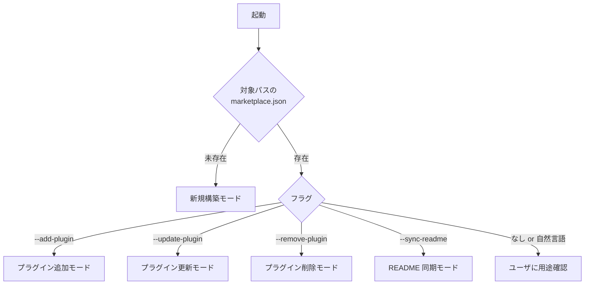

# 操作詳細（マーケットプレイス本体管理）

`marketplace-toolkit` の各操作モードの詳細手順。

## モード判定

実行モードは以下の順で判定する:



## モード A: 新規構築

### 必須入力

| 項目 | 説明 | 例 |
|-----|------|---|
| `name` | マーケットプレイス名（kebab-case） | `acme-claude-plugins` |
| `owner.name` | オーナー名 | `acme-corp` |
| `description` | 1〜2 文の概要 | "Acme Corp 内製 Claude Code プラグインマーケットプレイス" |
| `target-path` | 配置先（git リポジトリのルート） | `/path/to/repo` |

### 手順

1. `<target-path>` が存在しないか、空ディレクトリであることを確認
2. `<target-path>/.claude-plugin/` ディレクトリ作成
3. テンプレート [`../../../references/templates/marketplace/.claude-plugin/marketplace.json`](../../../references/templates/marketplace/.claude-plugin/marketplace.json) をコピー、プレースホルダ置換:
   - `{marketplace-name}` → `name`
   - `{owner-name}` → `owner.name`
   - `{description}` → `description`
4. テンプレート [`../../../references/templates/marketplace/README.md`](../../../references/templates/marketplace/README.md) を `<target-path>/README.md` にコピー、プレースホルダ置換
5. `.gitignore` を生成（`.claude/.local/` 等を含む）
6. JSON valid 検証
7. ユーザに git init 案内（必要に応じて）

### 任意入力

| 項目 | 説明 |
|-----|------|
| `allowCrossMarketplaceDependenciesOn` | 依存先マーケットプレイス名のリスト |
| `marketplace-url` | リポジトリ URL（README に埋め込む。後から追加でも可） |

## モード B: プラグイン追加

### 必須入力

| 項目 | 説明 | 例 |
|-----|------|---|
| `plugin-name` | 追加するプラグイン名 | `dev-toolkit` |
| `description` | プラグインの 1〜2 文説明 | |
| `source` | プラグインのソース（通常は `./plugins/{plugin-name}`） | `./plugins/dev-toolkit` |

### 手順

1. `marketplace.json` を読込
2. `plugins[]` に既存エントリがないか確認（重複チェック）
3. **アルファベット順**で挿入位置を決定し、新エントリ追加:
   ```json
   {
     "name": "{plugin-name}",
     "source": "{source}",
     "description": "{description}"
   }
   ```
4. JSON 整合性検証
5. README 同期（[readme-sync.md](readme-sync.md) に従う）
6. プラグインの実体（`<source>/.claude-plugin/plugin.json`）が存在することを確認

### 注意

- バージョン情報は `marketplace.json` に **記載しない**（`plugin.json` から README 同期時に取得）
- 重複エントリは追加せず、ユーザに「更新モードに切り替えますか？」と確認

## モード C: プラグイン更新

### 必須入力

| 項目 | 説明 |
|-----|------|
| `plugin-name` | 更新対象プラグイン名 |
| 更新フィールド | `description` / `source` のいずれか |

### 手順

1. `marketplace.json` を読込
2. 該当エントリを特定（`name` で検索）
3. 指定フィールドを更新（既存値は上書き）
4. JSON valid 検証
5. README 同期
6. プラグインの `plugin.json` の `version` が変わっている場合は README のバージョン列も自動更新される

## モード D: プラグイン削除

### 必須入力

| 項目 | 説明 |
|-----|------|
| `plugin-name` | 削除対象プラグイン名 |

### 手順

1. `marketplace.json` を読込
2. 該当エントリを特定
3. **ユーザに明示的確認**（`AskUserQuestion`）:
   ```text
   {plugin-name} をマーケットプレイスから削除します。
   この操作は marketplace.json と README の該当行を削除します。
   プラグインのファイル本体（plugins/{plugin-name}/）も削除しますか？

   選択肢:
   1. marketplace.json + README + ファイル本体を削除
   2. marketplace.json + README のみ削除（ファイルは保持、後で手動削除可能）
   3. キャンセル
   ```
4. 選択に応じて実行
5. JSON valid 検証
6. README 同期

## モード E: README 同期のみ

### 必須入力

なし（`marketplace.json` の現状から再生成）

### 手順

1. `marketplace.json` を読込
2. 各プラグインの `plugin.json` を読込してバージョン取得
3. README のプラグイン一覧テーブルを再生成（[readme-sync.md](readme-sync.md) に従う）
4. その他必須セクション（マーケットプレイス追加方法・自動更新設定）が揃うかを検証

## 非対話モード（`--non-interactive`）

| 必須フラグ | 説明 |
|-----------|------|
| 新規構築時 | `--name` `--owner` `--description` `--target-path` |
| 追加 | `--add-plugin <name>` `--description` `--source` |
| 更新 | `--update-plugin <name>` + 更新フィールド |
| 削除（メタデータのみ） | `--remove-plugin <name>` |
| 削除（ファイル本体含む） | `--remove-plugin <name>` `--also-delete-files` `--confirm-destructive`（**二段フラグ必須**） |
| README 同期 | `--sync-readme` |

すべての必須フラグが揃わない場合は対話なしでエラー終了する。

### 削除操作の安全装置（fail-closed）

`--also-delete-files` は **単独では受け付けない**。`--confirm-destructive` の **二段フラグ** が揃った場合のみファイル本体削除を実行する。

| 受け取ったフラグ | 動作 |
|---------------|------|
| `--remove-plugin X` のみ | `marketplace.json` + マーケットプレイス README からエントリ削除（ファイル本体は保持） |
| `--remove-plugin X --also-delete-files` のみ | エラー終了（`--confirm-destructive` 必須） |
| `--remove-plugin X --also-delete-files --confirm-destructive` | ファイル本体含む完全削除（最も破壊的、対話モードでは AskUserQuestion 二重確認、非対話モードではログにのみ警告） |

非対話モードでもファイル本体の完全削除は **二段フラグでガード** する。これにより上位スキル（`marketplace-publisher` のフルオート等）が誤って広範な削除を実行することを防ぐ（ADR の安全装置原則）。

### `<target-path>` の検証（パストラバーサル対策）

新規構築モードの `<target-path>` は以下のいずれにも該当してはならない:

| 拒否対象 | 例 |
|---------|---|
| ルートおよびシステムパス | `/`, `/etc`, `/usr`, `/var`, `/bin`, `/sbin`, `/opt`, `/home/<user>`, `/Users/<user>` |
| Windows ドライブルートおよびシステム | `C:\`, `C:\Windows`, `C:\Program Files`, `C:\Users\<user>` |
| ホームディレクトリ展開先 | `~`, `~/`, `$HOME` |
| シンボリックリンクが上記を指す | realpath 解決後に上記いずれかに該当 |

実装時は `realpath -m` で正規化したうえで上記拒否リストと照合する（[`../../environment-setup-toolkit/scripts/setup/teardown_venv.sh`](../../environment-setup-toolkit/scripts/setup/teardown_venv.sh) と同様の 3 段ガード設計）。
