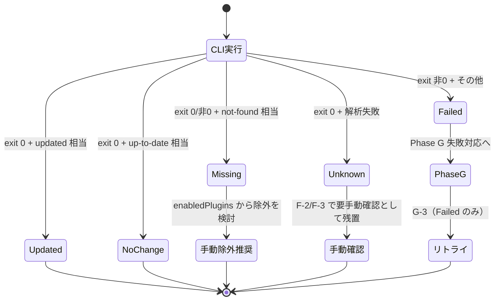

# Architecture Decision Records (maintenance/plugin-updater)

`maintenance` プラグインの `plugin-updater` スキル固有の設計判断記録（旧 `plugins-update` プラグインの ADR を継承し、ADR-PU-010 で統合決定）。プラグイン横断の規約は親マーケットプレイス側
（`extension-toolkit/references/architecture-decisions.md`）を参照。

> **Status 管理規約**: 各 ADR の Status は冒頭表で `Accepted` / `Proposed` / `Superseded` の
> いずれかで管理する。`Superseded` は「Superseded by ADR-PU-XXX」のように後継 ADR を明示する。
> 既存 ADR を後継で置き換える場合、置き換え先 ADR の Context に「ADR-PU-XXX を superseded する」
> と明記する。Michael Nygard 形式（Context / Decision / Rationale / Trade-offs / Alternatives /
> Future Direction）を全 ADR で踏襲する。

| 番号 | タイトル | 状態 | 最終 CLI 仕様確認日 | 最終 Future Direction 改訂日 |
|------|---------|------|------------------|----------------------------|
| ADR-PU-001 | 単一プラグイン化（vs marketplace-toolkit への統合 / vs スキル化） | **Superseded by ADR-PU-010** | N/A | 2026-05-01 (v1.0.0) |
| ADR-PU-002 | 公式 CLI 委譲（vs 低レベル git 操作 / vs 内部実装）— **Trigger ADR** | Accepted | 2026-05-01 (v1.0.0) | 2026-05-01 (v1.0.0) |
| ADR-PU-003 | Phase A-0〜G 固定順序 | Accepted | 2026-06-05 (target 導入) | 2026-06-05 (target 導入 / B/C スキップ追加) |
| ADR-PU-004 | 横断ルール SSOT 配置（cross-cutting-rules.md への分離） | Accepted | N/A | 2026-05-01 (v1.0.0) |
| ADR-PU-005 | exit code 一次判定 + Unknown 区分 | Accepted | 2026-05-01 (v1.0.0) | 2026-05-01 (v1.0.0) |
| ADR-PU-006 | サーキットブレーカー閾値と粒度 | Accepted | N/A | 2026-05-01 (v1.0.0) |
| ADR-PU-007 | 失敗対応の対話モデル | Accepted | N/A | 2026-05-01 (v1.0.0) |
| ADR-PU-008 | コマンドとスキルの責務分離（トリガー / 実作業） | Accepted | N/A | 2026-05-01 (v1.0.0) |
| ADR-PU-009 | installed_plugins.json をスコープ判定の SSOT に採用（Phase A-3） | Accepted | 2026-06-05 (target 導入 / projectPath 活用拡張) | 2026-06-05 (target 導入 / projectPath 活用拡張) |
| ADR-PU-010 | `maintenance` プラグインへの統合（ADR-PU-001 の発展形）| Accepted | N/A | 2026-05-18 (maintenance v0.2.0) |
| ADR-PU-015 | 全プロジェクト更新と `target` パラメータの導入（`scope` 廃止） | Accepted | 2026-06-05 | 2026-06-05 |

> **追従漏れ検知**: 「最終 CLI 仕様確認日」「最終 Future Direction 改訂日」列は ADR-PU-002（Trigger ADR）
> の改訂時に追従が必要な ADR を可視化するため。本表が SSOT。CLI 仕様変更時は ADR-PU-002 の
> 確認日を更新し、追従改訂が必要な他 ADR の改訂日も更新する。プラグインバージョンを括弧で付記する
> ことでリリース対応関係を追跡可能にする。
>
> **`N/A` の意味**: 「最終 CLI 仕様確認日」列の `N/A` は **CLI 仕様に直接依存しない ADR** を示す。
> ADR-PU-001（プラグイン配布単位）/ ADR-PU-004（SSOT 配置）/ ADR-PU-006（サーキットブレーカー
> 閾値）/ ADR-PU-007（対話モデル）/ ADR-PU-008（責務分離）は CLI のサブコマンド仕様変更とは独立した
> 設計判断のため、追従更新の対象外。CLI 仕様変更時に確認すべきは ADR-PU-002 / 003 / 005 のみ。
>
> **改訂日の更新基準**: 「最終 Future Direction 改訂日」列は **Future Direction 本文の改訂時のみ**
> 更新する。テーブル列追加・項目並び替え・誤字訂正等のメタ改訂はカウントしない。これにより
> 本表が「実質的な改訂履歴」として機能し、追従漏れ検知の精度を確保する。

---

## ADR-PU-001: 単一プラグイン化

### Context

プラグイン更新の手動トリガー機能を Claude Code 上で提供するにあたり、以下の配置選択肢があった。

1. **単一プラグイン化**: `plugins-update` として独立したプラグインとして提供
2. **`extension-toolkit:marketplace-toolkit` への統合**: マーケットプレイス本体管理スキルに更新機能を含める
3. **スキル化**: `extension-toolkit` 配下のスキルとして実装

### Decision

**選択肢 1（単一プラグイン化）** を採用する。

### Rationale

- **責務分離（SRP）**: 更新メンテナンスは「マーケットプレイス本体管理」「公開ワークフロー」と
  独立した運用関心事である。エンドユーザーが日常的に呼び出す手動メンテナンスコマンドであり、
  開発時のみ使う `marketplace-toolkit` / `marketplace-publish` とライフサイクルが異なる。
- **配布単位の独立性**: `extension-toolkit` をインストールしないユーザーでも、本プラグイン単独で
  インストール・利用可能にすることで、配布範囲を最大化できる。
- **依存関係の最小化**: 他プラグインへの依存を持たず（`dependencies: []`）、Claude Code CLI のみを
  要件とすることでインストール障壁を下げる。詳細な CLI 委譲方針は ADR-PU-002 を参照。

### Trade-offs

- `marketplace-toolkit` との連携は README リンクに留まり、自動同期はしない。
- 機能追加時に `extension-toolkit` 側のテンプレート資産は流用できない。

### Alternatives Considered

- **`marketplace-toolkit` への統合**: 開発時スキルに運用コマンドを混在させると SRP 違反になり、
  `extension-toolkit` のサイズが肥大化する。却下。
- **スキル化**: スキルは AI が自動起動する単位だが、本機能は明示的なユーザートリガー
  （`/update-all`）が前提のため、スラッシュコマンドが適切。却下。

### Future Direction

他のメンテナンス系コマンド（例: `uninstall-all`、`prune-all` 等）が追加された場合、
本プラグインを `maintenance-toolkit` 等の包括プラグインに発展させる選択肢を残す。

`plugin.json` に **関連プラグイン宣言用フィールド**（例: `relatedPlugins` / `recommendedPlugins`）が
公式に追加された場合、`extension-toolkit:marketplace-toolkit` / `marketplace-publish` を機械可読な
関連として宣言できるようになる。現状は人間可読な README リンクのみで対応している。

#### 境界判断基準

- **エンドユーザ運用コマンド** → 本プラグイン or 後継 `maintenance-toolkit` の責務
- **プラグイン作者向け開発コマンド** → `extension-toolkit` の責務
- **マーケットプレイス管理コマンド** → `extension-toolkit:marketplace-toolkit` の責務
- **公開ワークフロー** → `extension-toolkit:marketplace-publish` の責務

その判断時点で本 ADR の Decision を見直す。

---

## ADR-PU-002: 公式 CLI 委譲

### Context

ADR-PU-001 で単一プラグイン化を採用した前提のもと、マーケットプレイスとプラグインの更新を
実装するにあたり、以下の選択肢があった。

1. **公式 CLI 委譲**: `claude plugin marketplace update` / `claude plugin update <name>@<mp> --scope <scope>`
   を呼び出す
2. **低レベル git 操作**: 各マーケットプレイスのインストールディレクトリで `git fetch + reset --hard origin/HEAD`
   を直接実行する
3. **内部実装複製**: Claude Code CLI の更新ロジックを本プラグイン内に複製する

### Decision

**選択肢 1（公式 CLI 委譲）** を採用する。

### Rationale

- **破壊的操作の回避**: `git reset --hard` はローカルコミット・stash・detached HEAD・独自ブランチ等の
  ユーザ作業を意図せず破壊するリスクがある。CLI は内部でロック制御と状態管理を行い、これらを安全に
  扱う責務を負う。
- **シークレット非接触**: 本プラグインは Git credential helper / SSH キー / `.netrc` /
  `mcpServers` 内 API キーに **読み取りアクセスしない**。認証情報の取り扱い責務を CLI に委譲する。
- **CLI 機能改善の自動取り込み**: CLI バージョンアップで新機能（並列更新・JSON 出力等）が追加された場合、
  本プラグイン側の修正なしに恩恵を受けられる。
- **責務委譲によるシンプル化**: ロック・ロールバック・ネットワーク制御の責務を持たないため、
  本プラグインは「順序制御 + 結果集約 + ユーザ対話」に専念できる。

### Trade-offs

- **CLI 仕様変更への追従**: CLI 出力フォーマット変更時、結果分類ロジック（ADR-PU-005）が影響を受ける。
- **CLI 依存**: Claude Code CLI が PATH に存在しない環境では動作しない。
  Phase A-0 で事前チェック + 出力キーワード照合により早期失敗させる。
- **CLI 内部の挙動が不透明**: 並列処理・ロック粒度等が CLI 実装に依存する。
  本プラグイン側で全体タイムアウト（30 分・XR-2）を設定して暴走を防ぐ。
- **同時実行時の競合**: 同一ユーザがセッションを複数立ち上げて `/update-all` を並行実行した場合の
  `settings.json` Read 競合や CLI の同時呼び出しの挙動は、**CLI 側のロック制御に依拠** する
  （本プラグインは `claude plugin marketplace update` / `claude plugin update` を呼び出すのみで、
  ファイルシステム操作は CLI が担う）。ユーザ手動の二重起動は推奨しないが、`autoUpdate: true`
  起動時自動更新と `/update-all` 手動更新の同時走行は CLI 側の挙動に委ねる前提。
- **CLI バイナリ自体の真正性**: CLI バイナリが侵害されると本プラグインのセキュリティ前提が崩壊する。
  CLI 自体の真正性は OS のパッケージマネージャ署名検証に依拠する。検証コマンド例:
  - Linux (dpkg): `dpkg -V claude` 相当
  - macOS: `codesign -v $(which claude)`
  - Windows: `Get-AuthenticodeSignature (Get-Command claude).Source`
- **`marketplace update <name>` の個別 MP 指定が CLI で確認できない**: G-3 のリトライは現状
  全件リトライへフォールバックする（CLI が個別指定をサポートした際に挙動を更新する）。

### Alternatives Considered

- **低レベル git 操作（git fetch + reset --hard 直接呼び出し方式）**: security レビューで Critical
  （破壊操作の事前同意欠如）/ High（stash・detached HEAD 未対応）/ Medium（パストラバーサル）等の
  指摘多数。却下。
- **内部実装複製**: CLI のロジックを複製する保守コストが高く、CLI バージョン追従が困難。却下。

### Future Direction

CLI が `--output json` 等の構造化出力モードを提供したら、ADR-PU-005 を改訂し JSON 解析へ移行する。
外部 CLI 依存を `plugin.json` で機械可読に宣言する手段が公式仕様に追加された場合は速やかに対応する。
並列実行のサポートが CLI 側で提供された場合は ADR-PU-003 と組み合わせて検討する。
`marketplace update <name>` の個別 MP 指定が CLI で確認できた場合は G-3 のリトライ戦略を更新する。

> **CLI 機能改善時のトリガー ADR**: 本 ADR-PU-002 を **CLI 仕様変更追従の起点 ADR**
> （Trigger ADR）と位置付ける。CLI 仕様変更を検知したら、まず本 ADR の Future Direction を更新し、
> その後に追従が必要な他 ADR（ADR-PU-003 / ADR-PU-005 / ADR-PU-006 / ADR-PU-008）の Future Direction
> を順次改訂する。これにより SSOT 階層が「CLI 仕様 → 本 ADR → 他 ADR」と一方向化される。
>
> **CLI バージョン変更の検知運用**:
> 1. **A-0-2 由来の自動検知シグナル**: A-0-2 で `^\s+marketplace\s+update\b` / `^\s+update\b`
>    のいずれもマッチしないケースが新規発生した場合、CLI 出力フォーマット変更の可能性が高い
>    → ADR-PU-002 のレビュー候補とする
> 2. **XR-5 警告由来のシグナル**: F-1 サマリで Unknown 件数が試行済みの 20% を超える場合、
>    出力解析の誤分類が増加している兆候 → 同様にレビュー候補
> 3. **本プラグイン定期メンテナンス時**: `/update-all` 自体のリリース前に、`claude plugin --help`
>    と `claude plugin marketplace --help` を採取し、前回採取結果（CHANGELOG 等で履歴管理）との
>    diff を確認する
> 4. **Claude Code 公式リリースノート確認**: `plugin` 関連サブコマンドの追加・削除・引数変更を
>    リリースノートで定期確認
>
> **A-0-2 検証強化案**:
> - **セッション内初回のみ INFO 提示**: 現在は毎回提示する設計だが、同セッション内で `/update-all` を
>   複数回実行する運用シナリオではノイズ化する。Claude Code がセッションスコープ状態保持機構を
>   提供したら「セッション内初回のみ提示」「`target=current-project` 指定時の省略可」等の条件付き提示に発展させる
> - **`--verify-cli-signature` フラグの導入**: 明示指定時のみ OS 別の署名検証コマンド
>   （`codesign -v` / `Get-AuthenticodeSignature` / `dpkg -V`）を自動実行するオプションを追加し、
>   セキュリティ重視ユーザの真正性確認を自動化する

---

## ADR-PU-003: Phase A-0〜G 固定順序

### Context

複数のマーケットプレイスと複数スコープのプラグインを更新する処理の **順序** をどう構造化するかを決定する。
（結果分類ロジックは ADR-PU-005、横断ルール配置は ADR-PU-004、対話モデルは ADR-PU-007 を参照）

### Decision

以下の **Phase A-0〜G の固定順序** で逐次処理する。

| Phase | 内容 | 実行順 |
|-------|------|-------|
| A-0-1 | 引数バリデーション（`target` 値のホワイトリスト照合） | 1（最優先） |
| A-0-2 | Claude Code CLI 存在チェック + 必要サブコマンド連続文字列照合 | 2 |
| A | 対象収集（`marketplace list` + `enabledPlugins` 抽出） | 3 |
| A-1 | プラグイン名・MP 名・スコープ名の入力検証（XR-1） | 4 |
| A-2 | マーケットプレイス整合性検証（`enabledPlugins` の MP が `marketplace list` に存在するか） | 5 |
| A-3 | スコープ真値判定（`installed_plugins.json` の `scope` / `projectPath` を SSOT として project/local の現在のプロジェクト外エントリ等を除外。詳細は ADR-PU-009） | 6 |
| B | マーケットプレイス更新（`target=current-project` ではスキップ） | 7 |
| C | User スコープのプラグイン更新 | 8 |
| D | Project スコープのプラグイン更新 | 9 |
| E | Local スコープのプラグイン更新 | 10 |
| F | 結果報告（サマリ + マーケットプレイス詳細 + スコープ別詳細） | 11 |
| G | 失敗対応の確認 + 限定リトライ + 再描画 | 12 |

### Phase 番号体系

- **基本 Phase**: A / B / C / D / E / F / G の 1 文字。
- **派生 Phase**（Phase 全体の前後に追加するもの）: `A-0` / `A-1` / `A-2` のようにハイフン枝番。
  **判断基準**: 「対象 Phase の本質的責務（Phase A の場合は対象収集）の **前後に位置し、
  その本質的責務には直接含まれない** 検証・準備・後処理ステップ」を派生 Phase として番号付与する。
  例: `A-0`（事前検証）は Phase A の前段として CLI 存在チェック等を担い、`A-1`（入力検証）/
  `A-2`（MP 整合性検証）は Phase A 直後の Phase A 抽出結果に対する後段検証ステップ。いずれも
  Phase A の対象収集ロジックそのものではないため派生 Phase 扱い。
- **サブフェーズ**（Phase 内のステップ）: `B-1` / `C-1` / `F-1` / `G-1` のようにハイフン枝番。
  **判断基準**: 「対象 Phase の本質的責務を構成するステップ」をサブフェーズとして番号付与する。
  例: `B-1`（マーケットプレイス更新の結果判定）は Phase B（マーケットプレイス更新）の本質的責務の
  一部、`F-1`（サマリ）/ `F-2`（マーケットプレイス詳細）は Phase F（結果報告）の本質的責務の一部。
- **混在の解決**: 派生 Phase は当該基本 Phase に **論理的に属する処理ステップ** であり、
  サブフェーズは「結果分類」「サマリ表示」等のステップ。番号衝突を避けるため、新規追加の際は
  本 ADR を更新して位置付けを明記する。
- **A-2 の単一実施**: A-2 は Phase A 直後に 1 回のみ実施する。Phase B 後の再実施は行わない
  （仕様簡素化のため）。

### Rationale

- **A-0 を最優先実行する理由**: CLI 不在時に Phase A 以降が無意味な失敗を量産する前に早期エラー終了。
- **MP → User → Project → Local** の固定順は、(a) マーケットプレイス本体が SSOT のため最新化を
  プラグイン更新より先に行う必要があり、(b) スコープは上書き優先順位（より狭いスコープが優先）の
  逆順で更新することで「広いスコープから順に最新化される」ためユーザの認知モデルに合致する。
- **Phase B を `target=all` では常に実行** する理由: マーケットプレイスは全プラグインの SSOT であり、
  プラグイン更新前に最新の MP インデックスが必要なため。`target=current-project` では Phase B をスキップする
  （現在のプロジェクトの project/local のみ対象のため。ADR-PU-015 参照）。
- **冪等性**: 同一 (plugin, marketplace) を複数スコープで処理しても CLI 側で冪等性が保証される
  （`enabledPlugins` がスコープごとに独立 SSOT であるため）。

### Trade-offs

- **直列処理**: 並列実行による I/O 待ち短縮の余地を放棄。CLI のロック競合リスクを避けるため
  当面は直列を維持。将来的に `update-one(scope, plugin, marketplace) → result` 抽象を導入し、
  Strategy パターンで並列化への切り替え可能にすることを検討。
- **A-2 の単一実施によるドリフト**: Phase A 直後に 1 回のみ実施するため、Phase B（マーケットプレイス更新）で
  新規 MP が追加された場合、当該 MP 配下の `enabledPlugins` エントリは Skipped（マーケットプレイス未登録）
  扱いのまま当該セッション内では更新されない（次回実行で初回更新される）。Phase F に該当する INFO を
  表示してユーザの認知ギャップを埋める。
- **Strategy 抽象化の現状**: Phase C / D / E は scope パラメータ違いの同一ロジックであり、論理的には
  `update-scope(scope)` の 3 回適用。将来 `update-one(scope, plugin, marketplace) → result` 抽象を
  導入する素地として記述上も対称化している。

### Alternatives Considered

- **並列実行**: CLI の内部ロック挙動が公式に保証されていないため、現時点では却下。
- **スコープ → MP の順序**: ユーザの認知モデル（プラグインが先・MP は背後）に反するため却下。
- **A-2 の Phase B 後再実施**: 仕様複雑化に対して効果が小さい（B でマーケットプレイスが新規追加される
  ケースは現実的に稀）。次回実行時に反映されれば即時性は不要。却下。

### Future Direction

CLI が並列実行を公式サポートしたら、Phase C/D/E を `update-one` 抽象化して並列戦略に切り替える。
ADR-PU-002 の Future Direction と連動する。

**dry-run と本番実行の Strategy 統一**: 現在 dry-run は「Phase B/C/D/E 直前に変更系 CLI 実行を
スキップする」モードパラメータとして実装されているが、`update-one(scope, plugin, marketplace)` 抽象
を導入する際は **dry-run / 本番 / 並列の 3 戦略を同一インタフェースで切り替える Strategy パターン**
（例: `NoOpExecutor` / `SequentialExecutor` / `ParallelExecutor`）への統合を検討する。これにより
モード分岐が単一拡張ポイントに集約される。

**A-Sec 第三手順の決定論的実装への移行（Future Direction）**: 現行版は Phase A-Sec 第三手順
（ブロック終端検出）を Claude（LLM）の状態機械走査に依存している。LLM の取りこぼしリスクは
構造上ゼロにできないため第四手順がバックストップとして機能するが、将来的には外部 Bash + Python
の `json.loads` ベース抽出（決定論的実装）への移行を検討する。具体的な実装方針:

- A-Sec 第一手順 Grep で抽出した範囲を一時ファイルに書き出し
- `python -c "import json,sys; d=json.load(sys.stdin); print(json.dumps({'enabledPlugins': d.get('enabledPlugins', {})}))"` で
  `enabledPlugins` のみを抽出して再シリアライズ
- A-Sec 第二〜四手順を JSON パース成功 + キー名検証に置き換える

移行の前提: Bash + Python が PATH にあること。本プラグインは Claude Code CLI のみを必須とし
Python オプショナル化を維持する場合、LLM 走査と決定論的実装の両モード切替を XR-2 Future Direction の
Strategy 抽象化と統合する形が望ましい。

**Strategy 責務境界の予約**: Strategy 抽象は **`skills/plugin-updater/` 配下のスキル責務として配置** し、
コマンド本文（`commands/update-all.md`）は引数解釈のみを継続維持する（ADR-PU-008 の責務分離原則を
継承）。Strategy 導入時に以下の責務分担を採用する:
- `NoOpExecutor`: dry-run モード（出力フォーマット差し替えのみ・A-0-2 INFO は通常出力）
- `SequentialExecutor`: 通常モード（現行実装相当）
- `ParallelExecutor`: 将来 CLI 並列対応時（XR-2 サーキットブレーカーの並列セッション間集計が必要）
- **Phase オーケストレータ**: `skills/plugin-updater/` 配下のスキル責務として配置（具体的には
  `phase-flow.md` の各 Phase セクションが「現在の Phase」を保持し Executor を呼び出す責任を持つ）。
  Phase G スキップは Executor ではなく Phase オーケストレータが mode を見て判定（Executor は
  「実行する／しない」のみを担い、フロー制御は持たない）。
- **mode → Executor マッピング**: `mode` の解釈はコマンド側（引数解釈）で `mode = normal | dry-run`
  の正規化までを担い、スキル側で `mode` 値から Executor を選択する責任を持つ
  （`mode = normal → SequentialExecutor` / `mode = dry-run → NoOpExecutor`）。コマンドは
  `mode` 値を透過するのみで Executor を意識しない。

> **現状補注（v1.0.0）**: 本セクションは **将来予約**。v1.0.0 では Strategy / Executor /
> Phase オーケストレータは独立エンティティとして実装されておらず、`phase-flow.md` の各 Phase
> セクション記述が **暗黙の Phase オーケストレータ** として機能している。Phase G スキップ判定や
> dry-run 時の変更系 CLI スキップは phase-flow.md の各セクション内記述（mode 値の参照）に依拠。
> Strategy 抽象化を実装する際は本予約に従い、phase-flow.md の各 Phase セクションを Executor
> インタフェースに分解する。

---

## ADR-PU-004: 横断ルール SSOT 配置

### Context

入力検証・タイムアウト・出力サニタイズ・リトライ上限・Unknown 警告の 5 つは複数 Phase に横断適用される
「横断関心事（cross-cutting concerns）」。これをどこで定義するかを決定する。

### Decision

横断ルール XR-1〜XR-5 を `references/cross-cutting-rules.md` に切り出して **SSOT** とする。
コマンド本文 `commands/update-all.md` は本ファイルへの参照のみを持ち、規則本体を再定義しない。

### Rationale

- **Clean Architecture 階層分離**: 横断関心事を Implementation 層（コマンド本文）から Policy 層
  （references/）に持ち上げることで、層間依存方向を整理する。
- **将来の `update-one` 抽象化への耐性**: 別コマンドが追加された場合、`cross-cutting-rules.md` を
  共通参照することでコピペ重複を回避できる。
- **設計根拠の明示**: 各 XR の数値（60 秒・30 分・40 字・1 回・20% 等）の根拠を本ファイルに集約することで、
  将来の値変更判断が容易になる。

### Trade-offs

- **参照のオーバーヘッド**: コマンド本文を読む際に `cross-cutting-rules.md` への参照を追わないと
  詳細が分からない。
- **2 ファイル同期義務**: 規則変更時に 2 ファイルが整合する必要があるが、実体は SSOT 側にあり
  コマンド本文は「適用範囲のみ」を示すため、同期コストは小さい。

### Alternatives Considered

- **コマンド本文に SSOT を置く方式**: `update-one` 等の追加コマンド時に重複が発生するため、
  SRP / DRY 違反のリスクが高い。却下。
- **ADR 内に直接記載**: ADR は「決定根拠」を記録するもので、運用ルール本体ではない。
  `cross-cutting-rules.md` のような専用ファイルが適切。却下。

### Future Direction

#### XR 番号体系の拡張ルール

- **追加**: 新規横断関心事は `XR-{次番号}` で採番。`cross-cutting-rules.md` の冒頭表と本文・関連 ADR に
  追加する。コマンド本文の参照表も同期更新する。
- **削除**: 不要になった XR は **削除せず**「Deprecated」状態として残し、別 XR への統合や置換先を
  本文末尾に明記する。番号の再利用は禁止。
- **統合**: 複数の XR を統合する場合、新規番号を割り当て、旧 XR は Deprecated とする。
- **他プラグインからの参照**: 本ファイルは `maintenance` プラグインの `plugin-updater` スキル専用。他プラグインから直接参照させない。
  共通化が必要なら `extension-toolkit/references/` 側に同等ファイルを用意する。

---

## ADR-PU-005: exit code 一次判定 + Unknown 区分

### Context

公式 CLI の成否をどう判定し、想定外の出力をどう扱うかを決定する。
本 ADR は **マーケットプレイス更新（B-1）** と **プラグイン更新（C-1 / D-1 / E-1）** の両方に適用する。

### Decision

CLI の成否は **exit code を一次判定** とし、出力テキストの解析は補助情報に降格する。
判定不能ケースは "Unknown（要手動確認）" 区分として残す。

#### 結果分類テーブル — プラグイン更新（C-1 / D-1 / E-1 共通）

| exit code + 出力 | 結果分類 |
|------------------|---------|
| exit 0 + `updated` 相当 | Updated |
| exit 0 + `up-to-date` / `already latest` 相当 | No change |
| exit 0 + `not found` / `no such plugin` 相当 | Missing |
| exit 非 0 + `not found` / `no such plugin` 相当 | Missing |
| exit 非 0 + 上記以外 | Failed |
| exit 0 + いずれの相当文字列も検出不能 | Unknown |

#### 結果分類テーブル — マーケットプレイス更新（B-1）

| exit code + 出力 | 結果分類 | 後続処理 |
|------------------|---------|---------|
| exit 0 + 出力に `Failed:` / `Error:` 行なし | OK | Phase C 以降を通常実行 |
| exit 0 + 出力に `Failed:` / `Error:` 行あり | 部分失敗 | 抽出 MP 名は Failed として記録、他 MP は OK。Phase C 以降を **警告付き継続** |
| exit 0 + 出力解析で MP 名抽出不能 | Unknown | F-2 に Unknown 区分で残し、当該 MP 配下のプラグインは Skipped（MP Unknown）として Phase C/D/E から除外 |
| exit 非 0 | 全体失敗 | Phase C 以降は **警告付き継続**（CLI が古いインデックスでプラグイン更新を試みる可能性のため停止しない） |

#### 例外行抽出パターン

`Failed:` / `Error:` 行抽出には以下の正規表現を使用する（XR-3 サニタイズを抽出後に必ず適用）:

```text
^(Failed|Error)[:\s]+(.+?)(?:\s+at\s|\s+in\s|$)
```

##### 想定される CLI 出力例（v1 系挙動）

```text
Failed: dmajima-claude-plugins
Error: my-private-mp at 14:35:00
Failed: another-mp in branch main
```

- 上記いずれの行も `^(Failed|Error)[:\s]+(.+?)(?:\s+at\s|\s+in\s|$)` のキャプチャグループ 2 で
  MP 名（`dmajima-claude-plugins` / `my-private-mp` / `another-mp`）が取得される。
- `at <時刻>` / `in <branch>` のような後続フィールドが付かない場合は行末（`$`）でキャプチャ終端する。
- CLI バージョンによっては `Failed: <mp-name>: <error-detail>` のように追加コロン区切りが入る場合があり、
  その場合キャプチャ 2 は `<mp-name>: <error-detail>` を含む可能性がある。**XR-1 の正規表現
  （`^[A-Za-z0-9]([A-Za-z0-9_.-]{0,62}[A-Za-z0-9])?$`）で再照合** することで、コロン区切りを含む
  値は不一致となり Unknown 扱いに振り分けられる（誤判定の安全弁）。

抽出した MP 名候補は XR-1 の正規表現に再照合し、合致しないものは Unknown として扱う。

##### 例外抽出のテストケース

| CLI 出力例 | 抽出グループ 2 | XR-1 再照合 | 最終分類 |
|----------|--------------|-----------|---------|
| `Failed: dmajima-claude-plugins` | `dmajima-claude-plugins` | 合致 | Failed（MP 名: dmajima-claude-plugins） |
| `Error: my-mp at 14:35:00` | `my-mp` | 合致 | Failed（MP 名: my-mp） |
| `Failed: another-mp in branch main` | `another-mp` | 合致 | Failed（MP 名: another-mp） |
| `Failed: my-mp: connection refused` | `my-mp: connection refused` | 不合致（`:` を含む） | **Unknown**（XR-1 再照合の安全弁が発動） |
| `Failed: timeout` | `timeout` | 合致（XR-1 通過する単純語） | **A-2 整合性検証連携で Unknown 格上げ**（後述）— 偽陽性回避 |
| `random log line not matching pattern` | （マッチなし） | — | 抽出なし（B-1 「Unknown」） |

##### 偽陽性回避ルール（A-2 整合性検証連携）

XR-1 を通過した汎用語（`timeout` / `error` / `warning` / `fatal` 等）が MP 名候補として抽出された
場合、**Phase A で取得した `claude plugin marketplace list` の結果に該当 MP 名が存在するか** を再照合
する（A-2 整合性検証の補助）。存在しない場合は **Unknown に格上げ**（Failed として Phase G リトライ
対象に巻き込まない）。これにより `Failed: timeout` のような偽陽性を構造的に排除する。実装時の擬似処理:

```text
if mp_name_candidate in mp_list_from_phase_A:
    分類 = Failed
else:
    分類 = Unknown  # 偽陽性回避の安全弁
```

このロジックは Phase B-1 の結果分類処理内で実施し、Phase G への引き渡し前に確定させる。

**A-2 単一実施との関係（ADR-PU-003 Trade-offs 連動）**: Phase A 取得時点と Phase B-1 結果分類時点で
`marketplace list` がドリフトする可能性は低い（Phase B より前に collisions を A-2 で検出済みであり、
Phase B 自体は MP 一覧の追加・削除のみで既存エントリ名は変わらない）。よって本偽陽性回避ルールでの
再照合に Phase A の `marketplace list` 結果（A-2 時点のスナップショット）を再利用することは安全。

#### Unknown 件数の警告閾値

XR-5 を参照（試行済み件数の 20% 超で警告）。

### Rationale

- CLI の出力フォーマットはバージョン間で変わりうるため、出力テキストの正規表現マッチに依存すると
  CLI バージョン変更時に静かに誤分類が発生する。
- exit code は POSIX 慣習として安定したインターフェースであり、CLI バージョン非依存性が高い。
- 出力解析が失敗した場合に "Unknown" 区分として残すことで、ユーザに「要手動確認」のシグナルを
  届けられる（誤った成功・失敗判定よりも安全）。

### Trade-offs

- **Unknown 区分の負担**: ユーザが Unknown エントリを手動確認する必要がある。XR-5 の 20% 警告閾値で
  異常検知の補助とする。
- **exit 0 + not-found ケース**: CLI が認証エラーを exit 0 で返す実装が稀に存在するため、
  出力解析の補助が完全には不要にならない。
- **`marketplace list` 出力の認証情報リスク**: `claude plugin marketplace list` の出力は MP 名と URL を
  含むが、ユーザが `https://<TOKEN>@github.com/...` 形式で MP を登録している場合、出力に URL 埋め込み
  トークンが含まれる。本プラグインは XR-3 サニタイズ対象外として扱うが、**MP 名のみを抽出処理に
  使用し URL 列はメインコンテキストに保持しない設計** で実害を回避する（cross-cutting-rules.md XR-3
  「対象外」セクションのリスク許容記述を参照）。
- **Phase A 後に settings.json が編集された場合の Missing 検出**: Phase A の (plugin, mp, scope)
  リスト取得時点と Phase C/D/E 実行時点の状態がずれた場合、削除されたエントリへの呼び出しは
  Missing として記録される（CLI 側の検証で吸収）。

### Alternatives Considered

- **キーワードマッチ一次判定**: 出力解析を一次にすると CLI バージョン変更時の壊れ方が静かで
  気付きにくい。却下。
- **失敗とみなす（Unknown を Failed に統合）**: 誤った Failed 判定が増え、Phase G の質問が
  ノイズで埋まる。却下。
- **B と C/D/E で分類テーブルを別 ADR に分離**: 共通ポリシー（exit code 一次判定）が同一であり、
  分類項目のみ異なるため、本 ADR に両方を記載するのが SSOT として妥当。却下。

### Future Direction

CLI が `--output json` 等の構造化出力モードを提供したら、本 ADR を改訂し JSON 解析に移行する。
拡張ポイント（Phase B-1 / C-1 / D-1 / E-1 の結果分類ロジック）は
[`phase-flow.md`](phase-flow.md) の該当 Phase セクションに明記してある（ADR-PU-008 でコマンド本文から
スキル references 配下に移管済み）。

#### Unknown / Missing 区分の状態遷移（補足）

Missing は CLI リトライしても回復しない（マーケットプレイスから消失）ため、Phase G の
リトライ対象から **除外**し、ユーザに「`enabledPlugins` 除外を検討」を促す（Phase F-4 のアクション）。



---

## ADR-PU-006: サーキットブレーカー閾値と粒度

### Context

XR-2 のサーキットブレーカー（同一 MP に対する累計失敗で配下を Skip）について、閾値・粒度・カウント方式を決定する。

### Decision

- **粒度**: マーケットプレイス（MP）単位。
- **閾値**: 同一 MP に対する **累計 3 件以上の Failed**。
- **カウント方式**: 連続・非連続を問わない累計。集計対象は **ADR-PU-005 の各テーブルで `Failed` に
  分類されたエントリ** に限定する。具体的には:
  - Phase B-1 の **「部分失敗」分類で `Failed` として記録された MP**（カウント対象）
  - Phase C/D/E の `Failed` エントリ（カウント対象）
  - Phase B-1 の **「全体失敗」（exit 非 0）はカウント対象外**: 全体失敗は MP 個別の障害ではなく
    CLI 自体の応答異常であり、サーキットブレーカーで「特定 MP 配下を遮断する」概念に当てはまらない
  - Phase B-1 の **「Unknown」もカウント対象外**: 分類失敗であり Failed と区別する
- **作動時挙動**:
  - **C/D/E のプラグイン単位リトライ**: 当該 MP 配下のプラグイン更新エントリ（残）を Skipped
    （サーキットブレーカー作動）として除外。G-3 プラグイン単位リトライ対象からも除外。
  - **Phase B 全件リトライ**（G-3 で MP Failed が選択された場合）: **サーキットブレーカー作動中の
    MP も再試行され得る**（Phase B が `marketplace update <name>` の MP 単位個別指定を CLI で
    サポートしないため、現状は `marketplace update`（全 MP 一括）のみ。これは設計上の許容事項。
    CLI が個別指定をサポートした際は ADR-PU-002 Future Direction に従って G-3 リトライ戦略を更新し
    サーキットブレーカー除外を厳密化する）。SKILL.md / phase-flow.md / output-formats.md の関連
    記述は本 ADR への参照のみを持ち、本 ADR が SSOT。

### Rationale

- **MP 単位**: 失敗の根本原因（ネットワーク・認証・MP 自体の障害）は MP に紐づくことが多く、
  同一 MP の他プラグインも同じ理由で失敗する可能性が高い。プラグイン単位での個別判定は
  オーバーヘッドが大きく、無駄なリトライを生む。
- **累計 3 件**: 経験的閾値。1〜2 件は一過性のネットワーク失敗の可能性、4 件以上は反応が遅い。
  「3 件 = 統計的にパターン化された失敗」と判断する妥協点。
- **連続判定方式 vs 累計判定方式**: 連続判定方式では非連続パターン（2 件失敗→1 件成功→2 件失敗）を
  検知できない。本 ADR では累計判定方式を採用する。

### Trade-offs

- **誤作動の可能性**: 同一 MP の 3 プラグインがたまたま個別事情で失敗した場合（authentication 切れ等）、
  4 件目以降の正常更新がスキップされる。ユーザは Phase G で全件リトライを選択することで再実行可能。
- **大規模 MP での影響**: 100 件のプラグインを持つ MP で 3 件失敗すると残 97 件がスキップされる。
  ただしリトライ機構（XR-4）でリカバー可能。
- **敵対的 DoS の影響範囲**: MP 提供者が悪意ある場合、配下 3 プラグインを意図的に失敗させて 4 件目
  以降の正規プラグイン更新をスキップさせる DoS が理論的に可能。ただし以下により影響は限定的:
  (1) 既存インストール済みプラグインはそのまま動作するため可用性影響は更新の遅延のみ、
  (2) ユーザは Phase G で「全件リトライ」を選択することで再実行可能、
  (3) **C/D/E プラグイン単位ではサーキットブレーカー作動 MP は除外されるため波及しない**、
  (4) 公式 CLI 委譲（ADR-PU-002）により認証情報・データ毀損には繋がらない。
  MP 提供者の信頼性確認は別レイヤ（マーケットプレイス追加時のユーザー同意）で担保する。
- **Phase B 全件リトライ時の DoS 残余リスク**: G-3 で MP Failed が選択された場合、Phase B
  （`marketplace update` 全件）が再実行され、サーキットブレーカー作動中の MP も含まれる。
  悪意ある MP が応答遅延を仕掛けると個別タイムアウト 60 秒（XR-2）× 全 MP 件数が累積し、最悪
  全体タイムアウト 30 分（XR-2）を消費する可能性がある。
  **対策の SSOT**: 警告条件と警告文言は **output-formats.md「Phase G-1 質問文」の `<warn_breaker>`
  プレースホルダ仕様** が SSOT。本 ADR は概念説明のみを持ち、文言や条件式は再定義しない
  （v1.0.0 で `<M> >= 1` 条件化）。CLI が `marketplace update <name>` 個別指定をサポートしたら
  ADR-PU-002 Future Direction に従いサーキットブレーカー除外を厳密化し、本残余リスクを構造的に
  排除する。暫定対策として、Phase B 全件リトライ時のみ個別タイムアウトを 60 秒 → 30 秒に短縮する案も
  XR-2 拡張オプションとして検討余地がある（現状は実装複雑化を避けるため未採用）。

### Alternatives Considered

- **連続失敗のみカウント**: 公開前開発時に検討。非連続失敗パターンを見逃す。却下。
- **失敗率（5 件中 3 件）**: 母数が少ない場合に判定が不安定。却下。
- **指数バックオフ**: ローカル CLI 委譲のため過剰。却下。
- **プラグイン単位**: オーバーヘッド大、根本原因が MP に紐づくため意味薄。却下。

### Future Direction

CLI が並列実行をサポートした際は、サーキットブレーカーの集計が並列セッション間で正しく行われるか
の再評価が必要。現状は逐次実行のため単純カウンタで十分。

---

## ADR-PU-007: 失敗対応の対話モデル

### Context

Phase G での失敗対応をどのような対話形式で実施するかを決定する。
特に「失敗の性質（リトライで回復するか）」と「失敗件数の多寡」を考慮する必要がある。

### Decision

- **失敗総数 N の定義**: **Failed のみ**（Missing は CLI リトライで回復しないため対象外、
  Unknown は要手動確認のため対象外）。
- **G-1（全体方針）**: Failed エントリに対し「全件リトライ / 個別に判断 / 全件スキップ」の 3 択を 1 回提示。
- **G-2（個別判断）**: G-1 で「個別に判断」を選択した場合のみ、Failed エントリ数 N が **5 件以下**
  のときに各エントリ個別に「リトライ / スキップ」を質問。
- **件数閾値 5 件超**: G-1 の選択肢から「個別に判断」を **動的に除外**（連続質問による UX 劣化防止）。
- **質問テキスト切り詰め**: G-2 の質問テキストはサニタイズ後 500 字を上限に切り詰める
  （マスクトークン `***...***` の途中で切らない）。
- **Missing の扱い**: Phase G の対象としない。Phase F-4「次のアクション」で
  「`enabledPlugins` から除外することを検討」とユーザに提示する（リトライではなく設定変更を促す）。

### G-1 質問文の `<M>` / `<P>` 内訳

質問文 `<N> 件の更新失敗（マーケットプレイス: <M> 件 / プラグイン: <P> 件）` の定義:

- `<M>`: マーケットプレイス更新（Phase B-1）で Failed と判定された件数。CLI が MP 単位の Missing を
  返さないため B-1 の Missing は存在しない。
- `<P>`: プラグイン更新（Phase C/D/E）で Failed と判定された件数（Missing は除外）。
- `<N> = <M> + <P>`。

### Rationale

- **Missing をリトライ対象から除外**: Missing は CLI が「プラグインがマーケットプレイスから消失した」と
  判断した状態であり、CLI を再実行しても結果は変わらない（むしろユーザは `enabledPlugins` を整理する
  必要がある）。Failed（ネットワーク・認証・一時的障害）と Missing（永続的不在）は対応アクションが
  異なるため、リトライの対象を Failed に限定するのが SRP に整合。
- **5 件以下**: 1 件あたり 5〜10 秒の認知負荷を想定し、5 件 × 10 秒 = 50 秒程度を許容上限とする経験則。
- **6 件以上**: 個別判断はユーザの集中力を消耗し、結局「全件リトライ」が選ばれる傾向が強い。
  最初から G-1 で完結させる方が UX が良い。
- **500 字切り詰め**: AskUserQuestion の表示上の可読性と、サニタイズ済みエラーメッセージの情報量の
  バランス点。

### Trade-offs

- **5 件超で個別判断不可**: 大量失敗時に「3 件は致命的だが残 5 件はネットワーク一過性」のような
  ニュアンスを表現できない。ユーザは「全件リトライ」→ 残った失敗を手動対応の流れになる。
- **Missing の対応がチャット内で完結しない**: ユーザが手動で `enabledPlugins` を編集する必要が
  ある。`/plugin uninstall` 等の CLI を別途実行する必要があるが、これは設計上の妥当な責務分離
  （本コマンドは「更新実行」が責務、設定編集は本コマンドの範囲外）。

### Alternatives Considered

- **Missing もリトライ対象に含める方式**: ユーザに無駄な「リトライしたが Failed のまま」体験を
  与える。却下。
- **常に個別判断可能**: 大量失敗時の UX が破綻。却下。
- **multiSelect で一括選択**: チェックボックス UI が AskUserQuestion で複雑化。却下。
- **件数閾値を 10 件にする**: 認知負荷上限を超える。却下。

### Future Direction

将来的に AskUserQuestion がテーブル形式の選択 UI を提供したら、件数上限を緩和できる可能性がある。
Missing の自動除外（`enabledPlugins` から削除する別フェーズ）を本プラグインに追加するかは
ユーザの設定変更権限の観点で要検討（現状はユーザ手動対応に委ねる）。

---

## ADR-PU-008: コマンドとスキルの責務分離（トリガー / 実作業）

### Context

ADR-PU-001 では「スキル化を却下」と判断した（理由: スキルは AI が自動起動する単位だが、本機能は
明示的なユーザートリガー前提のため）。しかし継続的なレビューで以下の構造的問題が浮上した:

- コマンド本文が肥大化（460 行超）し、Phase 詳細・横断ルール参照・サニタイズ規則・ユーザ対話が
  一つのファイルに集約されている
- サブフェーズ番号体系（A-0-1 / B-1 / F-0）の混在で命名整合性が保てない
- F-0 を独立サブフェーズから NOTE に再構成した結果、SSOT 階層の整合性が脆弱化していた
  （現行版では Phase 番号を持たない `### サニタイズ規則本体` に改称済みで解消。詳細は本 ADR 末尾の
  「Notes（解消済み歴史事項）」を参照）
- Phase 詳細を AI が読み解く際の認知負荷が高い

ADR-PU-001 のスキル化却下は「AI 自動起動 vs 明示的トリガー」の文脈で行われたが、本 ADR-PU-008 は
「コマンド = ユーザートリガー / スキル = 実作業の SSOT」という別の責務分離軸での判断。
両者は矛盾しない（ADR-PU-001 は配布単位の判断、ADR-PU-008 はプラグイン内の実装責務分離）。

### Decision

`/update-all` コマンドは **トリガーと引数解釈のみ** を担当し、実作業（Phase A-0〜G、横断ルール適用、
ユーザ対話）は **`plugin-updater` スキルに委譲** する。

- `commands/update-all.md`: **43 行**（v1.0.0 `wc -l` 実測値・**±5 行誤差を許容**: フロントマター
  4 行 + 本文 + 末尾「関連」セクション 7 行）/ 実装ロジックは約 33 行（フロントマター・コードフェンス・
  「関連」セクション除外）。引数解釈 + Skill ツール呼び出しのみ。新バージョンで `±5 行` 範囲超の
  肥大化が再発した場合は本 Decision の数値を更新し、原因を Trade-offs に追記する。
  **計測規約**: `wc -l <file>` の出力数値を採用（最終行末 LF の有無に関わらず実環境の `wc` 出力に
  従う）。フロントマター（YAML 区切り `---` で囲まれた範囲）と末尾「関連」セクション（最終 H2
  セクション）を除外した残りを「実装ロジック」と定義する。
  本 Decision に記載の数値が計測の **SSOT**。Rationale その他の参照は本 Decision を引用する形にし、
  独立した数値を持たない。
  **CI 自動化**: 将来は `wc -l` ベースの自動チェックを CI に追加し、誤差超過時に警告する仕組みを
  検討（ADR-PU-002 Future Direction の検知運用と組み合わせ）。
- `skills/plugin-updater/SKILL.md`: スキル概要 + Phase 全体像 + references への参照。
- `skills/plugin-updater/references/`:
  - `phase-flow.md`: Phase A-0〜G 詳細手順（コマンド本文から分離）
  - `output-formats.md`: Phase F のテーブル / 警告 / 質問文フォーマット集約
  - `cross-cutting-rules.md`: XR-1〜XR-5 SSOT（移管）
  - `architecture-decisions.md`: ADR-PU-001〜008 SSOT（移管）

### Rationale

- **責務分離（SRP）**: コマンドは「ユーザー入力の解釈」、スキルは「Phase の実行」と責務を直交化
- **SSOT 階層の純化**: Phase 詳細・サニタイズ規則・ADR が同一スキル配下に集約され、
  `F-0` のような Phase 番号と SSOT 名称の混乱が構造的に排除される
- **AI 解釈容易性**: スキルは AI が起動時に読み込む単位として設計されており、Phase 詳細を持つのに
  自然な配置
- **将来拡張への耐性**: 追加コマンド（例: `update-one`、`prune-all`）が同じスキルを共有可能
- **コマンド本文の単純化**: 公開前開発時の試作版で約 460 行に達していたコマンド本文を、v1.0.0 では
  43 行（`wc -l` 実測値・実装ロジックは約 33 行）まで削減し、レビューでの「肥大化指摘」を構造的に
  解消（計測値の SSOT は本 ADR の Decision を参照）

### Trade-offs

- **ファイル数**: v1.0.0 では 8 ファイル構成（`plugin.json` + `README.md` + `commands/update-all.md`
  + `skills/plugin-updater/SKILL.md` + references 4 ファイル `phase-flow.md` / `output-formats.md`
  / `cross-cutting-rules.md` / `architecture-decisions.md`）。**計測母数**: プラグインルート
  （`plugins/plugins-update/`）配下の全ドキュメント・スキル定義ファイル（`.claude-plugin/plugin.json`
  と `README.md` と `commands/` 配下と `skills/` 配下を合算）。公開前の試作段階では 4 ファイル
  （`plugin.json` + `README.md` + `commands/update-all.md` + references 1 ファイル）構成だったが、
  ADR-PU-008 のスキル委譲設計に伴い 8 ファイルに分割した
- **インストール容量増**: わずかに増加（数 KB 程度）
- **コマンドとスキルで `description` の重複管理**: 軽微だが SSOT 違反の懸念あり。
  当面の運用緩和策として、スキル側 SKILL.md「トリガー条件」セクションに「コマンド呼び出し経由のみ
  （AI 自動起動非対象）」を明示することで、AI が誤って自動起動する可能性を抑制している（SKILL.md
  「トリガー条件」節を参照）
- **スキル化により AI トリガー判定対象になる**: ただし `description` がスキル経由で起動される
  ことを示す内容のため、自動起動による意図しない動作のリスクは小さい

### Alternatives Considered

- **コマンド本文に Phase 詳細を維持**: 公開前開発時の試作版で採用していた方式。レビューで継続的に
  「肥大化」指摘を受けた。却下。
- **スキルだけで配布（コマンドなし）**: `/update-all` の明示的トリガーが失われ、
  ADR-PU-001 で却下した理由と同じ問題が再発。却下。
- **Phase 詳細を `commands/` 配下のサブファイル（例: `commands/update-all-phases.md`）に分割**:
  Claude Code の規約上、`commands/` 配下は単一スラッシュコマンドファイルが基本で、
  サブファイル参照の慣行が確立していない。却下。

### Future Direction

- 追加メンテナンスコマンド（`uninstall-all` / `prune-all` 等）が登場した場合、`plugin-updater`
  スキルから `update-one(scope, plugin, marketplace)` 抽象を切り出して共有する（ADR-PU-002 /
  ADR-PU-003 Future Direction と連動）
- スキル `description` がコマンドと重複する問題は、スキル側を「実作業の説明」に特化することで
  軽減を継続検討

### Notes（解消済み歴史事項）

- **F-0 参照宙吊り（公開前開発時に解消）**: 公開前の試作段階で `cross-cutting-rules.md` に
  `F-0 サニタイズ規則本体` という Phase 番号付きセクションが存在したが、F-0 を独立サブフェーズから
  Phase F の NOTE 形式に再構成した結果、参照が宙吊りになる問題が発生していた。v1.0.0 では
  Phase 番号を持たない `### サニタイズ規則本体` への改称で本問題は構造的に解消済み。Context での
  本 ADR 制定動機の一つとして記録する（v1.0.0 で参照宙吊りはない）。

---

## ADR-PU-009: installed_plugins.json をスコープ判定の SSOT に採用（Phase A-3）

### Context

v1.0.x までは `enabledPlugins`（settings.json の `~/.claude/settings.json` /
`<repo>/.claude/settings.json` / `<repo>/.claude/settings.local.json`）の所在を **暗黙のスコープ判定**
として使用していた:

- `~/.claude/settings.json` → user スコープ
- `<repo>/.claude/settings.json` → project スコープ
- `<repo>/.claude/settings.local.json` → local スコープ

しかし Claude Code は `~/.claude/plugins/installed_plugins.json` を **真のインストール状態の
SSOT** として管理しており、特に **`scope=project|local` のプラグインは `projectPath` フィールド**
で「どの作業ディレクトリにインストールされたか」を記録する。同一プラグインを複数プロジェクトで
独立にインストールできるため、現在の `<repo>` と異なる `projectPath` のエントリに対して
`claude plugin update <plugin>@<mp> --scope project` を発行しても CLI が「該当エントリなし」で
失敗する。

具体的な再現:

1. プロジェクト A で `csharp-lsp@claude-plugins-official` を project スコープでインストール
   （`projectPath = A`）
2. プロジェクト B で同一プラグインを再度 project スコープでインストール（`projectPath = B`）
3. プロジェクト A の `<repo>/.claude/settings.json` の `enabledPlugins` には当該プラグインが
   記録されている
4. プロジェクト C（`projectPath = C` がインストール済みでない）で `/update-all` を実行すると、
   `<repo>/.claude/settings.json` 由来の更新対象列挙時に当該プラグインが含まれてしまい、
   `claude plugin update --scope project` が失敗する

### Decision

`~/.claude/plugins/installed_plugins.json` を **スコープ判定の SSOT** として採用し、
**Phase A-3** で読み取り・突合する。判定ロジックは phase-flow.md A-3 が SSOT。

- `enabledPlugins` は **「有効/無効フラグ」専用** の補助情報として維持（disabled 除外目的）
- スコープ真値は `installed_plugins.json` の `scope` / `projectPath` フィールドが決定
- `projectPath != <repo>` のエントリは **Skipped（現在のプロジェクト外）** として除外（リトライ対象外）

派生する Skipped 区分は 5 種類で、いずれも Phase G リトライ対象外:

1. 現在のプロジェクト外
2. 未インストール（installed_plugins.json に該当エントリなし）
3. disabled（enabledPlugins 値が false / null）
4. enabledPlugins 未登録（installed されているが当該スコープで未有効化）
5. projectPath 欠落（installed_plugins.json の project/local エントリで projectPath が記録されていない）

### Rationale

- **誤更新の構造的排除**: 別プロジェクトの project/local エントリを誤って更新対象に含めない。
- **CLI 挙動との整合**: `claude plugin update --scope project` は実際に現在の `<repo>` 配下の
  `installed_plugins.json` エントリのみを更新可能であり、本判定はそれと一致する。
- **シークレット非接触原則の維持**: `installed_plugins.json` は Claude Code が機械生成する
  状態ファイルで、`mcpServers` / `apiKeyHelper` / `env` 等の機密キーを構造的に持たない。
  Read ツールで全文読み込み可能（A-Sec のような Grep 限定読み込みは不要）。
- **`enabledPlugins` の役割明確化**: `enabledPlugins` を「有効/無効フラグ」専用に限定することで、
  「インストール先（projectPath）」と「有効化状態」の責務を分離。
- **ユーザ体験の改善**: スキップ理由が明示されるため、別プロジェクトでの更新が必要なのか、
  `enabledPlugins` 編集が必要なのかを Phase F-4 のアクションで判別可能。

### Trade-offs

- **追加の Read 操作**: Phase A-3 で `~/.claude/plugins/installed_plugins.json` の Read が
  発生する（夜次レイテンシは 1 ファイル分の Read 程度で軽微）。
- **Read 全文の機密キーリスク**: 現状の Claude Code 実装では `installed_plugins.json` に機密キーは
  含まれないが、将来 Claude Code が同ファイルにフィールド追加する場合、新規フィールドの内容次第で
  サニタイズ追加が必要になる可能性がある。**現実装では `version=2` のスキーマに `scope` /
  `projectPath` / `installPath` / `version` / `installedAt` / `lastUpdated` / `gitCommitSha` のみが
  含まれることを A-3 で前提**とし、これ以外のキーが追加された場合は本 ADR の Future Direction で
  対応する。
- **スキーマバージョン互換**: `version=1` 等の旧スキーマや `version=3` 以降の新スキーマを検出した
  場合、A-3 をスキップして従来挙動（settings.json ベース）にフォールバックする（フェイルセーフ）。
- **projectPath 文字列比較の OS 差**: Windows は大文字小文字非区別、POSIX は区別という差を
  正規化する処理が必要（A-3-3 で実装）。シンボリックリンク経由でインストールされた稀ケースでは
  文字列一致せず Skipped 扱いになるが、誤更新よりは安全側。
- **`projectPath` のメインコンテキスト混入**: `C:\Users\<USER>\...` 形式のパスにユーザ名が含まれる
  ため、判定後はメインコンテキストに保持しない。Phase F-3 の備考列および F-4 のアクション文言で
  表示する場合は **必ず XR-3 サニタイズ（`<user-home>` マスク）を経由** する（phase-flow.md A-3-6 の
  注記参照）。
- **`projectPath` 詐称攻撃面**: `~/.claude/plugins/installed_plugins.json` がローカル他プロセスで
  改変された場合、`projectPath` に `..`/制御文字/末尾空白/`\\?\` プレフィックス/UNC を仕込まれる
  リスクがある。phase-flow.md A-3-3-pre で **`projectPath` にも XR-1 パス検証を対称適用**して防御
  （CWE-22 / CWE-706）。
- **DoS / 巨大 `installed_plugins.json`**: A-3-1 で **4000 行 / 1 MB の上限** を明示し、超過時は
  フェイルクローズ（A-3 をスキップしファイル不在時挙動にフォールバック）。
- **スキーマ未定義フィールド注入**: A-3-1 の Read 直後に **`scope` / `projectPath` のみを抽出する
  ホワイトリストピックアップ** を行い、原データを破棄する。これにより将来 Claude Code が
  `installed_plugins.json` にフィールドを追加した場合や、攻撃者が同ファイルに任意フィールドを
  注入した場合でも、メインコンテキストに混入する経路を構造的に遮断する。
- **A-1 と A-3 の交差集合**: A-3-4 で「`enabledPlugins` ∩ `installed_plugins.json`」の交差集合のみを
  C/D/E の対象とする。`installed_plugins.json` 単独に細工キーが注入されても、A-1 検証済の
  `enabledPlugins` を経由しないルートで CLI に到達することはない（XR-1 二重防御の構造化）。

### Alternatives Considered

- **`enabledPlugins` のみで完結する**（現状維持）: 別プロジェクトでインストールされた project/local
  エントリの誤更新失敗が解消しない。却下。
- **`claude plugin list` 出力を解析**: CLI の出力フォーマットが安定保証されておらず、ADR-PU-005 の
  「exit code 一次判定」原則と整合しない。テキスト解析依存度が増す。却下。
- **A-3 を独立フェーズ化せず Phase A の中で処理**: A-Sec の Grep 限定読み取り原則と
  Read 全文読み取りの方式差を 1 つの Phase 内に共存させると認知負荷が高まる。独立サブフェーズ化で
  責務を分離する方が SRP に整合。却下。
- **`scope=project|local` のエントリは projectPath を見ず一律 Skipped にする**: 現在のプロジェクト
  内のインストールも更新できなくなる過剰防御。却下。

### Future Direction

- **CLI が `claude plugin list --output json` を提供した場合**: `installed_plugins.json` の直接 Read を
  廃し CLI 出力に切り替える（ADR-PU-002 Future Direction と連動）。本 ADR の Decision を改訂。
- **`installed_plugins.json` のスキーマ変更追従**: `version=3` 以降や新規フィールド追加が
  リリースノートで告知された場合、A-3-2 のスキーマ検証ロジックを更新。新フィールドに機密情報が
  含まれる場合は XR-3 のサニタイズ規則本体テーブルに追加する。
- **`/update-all --include-other-projects` 等の拡張**: 別プロジェクトの project/local エントリも
  まとめて更新したいユーザ要望が出た場合、`/update-all --include-other-projects` フラグを追加し、
  当該フラグ指定時は projectPath ベースで全プロジェクト分の更新を試みる（CLI が複数プロジェクト
  対応をサポートした後の拡張）。
- **A-3 由来 Skipped の自動修復提案**: Phase F-4 のアクション提示を受けて、ユーザが対話的に
  `enabledPlugins` から該当エントリを除外できる別コマンド（例: `/prune-enabled-plugins`）を
  検討する（ADR-PU-001 Future Direction の `maintenance-toolkit` 内で扱う案、ADR-PU-010 で
  `maintenance` プラグイン統合として実現）。

---

## ADR-PU-010: `maintenance` プラグインへの統合（ADR-PU-001 の発展形）

### Context

ADR-PU-001 では「単一プラグイン化」を採用し、`plugins-update` を独立プラグインとして
配布してきた（v1.0.0〜v1.1.1）。同 ADR の Future Direction で「他のメンテナンス系コマンドが
追加された場合、本プラグインを `maintenance-toolkit` 等の包括プラグインに発展させる選択肢を残す」
と明記していた。

その後、メンテナンス系の機能要件が複数登場した:

- **`cleanup-workspace`**（新規）: `.claude/.local/work/` 配下の古いセッションフォルダ削除
- **`sync-settings`**（新規）: 特定の Git リポジトリから `~/.claude/` 配下の設定を pull 同期
- **`/update-all`**（既存・本プラグイン）: マーケットプレイス・プラグインの一括更新

これら 3 機能はすべて「Claude Code 環境の運用・保守」という同一ドメインに属し、Future Direction
で予見されていた `maintenance-toolkit` の対象となる。

### Decision

`plugins-update` プラグイン（独立配布）を **`maintenance` プラグインに統合** する（`workspace-maintenance`
プラグイン v0.1.0 を `maintenance` v0.2.0 に改名・拡張する形）。`plugin-updater` スキルおよび
`/update-all` コマンドは `maintenance/skills/plugin-updater/` および `maintenance/commands/update-all.md`
に移管され、機能・インターフェースは互換性を維持する。

旧 `plugins-update` プラグインはマーケットプレイスから削除し、README 冒頭に既存ユーザ向けの
移行手順を明記する。

### Rationale

- **Future Direction の実現**: ADR-PU-001 が想定したシナリオが現実化したため、計画通りの発展を
  選択する。
- **発見容易性**: 「Claude Code 環境メンテナンス」を求めるユーザに対し、関連機能（更新・整理・
  同期）を 1 プラグインで提供することで、機能発見と運用導入のコストを下げる。
- **設計判断の整合性**: ADR-PU-002（公式 CLI 委譲）/ ADR-PU-003〜009 などの「実作業ロジック」に
  関する判断はすべて維持される（移管はファイル配置の変更のみで、Phase 構成・横断ルール・
  対話モデル等は無変更）。
- **ADR-PU-008 との整合**: 「コマンド = ユーザートリガー / スキル = 実作業の SSOT」の責務分離は
  `maintenance` プラグイン内でもそのまま機能する。

### Trade-offs

- **既存ユーザへの移行コスト**: `plugins-update` v1.x をインストール済みのユーザは、旧プラグインの
  アンインストールと新プラグイン（`maintenance`）の再インストールが必要。`/update-all` コマンド自体は
  名前・引数・出力ともに互換性維持。
- **配布単位の独立性低下**: `cleanup-workspace` / `sync-settings` を使わないユーザでも、`maintenance`
  プラグイン全体をインストールすることになる。ただし `dependencies: []` を維持しており、追加の
  外部依存は発生しない。
- **バージョン履歴の継続性**: `plugins-update` v1.1.1 のリリース履歴は新プラグイン側に継承されず、
  `maintenance` v0.2.0 が新たな履歴起点となる。

### Alternatives Considered

- **完全独立維持**（ADR-PU-001 のままを継続）: Future Direction で計画していた統合機会を放棄する
  ことになり、ユーザ視点でのプラグイン散在を解消できない。却下。
- **3 プラグイン完全統合**（`plugins-update` + `workspace-maintenance` + `session-usage`）:
  `session-usage` は `category=diagnostics`（環境状態の可視化）で `maintenance`（保守操作）とは
  性質が異なる。統合すると category 整合性が崩れる。却下。
- **依存関係でリンク**: `maintenance` プラグインの `dependencies` に `plugins-update` を追加する案。
  クロスマーケ依存ではないため不要に複雑化する。却下。

### Future Direction

- **`session-usage` 統合判断の継続検討**: 「メンテナンス」と「診断（diagnostics）」の境界を
  整理した結果、統合が妥当と判断されれば次の minor バンプで取り込む。
- **既存ユーザ向け通知の体系化**: 統合・改名・廃止が複数発生する場合、マーケットプレイス側で
  `deprecated` ステータスを付与する仕組みを `extension-toolkit:marketplace-toolkit` に追加する案。
- **横断ルール（XR-1〜5）の他スキルへの適用**: `cleanup-workspace` / `sync-settings` も
  破壊的操作を伴うため、XR-1（入力検証）/ XR-3（出力サニタイズ）の共通化を検討する。

---

## ADR-PU-011: sync-settings の設定ストアを sync-mappings.json に SSOT 統一

### Context

`sync-settings` スキルには現在 2 つの設定ストアが並存している:

| ファイル | 内容 | 利用箇所 |
|---------|------|---------|
| `sync-config.json` | `last_repo` / `last_branch` / `last_targets` / `last_strategy` / `last_sync_at` / `history[]` | sync.sh（pull 側） |
| `sync-mappings.json` | global / projects[abs_path] それぞれの `remote_repo` / `remote_branch` / `targets` / `last_sync_at` | sync.sh（マッピング解決時）/ sync-mappings.sh（CRUD）/ sync-push.sh |

Phase 3-A（マッピング機構導入）以降、`sync-mappings.json` がプライマリストアとなったが、
互換性のため `sync-config.json` も並行的に書き込まれており、SSOT（Single Source of Truth）が
不明確である（Cycle 1 アーキレビュー Critical C-1）。

### Decision

`sync-mappings.json` を sync-settings の唯一の設定 SSOT として位置付け、`sync-config.json` を
段階的に廃止する。

- **v0.2.x 系（互換期間）**: 既存の `sync-config.json` 書き込みロジックは維持するが、ドキュメント
  上は **deprecated** と明記する。新規ユーザは `sync-mappings.json` 経由（`/sync-map-set` 利用）
  での運用を案内する。
- **v0.3.0**: `sync-config.json` の読み書きを sync.sh から削除する。`last_repo` / `last_branch`
  / `last_targets` / `last_strategy` 等の暗黙利用はサポートしない（マッピング設定を `/sync-map-set`
  で明示的に行うことを前提とする）。
- **`history[]` の扱い**: 利用実績が小さく主要動線では参照されないため、v0.3.0 で削除する。再導入が
  必要になった場合は別ファイル `sync-history.jsonl` として復活させる（JSON Lines 形式で追記専用）。

### Rationale

- **責務分離の明確化**: マッピング設定（永続）と同期履歴（揮発）を分離することで、各ファイルの責務
  と保持期間ポリシーが明示できる。
- **AI / ユーザの混乱回避**: 同一情報を 2 ファイルに重複保持していたため、片方を更新すると整合性が
  保たれない問題があった。SSOT 化により回避する。
- **v0.3.0 リリースタイミングの先行宣言**: 移行猶予を明示することで、既存スクリプトを利用するユーザ
  への影響を最小化する。

### Migration Plan

1. **v0.2.x（本サイクル）**:
   - `references/procedures.md` / `references/safety.md` で `sync-mappings.json` を SSOT と明記
   - `sync-config.json` の互換性レイヤーとしての位置付けを README で説明
   - 新規ドキュメント・evals では `sync-config.json` を参照しない
2. **v0.3.0**:
   - sync.sh から `sync-config.json` 読み書きを削除
   - `--Repo` 引数省略時の暗黙取得（`config.last_repo` から）を廃止
   - 既存 `sync-config.json` を検出した場合、warning でアナウンスし、変換ガイドを提示
3. **v0.4.0+**:
   - `sync-history.jsonl` の必要性を再評価し、要望があれば実装

### Trade-offs

- **既存ユーザへの影響**: `sync-config.json` に暗黙依存していた挙動は v0.3.0 で動作しなくなる。
  移行猶予として v0.2.x 系で deprecated 警告を出し、影響を最小化する。
- **history の喪失**: 既存利用者で history を参照していたケースは v0.3.0 以降途絶える。要望に応じて
  v0.4.0+ で復活させる方針。

### Alternatives Considered

- **両ストア並存維持**: SSOT 不明瞭の問題が継続するため却下。
- **sync-config.json を SSOT 化**: マッピング機構（global / projects[abs_path] 別エントリ）を
  sync-config.json に押し込むと構造が複雑化する。マッピング機構のほうが拡張性が高いため却下。
- **完全統合（マッピングと履歴を同一ファイル）**: マッピング更新の度に history を巻き込んで
  書き換えることになり、原子性が低下する。分離が妥当として却下。

### Future Direction

- v0.3.0 リリースタイミングで `sync-config.json` の検出 → 自動マイグレーション（mapping 化）を
  オプションで提供する案を検討する。

---

## ADR-PU-012: 設定ファイルの version スキーマ検証ポリシー統一

### Context

`maintenance` プラグインには複数の JSON 設定ファイルが存在し、それぞれが `version` フィールドを
持つ:

| ファイル | version | 検証ロジック |
|---------|---------|------------|
| `cleanup-config.json` | 1 | 旧来は不在（Cycle 5 で追加） |
| `sync-mappings.json` | 2 | `Get-MappingsStore` で version 不一致を検出して空ストアにフォールバック |
| `sync-config.json` | 1 | v0.3.0 廃止予定（ADR-PU-011） |

これまで cleanup-config.json は version 検証なしで運用しており、Cycle 5 アーキレビュー H-arch-1 で
スキーマ進化時のリスクが指摘された。

### Decision

すべての設定ファイル読み込みで以下のポリシーを統一する:

1. `version` フィールドがファイルに存在する場合は、現行スキーマ version と比較する
2. **不一致**: warning を出力し、**出荷時デフォルトを採用** する（旧設定は無視）
3. **一致または不在**: 不足フィールドを既定値で補完して使用

### Rationale

- スキーマ進化時の互換性管理ポリシーを明示化
- `installed_plugins.json` (ADR-PU-009) や sync-mappings.json (ADR-PU-011) と一貫した挙動
- ユーザは旧 version の設定ファイルを手動マイグレーションするか、出荷時デフォルトで運用するか
  を意識的に選択できる

### Migration Plan

- v0.2.x: cleanup-config.json への version 検証ロジックを追加（Cycle 6 完了）
- v0.3.0+: 新規 JSON 設定ファイル追加時は同ポリシーを必須化

### Trade-offs

- 旧 version 設定の自動マイグレーションは行わない（ユーザの明示的な再設定を要求）
- ファイル増加時にロジックを 1 箇所で更新できるよう、将来的に
  `Read-MaintenanceConfig -Path <path> -CurrentVersion <int>` のヘルパー化を検討

---

## ADR-PU-013: maintenance プラグイン自身のキャッシュディレクトリ寿命管理

### Context

`maintenance` プラグインは以下のキャッシュ / 中間ディレクトリを `~/.claude/.local/plugins/maintenance/`
配下に蓄積する:

- `repo/` — sync-settings pull 用 clone 領域（`--depth 1`）
- `repo-push/` — sync-settings push 用 clone 領域（`--depth 1`）
- `backup/` — sync-settings バックアップ領域（YYYYMMDD_HHmmss 連番）

`cleanup-workspace` スキルは `.claude/.local/work/` 配下のセッションフォルダのみを対象とし、
これらのキャッシュには触れない。Cycle 5 アーキレビュー H-arch-2 で「メンテナンスプラグイン自身が
散らかる」状態が指摘された。

### Decision

`repo/` / `repo-push/` / `backup/` の管理ポリシーを次の通り明示する:

| ディレクトリ | 寿命管理 | 削除タイミング |
|------------|---------|--------------|
| `repo/` | 手動 | 利用者が明示的に削除（再 clone で自動再生成） |
| `repo-push/` | 手動 | 同上 |
| `backup/` | 手動 | 利用者が古いバックアップを定期削除（自動削除は不可、復旧用） |

`cleanup-workspace` の責務は `.claude/.local/work/` 配下のセッションフォルダ削除に限定し、
maintenance キャッシュへの干渉は行わない（責務分離の明示化）。

### Rationale

- バックアップは復旧用途のため自動削除のリスクが高い（ユーザの明示判断必須）
- `repo/` / `repo-push/` は `--depth 1` で容量を抑え、削除しても再 clone で復元可能
- 将来的に容量逼迫が問題化した場合は別途 `/maintenance-clean-cache` 等のコマンドを検討

### Migration Plan

- v0.2.x: README に寿命管理ポリシーを記載（Cycle 6 完了予定）
- v0.4.0+: 必要に応じて `cleanup-workspace --include-maintenance-cache` 等のオプション追加を検討

---

## ADR-PU-014: plugin-updater スキル直接起動時のフェイルセーフ動作

### Context

`plugin-updater` スキルは ADR-PU-008 で「コマンド経由のみ起動」と方針化したが、
SKILL.md の description には `Use only when explicitly invoked via /update-all or /update` と記載しても、
Claude Code の AI トリガー判定は description のキーワード適合度で起動を判断するため、
ユーザが「プラグインを最新にして」等と発話した場合、AI が直接スキルを起動する可能性が残る。

Cycle 5 アーキレビュー H-arch-3 で「直接起動時の引数不在による予期しない挙動」が指摘された。

### Decision

`plugin-updater` スキルは以下のフェイルセーフ動作を SKILL.md に明示する:

| 起動経路 | 引数渡し | フェイルセーフ動作 |
|---------|---------|------------------|
| `/update-all` または `/update` コマンド経由 | `mode=<value> target=<value>` を明示 | コマンド側が validated 済みの値を渡す |
| AI 直接起動 | `mode` / `target` 不在または空文字列 | `mode = normal`, `target = all` を採用 |
| `mode` / `target` に不正値 | 任意 | A-0-1 で早期失敗（既存挙動） |

### Rationale

- 直接起動された場合でも安全に動作させる（破壊的副作用は Phase G の AskUserQuestion で抑止）
- description に強制力を持たせる代わりに、コードレベルで防御層を入れる
- ADR-PU-008 の「コマンド経由のみ」原則は意図表明として残し、実装は両経路に対応

### Migration Plan

- v0.2.x: SKILL.md「起動コンテキスト」に既定値を明示（Cycle 6 完了）
- v0.3.0+: phase-flow.md A-0-1 にフェイルセーフ判定の擬似コードを追加する案を検討

---

## ADR-PU-015: 全プロジェクト更新と `target` パラメータの導入（`scope` 廃止）

### Context

v1.1.x までは `--scope` パラメータ（`user` / `project` / `local` / `all`）で更新対象スコープを
指定していたが、以下の運用上の課題があった:

1. **クロスプロジェクト更新の欠如**: `--scope project` / `--scope local` は現在の `<repo>` 配下の
   プラグインのみを対象とし、他プロジェクトにインストールされたプラグインは「Skipped（現在のプロジェクト外）」
   としてスキップされた（ADR-PU-009 Phase A-3）。ユーザは各プロジェクトで個別に `/update-all` を
   実行する必要があり、全環境の一括更新ができなかった。
2. **スコープ指定の複雑さ**: `--scope` の使い分けは直感的でなく、「全部更新したい」ユースケースが
   大半であった。

### Decision

- 旧 `--scope` パラメータを廃止し、`target` パラメータ（`all` / `current-project`）を導入する。
- `/update-all` コマンドは `target=all` で起動し、**全プロジェクトのプラグインを一括更新** する。
  `installed_plugins.json` の全 `projectPath` を走査し、ディレクトリが実在するものを更新対象とする。
- `/update` コマンド（新設）は `target=current-project` で起動し、現在のプロジェクトの
  Project / Local スコーププラグインのみを更新する（Marketplace / User スコープはスキップ）。

### Rationale

- **ユーザ体験の向上**: どのプロジェクトから `/update-all` を実行しても、全環境が最新化される。
- **操作の単純化**: スコープ指定が不要になり、コマンド体系が明快になる（`/update-all` = 全部、
  `/update` = 現在のプロジェクトだけ）。
- **`installed_plugins.json` の活用深化**: ADR-PU-009 で SSOT として採用した
  `installed_plugins.json` の `projectPath` フィールドを、フィルタリングだけでなく
  更新先ディレクトリの発見にも活用する。

### Trade-offs

- **クロスプロジェクト更新のセキュリティ面**: 各 `projectPath` ディレクトリへの `cd` が発生する。
  XR-1 パス検証（A-3-3-pre）を `projectPath` に対しても適用することで、パストラバーサル等の
  リスクを排除する（ADR-PU-009 で既に実装済み）。
- **実行時間の増大**: 全プロジェクトを走査するため、プロジェクト数が多い場合に実行時間が伸びる。
  XR-2 の全体タイムアウト（30 分）で暴走を防ぐ。
- **`--scope` の後方互換性の喪失**: 旧 `--scope` 引数は受け付けない。ただし `--scope` を使う
  ユースケースの大半は `target=all`（旧 `--scope all` 相当）で代替可能であり、特定スコープのみ
  更新したいケースは `/update`（現在のプロジェクトの project/local のみ）でカバーする。
- **`projectPath` ディレクトリの不在**: プロジェクトが移動・削除された場合、
  `Skipped（projectPath ディレクトリ不在）` として記録し、Phase F-4 でユーザに案内する。

### Alternatives Considered

- **`--scope` を維持しつつ `--all-projects` フラグを追加**: パラメータが増えて複雑化。却下。
- **`projectPath` の自動修復（ディレクトリ移動の検知）**: Claude Code 側の責務であり、
  本プラグインの範囲外。却下。

### Future Direction

- CLI が `claude plugin update --project-path <path>` 等のフラグを提供した場合、`cd` による
  ディレクトリ変更を CLI 引数に置き換える。
- `installed_plugins.json` の `projectPath` が相対パスで記録されるケースへの対応（現状は
  絶対パスのみを前提としている）。