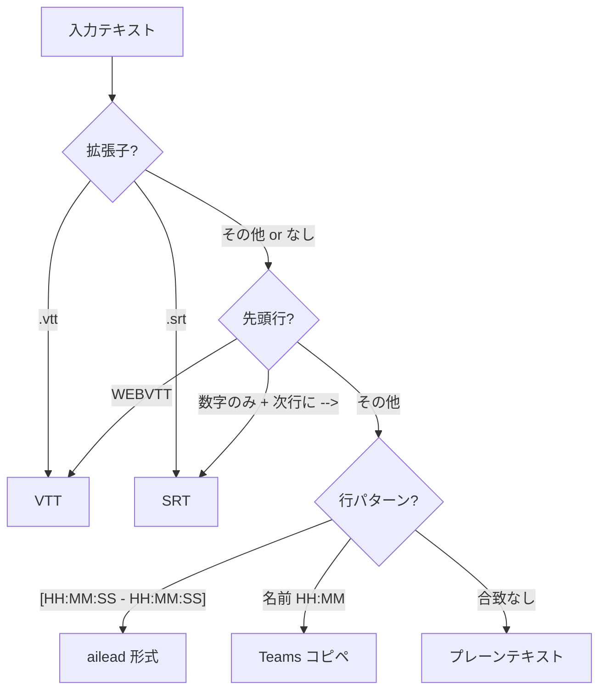

# 形式自動判定ロジック

## 判定フロー



## 各形式のサンプル

### WebVTT (.vtt)

```
WEBVTT

00:00:05.000 --> 00:00:10.000
<v 田中太郎>こんにちは、本日もよろしくお願いします。</v>

00:00:10.500 --> 00:00:15.000
<v 鈴木花子>よろしくお願いいたします。</v>
```

### SRT (.srt)

```
1
00:00:05,000 --> 00:00:10,000
こんにちは、本日もよろしくお願いします。

2
00:00:10,500 --> 00:00:15,000
よろしくお願いいたします。
```

### ailead transcript.txt

```
[00:00:05 - 00:00:10] 田中太郎: こんにちは、本日もよろしくお願いします。
[00:00:10 - 00:00:15] 鈴木花子: よろしくお願いいたします。
```

### Teams チャットコピペ

```
田中太郎 15:00
こんにちは、本日もよろしくお願いします。
鈴木花子 15:00
よろしくお願いいたします。
```

### プレーンテキスト

```
こんにちは、本日もよろしくお願いします。
よろしくお願いいたします。
```

## 変換後の標準形式

すべて以下の形式に統一される:

```
[HH:MM:SS - HH:MM:SS] 発話者名: テキスト
```

タイムスタンプや発話者名が元データにない場合は `00:00:00` / `Unknown` で補填する。
