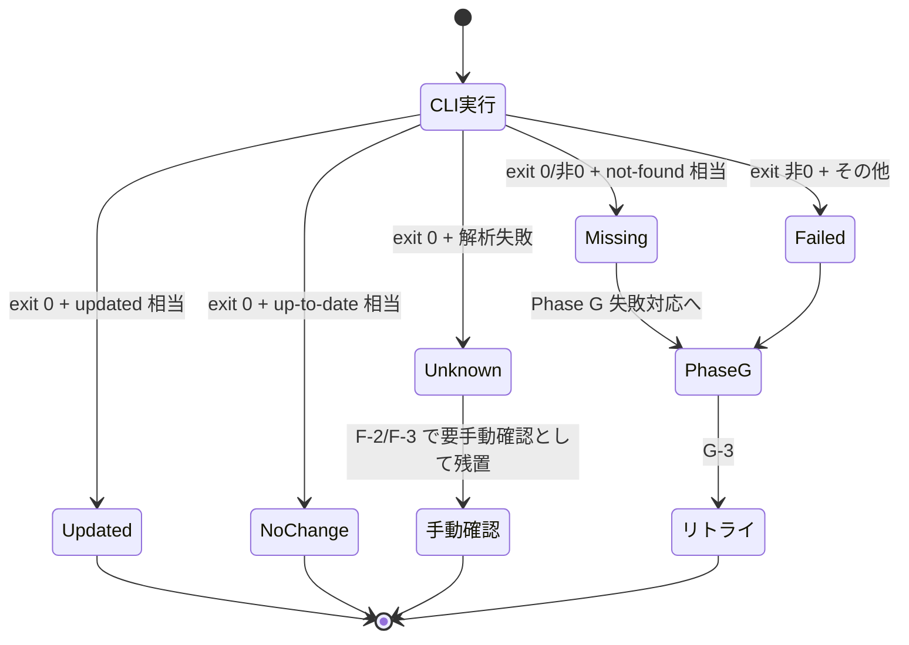

# Architecture Decision Records (plugins-update)

`plugins-update` プラグイン固有の設計判断記録。プラグイン横断の規約は親マーケットプレイス側
（`extension-toolkit/references/architecture-decisions.md`）を参照。

| 番号 | タイトル | 状態 |
|------|---------|------|
| ADR-PU-001 | 単一プラグイン化（vs marketplace-toolkit への統合 / vs スキル化） | Accepted |
| ADR-PU-002 | 公式 CLI 委譲（vs 低レベル git 操作 / vs 内部実装） | Accepted |
| ADR-PU-003 | Phase A-0〜G 固定順序 | Accepted |
| ADR-PU-004 | 横断ルール SSOT 配置（cross-cutting-rules.md への分離） | Accepted |
| ADR-PU-005 | exit code 一次判定 + Unknown 区分 | Accepted |
| ADR-PU-006 | サーキットブレーカー閾値と粒度 | Accepted |
| ADR-PU-007 | 失敗対応の対話モデル | Accepted |

---

## ADR-PU-001: 単一プラグイン化

### Context

プラグイン更新の手動トリガー機能を Claude Code 上で提供するにあたり、以下の配置選択肢があった。

1. **単一プラグイン化**: `plugins-update` として独立したプラグインとして提供
2. **`extension-toolkit:marketplace-toolkit` への統合**: マーケットプレイス本体管理スキルに更新機能を含める
3. **スキル化**: `extension-toolkit` 配下のスキルとして実装

### Decision

**選択肢 1（単一プラグイン化）** を採用する。

### Rationale

- **責務分離（SRP）**: 更新メンテナンスは「マーケットプレイス本体管理」「公開ワークフロー」と
  独立した運用関心事である。エンドユーザーが日常的に呼び出す手動メンテナンスコマンドであり、
  開発時のみ使う `marketplace-toolkit` / `marketplace-publisher` とライフサイクルが異なる。
- **配布単位の独立性**: `extension-toolkit` をインストールしないユーザーでも、本プラグイン単独で
  インストール・利用可能にすることで、配布範囲を最大化できる。
- **依存関係の最小化**: 他プラグインへの依存を持たず（`dependencies: []`）、Claude Code CLI のみを
  要件とすることでインストール障壁を下げる。

### Trade-offs

- `marketplace-toolkit` との連携は README リンクに留まり、自動同期はしない。
- 機能追加時に `extension-toolkit` 側のテンプレート資産は流用できない。

### Alternatives Considered

- **`marketplace-toolkit` への統合**: 開発時スキルに運用コマンドを混在させると SRP 違反になり、
  `extension-toolkit` のサイズが肥大化する。却下。
- **スキル化**: スキルは AI が自動起動する単位だが、本機能は明示的なユーザートリガー
  （`/update-all`）が前提のため、スラッシュコマンドが適切。却下。

### Future Direction

他のメンテナンス系コマンド（例: `uninstall-all`、`prune-all` 等）が追加された場合、
本プラグインを `maintenance-toolkit` 等の包括プラグインに発展させる選択肢を残す。

#### 境界判断基準

- **エンドユーザ運用コマンド** → 本プラグイン or 後継 `maintenance-toolkit` の責務
- **プラグイン作者向け開発コマンド** → `extension-toolkit` の責務
- **マーケットプレイス管理コマンド** → `extension-toolkit:marketplace-toolkit` の責務
- **公開ワークフロー** → `extension-toolkit:marketplace-publisher` の責務

その判断時点で本 ADR の Decision を見直す。

---

## ADR-PU-002: 公式 CLI 委譲

### Context

マーケットプレイスとプラグインの更新を実装するにあたり、以下の選択肢があった。

1. **公式 CLI 委譲**: `claude plugin marketplace update` / `claude plugin update <name>@<mp> --scope <scope>`
   を呼び出す
2. **低レベル git 操作**: 各マーケットプレイスのインストールディレクトリで `git fetch + reset --hard origin/HEAD`
   を直接実行する
3. **内部実装複製**: Claude Code CLI の更新ロジックを本プラグイン内に複製する

### Decision

**選択肢 1（公式 CLI 委譲）** を採用する。

### Rationale

- **破壊的操作の回避**: `git reset --hard` はローカルコミット・stash・detached HEAD・独自ブランチ等の
  ユーザ作業を意図せず破壊するリスクがある。CLI は内部でロック制御と状態管理を行い、これらを安全に
  扱う責務を負う。
- **シークレット非接触**: 本プラグインは Git credential helper / SSH キー / `.netrc` /
  `mcpServers` 内 API キーに **読み取りアクセスしない**。認証情報の取り扱い責務を CLI に委譲する。
- **CLI 機能改善の自動取り込み**: CLI バージョンアップで新機能（並列更新・JSON 出力等）が追加された場合、
  本プラグイン側の修正なしに恩恵を受けられる。
- **責務委譲によるシンプル化**: ロック・ロールバック・ネットワーク制御の責務を持たないため、
  本プラグインは「順序制御 + 結果集約 + ユーザ対話」に専念できる。

### Trade-offs

- **CLI 仕様変更への追従**: CLI 出力フォーマット変更時、結果分類ロジック（ADR-PU-005）が影響を受ける。
- **CLI 依存**: Claude Code CLI が PATH に存在しない環境では動作しない。
  Phase A-0 で事前チェック + 出力キーワード照合により早期失敗させる。
- **CLI 内部の挙動が不透明**: 並列処理・ロック粒度等が CLI 実装に依存する。
  本プラグイン側で全体タイムアウト（30 分・XR-2）を設定して暴走を防ぐ。
- **CLI バイナリ自体の真正性**: CLI バイナリが侵害されると本プラグインのセキュリティ前提が崩壊する。
  CLI 自体の真正性は OS のパッケージマネージャ署名検証に依拠する。検証コマンド例:
  - Linux (dpkg): `dpkg -V claude` 相当
  - macOS: `codesign -v $(which claude)`
  - Windows: `Get-AuthenticodeSignature (Get-Command claude).Source`
- **`marketplace update <name>` の個別 MP 指定が CLI で確認できない**: G-3 のリトライは現状
  全件リトライへフォールバックする（CLI が個別指定をサポートした際に挙動を更新する）。

### Alternatives Considered

- **低レベル git 操作**: 旧版（v1.x）の実装方式。security レビューで Critical（破壊操作の事前同意欠如）/
  High（stash・detached HEAD 未対応）/ Medium（パストラバーサル）等の指摘多数。却下。
- **内部実装複製**: CLI のロジックを複製する保守コストが高く、CLI バージョン追従が困難。却下。

### Future Direction

CLI が `--output json` 等の構造化出力モードを提供したら、ADR-PU-005 を改訂し JSON 解析へ移行する。
外部 CLI 依存を `plugin.json` で機械可読に宣言する手段が公式仕様に追加された場合は速やかに対応する。
並列実行のサポートが CLI 側で提供された場合は ADR-PU-003 と組み合わせて検討する。
`marketplace update <name>` の個別 MP 指定が CLI で確認できた場合は G-3 のリトライ戦略を更新する。

---

## ADR-PU-003: Phase A-0〜G 固定順序

### Context

複数のマーケットプレイスと複数スコープのプラグインを更新する処理の **順序** をどう構造化するかを決定する。
（結果分類ロジックは ADR-PU-005、横断ルール配置は ADR-PU-004、対話モデルは ADR-PU-007 を参照）

### Decision

以下の **Phase A-0〜G の固定順序** で逐次処理する。

| Phase | 内容 | 実行順 |
|-------|------|-------|
| A-0 | Claude Code CLI の存在チェック | 1（最優先） |
| A | 対象収集（`marketplace list` + `enabledPlugins` 抽出） | 2 |
| A-1 | プラグイン名・MP 名・スコープ名の入力検証（XR-1） | 3 |
| A-2 | マーケットプレイス整合性検証（`enabledPlugins` の MP が `marketplace list` に存在するか） | 4 |
| B | マーケットプレイス更新（`--scope` 指定でも常に実行） | 5 |
| C | User スコープのプラグイン更新 | 6 |
| D | Project スコープのプラグイン更新 | 7 |
| E | Local スコープのプラグイン更新 | 8 |
| F | 結果報告（サマリ + マーケットプレイス詳細 + スコープ別詳細） | 9 |
| G | 失敗対応の確認 + 限定リトライ + 再描画 | 10 |

### Phase 番号体系

- **基本 Phase**: A / B / C / D / E / F / G の 1 文字。
- **派生 Phase**（Phase 全体の前後に追加するもの）: `A-0` / `A-1` / `A-2` のようにハイフン枝番。
- **サブフェーズ**（Phase 内のステップ）: `B-1` / `C-1` / `F-0` / `F-1` のようにハイフン枝番。
- **混在の解決**: 派生 Phase は当該基本 Phase に **論理的に属する処理ステップ** であり、
  サブフェーズは「結果分類」「サマリ表示」等のステップ。番号衝突を避けるため、新規追加の際は
  本 ADR を更新して位置付けを明記する。
- **A-2 の単一実施**: A-2 は Phase A 直後に 1 回のみ実施する。Phase B 後の再実施は行わない
  （仕様簡素化のため）。

### Rationale

- **A-0 を最優先実行する理由**: CLI 不在時に Phase A 以降が無意味な失敗を量産する前に早期エラー終了。
- **MP → User → Project → Local** の固定順は、(a) マーケットプレイス本体が SSOT のため最新化を
  プラグイン更新より先に行う必要があり、(b) スコープは上書き優先順位（より狭いスコープが優先）の
  逆順で更新することで「広いスコープから順に最新化される」ためユーザの認知モデルに合致する。
- **Phase B を `--scope` 指定でも常に実行** する理由: マーケットプレイスは全プラグインの SSOT であり、
  スコープ限定更新でも最新の MP インデックスが必要なため。
- **冪等性**: 同一 (plugin, marketplace) を複数スコープで処理しても CLI 側で冪等性が保証される
  （`enabledPlugins` がスコープごとに独立 SSOT であるため）。

### Trade-offs

- **直列処理**: 並列実行による I/O 待ち短縮の余地を放棄。CLI のロック競合リスクを避けるため
  当面は直列を維持。将来的に `update-one(scope, plugin, marketplace) → result` 抽象を導入し、
  Strategy パターンで並列化への切り替え可能にすることを検討。

### Alternatives Considered

- **並列実行**: CLI の内部ロック挙動が公式に保証されていないため、現時点では却下。
- **スコープ → MP の順序**: ユーザの認知モデル（プラグインが先・MP は背後）に反するため却下。
- **A-2 の Phase B 後再実施**: 仕様複雑化に対して効果が小さい（B でマーケットプレイスが新規追加される
  ケースは現実的に稀）。次回実行時に反映されれば即時性は不要。却下。

### Future Direction

CLI が並列実行を公式サポートしたら、Phase C/D/E を `update-one` 抽象化して並列戦略に切り替える。
ADR-PU-002 の Future Direction と連動する。

---

## ADR-PU-004: 横断ルール SSOT 配置

### Context

入力検証・タイムアウト・出力サニタイズ・リトライ上限・Unknown 警告の 5 つは複数 Phase に横断適用される
「横断関心事（cross-cutting concerns）」。これをどこで定義するかを決定する。

### Decision

横断ルール XR-1〜XR-5 を `references/cross-cutting-rules.md` に切り出して **SSOT** とする。
コマンド本文 `commands/update-all.md` は本ファイルへの参照のみを持ち、規則本体を再定義しない。

### Rationale

- **Clean Architecture 階層分離**: 横断関心事を Implementation 層（コマンド本文）から Policy 層
  （references/）に持ち上げることで、層間依存方向を整理する。
- **将来の `update-one` 抽象化への耐性**: 別コマンドが追加された場合、`cross-cutting-rules.md` を
  共通参照することでコピペ重複を回避できる。
- **設計根拠の明示**: 各 XR の数値（60 秒・30 分・40 字・1 回・20% 等）の根拠を本ファイルに集約することで、
  将来の値変更判断が容易になる。

### Trade-offs

- **参照のオーバーヘッド**: コマンド本文を読む際に `cross-cutting-rules.md` への参照を追わないと
  詳細が分からない。
- **2 ファイル同期義務**: 規則変更時に 2 ファイルが整合する必要があるが、実体は SSOT 側にあり
  コマンド本文は「適用範囲のみ」を示すため、同期コストは小さい。

### Alternatives Considered

- **コマンド本文に SSOT を置く**: 旧版 v2.1.0 の方式。`update-one` 等の追加コマンド時に重複が発生する
  ため、SRP / DRY 違反のリスクが高い。却下。
- **ADR 内に直接記載**: ADR は「決定根拠」を記録するもので、運用ルール本体ではない。
  `cross-cutting-rules.md` のような専用ファイルが適切。却下。

### Future Direction

#### XR 番号体系の拡張ルール

- **追加**: 新規横断関心事は `XR-{次番号}` で採番。`cross-cutting-rules.md` の冒頭表と本文・関連 ADR に
  追加する。コマンド本文の参照表も同期更新する。
- **削除**: 不要になった XR は **削除せず**「Deprecated」状態として残し、別 XR への統合や置換先を
  本文末尾に明記する。番号の再利用は禁止。
- **統合**: 複数の XR を統合する場合、新規番号を割り当て、旧 XR は Deprecated とする。
- **他プラグインからの参照**: 本ファイルは plugins-update 専用。他プラグインから直接参照させない。
  共通化が必要なら `extension-toolkit/references/` 側に同等ファイルを用意する。

---

## ADR-PU-005: exit code 一次判定 + Unknown 区分

### Context

公式 CLI の成否をどう判定し、想定外の出力をどう扱うかを決定する。
本 ADR は **マーケットプレイス更新（B-1）** と **プラグイン更新（C-1 / D-1 / E-1）** の両方に適用する。

### Decision

CLI の成否は **exit code を一次判定** とし、出力テキストの解析は補助情報に降格する。
判定不能ケースは "Unknown（要手動確認）" 区分として残す。

#### 結果分類テーブル — プラグイン更新（C-1 / D-1 / E-1 共通）

| exit code + 出力 | 結果分類 |
|------------------|---------|
| exit 0 + `updated` 相当 | Updated |
| exit 0 + `up-to-date` / `already latest` 相当 | No change |
| exit 0 + `not found` / `no such plugin` 相当 | Missing |
| exit 非 0 + `not found` / `no such plugin` 相当 | Missing |
| exit 非 0 + 上記以外 | Failed |
| exit 0 + いずれの相当文字列も検出不能 | Unknown |

#### 結果分類テーブル — マーケットプレイス更新（B-1）

| exit code + 出力 | 結果分類 | 後続処理 |
|------------------|---------|---------|
| exit 0 + 出力に `Failed:` / `Error:` 行なし | OK | Phase C 以降を通常実行 |
| exit 0 + 出力に `Failed:` / `Error:` 行あり | 部分失敗 | 抽出 MP 名は Failed として記録、他 MP は OK。Phase C 以降を **警告付き継続** |
| exit 0 + 出力解析で MP 名抽出不能 | Unknown | F-2 に Unknown 区分で残し、当該 MP 配下のプラグインは Skipped（MP Unknown）として Phase C/D/E から除外 |
| exit 非 0 | 全体失敗 | Phase C 以降は **警告付き継続**（CLI が古いインデックスでプラグイン更新を試みる可能性のため停止しない） |

#### 例外行抽出パターン

`Failed:` / `Error:` 行抽出には以下の正規表現を使用する（XR-3 サニタイズを抽出後に必ず適用）:

```text
^(Failed|Error)[:\s]+(.+?)(?:\s+at\s|\s+in\s|$)
```

抽出した MP 名候補は XR-1 の正規表現に再照合し、合致しないものは Unknown として扱う。

#### Unknown 件数の警告閾値

XR-5 を参照（試行済み件数の 20% 超で警告）。

### Rationale

- CLI の出力フォーマットはバージョン間で変わりうるため、出力テキストの正規表現マッチに依存すると
  CLI バージョン変更時に静かに誤分類が発生する。
- exit code は POSIX 慣習として安定したインターフェースであり、CLI バージョン非依存性が高い。
- 出力解析が失敗した場合に "Unknown" 区分として残すことで、ユーザに「要手動確認」のシグナルを
  届けられる（誤った成功・失敗判定よりも安全）。

### Trade-offs

- **Unknown 区分の負担**: ユーザが Unknown エントリを手動確認する必要がある。XR-5 の 20% 警告閾値で
  異常検知の補助とする。
- **exit 0 + not-found ケース**: CLI が認証エラーを exit 0 で返す実装が稀に存在するため、
  出力解析の補助が完全には不要にならない。

### Alternatives Considered

- **キーワードマッチ一次判定**: 出力解析を一次にすると CLI バージョン変更時の壊れ方が静かで
  気付きにくい。却下。
- **失敗とみなす（Unknown を Failed に統合）**: 誤った Failed 判定が増え、Phase G の質問が
  ノイズで埋まる。却下。
- **B と C/D/E で分類テーブルを別 ADR に分離**: 共通ポリシー（exit code 一次判定）が同一であり、
  分類項目のみ異なるため、本 ADR に両方を記載するのが SSOT として妥当。却下。

### Future Direction

CLI が `--output json` 等の構造化出力モードを提供したら、本 ADR を改訂し JSON 解析に移行する。
拡張ポイントは `commands/update-all.md` の Phase B-1 / C-1 に明記してある。

#### Unknown 区分の状態遷移（補足）



---

## ADR-PU-006: サーキットブレーカー閾値と粒度

### Context

XR-2 のサーキットブレーカー（同一 MP に対する累計失敗で配下を Skip）について、閾値・粒度・カウント方式を決定する。

### Decision

- **粒度**: マーケットプレイス（MP）単位。
- **閾値**: 同一 MP に対する **累計 3 件以上の Failed**。
- **カウント方式**: 連続・非連続を問わない累計（フェーズ横断で B / C / D / E すべての Failed を集計）。
- **作動時挙動**: 当該 MP 配下のプラグイン更新エントリ（残）を Skipped（サーキットブレーカー作動）として除外。
  G-3 のリトライ対象からも除外。

### Rationale

- **MP 単位**: 失敗の根本原因（ネットワーク・認証・MP 自体の障害）は MP に紐づくことが多く、
  同一 MP の他プラグインも同じ理由で失敗する可能性が高い。プラグイン単位での個別判定は
  オーバーヘッドが大きく、無駄なリトライを生む。
- **累計 3 件**: 経験的閾値。1〜2 件は一過性のネットワーク失敗の可能性、4 件以上は反応が遅い。
  「3 件 = 統計的にパターン化された失敗」と判断する妥協点。
- **連続→累計**: v2.1.0 では連続判定だったが、非連続パターン（2 件失敗→1 件成功→2 件失敗）を
  検知できないため累計に変更（v2.2.0）。

### Trade-offs

- **誤作動の可能性**: 同一 MP の 3 プラグインがたまたま個別事情で失敗した場合（authentication 切れ等）、
  4 件目以降の正常更新がスキップされる。ユーザは Phase G で全件リトライを選択することで再実行可能。
- **大規模 MP での影響**: 100 件のプラグインを持つ MP で 3 件失敗すると残 97 件がスキップされる。
  ただしリトライ機構（XR-4）でリカバー可能。

### Alternatives Considered

- **連続失敗のみカウント**: v2.1.0 方式。非連続失敗パターンを見逃す。却下。
- **失敗率（5 件中 3 件）**: 母数が少ない場合に判定が不安定。却下。
- **指数バックオフ**: ローカル CLI 委譲のため過剰。却下。
- **プラグイン単位**: オーバーヘッド大、根本原因が MP に紐づくため意味薄。却下。

### Future Direction

CLI が並列実行をサポートした際は、サーキットブレーカーの集計が並列セッション間で正しく行われるか
の再評価が必要。現状は逐次実行のため単純カウンタで十分。

---

## ADR-PU-007: 失敗対応の対話モデル

### Context

Phase G での失敗対応をどのような対話形式で実施するかを決定する。
特に失敗件数が多い場合の UX を考慮する必要がある。

### Decision

- **G-1（全体方針）**: 全失敗に対し「全件リトライ / 個別に判断 / 全件スキップ」の 3 択を 1 回提示。
- **G-2（個別判断）**: G-1 で「個別に判断」を選択した場合のみ、失敗エントリ数 N が **5 件以下**
  のときに各エントリ個別に「リトライ / スキップ」を質問。
- **件数閾値 5 件超**: G-1 の選択肢から「個別に判断」を **動的に除外**（連続質問による UX 劣化防止）。
- **質問テキスト切り詰め**: G-2 の質問テキストはサニタイズ後 500 字を上限に切り詰める
  （マスクトークン `***...***` の途中で切らない）。
- **失敗総数 N の定義**: Failed + Missing の合計（Unknown は要手動確認のため除外）。

### Rationale

- 5 件以下: 1 件あたり 5〜10 秒の認知負荷を想定し、5 件 × 10 秒 = 50 秒程度を許容上限とする経験則。
- 6 件以上: 個別判断はユーザの集中力を消耗し、結局「全件リトライ」が選ばれる傾向が強い。
  最初から G-1 で完結させる方が UX が良い。
- 500 字切り詰め: AskUserQuestion の表示上の可読性と、サニタイズ済みエラーメッセージの情報量の
  バランス点。

### Trade-offs

- **5 件超で個別判断不可**: 大量失敗時に「3 件は致命的だが残 5 件はネットワーク一過性」のような
  ニュアンスを表現できない。ユーザは「全件リトライ」→ 残った失敗を手動対応の流れになる。

### Alternatives Considered

- **常に個別判断可能**: 大量失敗時の UX が破綻。却下。
- **multiSelect で一括選択**: チェックボックス UI が AskUserQuestion で複雑化。却下。
- **件数閾値を 10 件にする**: 認知負荷上限を超える。却下。

### Future Direction

将来的に AskUserQuestion がテーブル形式の選択 UI を提供したら、件数上限を緩和できる可能性がある。
